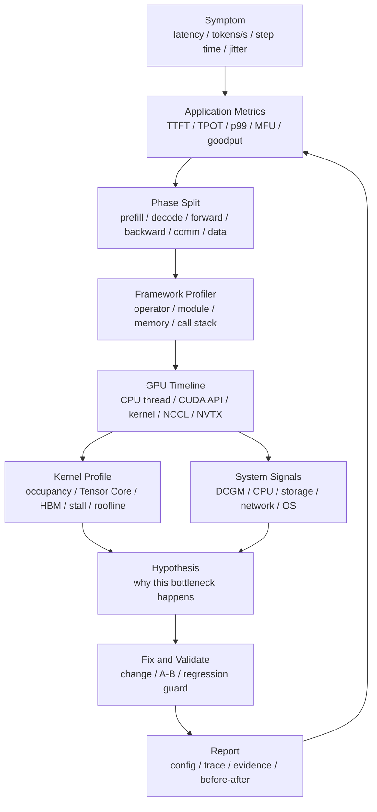

# Profiler 工具链与瓶颈定位：Nsight、PyTorch Profiler、DCGM、perf 与 eBPF

AI 系统性能问题很少能靠一个指标直接解释。

常见现象包括：

- GPU utilization 看起来很高，但 tokens/s 很低。
- GPU utilization 看起来很低，但 CPU、网络或存储并没有明显打满。
- 平均延迟正常，但 p99 经常抖动。
- 单机 benchmark 很好，多机训练一扩展就掉效率。
- 同样代码在一批机器上快，在另一批机器上慢。
- 某次升级后吞吐下降，但日志没有明显错误。

Profiler 的作用不是“截几张漂亮的 trace 图”，而是建立一条证据链：

```text
现象是什么
  -> 哪个指标证明它存在
  -> 哪个阶段贡献最多
  -> 哪个资源成为瓶颈
  -> 哪个代码路径或 kernel 导致瓶颈
  -> 哪个修改能改善
  -> 改完后 benchmark 是否复现提升
```

本篇重点回答：

> 面对 AI 推理、训练和集群性能问题时，应该如何组合 PyTorch Profiler、Nsight Systems、Nsight Compute、DCGM、perf、eBPF、NVTX 标注和 benchmark，形成可复现的瓶颈定位方法？

## 一张总图



这张图强调两个原则：

- 先用指标确认问题，再用 profiler 解释原因。
- profiler 结论必须回到 benchmark 验证，不能只停留在 trace 观察。

## 工具各自回答什么问题

不同工具处在不同层级。选错工具，会让定位过程变慢。

| 工具 | 主要回答的问题 | 典型用途 | 不适合做什么 |
| --- | --- | --- | --- |
| PyTorch Profiler | 框架层时间花在哪些 operator、module、CPU/GPU activity 上 | 训练 step、推理 forward、显存、shape、operator 热点 | 深入解释单个 CUDA kernel 为什么慢 |
| Nsight Systems | 整机时间线如何流动，CPU 线程、CUDA API、GPU kernel、NCCL 是否并行 | 找 idle gap、CPU launch overhead、同步点、通信等待、跨进程关系 | 分析单个 kernel 的寄存器、访存和指令瓶颈 |
| Nsight Compute | 单个 CUDA kernel 的微观性能瓶颈是什么 | occupancy、Tensor Core、memory throughput、warp stall、kernel 对比 | 看端到端请求生命周期 |
| DCGM / DCGM Exporter | GPU 在生产或集群中是否健康、忙碌、降频、报错 | utilization、HBM、power、temperature、ECC、Xid、长期监控 | 替代 profiler 解释代码级瓶颈 |
| perf | CPU 侧热点、系统调用、内核路径和用户态采样 | tokenization、DataLoader、scheduler、runtime、网络/存储 CPU 开销 | 分析 GPU kernel 内部 |
| eBPF | 低侵入地观察生产系统的内核事件、网络、块设备、系统调用 | 线上排查 syscall、TCP、磁盘 I/O、调度延迟 | 替代训练/推理框架 profiler |
| NVTX | 给 trace 增加业务语义标签 | 标注 prefill、decode、step、rank、request、pipeline stage | 单独产生性能结论 |

一个实用判断：

- 不知道问题有没有发生：先看 monitoring。
- 知道问题发生但不确定是否可复现：做 benchmark。
- benchmark 确认变慢但不知道原因：做 profiling。
- profiling 找到疑似原因：做最小变更，再 benchmark 验证。

## 先从症状和阶段拆分开始

Profiler 之前要先回答两个问题：

1. 哪个指标坏了？
2. 这个指标属于哪个阶段？

推理系统可以先拆成：

```text
request arrival
  -> queueing
  -> scheduling
  -> prefill
  -> decode loop
  -> postprocess
  -> response streaming
```

训练系统可以先拆成：

```text
data loading
  -> forward
  -> loss
  -> backward
  -> gradient communication
  -> optimizer
  -> checkpoint / eval
```

集群层可以先拆成：

```text
scheduling
  -> image / env startup
  -> data access
  -> GPU execution
  -> network communication
  -> storage checkpoint
  -> failure / retry
```

如果没有阶段拆分，trace 很容易变成一张很复杂但无法决策的图。

例如“p99 延迟变差”至少要区分：

- 排队变长。
- prefill 变慢。
- decode 每 token 变慢。
- KV Cache miss 变多。
- speculative decoding 接受率下降。
- 远端存储或 tokenizer 抖动。
- 某些节点降频或出现 Xid 错误。

这些原因对应的工具完全不同。

## PyTorch Profiler：先看框架层热点

PyTorch Profiler 适合回答：

- 一个训练 step 中哪些 operator 最耗时。
- CPU 和 CUDA 时间分别花在哪里。
- 是否存在意外的 CPU hotspot。
- 哪些 operator 显存占用大。
- 某些 shape 是否导致 kernel 选择异常。
- forward、backward、optimizer 的时间比例是否合理。

它的优势是和框架语义贴近。对于新手来说，PyTorch Profiler 通常比直接看 Nsight 更容易入门，因为它能直接显示 operator 名称、调用栈、shape、memory 和时间统计。

使用时要注意几个点。

### 不要从第一个 step 直接判断

第一个 step 常常包含：

- CUDA context 初始化。
- kernel lazy loading。
- JIT / graph capture / compile。
- dataloader warmup。
- cache 填充。

因此需要设置 warmup、active window 和重复采样窗口。只看第一个 step，很容易把初始化成本误判为稳定瓶颈。

### 先看粗粒度，再看细粒度

常见顺序是：

1. 看 CPU total、CUDA total 和 self time。
2. 看最耗时 operator。
3. 看显存峰值和分配次数。
4. 看 shape 是否符合预期。
5. 看调用栈定位到模型代码、数据代码或 runtime 代码。

如果发现时间集中在 `aten::matmul`、attention、layernorm、embedding、copy、all_reduce 等操作上，再进一步用 Nsight Systems 或 Nsight Compute。

### 警惕 profiler 自身开销

Profiler 会带来额外开销，尤其是记录 shape、memory、stack、trace 时。采样窗口越长，trace 越大，对系统扰动越明显。

实用做法：

- 用短窗口抓稳定阶段。
- 不在所有进程、所有 rank、所有 step 上同时开完整 trace。
- 先跑无 profiler 的 benchmark，再跑 profiler 解释原因。
- profiler 数据只用于定位，不直接当作最终性能指标。

## Nsight Systems：看端到端时间线

Nsight Systems 适合回答：

- CPU 是否在及时 launch CUDA kernel。
- GPU 是否存在 idle gap。
- CUDA API 是否被同步点阻塞。
- NCCL 通信是否和计算重叠。
- 多进程、多线程、多 GPU 的时间线是否协调。
- NVTX 标注的业务阶段是否和 kernel 执行对应。

它最擅长发现“时间线形态问题”。

常见模式包括：

### GPU 中间有大段空白

可能原因：

- CPU preprocessing 太慢。
- dataloader 供应不上。
- Python 逻辑或 GIL 开销大。
- scheduler 决策慢。
- 同步等待。
- 数据从 CPU 到 GPU 拷贝没有重叠。

处理方向：

- 用 perf 或 PyTorch Profiler 看 CPU 侧热点。
- 增加 dataloader worker、prefetch、pinned memory。
- 减少 Python 调度开销。
- 合并小 kernel 或使用 CUDA Graph。
- 检查是否有不必要的 `cudaSynchronize` 或 `.item()`。

### CUDA API 调用很多且 kernel 很碎

可能原因：

- batch 太小。
- operator 没有融合。
- dynamic shape 过多。
- 推理 decode 阶段单 token 粒度导致 launch overhead 显著。
- 框架 fallback 到低效路径。

处理方向：

- 使用 fused kernel。
- 使用 CUDA Graph。
- 调整 batch 或 micro-batch。
- 稳定 shape。
- 检查 torch.compile、Inductor、Triton 或专用推理引擎是否生效。

### 通信没有被计算覆盖

训练中常见现象是 all-reduce、reduce-scatter、all-gather 或 all-to-all 暴露在计算路径上。

可能原因：

- bucket 太大或太小。
- 并行策略不匹配网络拓扑。
- rank mapping 不合理。
- 某个 rank 变成 straggler。
- MoE expert imbalance。
- 网络拥塞或链路异常。

处理方向：

- 调整 bucket、overlap 策略和通信粒度。
- 优化 DP/TP/PP/EP/FSDP/ZeRO 配置。
- 检查 NCCL topology、multi-rail、IB/RoCE 状态。
- 对比最快 rank 和最慢 rank 的 trace。

### 频繁出现同步点

常见来源：

- `.item()`、打印 tensor 值、同步日志。
- CPU 读取 GPU 结果。
- 不必要的 barrier。
- allocator 或 memory copy 引发同步。
- 评测、保存、采样逻辑插入训练主路径。

处理方向是减少同步、把必要同步移出关键路径，或把同步成本显式纳入指标。

## Nsight Compute：深入单个 kernel

当 Nsight Systems 或 PyTorch Profiler 已经定位到某个 kernel 或 operator 可疑时，再用 Nsight Compute。

Nsight Compute 适合回答：

- kernel 是否真正使用 Tensor Core。
- occupancy 是否过低。
- 是否受 HBM bandwidth 限制。
- 是否受 shared memory、register、L2、instruction issue 限制。
- warp stall 主要来自 memory dependency、barrier、not selected 还是其他原因。
- 同一个 kernel 在不同 shape、不同参数下为什么性能不同。

它不适合作为第一步，因为单个 kernel 优化可能对端到端性能没有意义。

一个常见误区是：发现某个 kernel 只有 50% occupancy，就认为它一定是瓶颈。实际要看：

- 这个 kernel 占端到端时间多少。
- 它是否 memory-bound。
- 它是否已经接近可达到的 roofline。
- 它是否在关键路径上。
- 优化它是否会被别的瓶颈抵消。

对 AI 计算来说，Nsight Compute 常用于分析：

- attention kernel。
- GEMM / matmul。
- layernorm / rmsnorm。
- softmax。
- embedding。
- MoE dispatch / combine。
- quantization / dequantization kernel。
- sampling kernel。
- 自定义 Triton kernel。

## DCGM：生产和集群层的 GPU 事实

DCGM 更像是 GPU 侧的健康和资源观测基础设施。它适合长期、低频、集群级监控。

常见指标包括：

- GPU utilization。
- SM active。
- memory utilization。
- HBM bandwidth。
- power draw。
- temperature。
- clocks。
- ECC errors。
- Xid errors。
- PCIe / NVLink 相关信号。

DCGM 能帮助回答：

- 某个节点是否降频。
- 某张卡是否异常报错。
- GPU 是否长期空闲。
- 显存是否接近上限。
- 功耗和温度是否导致性能波动。
- workload 是否真的跑在预期 GPU 上。

但 DCGM 不能告诉你“哪个 operator 慢”或“哪个 kernel 访存模式不好”。它更适合做：

- profiler 前的异常筛查。
- benchmark 期间的环境记录。
- 生产环境的告警。
- 容量模型的长期校准。

## perf 与 eBPF：CPU、系统调用、网络和存储

AI 系统不是只有 GPU。

很多瓶颈发生在 CPU 和操作系统层：

- tokenization。
- prompt parsing。
- JSON 序列化。
- Python 调度。
- DataLoader。
- 图像/音频解码。
- 文件系统读取。
- 网络收发。
- 进程调度。
- 内存拷贝。
- page fault。
- syscall 过多。

`perf` 适合做 CPU sampling，回答“CPU 时间花在哪些函数上”。如果 GPU trace 里有大量 idle gap，而 DCGM 显示 GPU 没打满，perf 常常是下一步。

eBPF 适合做线上低侵入观测，尤其是：

- syscall latency。
- TCP retransmit。
- block I/O latency。
- scheduler latency。
- socket queue。
- 文件系统热点。
- 容器和进程维度的系统行为。

它们和 GPU profiler 是互补关系。

一个典型例子：

```text
Nsight Systems 看到 GPU 每隔一段时间空闲
  -> PyTorch Profiler 看到 data loading 时间变长
  -> perf 看到 CPU 时间集中在 image decode
  -> eBPF 看到对象存储读取存在尾延迟
  -> benchmark 复现：本地 NVMe cache 后 step time 抖动下降
```

## NVTX：让 trace 看得懂

没有业务标注的 trace，通常很难解释。

NVTX 的作用是把业务阶段写进 timeline，例如：

- `request_id=...`
- `prefill`
- `decode_step`
- `sampling`
- `forward`
- `backward`
- `optimizer`
- `all_reduce`
- `checkpoint_save`
- `rank=7`
- `pipeline_stage=2`
- `expert_dispatch`

好的 NVTX 标注应该满足：

- 名称稳定，便于跨版本对比。
- 粒度适中，不要每行代码都标。
- 包含关键维度，如 rank、stage、batch、sequence length。
- 和 benchmark 指标中的阶段定义一致。

在推理服务中，建议至少标注：

```text
queueing
  -> prefill
  -> decode
  -> sampling
  -> detokenize
  -> stream response
```

在训练任务中，建议至少标注：

```text
data
  -> forward
  -> loss
  -> backward
  -> optimizer
  -> checkpoint
  -> eval
```

如果没有 NVTX，Nsight Systems 里看到的只是线程、CUDA API 和 kernel 名称；有了 NVTX，才能把底层事件映射回业务阶段。

## 一套推荐定位流程

下面是一套比较稳的流程。

### 1. 明确症状和成功标准

先写清楚：

- 哪个 workload。
- 哪个版本。
- 哪个指标变差。
- 变差多少。
- 是否稳定复现。
- 优化成功的判断标准是什么。

例如：

```text
workload: Llama-like 70B, input 2048, output 512
symptom: p99 E2E latency from 3.2s to 4.1s
scope: only high-concurrency requests
success: p99 returns below 3.3s with no throughput regression
```

### 2. 复现并控制变量

复现时要记录：

- 模型、权重、tokenizer。
- 输入/输出长度分布。
- batch、并发、随机种子。
- GPU、CPU、内存、网络、存储。
- driver、CUDA、NCCL、PyTorch、engine 版本。
- 容器镜像 digest。
- 环境变量。

如果环境不固定，profiler 很容易追着噪声跑。

### 3. 先拆阶段

不要一开始就看 kernel。先确认问题在哪个阶段。

推理：

```text
queueing latency
prefill latency
decode TPOT
sampling/postprocess
network streaming
```

训练：

```text
data time
forward time
backward time
communication time
optimizer time
checkpoint/eval time
```

如果阶段指标已经能解释 80% 的问题，再深入该阶段。

### 4. 用框架 profiler 找热点

用 PyTorch Profiler 或推理引擎内部 profiler 看：

- operator 时间。
- CPU/GPU 时间比例。
- memory allocation。
- shape。
- module path。
- 关键阶段的算子组成。

这一步的目标是缩小范围，不是最终定论。

### 5. 用 Nsight Systems 看时间线

重点看：

- GPU 是否空闲。
- CPU launch 是否连续。
- CUDA API 是否阻塞。
- kernel 是否碎片化。
- 通信是否暴露。
- rank 之间是否同步等待。
- NVTX 阶段是否符合预期。

这一步通常能判断瓶颈属于：

- CPU 供应不足。
- GPU kernel 低效。
- 通信暴露。
- 同步过多。
- 数据/存储阻塞。
- 调度和排队问题。

### 6. 必要时用 Nsight Compute 看 kernel

只有当一个 kernel 端到端占比足够高，或者它是一个关键路径上的自定义 kernel，才值得深入 Nsight Compute。

要记录：

- 输入 shape。
- block/grid 配置。
- dtype。
- kernel 名称和版本。
- occupancy。
- achieved occupancy。
- Tensor Core 使用情况。
- HBM/L2 throughput。
- stall reason。
- 与理论或历史版本对比。

### 7. 用系统信号排除环境问题

同时检查：

- DCGM：降频、温度、功耗、ECC、Xid。
- 网络：IB/RoCE counters、重传、拥塞、链路速率。
- 存储：吞吐、IOPS、尾延迟。
- CPU：load、context switch、syscall、NUMA。
- 容器：cgroup 限制、CPU pinning、共享节点干扰。

AI 性能问题里，环境问题很常见。尤其是“同样代码有些节点慢”的情况，必须先排环境。

### 8. 做最小变更并回到 benchmark

定位结论要通过前后对比验证。

报告中至少写：

- 改了什么。
- 为什么这个修改对应前面的证据。
- 修改前指标。
- 修改后指标。
- 是否影响其他指标。
- 是否只对特定 workload 有效。
- 是否加入回归检测。

## 常见瓶颈模式

### GPU 空闲，但 CPU 很忙

可能原因：

- tokenization 太慢。
- DataLoader 解码太慢。
- Python 控制流过重。
- 请求 scheduler 单线程瓶颈。
- 小 batch 导致 launch overhead 占比高。
- CPU 到 GPU 拷贝没有重叠。

工具组合：

```text
DCGM -> Nsight Systems -> PyTorch Profiler -> perf / eBPF
```

优化方向：

- 预处理或缓存 tokenizer 结果。
- 增加并行度和 prefetch。
- 使用 pinned memory。
- 减少 Python 路径。
- 合并小算子。
- 使用 CUDA Graph。

### GPU 很忙，但吞吐不高

可能原因：

- kernel 低效。
- memory-bound。
- 没有使用 Tensor Core。
- shape 不适合当前 kernel。
- fallback 到通用实现。
- quant/dequant 开销抵消收益。
- batch 或 sequence length 导致资源利用差。

工具组合：

```text
PyTorch Profiler -> Nsight Systems -> Nsight Compute
```

优化方向：

- fused kernel。
- 更合适的 attention 实现。
- 调整 shape 和 padding。
- 使用 torch.compile / Inductor / Triton。
- 使用专用推理引擎。
- 检查 dtype、layout 和 kernel selection。

### 平均值正常，p99 抖动

可能原因：

- queueing burst。
- KV Cache eviction。
- prefix cache miss。
- 某些请求输入极长。
- GC 或 allocator 抖动。
- checkpoint/eval 干扰。
- 网络或存储尾延迟。
- 个别节点降频或硬件异常。

工具组合：

```text
application metrics -> distributed trace -> DCGM -> eBPF -> targeted profiler
```

优化方向：

- 按输入/输出长度分桶分析。
- 分离长短请求。
- 增加 cache hit 指标。
- 做节点维度对比。
- 对 p99 请求单独采样 trace。
- 做隔离和限流。

### 多机训练扩展效率差

可能原因：

- 通信暴露。
- rank mapping 不合理。
- NCCL topology 不匹配。
- 网络拥塞。
- straggler。
- pipeline bubble。
- MoE expert imbalance。
- checkpoint 阻塞。

工具组合：

```text
step metrics -> Nsight Systems multi-rank trace -> NCCL logs/counters -> DCGM/network metrics
```

优化方向：

- 调整 DP/TP/PP/EP/FSDP/ZeRO 组合。
- 改善 compute-communication overlap。
- 调整 bucket。
- 做拓扑感知 placement。
- 检查 slow rank。
- 优化 checkpoint 和 eval 调度。

### 同样代码在不同节点速度不同

可能原因：

- GPU clocks 不同。
- 温度或功耗限制。
- PCIe/NVLink/IB 链路异常。
- NUMA 绑定错误。
- CPU 频率策略不同。
- 驱动、固件、容器镜像不一致。
- 邻居任务干扰。

工具组合：

```text
DCGM -> nvidia-smi topo / fabric counters -> environment manifest -> benchmark A-B
```

优化方向：

- 固化节点基线。
- 上线前 burn-in。
- 定期健康检查。
- 自动隔离异常节点。
- benchmark 结果按 node id 记录。

## 分布式 profiling 的特殊问题

分布式训练和多副本推理不能简单地“每个进程都开完整 profiler”。

问题包括：

- trace 文件巨大。
- profiler 开销影响原始行为。
- 所有 rank 同时采样会放大干扰。
- 不同机器时钟可能不完全一致。
- 最慢 rank 才是真正关键，但不一定容易提前知道。

更实用的做法：

- 先用全局指标找异常时间窗口。
- 只对少数代表 rank 开 trace。
- 同时采样最快 rank 和最慢 rank。
- 用统一 step id、request id、rank id 做 NVTX 标注。
- 对通信问题保留 NCCL 拓扑、环境变量和网络 counters。
- 对 MoE 问题记录 expert load、token routing、all-to-all 时间。
- 对 pipeline 问题记录 stage id、microbatch id、bubble。

分布式 profiling 的目标不是收集所有数据，而是收集能解释差异的数据。

## Profiler 报告模板

一份有用的 profiler 报告可以按下面结构写。

```text
Title:
  short problem statement

Workload:
  model / batch / sequence length / concurrency / training config

Environment:
  hardware / driver / CUDA / framework / engine / image / topology

Symptom:
  which metric regressed or missed target

Reproduction:
  command / dataset / seed / duration / warmup / repetitions

Evidence:
  application metrics
  profiler trace links
  system metrics
  before-after tables

Bottleneck:
  phase
  root cause hypothesis
  why other explanations were ruled out

Fix:
  code/config/runtime change

Result:
  metric before
  metric after
  confidence and caveats

Regression Guard:
  benchmark or alert added
```

这个模板的价值是逼迫结论闭环：有现象、有证据、有修改、有验证。

## 常见错误

### 只看 GPU utilization

GPU utilization 高不等于有效吞吐高。

它可能代表：

- 有效矩阵计算。
- 低效 kernel 忙碌。
- 访存等待。
- 小 kernel 频繁执行。
- 通信或同步导致其他资源等待。

必须结合 tokens/s、latency、SM active、HBM bandwidth、kernel timeline 和业务阶段看。

### 用 profiler trace 代替 benchmark

Profiler 会改变系统行为。trace 适合解释原因，不适合作为最终性能数字。

最终性能仍应来自受控 benchmark。

### 优化非关键路径

某个 kernel 看起来很慢，但如果它只占端到端 1%，优化 50% 也几乎没有收益。

优先级应该按：

```text
端到端占比 * 可优化空间 * 修改风险
```

### 忽略 workload 分布

推理服务中，输入长度、输出长度、并发、cache 命中率、RAG 文档数和工具调用都会改变瓶颈。

训练任务中，sequence length、batch、并行策略、数据格式和 checkpoint 频率都会改变瓶颈。

一个 workload 上的 profiler 结论，不能自动外推到所有 workload。

### 没有保存环境信息

没有环境信息的 trace 很难复现。

至少保存：

- commit hash。
- container image digest。
- driver/CUDA/NCCL/PyTorch 版本。
- GPU 型号和数量。
- CPU、内存、NUMA。
- 网络和存储配置。
- benchmark 参数。
- profiler 参数。

## 最小检查清单

开始 profiler 前：

- 是否已经明确症状指标？
- 是否有可复现 workload？
- 是否记录环境和版本？
- 是否区分 warmup 和 steady state？
- 是否知道要观察哪个阶段？

采集 profiler 时：

- 是否控制 trace 时间窗口？
- 是否避免全量 rank 长时间采样？
- 是否加了 NVTX 标注？
- 是否同步采集应用指标和系统指标？
- 是否保留原始 trace 和命令？

分析后：

- 是否证明瓶颈在关键路径上？
- 是否排除了更简单的解释？
- 是否做了 before/after benchmark？
- 是否说明适用范围？
- 是否把经验沉淀成 benchmark、告警或 runbook？

## 小结

Profiler 工具链的核心不是工具名字，而是方法顺序。

一条可靠路径是：

```text
monitoring 发现症状
  -> benchmark 复现和量化
  -> 阶段拆分缩小范围
  -> PyTorch Profiler 找框架热点
  -> Nsight Systems 看端到端时间线
  -> Nsight Compute 深入关键 kernel
  -> DCGM/perf/eBPF 排查系统层
  -> 最小修改
  -> benchmark 验证
  -> 写入报告和回归检测
```

当团队形成这样的证据链后，性能优化就不再依赖经验猜测，而可以变成可复现、可审查、可积累的工程能力。

## 参考资料

- [NVIDIA Nsight Systems User Guide](https://docs.nvidia.com/nsight-systems/UserGuide/index.html)
- [NVIDIA Nsight Compute Documentation](https://docs.nvidia.com/nsight-compute/)
- [PyTorch Profiler](https://docs.pytorch.org/docs/stable/profiler.html)
- [NVIDIA DCGM Documentation](https://docs.nvidia.com/datacenter/dcgm/latest/)
- [Linux perf Wiki](https://perf.wiki.kernel.org/index.php/Main_Page)
- [eBPF Introduction](https://ebpf.io/what-is-ebpf/)
