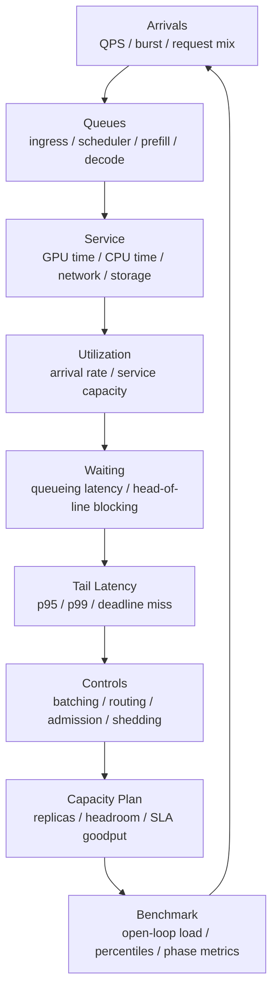

# 排队模型与尾延迟：QPS、并发、利用率和 p99

AI 推理服务的性能问题，很多不是“单个请求算得慢”，而是“请求在系统里等得久”。

常见现象包括：

- 平均延迟不高，但 p99 很差。
- GPU utilization 还没到 100%，请求已经开始排队。
- QPS 只增加 10%，p99 却翻倍。
- batching 提高了吞吐，但 TTFT 变差。
- 单请求测试很快，上并发后延迟突然失控。
- 重试策略本来想提高成功率，却把服务打爆。
- replica 数量看似够，但流量峰值一来就开始超时。

这些现象都和排队有关。

本篇重点回答：

> 如何用排队模型理解 AI 推理服务中的 QPS、并发、利用率、queueing latency、tail latency、batching、load shedding 和容量规划？

这不是一篇严格的排队论教材，而是一篇工程入门：目标是让读者能用简单模型解释现象、设计 benchmark、设置 headroom，并避免把系统推到尾延迟失控区间。

## 一张总图



这张图表达一个核心事实：

```text
延迟 = 服务时间 + 排队时间
```

单请求 profile 只能看到服务时间的一部分。在线服务的 p95/p99 往往由排队、突发、长请求、调度和过载控制共同决定。

## 基本概念

### Arrival Rate

Arrival rate 是请求到达速率，常写作：

```text
lambda = requests per second
```

工程上常叫 QPS、RPS 或 request rate。

要注意 arrival rate 有不同口径：

- 外部请求到达服务的速率。
- 通过 admission control 后真正进入队列的速率。
- 成功完成请求的速率。
- retry 后放大的实际请求速率。

如果系统发生过载，外部 QPS 和有效完成 QPS 可能差很多。

### Service Time

Service time 是请求真正被处理所需的时间。

在 LLM 推理里，它可能包含：

```text
tokenization
  + scheduling
  + prefill
  + decode loop
  + sampling
  + detokenization
  + response streaming
```

严格来说，scheduling 前的等待不属于 service time；但工程日志里经常混在一起。因此必须把阶段时间拆开记录。

### Service Rate

Service rate 是系统处理请求的速率，常写作：

```text
mu = requests per second
```

如果平均 service time 是 100 ms，那么单服务台的粗略 service rate 是：

```text
mu = 1 / 0.1 = 10 requests/s
```

但 AI 推理不是简单单服务台：

- batching 会让多个请求一起服务。
- prefill 和 decode 的资源形态不同。
- 不同请求输入/输出长度不同。
- 连续 batching 会让服务时间随队列状态变化。
- 多 GPU、多 replica、多模型共享资源。

所以 `mu` 在实际系统中不是常数，而是 workload、batch、长度分布和调度策略共同决定的有效服务能力。

### Utilization

利用率可以粗略理解为：

```text
rho = arrival_rate / service_capacity
```

如果：

```text
rho < 1
```

系统平均上有能力处理到达请求。

如果：

```text
rho >= 1
```

长期看队列会持续增长，除非请求被拒绝、超时、丢弃或服务降级。

工程上最容易误判的是：

> `rho < 1` 只表示平均上能处理，不表示 p99 好。

当 utilization 接近 1 时，即使平均服务能力略大于平均到达率，排队时间也会急剧增加。

### Queueing Latency

Queueing latency 是请求等待被处理的时间。

推理服务里可能有多段等待：

- 网关或 load balancer 等待。
- 服务进程 ingress queue 等待。
- scheduler 等待可用 batch slot。
- prefill queue 等待。
- decode queue 等待。
- KV Cache 资源等待。
- 多模型共享 GPU 时等待模型上下文。

如果只看 E2E latency，不拆 queueing latency，很难判断“模型慢”还是“排队慢”。

### Tail Latency

Tail latency 是高分位延迟，例如：

- p90。
- p95。
- p99。
- p99.9。

在线服务通常更关心 tail latency，而不是平均值。

原因很简单：用户、上游服务或 agent workflow 感受到的是某次请求是否超时，而不是所有请求的平均体验。

在多阶段系统中，尾延迟还会叠加。一个请求如果依赖多个子调用，只要其中一个子调用落在尾部，整体就可能变慢。

## Little's Law：并发、QPS 和延迟

Little's Law 是排队系统里最实用的关系之一：

```text
L = lambda * W
```

其中：

- `L`：系统内平均同时存在的请求数。
- `lambda`：有效到达率或完成率。
- `W`：请求在系统内平均停留时间。

在服务系统里，可以理解成：

```text
in_flight_requests = throughput * average_latency
```

例如：

```text
throughput = 100 requests/s
average_latency = 0.5 s
in_flight ~= 50 requests
```

这能解释几个常见现象。

### 并发不是独立指标

并发、吞吐、延迟三者绑定在一起。

如果 QPS 不变，但 latency 变长，in-flight requests 会增加。

如果 in-flight requests 增加，会消耗更多：

- 内存。
- KV Cache。
- socket。
-线程/协程。
- scheduler 状态。
- batch slot。

这就是过载时系统会“越慢越拥挤”的原因。

### 延迟变长会反过来放大资源压力

假设服务原来：

```text
QPS = 100
latency = 0.5s
in-flight = 50
```

如果过载让 latency 变成 2s：

```text
in-flight = 100 * 2 = 200
```

即使外部 QPS 没变，系统内部同时存在的请求数也变成 4 倍。

对 LLM 推理来说，这意味着：

- 更多请求占用 KV Cache。
- 更多请求占用 scheduler 状态。
- 更多 streaming connection。
- 更多超时和取消。
- 更多 retry 可能进一步放大到达率。

所以延迟不是一个被动结果，它会反过来影响系统容量。

## 为什么接近满载时 p99 会爆

最简单的直觉：

```text
服务台越忙，新来的请求越可能遇到前面还有活没做完。
```

当 utilization 很低时，请求到达时服务台经常是空的，排队很少。

当 utilization 很高时，请求到达时服务台大概率正在忙，稍微有一点抖动就会排队。

在 M/M/1 这类简化模型中，平均响应时间会随着 `lambda` 接近 `mu` 急剧上升：

```text
response_time ~= 1 / (mu - lambda)
```

不需要把这个公式当作真实推理服务的精确预测。它的工程意义是：

> 不要把线上服务长期推到理论最大吞吐附近。越接近饱和，排队时间越敏感，尾延迟越容易失控。

## Kingman 直觉：利用率、波动和服务时间

实际系统不是理想 M/M/1。请求到达会突发，服务时间也会变化。

Kingman 近似常被概括成 VUT 直觉：

```text
waiting time
  ~= utilization effect
   * variability effect
   * service time effect
```

更直观地说，排队等待由三类因素放大：

### Utilization

系统越接近满载，等待越容易急剧增加。

```text
rho / (1 - rho)
```

这一项会在 `rho` 接近 1 时变得很大。

### Variability

到达越突发、服务时间越不稳定，等待越严重。

在 LLM 推理中，服务时间变化来自：

- 输入长度不同。
- 输出长度不同。
- 是否命中 prefix cache。
- 是否触发 RAG 检索。
- 是否走工具调用。
- 是否 speculative decoding 接受率不同。
- 是否遇到长上下文。
- 是否动态 batch 中混入长请求。

### Service Time

单次服务越慢，排队等待的基础尺度越大。

这意味着优化单请求服务时间仍然有意义，因为它不仅缩短请求本身，也能降低后续请求等待。

Kingman 直觉给 AI 系统一个很重要的启发：

> 降低 p99 不只靠提高平均吞吐，还要降低 workload 波动、控制长请求、限制队列、做隔离和调度。

## LLM 推理里的队列不止一个

一个 LLM 服务里通常有多层队列。

```text
client
  -> load balancer
  -> API server ingress queue
  -> tokenizer / preprocessing
  -> scheduler waiting queue
  -> prefill batch
  -> decode active set
  -> sampling / postprocess
  -> streaming response
```

每一层都可能制造 tail latency。

### Ingress Queue

入口队列用于吸收短期突发。

如果入口队列过长，请求会在服务外层等待很久，等轮到它时可能已经接近 timeout。继续处理这样的请求可能浪费 GPU。

### Scheduler Queue

调度队列决定请求何时进入 prefill 或 decode。

影响因素包括：

- 当前 batch 是否已满。
- KV Cache 是否有空间。
- 请求长度。
- 优先级。
- 是否可与其他请求合批。
- 是否命中 prefix cache。

调度策略可以显著影响 p99。

### Prefill Queue

Prefill 处理输入 prompt，通常计算密集，长 prompt 会占用较多 GPU 时间。

如果长 prompt 和短 prompt 混在一起，短请求可能被长请求阻塞。

### Decode Active Set

Decode 阶段逐 token 生成，活跃请求集合会持续变化。

影响因素包括：

- 当前活跃序列数。
- 每个请求剩余输出长度。
- KV Cache 容量。
- batching 策略。
- speculative decoding。
- EOS 提前结束。

Decode 的排队和调度比普通 Web 服务更复杂，因为请求不是一次处理完，而是多轮反复占用 GPU。

## Batching 的排队取舍

Batching 是 AI 推理里最重要的吞吐优化之一，但它不是免费午餐。

Batching 的收益：

- 提高 GPU 利用率。
- 合并 kernel。
- 提高 tokens/s。
- 摊薄 launch overhead。
- 让矩阵形状更适合硬件。

Batching 的代价：

- 请求可能要等 batch 凑齐。
- 大 batch service time 可能变长。
- 长短请求混合会产生 head-of-line blocking。
- KV Cache 占用增加。
- p99 可能变差。

所以 batching 的核心问题不是“batch 越大越好”，而是：

```text
在 SLA 约束下，选择能最大化 goodput 的 batch 策略。
```

### Batch Window

很多系统会设置一个短暂等待窗口：

```text
wait up to X ms to form a better batch
```

如果 `X` 太小，batch 不充分，吞吐低。

如果 `X` 太大，TTFT 增加，p99 变差。

### Continuous Batching

连续 batching 允许请求在 decode 过程中动态加入和离开 batch。

它能显著提高吞吐，但也让排队模型更复杂：

- 请求服务不是一次完成。
- decode step 之间共享 GPU。
- 新请求插入会影响活跃集合。
- 长输出请求会长期占用资源。

因此 benchmark 必须记录：

- TTFT。
- TPOT。
- active sequence count。
- waiting queue length。
- prefill batch size。
- decode batch size。
- KV Cache occupancy。

只看 overall latency 不够。

## Head-of-Line Blocking

Head-of-line blocking 指队列前面的慢请求挡住后面的快请求。

在 LLM 推理中，慢请求可能是：

- 超长 prompt。
- 超长输出。
- RAG 上下文很多。
- 工具调用等待。
- 多模态输入预处理。
- prefix cache miss。
- 低优先级但已经进入队列的请求。

如果所有请求共用一个 FIFO 队列，短请求可能被长请求拖慢。

常见缓解方式：

- 按输入长度分桶。
- 按输出预算分队列。
- 区分 interactive 和 batch。
- 给长上下文单独 replica pool。
- 设置 max tokens、deadline、priority。
- 对超长请求使用单独调度策略。

不要只看平均输入长度。尾部长度分布通常决定 p99。

## Goodput：SLA 下的有效吞吐

Throughput 表示系统完成多少工作。

Goodput 表示在 SLA 约束下完成多少有用工作。

例如：

```text
throughput = 120 requests/s
but p99 latency > SLA
goodput at SLA = 90 requests/s
```

对在线推理来说，goodput 比峰值 throughput 更有意义。

容量规划要回答：

```text
每个 replica 在满足 TTFT / TPOT / E2E p99 的前提下，能承载多少 QPS？
```

而不是：

```text
极限压测下最多能挤出多少 tokens/s？
```

极限 throughput 经常对应不可接受的 tail latency。

## 过载、超时和重试

过载时，系统会出现一个危险反馈环：

```text
服务变慢
  -> in-flight requests 增加
  -> 队列变长
  -> 更多请求超时
  -> 客户端重试
  -> 到达率进一步升高
  -> 服务更慢
```

Google SRE 书中反复强调 overload 和 cascading failure 的关系；AWS Builders Library 也强调 timeout、retry、backoff 和 jitter 需要谨慎设计。对 AI 推理服务来说，这些经验尤其重要，因为 GPU 任务昂贵，处理已经超时的请求会浪费大量算力。

### Deadline Propagation

请求应该携带 deadline。

如果某个请求已经没有机会在 SLA 内完成，就应该尽早取消或拒绝，而不是继续占用 GPU。

### Load Shedding

当系统接近过载时，可以主动拒绝一部分请求，保住剩余请求的延迟和成功率。

常见触发条件：

- queue length 超过阈值。
- estimated waiting time 超过 deadline。
- KV Cache occupancy 过高。
- GPU memory pressure。
- p99 连续超标。
- active requests 超过限制。

拒绝请求听起来不好，但比让所有请求一起超时更好。

### Backoff and Jitter

客户端重试应该带退避和随机抖动。

如果所有客户端同时重试，会形成同步流量峰值，把刚恢复的服务再次打爆。

### Retry Budget

重试应该有预算。

例如：

- 每个请求最多重试几次。
- 每个客户端重试 QPS 上限。
- 只对可重试错误重试。
- 不重试已经明显超过 deadline 的请求。
- 对 overload 返回的错误采用更保守策略。

没有重试预算的系统，峰值流量会被客户端自己放大。

## 多副本服务的排队问题

多个 replica 并不自动消除排队。

常见问题：

### 负载不均

如果路由只做简单 round-robin，可能忽略每个 replica 当前队列长度、KV Cache 状态和请求长度。

更好的路由信号包括：

- waiting queue length。
- active sequence count。
- KV Cache occupancy。
- recent TTFT / TPOT。
- estimated time to first token。
- model loaded / warming state。
- node health。

### 异构节点

同一个服务池里可能有不同 GPU、不同显存、不同网络状态、不同温度/频率。

如果容量模型假设所有 replica 等价，p99 可能被慢节点拖坏。

### 冷启动

新 replica 加入时可能需要：

- 拉镜像。
- 加载模型权重。
- warmup kernel。
- 建立 cache。
- 编译 graph。

autoscaling 如果只看当前 QPS，可能来不及应对突发。容量规划必须考虑冷启动时间和预留 headroom。

## Benchmark 应该怎么设计

排队和尾延迟只有在负载测试中才会暴露。

单请求 benchmark 只能回答服务时间，不能回答排队行为。

### Open-loop vs Closed-loop

Closed-loop 测试常见方式是：

```text
client sends request
waits for response
sends next request
```

这种方式会因为服务变慢而自动降低发送速率，容易隐藏过载。

Open-loop 测试按指定到达过程发请求：

```text
send requests according to target QPS distribution
regardless of previous response completion
```

它更适合观察系统在固定外部到达率下的排队和 tail latency。

两者都有价值：

- closed-loop 适合模拟有限用户数的交互。
- open-loop 适合测容量边界和 overload 行为。

做容量规划时，至少要有 open-loop 压测。

### 到达过程不能只有平均 QPS

真实流量通常有突发。

benchmark 应该覆盖：

- steady QPS。
- burst traffic。
- diurnal pattern。
- sudden spike。
- retry storm。
- long-context burst。
- mixed short/long requests。

如果只测恒定平均 QPS，会低估 p99。

### 请求长度分布必须真实

LLM 推理的 service time 高度依赖：

- input tokens。
- output tokens。
- max tokens。
- stop condition。
- RAG chunks。
- image/audio/video 输入大小。
- tool call 次数。

benchmark 必须使用长度分布，而不是只用一个固定 prompt。

至少记录：

```text
input_tokens p50/p90/p99
output_tokens p50/p90/p99
concurrent requests
TTFT p50/p95/p99
TPOT p50/p95/p99
E2E latency p50/p95/p99
error / timeout / cancelled
```

## 需要采集的指标

为了分析排队和尾延迟，建议采集以下指标。

### 请求时间戳

每个请求记录：

```text
client_send_time
server_receive_time
admission_time
scheduled_time
prefill_start_time
prefill_end_time
first_token_time
last_token_time
response_finish_time
```

这样可以拆出：

```text
network latency
ingress queueing
scheduler waiting
prefill latency
TTFT
decode TPOT
postprocess / streaming
E2E latency
```

### 队列指标

按时间记录：

- waiting queue length。
- active request count。
- active sequence count。
- prefill queue length。
- decode active set size。
- batch size。
- batch wait time。
- queue age。
- rejected requests。
- cancelled requests。

队列长度本身不是最终目标，但它能解释 p99。

### 资源指标

同时记录：

- GPU utilization。
- HBM bandwidth。
- KV Cache occupancy。
- GPU memory free/used。
- CPU utilization。
- tokenizer time。
- network throughput。
- storage/cache hit。

排队问题常常由资源瓶颈触发，但最终表现为 latency。

## 容量规划怎么用排队模型

一个实用流程：

### 1. 定义 SLA

例如：

```text
TTFT p99 < 500 ms
TPOT p99 < 50 ms
E2E p99 < 5 s
error rate < 0.1%
```

### 2. 定义 workload 分布

记录：

```text
input length distribution
output length distribution
request mix
burst factor
cache hit rate
priority classes
```

### 3. 测单 replica goodput 曲线

对每个 replica，压测不同 QPS：

```text
QPS -> TTFT/TPOT/E2E p50/p95/p99 -> error rate
```

找到满足 SLA 的最大 QPS：

```text
goodput_per_replica_at_SLA
```

### 4. 加 headroom

不要按极限 goodput 部署。

需要考虑：

- 流量突发。
- 节点故障。
- rolling update。
- cache miss。
- 模型热切换。
- 长请求比例变化。
- 上游 retry。

例如：

```text
required_replicas
  = ceil(peak_QPS / (goodput_per_replica_at_SLA * target_utilization))
```

其中 `target_utilization` 可能是 0.5、0.6、0.7，取决于 tail latency 敏感程度和 workload 波动。

### 5. 做故障场景验证

验证：

- 少一个 replica 是否还能满足 SLA。
- 某个节点慢 20% 时路由是否能避开。
- cache miss burst 是否会打爆 p99。
- 上游 retry 是否会放大流量。
- autoscaling 是否来得及。

容量规划不是只算平均 QPS，而是验证系统在压力和故障下是否稳定。

## 常见诊断模式

### QPS 增加一点，p99 大幅变差

可能原因：

- utilization 接近饱和。
- 队列过长。
- 长请求比例变化。
- batch window 太大。
- KV Cache 接近容量上限。
- 负载不均。

排查：

- 画 QPS -> p99 曲线。
- 同时看 queue length。
- 看 rejected/timeout/cancelled。
- 按 input/output length 分桶。

### TTFT 高，但 TPOT 正常

可能原因：

- ingress queue 等待。
- scheduler 等待。
- prefill queue 堵塞。
- batch wait window 太大。
- 长 prompt 阻塞短 prompt。

排查：

- 拆 TTFT：queueing + prefill。
- 看 prefill batch size。
- 看 prompt length 分布。
- 看 prefix cache hit。

### TPOT 高，但 TTFT 正常

可能原因：

- decode active set 太大。
- KV Cache 读成为瓶颈。
- decode batch 调度不合理。
- speculative decoding 接受率低。
- HBM bandwidth 接近上限。

排查：

- 看 active sequence count。
- 看 KV Cache occupancy。
- 看 HBM bandwidth。
- 按 context length 分桶。

### 平均延迟正常，p99 抖动

可能原因：

- burst arrival。
- long-tail service time。
- slow replica。
- GC / CPU 抖动。
- cache eviction。
- network jitter。
- load balancer 不均。

排查：

- 不只看均值，画分位数和时间序列。
- 找 p99 请求样本。
- 对比 slow request 和 normal request 的长度、replica、cache、queue。
- 检查是否集中在少数节点。

### GPU utilization 高，但 goodput 不高

可能原因：

- 处理了很多超时请求。
- retry 放大了无效工作。
- batch 太大导致 SLA 失败。
- 长请求占用资源。
- 低优先级请求挤占高优先级。

排查：

- 同时看 completed、timeout、cancelled、rejected。
- 统计 successful tokens/s 和 wasted tokens/s。
- 按 deadline 检查是否及时取消。

## 设计建议

### 小队列优先

长队列能吸收突发，但会隐藏过载并增加尾延迟。

对低延迟在线推理，队列应该有明确上限，并配合 deadline、admission control 和 load shedding。

### 明确区分请求类型

不要把所有请求放进同一个池。

至少区分：

- interactive chat。
- batch offline generation。
- RAG-heavy requests。
- long-context requests。
- agent/tool requests。
- high-priority / low-priority。

不同请求类型的 SLA 和排队策略应该不同。

### 用 estimated waiting time 做 admission

单纯按 queue length 拒绝不够，因为请求服务时间不同。

更好的信号是：

```text
estimated_waiting_time + estimated_service_time < deadline_remaining
```

估算不需要完美，只要比盲目排队更好。

### 限制最大工作量

需要设置：

- max input tokens。
- max output tokens。
- max total tokens。
- max batch size。
- max active sequences。
- max queue time。
- max KV Cache occupancy。

没有上限的请求会让排队模型失效。

### 对取消请求及时释放资源

客户端断开、deadline 过期、上游取消时，服务端要尽快停止生成并释放：

- KV Cache。
- scheduler state。
- network stream。
- batch slot。

否则系统会处理无效请求，goodput 下降。

## 报告模板

排队和尾延迟分析可以按下面模板记录。

```text
Workload:
  model / input length distribution / output length distribution / request mix

SLA:
  TTFT / TPOT / E2E / error budget

Load Pattern:
  open-loop or closed-loop
  steady QPS / burst / retry / ramp-up

Capacity Curve:
  QPS -> p50/p95/p99 latency
  QPS -> goodput at SLA
  QPS -> error/timeout/reject

Queue Metrics:
  ingress queue length
  scheduler wait
  prefill queue
  decode active set
  KV Cache occupancy

Resource Metrics:
  GPU / HBM / CPU / network / memory

Bottleneck:
  service time, queueing, batching, routing, cache, or overload

Decision:
  replica count
  target utilization
  queue limit
  load shedding rule
  routing policy
```

## 小结

排队模型给 AI 推理系统一个基础判断框架：

- QPS、并发和延迟由 Little's Law 绑定。
- 利用率接近饱和时，排队和 p99 会快速恶化。
- 到达突发和服务时间波动会放大等待。
- batching 提高吞吐，但可能增加 TTFT 和尾延迟。
- goodput at SLA 比极限 throughput 更适合容量规划。
- 过载时要尽早拒绝、降级或取消，而不是让队列无限增长。
- benchmark 必须覆盖 open-loop 负载、真实长度分布、burst、p95/p99 和队列指标。

对 AI 系统来说，排队不是运维细节，而是容量、调度、缓存和用户体验之间的核心连接点。

## 参考资料

- [J. D. C. Little, A Proof for the Queuing Formula: L = λW](https://doi.org/10.1287/opre.9.3.383)
- [J. F. C. Kingman, The single server queue in heavy traffic](https://doi.org/10.1017/S0305004100054383)
- [Google Research: The Tail at Scale](https://research.google/pubs/the-tail-at-scale/)
- [Google SRE Book: Addressing Cascading Failures](https://sre.google/sre-book/addressing-cascading-failures/)
- [Google SRE Book: Handling Overload](https://sre.google/sre-book/handling-overload/)
- [AWS Builders Library: Timeouts, retries, and backoff with jitter](https://aws.amazon.com/builders-library/timeouts-retries-and-backoff-with-jitter/)
