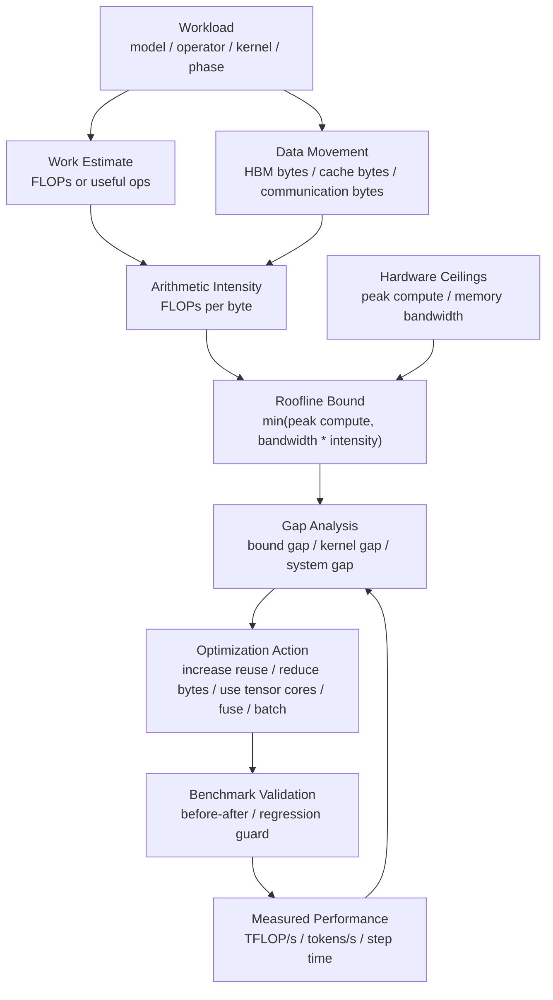

# Roofline 分析：算力、带宽与瓶颈上限

在 AI 系统性能分析里，经常会遇到这样的判断：

- 这个 kernel 是 compute-bound 还是 memory-bound？
- GPU 峰值 TFLOPS 很高，为什么模型没有变快？
- HBM 带宽翻倍，哪些 workload 会受益？
- FP8/INT8 理论算力很高，为什么端到端吞吐没有等比例提升？
- FlashAttention、算子融合、KV Cache 优化为什么有效？
- profiler 里看到 HBM bandwidth 很高，下一步应该优化什么？

Roofline 模型就是回答这些问题的基础工具。

第 6 章的 [AI 加速器性能模型：算力、带宽与 Roofline](../06-accelerators-architecture/performance-model-roofline.md) 从硬件架构角度解释了算力、带宽、存储层次和硬件上限。本篇站在 benchmark 和性能剖析角度，重点回答：

> 已经有 benchmark 和 profiler 数据后，如何用 Roofline 判断瓶颈上限、解释性能差距、选择优化方向，并避免把“峰值算力”误当成“真实吞吐”？

## 一张总图



这张图里最重要的是两条线：

- 理论上限线：由硬件峰值和 arithmetic intensity 决定。
- 实测性能点：由 benchmark 或 profiler 采到。

性能分析的目标不是把公式算得很精确，而是回答：

```text
现在离哪个上限最近？
差距主要来自硬件物理上限，还是来自 kernel、编译器、shape、调度和系统开销？
```

## 核心公式

Roofline 的核心公式是：

```text
attainable_performance
  <= min(peak_compute, memory_bandwidth * arithmetic_intensity)
```

其中：

```text
arithmetic_intensity = FLOPs / bytes_moved
```

可以用更直观的话解释：

- `peak_compute`：硬件每秒最多能做多少计算。
- `memory_bandwidth`：硬件每秒最多能搬多少数据。
- `arithmetic_intensity`：每搬 1 byte 数据，能做多少计算。

如果每搬 1 byte 数据只能做很少计算，那么即使计算单元很强，也会一直等数据。

如果每搬 1 byte 数据能做很多计算，那么数据搬运不再是主要限制，计算单元峰值会成为上限。

## Ridge Point：分界点

Roofline 里有一个关键分界点，常叫 ridge point。

```text
ridge_point = peak_compute / memory_bandwidth
```

单位是：

```text
FLOPs / byte
```

它表示：

> 一个 workload 的 arithmetic intensity 至少要达到多少，才有机会吃满计算峰值。

例如某硬件：

```text
peak_compute = 1000 TFLOP/s
HBM bandwidth = 4 TB/s
```

则：

```text
ridge_point = 1000 / 4 = 250 FLOPs/byte
```

这意味着：

- 如果某个 kernel 只有 `10 FLOPs/byte`，它大概率受带宽限制。
- 如果某个 kernel 有 `500 FLOPs/byte`，它才更可能接近计算峰值。

这个分界点能解释一个常见现象：

> 新一代 GPU 的峰值 TFLOPS 增长很快，但很多低 arithmetic intensity 算子并不会等比例变快，因为它们需要的是带宽、缓存复用和减少数据搬运。

## 怎么读 Roofline 图

典型 Roofline 图有两个轴：

| 轴 | 含义 |
| --- | --- |
| 横轴 | arithmetic intensity，通常是 FLOPs/byte |
| 纵轴 | performance，通常是 FLOP/s |

图上通常有：

- 一条斜线：memory bandwidth roof。
- 一条水平线：compute roof。
- 若干实测点：operator 或 kernel 的位置。

读图时按下面顺序：

1. 看点在 ridge point 左边还是右边。
2. 看点离 memory roof 近，还是离 compute roof 近。
3. 看点离对应 roof 的距离有多大。
4. 再看 profiler 证据解释差距。

简单判断：

| 位置 | 直觉 | 优化方向 |
| --- | --- | --- |
| ridge point 左侧 | arithmetic intensity 低，偏 memory-bound | 减少 bytes、提高复用、fusion、layout、低精度 |
| ridge point 右侧 | arithmetic intensity 高，偏 compute-bound | 提高 Tensor Core 利用率、tile、shape、dtype、occupancy |
| 离 roof 很远 | 还有实现或系统开销 | 看 kernel metrics、launch、同步、cache、编译器、通信 |
| 已接近 roof | 单点优化空间有限 | 换算法、改数据流、改 workload 或硬件 |

Roofline 的价值在于给优化设定方向：不要在 memory-bound kernel 上只盯着 TFLOPS，也不要在 compute-bound kernel 上只盯着 HBM 带宽。

## FLOPs 怎么估算

Roofline 分析需要先估算计算量。

AI workload 中常见估算包括：

### GEMM

对于：

```text
C = A[M, K] @ B[K, N]
```

乘加计算量通常估为：

```text
FLOPs ~= 2 * M * N * K
```

这里把一次 multiply 和一次 add 记为 2 FLOPs。

大模型里的线性层、QKV projection、MLP projection、attention QK/PV 都会转成 GEMM 或 batched GEMM。

### Attention

标准 attention 包含：

```text
QK^T
softmax
softmax(V)
```

其中 QK 和 PV 是主要计算项，softmax 和 mask 更偏 memory-bound。

粗略估算时，可以先看：

```text
QK FLOPs ~= 2 * batch * heads * query_len * key_len * head_dim
PV FLOPs ~= 2 * batch * heads * query_len * key_len * head_dim
```

训练或 prefill 中，`query_len` 和 `key_len` 都可能较大。

decode 中，通常 `query_len = 1`，但 `key_len` 随上下文增长，计算形态和数据复用会明显不同。

### Elementwise / Norm / Softmax

这类算子的 FLOPs 相对不高，但读写 tensor 多。

例如 elementwise add：

```text
y = a + b
```

每个元素只有一次加法，但至少要读两个输入、写一个输出。它通常不是被 FLOPs 限制，而是被 memory bandwidth、cache、launch overhead 限制。

### Optimizer

优化器 step 里可能有大量逐元素更新，例如 AdamW：

```text
m update
v update
weight decay
parameter update
```

单个元素会做若干次标量运算，但也会读写参数、梯度、一阶矩、二阶矩等状态。很多 optimizer update 的瓶颈并不在计算峰值，而在显存读写和状态容量。

## Bytes 怎么估算

比 FLOPs 更容易被低估的是 bytes moved。

Roofline 中的 bytes 通常关注“从较慢层级搬到较快层级的数据量”。在 GPU kernel 分析中，最常用的是 HBM bytes，也就是 global memory 读写量。

估算 bytes 时要考虑：

- 读输入 tensor。
- 写输出 tensor。
- 读写中间 tensor。
- 读写参数。
- 读写 KV Cache。
- 读写 optimizer states。
- padding 和 alignment。
- dtype 大小。
- 是否有重复读写。
- cache 是否命中。

常见 dtype 大小：

| dtype | bytes / element |
| --- | --- |
| FP32 | 4 |
| BF16 / FP16 | 2 |
| FP8 / INT8 | 1 |
| INT4 / FP4 | 0.5 |

一个重要经验：

> 算法论文里的“计算复杂度”不等于硬件实际 bytes moved。高性能实现常常不是减少 FLOPs，而是减少 HBM 读写次数。

FlashAttention 就是典型例子：它的核心收益不是把 attention 的数学定义变了，而是通过 tiling 和 online softmax 减少中间 attention matrix 的 HBM 读写。

## 用 profiler 获取数据

手算只是第一步，实际分析要结合 profiler。

常见数据来源：

| 数据 | 可能来源 |
| --- | --- |
| operator 时间 | PyTorch Profiler、框架 profiler |
| kernel 时间 | Nsight Systems、Nsight Compute |
| achieved FLOP/s | Nsight Compute、厂商 profiler、手算 FLOPs / kernel time |
| HBM throughput | Nsight Compute memory metrics、DCGM、硬件 profiler |
| Tensor Core 使用 | Nsight Compute、vendor profiler |
| occupancy / stall | Nsight Compute |
| end-to-end tokens/s | benchmark 工具、服务指标 |
| step time / MFU | 训练日志、benchmark |

一个可用的流程是：

1. 用 benchmark 得到端到端指标。
2. 用 PyTorch Profiler 找耗时 operator。
3. 用 Nsight Systems 确认时间线和关键 kernel。
4. 用 Nsight Compute 看关键 kernel 的 FLOP/s、memory throughput、Tensor Core、stall reason。
5. 把关键 kernel 画到 Roofline 上。
6. 再决定优化方向。

不要反过来：先打开 Nsight Compute 抓一个随机 kernel，再试图从微观指标推导端到端结论。

## Roofline 与端到端性能的关系

Roofline 原本更适合分析 kernel 或 operator，不是完整服务。

端到端推理或训练包含很多非 kernel 因素：

- queueing。
- batching。
- scheduler。
- tokenization。
- Python overhead。
- CPU/GPU 同步。
- kernel launch。
- communication。
- checkpoint。
- network streaming。
- cache miss。

因此端到端性能可以粗略拆成：

```text
end_to_end_time
  = compute_kernel_time
  + memory_kernel_time
  + communication_time
  + launch_and_runtime_overhead
  + queueing_and_system_overhead
```

Roofline 能解释其中的 kernel 上限，但不能解释全部。

正确用法是：

- 用端到端 benchmark 确认问题。
- 用 profiler 找关键 kernel 或阶段。
- 对关键 kernel 做 Roofline 分析。
- 再把 kernel 优化收益放回端到端路径里验证。

如果某个 kernel 只占端到端 2%，即使它离 Roofline 很远，也不一定值得优先优化。

## 典型 AI 算子的 Roofline 直觉

下面是常见直觉，不是固定结论。真实位置取决于 shape、dtype、硬件、kernel 实现和 batch。

| 算子/阶段 | 常见瓶颈倾向 | 说明 |
| --- | --- | --- |
| 大 GEMM | compute-bound | 数据复用高，容易接近矩阵单元上限 |
| 小 GEMM | launch-bound 或 compute under-utilized | shape 太小，Tensor Core 吃不满 |
| LayerNorm / RMSNorm | memory-bound | 每元素计算少，读写多 |
| Softmax | memory-bound / latency-sensitive | 依赖 reduction、访存和数值稳定处理 |
| Elementwise | memory-bound / launch-bound | FLOPs 少，中间 tensor 写回多 |
| Embedding lookup | memory-bound / irregular access | 访问不规则，cache 命中影响大 |
| KV Cache read | memory-bound | decode 阶段常见瓶颈 |
| Attention prefill | compute + memory 混合 | QK/PV 有大矩阵乘，softmax 和中间数据也重要 |
| Attention decode | memory-bound 倾向更强 | 每步 query 少，KV 读随上下文增长 |
| Optimizer update | memory-bound | optimizer states 读写量大 |
| AllReduce / AllToAll | communication-bound | 受互连带宽、拓扑和重叠影响 |

这张表的作用是帮助快速形成假设。真正结论必须由 benchmark 和 profiler 证明。

## 例子一：为什么大 GEMM 容易快

考虑一个大矩阵乘：

```text
C[M, N] = A[M, K] @ B[K, N]
```

FLOPs 约为：

```text
2 * M * N * K
```

如果 M、N、K 都很大，A 和 B 的 tile 可以在片上存储中被重复使用。一次从 HBM 读入的元素，可以参与很多次乘加。

这会提高 arithmetic intensity。

结果是：

- 更容易进入 compute-bound 区域。
- 更容易用满 Tensor Core。
- 更容易获得高 TFLOP/s。

这解释了为什么大 batch 训练中的 MLP / projection 往往效率较高。

但如果模型并行把矩阵切得太碎，或者 decode 阶段 batch 很小，大 GEMM 会变成很多小 GEMM，效率可能明显下降。

## 例子二：为什么 KV Cache 读很难靠 TFLOPS 解决

LLM decode 阶段每生成一个 token，都要读历史 KV Cache。

随着上下文变长：

```text
bytes_to_read ~= layers * heads * context_length * head_dim * dtype_bytes
```

每一步 query 只有一个或少量 token，计算规模不像 prefill 那样大，但要读的 KV 会随 context 增长。

结果是：

- HBM bandwidth 变得很重要。
- KV Cache layout 很重要。
- cache 分页和连续性很重要。
- quantized KV Cache 可能有效。
- batching 能改变吞吐，但也增加 KV 容量压力。

这也是为什么推理优化里不能只看模型权重 GEMM。TPOT 往往被 decode 的 KV 访问、调度和小 kernel 效率影响。

## 例子三：为什么 Fusion 能提升 memory-bound 算子

假设有三个 elementwise 算子：

```text
x1 = f(x)
x2 = g(x1)
y = h(x2)
```

如果每个算子单独一个 kernel，可能发生：

```text
读 x -> 写 x1
读 x1 -> 写 x2
读 x2 -> 写 y
```

中间结果 `x1`、`x2` 都要写回 HBM，再读回来。

Fusion 后可以变成：

```text
读 x -> 在寄存器/片上计算 f,g,h -> 写 y
```

FLOPs 可能没变，但 bytes moved 大幅下降。

因此 arithmetic intensity 上升，memory-bound 压力下降，kernel launch 次数也减少。

这解释了为什么 TorchInductor、XLA、Triton fusion、手写 fused kernel 对 LayerNorm、activation、bias、residual、quant/dequant 等路径很重要。

## 例子四：为什么低精度不是必然等比例提速

低精度通常能带来两类收益：

- 计算峰值更高。
- 每个元素 bytes 更少。

但端到端提速不一定等比例，因为还要看瓶颈是否改变。

可能出现：

### 原来是 compute-bound

如果原来大 GEMM 受计算限制，BF16 换 FP8 可能显著提升。

但前提是：

- kernel 真正走 FP8 Tensor Core。
- shape 满足高吞吐路径。
- scale / amax 管理没有引入过大开销。
- 其他阶段没有立刻成为新瓶颈。

### 原来是 memory-bound

如果原来受 HBM 带宽限制，低精度减少 bytes 后可能有效。

例如权重量化、KV Cache 量化、optimizer state 压缩，可能降低读写量。

但如果瓶颈来自 launch、调度、通信、cache miss 或 CPU，低精度收益会被稀释。

### 反量化开销抵消收益

量化推理常见问题是：

```text
weight bytes 降低
  但 dequant kernel / scale load / layout conversion 增加
```

因此要用 profiler 看：

- dequant 是否融合进 GEMM。
- scale 读取是否增加带宽压力。
- 量化 layout 是否匹配高效 kernel。
- tokens/s 或 latency 是否真正改善。

## 用 Roofline 指导优化方向

### 如果偏 memory-bound

优先考虑：

- 减少 HBM 读写次数。
- kernel fusion。
- 避免 materialize 大中间 tensor。
- 改善 memory coalescing。
- 改善 data layout。
- 使用更低精度减少 bytes。
- 提高 cache 命中。
- 使用 tiling 增加数据复用。
- 减少 padding 浪费。
- 对 KV Cache 做分页、压缩、量化或分层管理。

典型技术：

- FlashAttention。
- fused LayerNorm/RMSNorm。
- fused bias + activation。
- fused quant/dequant + GEMM。
- PagedAttention。
- KV Cache quantization。
- TorchInductor fusion。
- Triton 自定义 kernel。

### 如果偏 compute-bound

优先考虑：

- 确认 Tensor Core / Matrix Core 是否被使用。
- 选择合适 dtype。
- 调整 tile shape。
- 调整 batch / micro-batch。
- 避免把大 GEMM 切成过小 GEMM。
- 改善 occupancy。
- 减少寄存器压力。
- 使用更高效的 grouped GEMM。
- 检查 layout 和 alignment。

典型技术：

- cuBLASLt / CUTLASS / Triton matmul。
- FP8/BF16 mixed precision。
- grouped GEMM for MoE。
- persistent matmul。
- tensor parallel 配置调整。
- CUDA Graph 减少重复 launch。

### 如果离 roof 很远

说明仅用 compute/memory 上限还解释不了问题。

继续看：

- kernel launch overhead。
- CPU 调度开销。
- 同步点。
- warp stall reason。
- memory divergence。
- cache conflict。
- branch divergence。
- occupancy。
- register spill。
- 编译器 fallback。
- 通信等待。
- 多租户干扰。

这时 Roofline 给出的不是答案，而是提示：理论上限没有被接近，必须回到 profiler 找实现问题。

## 推理场景中的 Roofline

LLM 推理可以粗略分成 prefill 和 decode。

### Prefill

Prefill 处理整段输入 prompt。

特点：

- 矩阵乘规模相对大。
- attention QK/PV 计算量大。
- batch 和 sequence length 影响很明显。
- 更容易出现 compute-heavy 阶段。

优化关注：

- GEMM / attention kernel 效率。
- FlashAttention。
- continuous batching。
- prompt 长度分布。
- prefix cache 命中。
- 低精度权重和激活。

### Decode

Decode 每次生成一个或少量 token。

特点：

- 每步矩阵规模小。
- 需要读历史 KV Cache。
- kernel launch 和调度开销更明显。
- TPOT 对 HBM、KV layout、batching 很敏感。

优化关注：

- KV Cache 读写 bytes。
- PagedAttention。
- KV Cache quantization。
- speculative decoding。
- CUDA Graph。
- persistent kernel。
- batch 调度。
- prefix cache。

因此同一个模型，prefill 和 decode 在 Roofline 上可能落在完全不同区域。

## 训练场景中的 Roofline

训练通常比推理更容易吃满大矩阵计算，但也有很多 memory/communication 问题。

### Forward / Backward

大部分时间可能在：

- attention GEMM。
- MLP GEMM。
- backward GEMM。

这些更可能接近 compute-bound，适合用 MFU、Tensor Core utilization 和 Roofline 分析。

### Activation 与 Checkpointing

activation checkpointing 减少显存保存，但增加 recompute。

从 Roofline 角度看，它是在做一个权衡：

```text
减少 activation bytes / memory capacity pressure
  换取额外 FLOPs
```

如果训练原本 memory-capacity 受限，recompute 可以让更大 batch 或更长 sequence 成立。是否划算要看额外 FLOPs 是否能被硬件高效执行。

### Optimizer

AdamW 这类优化器状态多，memory footprint 和 HBM bandwidth 压力大。

如果 optimizer step 在 profiler 中占比较高，可能需要看：

- fused optimizer。
- optimizer state sharding。
- ZeRO/FSDP。
- 低精度 optimizer state。
- CPU offload 是否引入 PCIe/网络瓶颈。

### Communication

多机训练还有 network roofline。

即使单卡 kernel 接近 compute roof，多卡也可能被：

- all-reduce。
- reduce-scatter。
- all-gather。
- all-to-all。
- pipeline send/recv。

限制。

这时需要把 Roofline 思想扩展到通信：

```text
communication_time >= bytes_to_transfer / effective_network_bandwidth
```

也就是说，不仅要问“每 byte HBM 能做多少 FLOPs”，还要问“每 byte 网络通信能换来多少有效训练进展”。

## 从 Roofline 到容量建模

Roofline 不只是 kernel 优化工具，也能帮助容量判断。

例如：

### 评估硬件采购

如果目标 workload 主要 memory-bound，那么只买峰值 TFLOPS 更高的卡，收益可能有限。需要看：

- HBM bandwidth。
- HBM capacity。
- cache。
- 小 kernel 效率。
- KV Cache 容量。
- 端到端 benchmark。

### 评估推理副本数

如果 decode TPOT 主要受 KV Cache HBM 读限制，那么单副本吞吐不会随计算峰值线性增长。

容量模型要把：

- context length 分布。
- KV bytes/token。
- HBM bandwidth。
- cache 命中率。
- batch 调度。

纳入，而不是只用 TFLOPS 推算。

### 评估训练扩展

如果单卡训练已经接近 compute roof，但扩展到多卡后效率下降，问题可能不在单卡 kernel，而在通信、rank mapping、data pipeline 或 checkpoint。

这时继续优化单卡 GEMM 的收益很小，需要转向分布式 profiler。

## 常见误区

### 误区一：Roofline 能精确预测端到端速度

不能。

Roofline 是上限模型，不是完整模拟器。它通常不直接包含：

- kernel launch。
- CPU 调度。
- queueing。
- 网络服务开销。
- 动态 batch。
- cache eviction。
- 分布式同步。
- 框架 overhead。

它适合解释 kernel/operator 的性能上限，再辅助端到端分析。

### 误区二：Arithmetic intensity 只要手算一次就够

不够。

实际 bytes moved 会受实现影响：

- 是否 materialize 中间 tensor。
- 是否 fusion。
- cache 是否命中。
- layout 是否连续。
- padding 是否浪费。
- dtype 是否一致。
- 是否有隐式 copy。

同一个数学算子，不同 kernel 的 arithmetic intensity 可能不同。

### 误区三：接近 Roofline 就一定不需要优化

如果一个 kernel 已接近当前算法和硬件的 roof，单点微优化空间确实小。

但仍可能通过更大改变优化：

- 换算法。
- 改数据流。
- 做 fusion。
- 减少调用次数。
- 改 batch 策略。
- 改缓存策略。
- 避免该 kernel 落在关键路径。

Roofline 只能说明“在当前计算和数据搬运模型下”的上限。

### 误区四：只看 FLOP/s，不看 tokens/s

AI 系统的最终目标通常不是 FLOP/s，而是：

- tokens/s。
- latency。
- p99。
- cost/token。
- energy/token。
- time to train。

FLOP/s 是解释指标，不是最终业务指标。

一个系统可以 FLOP/s 很高，但 p99 很差；也可以通过减少无效计算让 FLOP/s 下降，但 tokens/s 上升。

### 误区五：把所有瓶颈都叫 memory-bound

HBM bandwidth 高不等于所有问题都是 memory-bound。

还要区分：

- HBM bandwidth 接近上限。
- L2/cache 行为差。
- memory coalescing 差。
- register spill。
- launch overhead。
- CPU 没供应上。
- 通信等待。
- allocator 或同步开销。

memory-bound 是需要证据证明的结论，不是看到速度慢后的默认解释。

## 实战检查清单

做 Roofline 分析时，可以按下面检查。

### 定义对象

- 分析的是端到端请求、阶段、operator 还是 kernel？
- 是否在关键路径上？
- 占端到端时间多少？
- workload shape 是否代表真实情况？

### 估算工作量

- FLOPs 怎么算？
- bytes moved 怎么算？
- dtype 是什么？
- 是否包含中间 tensor？
- 是否考虑 KV Cache、optimizer state、activation？

### 获取硬件上限

- peak compute 用哪个 dtype 的峰值？
- memory bandwidth 用理论值还是实测值？
- 是否有 tensor core / sparsity / FP8 特殊路径？
- 是否用实际可达到带宽做 roof？

### 对照 profiler

- 实测 kernel time 是多少？
- achieved FLOP/s 是多少？
- HBM throughput 是多少？
- Tensor Core 是否使用？
- stall reason 是什么？
- 是否有同步或 launch gap？

### 形成结论

- 更像 compute-bound、memory-bound、launch-bound 还是 communication-bound？
- 离 roof 的差距是否能由 profiler 解释？
- 优化方向是减少 bytes、提高复用、提高计算利用率，还是减少系统开销？
- 预期端到端收益上限是多少？

### 验证收益

- 是否做 before/after benchmark？
- 是否保持 workload 不变？
- 是否检查 p50/p99、tokens/s、显存、功耗和质量？
- 是否加入回归检测？

## 报告模板

可以把 Roofline 分析写成下面格式。

```text
Object:
  operator/kernel/phase name

Workload:
  model, batch, sequence length, dtype, hardware

Time Share:
  percentage of end-to-end time

FLOPs Estimate:
  formula and result

Bytes Estimate:
  HBM read/write estimate and assumptions

Arithmetic Intensity:
  FLOPs / byte

Hardware Ceilings:
  peak compute, measured/theoretical bandwidth, ridge point

Profiler Evidence:
  kernel time, achieved FLOP/s, HBM throughput, Tensor Core usage, stalls

Conclusion:
  compute-bound / memory-bound / launch-bound / communication-bound

Optimization:
  chosen action and why it matches evidence

Validation:
  before-after metrics and caveats
```

这个模板可以和第 8 章的 benchmark 报告、profiler 报告配合使用。

## 小结

Roofline 分析的核心不是画图，而是建立一种性能判断方式：

```text
性能上限 = min(算力上限, 带宽上限 * 数据复用能力)
```

它帮助我们判断：

- 算子是更缺算力，还是更缺带宽。
- 优化应该减少数据搬运，还是提高计算单元利用率。
- 某个硬件升级对目标 workload 是否可能有效。
- profiler 看到的瓶颈是否接近物理上限。
- kernel 级优化能否转化成端到端收益。

对 AI 系统来说，Roofline 最重要的实践价值是避免盲目优化。它让团队在讨论“更快、更省、更高效”时，不只看峰值参数，而是回到 workload 的 FLOPs、bytes、shape、数据复用和实测证据。

## 参考资料

- [Roofline: An Insightful Visual Performance Model for Multicore Architectures](https://dl.acm.org/doi/10.1145/1498765.1498785)
- [NVIDIA Nsight Compute Documentation](https://docs.nvidia.com/nsight-compute/)
- [NVIDIA Nsight Compute Profiling Guide](https://docs.nvidia.com/nsight-compute/ProfilingGuide/index.html)
- [NVIDIA CUDA C++ Best Practices Guide](https://docs.nvidia.com/cuda/cuda-c-best-practices-guide/)
- [NERSC Roofline Documentation](https://docs.nersc.gov/tools/performance/roofline/)
