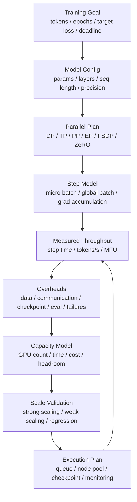

# 训练容量建模：Tokens/s、Step Time、MFU 与扩展效率

训练容量建模回答的不是“这批 GPU 峰值算力有多高”，而是：

> 在指定模型、数据、并行策略、训练配置和容错策略下，完成目标训练量需要多少 GPU、多少时间、多少成本，以及扩展到更多 GPU 后效率会怎样变化？

训练容量规划如果只看 GPU 数量，会很容易误判。

常见错误包括：

- 用理论 FLOPS 推算训练时间。
- 用单机 tokens/s 线性外推到千卡。
- 只看 step time，不看 DataLoader、通信、checkpoint 和故障恢复。
- 只看 MFU，不看排队、重启、评测和数据处理。
- 只看平均 step time，不看长尾、straggler 和周期性 checkpoint spike。
- 只算一次训练运行成本，不算失败重试和实验探索成本。

训练系统的真实容量取决于一条长链：

```text
data
  -> dataloader
  -> forward/backward
  -> communication
  -> optimizer
  -> checkpoint/eval
  -> failure recovery
  -> queue and scheduling
```

任何一环变慢，最终 tokens/s 都会下降。

更准确地说，训练容量建模关心三件事：

1. **可完成性**：现有资源能不能在目标时间内完成训练。
2. **可扩展性**：增加 GPU 后，训练时间是否按预期下降。
3. **可运营性**：checkpoint、故障、排队、数据和评测是否会把理论计划打穿。

所以训练容量不是单一数字，而是一组带前提的结论：

```text
given:
  model + data + batch + parallelism + hardware + reliability policy

estimate:
  time_to_target
  required_gpus
  scaling_efficiency
  cost
  risk_and_headroom
```

如果这些前提变化，容量结论也必须重新计算。

## 一张总图



这张图表达一个闭环：

- 先定义训练目标。
- 再定义模型和训练配置。
- 用实际 benchmark 得到 step time、tokens/s 和 MFU。
- 把数据、通信、checkpoint、评测和故障恢复纳入容量模型。
- 扩展到更多 GPU 前，用强扩展/弱扩展验证效率。
- 执行中持续校准模型。

## 先定义训练目标

训练容量建模必须从目标开始。

目标可能是：

- 训练 N tokens。
- 训练 N epochs。
- 在某个 deadline 前达到目标 loss。
- 完成某个模型规模的预训练。
- 在预算内完成多个实验。
- 每周固定产出若干 fine-tune。

一个更完整的目标例子：

```text
model: 70B dense transformer
training tokens: 2T
sequence length: 4096
precision: BF16/FP8 mixed precision
global batch: 4M tokens
target time: 14 days
hardware: H100 80GB
availability: tolerate node failure with checkpoint resume
```

如果只写“训练 70B 模型”，容量模型无法成立。

## Capacity Contract

训练容量建模前，建议先写一个 Capacity Contract。它不是最终报告，而是容量估算的输入契约。

示例：

```yaml
capacity_plan: pretrain-70b-2t-2026-06

goal:
  objective: pretrain
  total_training_tokens: 2_000_000_000_000
  target_wall_clock_days: 14
  target_quality_gate:
    validation_loss: tracked
    downstream_eval: scheduled

model:
  architecture: decoder_only_transformer
  dense_params: 70B
  sequence_length: 4096
  vocab_size: 128000
  precision: bf16
  attention_impl: flash_attention

training_config:
  global_batch_tokens: 4_194_304
  micro_batch_tokens_per_gpu: 8192
  gradient_accumulation_steps: 8
  optimizer: adamw
  activation_checkpointing: selective

parallelism:
  dp: 64
  tp: 8
  pp: 2
  ep: 1
  fsdp_or_zero: none
  total_gpus: 1024

reliability:
  checkpoint_interval_steps: 1000
  checkpoint_target_time: 300s
  expected_node_failures_per_week: 1
  restart_time_target: 20m

capacity_policy:
  target_scaling_efficiency: 0.75
  planning_headroom: 20%
  include_queue_wait: true
  include_eval: true
  include_failure_recovery: true
```

这个 contract 的作用，是把“训练要多少卡”拆成一组可验证输入：

- 训练目标是什么，是否以 token、epoch、质量指标或 deadline 表达。
- workload 是否固定，包括模型、序列长度、batch、precision 和数据路径。
- 并行策略是否明确，是否约束了通信域和拓扑。
- checkpoint、eval、故障恢复和排队是否计入端到端时间。
- 规划是否保留 headroom，而不是把系统压到临界点。

容量模型的输出应该回写 contract：

```text
required_gpus
expected_wall_clock
expected_gpu_hours
expected_cost
expected_efficiency_curve
known_bottlenecks
validation_result
```

这样容量规划就从口头估算变成了可复查的工程记录。

## 核心指标

### Step Time

Step time 是一次 optimizer update 的时间。

它通常包括：

```text
data loading
  + forward
  + backward
  + gradient communication
  + optimizer
  + optional recompute
  + logging/eval/checkpoint overhead
```

有些报告只统计纯训练 step，不含 checkpoint 和 eval；有些报告统计端到端 step。两者必须区分。

### Tokens/s

训练吞吐通常用 tokens/s 表示：

```text
tokens_per_second = global_batch_tokens / step_time
```

其中：

```text
global_batch_tokens = micro_batch_size * sequence_length * data_parallel_size * gradient_accumulation_steps
```

实际公式会因 packing、padding、多模态 token、loss mask 而变化。

容量规划里建议至少区分三种 token：

| 口径 | 含义 | 容量建模风险 |
| --- | --- | --- |
| raw tokens | 数据样本里的原始 token 数 | 包含 padding 或不参与 loss 的 token 时会虚高 |
| processed tokens | 模型实际处理的 token 数 | 能反映算力压力，但不一定都贡献训练信号 |
| loss tokens | 参与 loss 的有效 token 数 | 更接近“训练进展”，但统计实现要统一 |

例如 instruction tuning 中，prompt token 可能参与 forward，但 loss 只算 response token。此时：

```text
processed_tokens/s 高
loss_tokens/s 低
```

这不一定是系统慢，而是 workload 本身有效 token 比例低。容量报告必须说明使用哪种 token 口径。

### Tokens/s/GPU

用于比较不同 GPU 数量：

```text
tokens_per_second_per_gpu = tokens_per_second / num_gpus
```

它能帮助观察扩展效率下降，但不能单独代表好坏。大规模训练为了缩短总时间，可能接受 tokens/s/GPU 降低。

### MFU

MFU 是 model FLOPs utilization，表示模型理论计算量相对硬件峰值的利用程度。

粗略理解：

```text
MFU = model_flops_per_second / hardware_peak_flops
```

Megatron-LM 文档和论文中常用 MFU 衡量大模型训练效率，并展示了在不同模型规模和 GPU 数下的 MFU 与扩展表现。

MFU 的价值是观察计算效率；局限是它不直接包含数据读取、checkpoint、排队和故障恢复。

### Scaling Efficiency

扩展效率衡量加 GPU 后吞吐是否接近线性增长。

强扩展：

```text
strong_scaling_efficiency(N)
  = throughput(N) / (throughput(1) * N)
```

如果基线不是 1 GPU，也可以用：

```text
efficiency(N vs B)
  = throughput(N) / throughput(B) / (N / B)
```

弱扩展：

```text
weak_scaling_efficiency(N)
  = step_time(B) / step_time(N)
```

前提是每 GPU workload 保持近似不变。

### End-to-End Training Time

训练总时间不能只用纯 step time 算。

更完整：

```text
total_time
  = train_steps * avg_step_time
  + checkpoint_time
  + eval_time
  + restart_time
  + data_preparation_wait
  + queue_wait
  + debugging_overhead
```

容量规划至少要把可量化的 checkpoint、eval、failure/restart 和 queue wait 纳入。

### Sustained Throughput 与 Effective Throughput

训练容量建模通常需要两个吞吐：

```text
sustained_tokens_per_second
  = tokens_processed_in_measurement_window / steady_state_wall_clock

effective_tokens_per_second
  = useful_training_tokens / end_to_end_wall_clock
```

前者用于分析训练热路径，例如算子、通信、数据 pipeline 是否够快。后者用于容量规划，因为它包含 checkpoint、eval、故障恢复、重启和必要等待。

如果只用 sustained throughput 外推总时间，常见偏差是：

- 忽略 warmup 和编译。
- 忽略 checkpoint spike。
- 忽略 eval job 占用 GPU。
- 忽略故障后丢失的 step。
- 忽略排队和资源准入。

因此容量报告建议同时给出：

```text
steady_state_tokens/s
effective_tokens/s
overhead_ratio = 1 - effective_tokens/s / steady_state_tokens/s
```

这个 overhead ratio 能快速暴露“训练热路径看起来很快，但端到端很慢”的问题。

### Goodput

训练里的 goodput 可以理解为“真正推进目标质量的有效吞吐”。

```text
goodput
  = useful_progress / wall_clock_time
```

这里的 useful progress 不是固定单位，可以按场景定义：

- 预训练：有效 loss tokens。
- 微调：有效样本或 response loss tokens。
- RLHF / GRPO：通过过滤后的 rollout 或 update。
- 自动化实验：达到质量门槛的成功 run。

goodput 会扣除：

- padding 和被 mask 的 token。
- 坏数据 batch。
- 数值异常后回滚的 step。
- 失败重跑。
- 没有进入最终模型的无效实验。

capacity planning 关注的是 goodput，而不是只看 GPU 忙不忙。GPU 忙着处理无效 token、重跑失败 step 或等待慢存储，都不能等价为有效训练产出。

## Step Time 拆解

训练 step 可以拆成：

```text
step_time
  = data_time
  + forward_time
  + backward_time
  + communication_time
  + optimizer_time
  + overhead_time
```

更实际的是：

```text
step_time = max(compute_path, overlapped_comm_path, data_path) + exposed_overheads
```

因为通信和数据读取可能与计算重叠。

这句话很关键。容量建模不要只问“通信总共用了多少时间”，而要问：

```text
有多少通信时间暴露在 critical path 上？
```

例如某次 all-reduce 总耗时 400 ms，但其中 300 ms 被 backward compute 隐藏，那么它对 step time 的直接影响更接近 100 ms。反过来，如果通信完全暴露，新增 GPU 可能让 step time 快速恶化。

建议把 step time 拆成两类：

| 类别 | 例子 | 容量意义 |
| --- | --- | --- |
| critical path time | 暴露通信、等待数据、pipeline bubble、慢 rank | 直接决定 step time |
| background/resource time | 被隐藏的通信、异步写 checkpoint、预取数据 | 不直接增加当前 step，但会占用网络、存储或 CPU |

扩展到更多 GPU 后，background time 也可能变成 critical path。例如网络在 512 GPU 时还能隐藏，到 2048 GPU 时 all-to-all 拥塞，通信就会暴露出来。

### Data Time

包括：

- 数据读取。
- 解压和解码。
- tokenization。
- packing。
- batch collation。
- host-to-device copy。

如果 DataLoader 等待暴露在 step 时间里，GPU 会空转。

容量规划需要单独记录：

```text
data_wait_visible_in_step
prefetch_queue_depth
samples_or_tokens_ready_per_second
cache_hit_rate
storage_read_bandwidth
```

训练 benchmark 使用 synthetic data 时，data time 可能接近 0；但真实训练可能受对象存储、并行文件系统、本地 NVMe cache、tokenization 和 packing 影响。容量报告必须说明是否使用真实数据路径。

### Forward/Backward

模型主要计算部分。

受影响因素：

- 模型结构。
- sequence length。
- batch size。
- precision。
- attention 实现。
- activation checkpointing。
- compiler/kernel fusion。
- Tensor Core 使用率。

### Communication

通信包括：

- data parallel gradient all-reduce。
- ZeRO/FSDP reduce-scatter/all-gather。
- tensor parallel all-reduce/all-gather。
- pipeline parallel activation send/recv。
- expert parallel all-to-all。

通信能否被计算隐藏，决定扩展效率。

通信建模至少要区分：

- 通信量：每 step 需要传多少 bytes。
- 通信频率：每层、每 micro-step、每 optimizer step 通信几次。
- 通信域：节点内、机架内、跨机架还是跨 pod。
- 通信算法：ring、tree、hierarchical、all-to-all routing。
- 暴露比例：多少通信落在 critical path。

例如 data parallel 的梯度同步通常和参数规模相关；tensor parallel 的通信嵌在每层内部，对拓扑和延迟更敏感；expert parallel 的 all-to-all 还会受 token routing 和 expert load balance 影响。

训练容量报告里，建议给出：

```text
communication_time_total
communication_time_exposed
communication_bytes_per_step
effective_network_bandwidth
slowest_rank_gap
```

这样才能判断扩展效率下降是因为计算太小、网络太慢、rank mapping 不对，还是某些节点成为 straggler。

### Optimizer

优化器阶段可能包含：

- 参数更新。
- optimizer state 读写。
- master weight。
- gradient clipping。
- sharded optimizer state communication。

Adam 类优化器状态较重；Muon 等优化器还可能引入额外矩阵操作或通信需求，容量模型要按具体实现测量。

### Checkpoint 和 Eval

Checkpoint 和 eval 不是每一步都有，但会影响端到端训练时间。

如果每 1000 step 保存一次 checkpoint，每次耗时 10 分钟，那么平均摊到 step 上：

```text
checkpoint_overhead_per_step = 600s / 1000 = 0.6s
```

如果纯 step time 是 2s，这就是 30% 开销。

更完整的 checkpoint/eval 摊销方式：

```text
checkpoint_overhead_ratio
  = checkpoint_time / (checkpoint_interval_steps * avg_step_time)

eval_overhead_ratio
  = eval_time_per_interval / (eval_interval_steps * avg_step_time)
```

如果 checkpoint 是异步保存，也不能直接记为 0。需要确认异步写是否会占用：

- GPU memory。
- CPU memory。
- PCIe/NVLink。
- 本地 NVMe。
- 网络和共享存储。

异步 checkpoint 在当前 step 不阻塞，不代表它不影响后续 step 或其他 job。

## 训练步数

如果以 token 数为目标：

```text
train_steps = total_training_tokens / global_batch_tokens
```

例子：

```text
total_training_tokens = 2T
global_batch_tokens = 4M
train_steps = 500000
```

如果 step time 是 2s：

```text
pure_train_time = 500000 * 2s = 1,000,000s ~= 11.6 days
```

但实际总时间还要加 checkpoint、eval、失败恢复和排队。

## Global Batch 与 Micro-batch

训练容量模型必须区分：

- micro batch。
- gradient accumulation。
- data parallel size。
- sequence length。
- global batch。

关系：

```text
global_batch_samples
  = micro_batch_samples
  * gradient_accumulation_steps
  * data_parallel_size

global_batch_tokens
  = global_batch_samples * sequence_length
```

当 GPU 数增加时，如果保持 global batch 不变，就是强扩展；如果每 GPU batch 不变，global batch 随 GPU 增加，就是弱扩展。

大 batch 会影响：

- 优化稳定性。
- learning rate schedule。
- loss 曲线。
- checkpoint/eval 节奏。
- tokens/s。

所以容量规划不能随意增大 global batch 来获得更好吞吐。

一个常见陷阱是：

```text
GPU 数增加 -> global batch 增加 -> tokens/s 增加 -> 预计更快完成
```

但如果 global batch 变大后需要更多 warmup、不同 learning rate、更多 total tokens 才达到同等质量，那么 wall-clock 未必真的更短。

容量建模建议把 batch 分成两层约束：

| 约束 | 问题 | 典型证据 |
| --- | --- | --- |
| 系统约束 | 显存是否放得下，通信是否可接受，step 是否够快 | OOM、step time、MFU、communication ratio |
| 优化约束 | 这个 batch 是否还能稳定收敛，质量是否不退化 | loss curve、eval、learning-rate sweep |

如果只是做系统容量初估，可以先假设 global batch 固定。但正式容量报告要注明：

```text
global_batch_is_quality_validated: true/false
```

否则“能跑得快”不等于“能训练出目标模型”。

## 容量估算的基本公式

最小模型可以写成：

```text
train_steps = total_effective_tokens / global_batch_effective_tokens

steady_train_time = train_steps * avg_optimizer_step_time

end_to_end_time
  = steady_train_time
  + checkpoint_blocking_time
  + eval_time
  + failure_recovery_time
  + startup_and_compile_time
  + queue_wait_time
```

如果目标是反推 GPU 数，可以写成：

```text
required_effective_tokens_per_second
  = total_effective_tokens / target_wall_clock_seconds

required_gpus
  ~= required_effective_tokens_per_second
     / effective_tokens_per_second_per_gpu_at_scale
```

问题在于 `effective_tokens_per_second_per_gpu_at_scale` 不能用单卡值代替。它必须包含扩展效率：

```text
throughput(N)
  = throughput(B) * (N / B) * scaling_efficiency(N vs B)

effective_throughput(N)
  = throughput(N) * (1 - overhead_ratio_at_N)
```

其中 `B` 是已实测的基准规模，例如 128 GPU 或 256 GPU。

容量规划的核心，就是用尽可能可靠的 benchmark 估计：

```text
scaling_efficiency(N vs B)
overhead_ratio_at_N
```

然后再决定是否扩到 N 张 GPU。

### Headroom

训练容量也需要 headroom。不要把计划建立在“集群、网络、存储、数据和代码都完美运行”的假设上。

常见 headroom 来源：

- step time 波动。
- checkpoint 变慢。
- 数据缓存 miss。
- 节点故障。
- 网络拥塞。
- 部分 GPU 降频。
- 评测或保存策略增加。
- 训练中途修改配置。

简单做法：

```text
planned_wall_clock
  = modeled_wall_clock * (1 + planning_headroom)
```

更好的做法是分项 headroom：

```text
compute_headroom
communication_headroom
storage_headroom
failure_headroom
scheduler_headroom
```

因为不同 headroom 的治理方式不同。计算不足可能要换并行策略，存储不足可能要改 checkpoint，调度不足可能要拆 job 或改资源池。

## 强扩展与弱扩展

### 强扩展

固定总 workload，增加 GPU，目标是缩短训练时间。

例如：

```text
same model
same global batch
same total tokens
GPU: 256 -> 512 -> 1024
```

风险：

- 每 GPU workload 变小。
- 通信占比上升。
- pipeline bubble 变大。
- scaling efficiency 下降。

适合回答：

> 为了赶 deadline，多加 GPU 是否值得？

强扩展报告建议给出：

| GPUs | Throughput | Speedup vs baseline | Efficiency | Step Time | Bottleneck |
| --- | --- | --- | --- | --- | --- |
| 256 | 1.0x | 1.0x | 100% | | baseline |
| 512 | | | | | |
| 1024 | | | | | |
| 2048 | | | | | |

并且要计算边际收益：

```text
marginal_time_saved
  = total_time(previous_gpu_count) - total_time(new_gpu_count)

marginal_gpu_hours
  = gpu_hours(new_gpu_count) - gpu_hours(previous_gpu_count)

hours_saved_per_extra_gpu_hour
  = marginal_time_saved / marginal_gpu_hours
```

当 GPU 数越加越多，训练时间通常继续下降，但单位新增 GPU 带来的时间节省会变小。容量决策要看这个边际收益是否值得。

### 弱扩展

每 GPU workload 近似不变，GPU 增加时整体 workload 增加。

例如：

```text
per-GPU batch fixed
GPU: 256 -> 512 -> 1024
global batch grows
```

风险：

- 优化超参数需要调整。
- global batch 太大可能影响收敛。
- 数据和 checkpoint 压力增加。

适合回答：

> 系统能否高效支撑更大模型或更大 batch？

弱扩展报告要特别说明质量假设：

```text
per_gpu_batch_fixed: true
global_batch_grows_with_gpu_count: true
optimizer_hparams_revalidated: true/false
quality_regression_checked: true/false
```

如果 global batch 随 GPU 增加，但优化超参数没有重新验证，那么弱扩展吞吐不能直接用于“达到同等质量所需时间”的判断。

### 扩展曲线的形状

理想扩展曲线接近线性：

```text
GPU x2 -> throughput x2 -> training time /2
```

实际曲线通常有三个阶段：

| 阶段 | 表现 | 常见原因 |
| --- | --- | --- |
| 近线性区 | 加 GPU 基本有效 | 计算占主导，通信可隐藏 |
| 拐点区 | 吞吐仍增加，但效率明显下降 | 通信、pipeline bubble、data wait、straggler 开始暴露 |
| 平台区 | 多加 GPU 收益很小 | workload 太小、网络/存储瓶颈、拓扑跨域 |

容量规划的关键不是追求最大 GPU 数，而是找到“满足 deadline 且边际成本可接受”的点。

可以用这样的表做决策：

| GPUs | Modeled Total Time | Efficiency | GPU Hours | Cost | Risk |
| --- | --- | --- | --- | --- | --- |
| 512 | 24d | 0.86 | 294,912 | | deadline 风险高 |
| 1024 | 14d | 0.74 | 344,064 | | 可接受 |
| 2048 | 9d | 0.56 | 442,368 | | 成本和网络风险高 |

这个例子里，2048 GPU 更快，但不一定更合理；1024 GPU 可能是更好的容量点。

## 并行策略对容量的影响

### Data Parallel

Data parallel 简单，但通信量随参数规模增长。

容量风险：

- gradient all-reduce 暴露。
- 大模型 optimizer state 重。
- 网络瓶颈。

容量建模要关注：

```text
gradient_bytes_per_step
all_reduce_or_reduce_scatter_time
overlap_with_backward
data_parallel_group_size
```

如果 DP group 过大，单次梯度同步可能成为扩展瓶颈；如果使用 ZeRO/FSDP，显存压力下降，但通信模式会从简单 all-reduce 变成更复杂的 reduce-scatter/all-gather。

### Tensor Parallel

Tensor parallel 切分单层计算。

容量风险：

- 层内通信频繁。
- 对 NVLink/NVSwitch 和节点内拓扑敏感。
- 多节点 TP 通常更难。

容量建模要关注：

```text
tp_group_size
tp_group_topology
per_layer_collective_time
activation_tensor_size
```

TP 通常适合放在高速互连域内。跨节点 TP 可以解决单节点放不下的问题，但可能显著增加延迟和网络压力。

### Pipeline Parallel

Pipeline parallel 切分层。

容量风险：

- pipeline bubble。
- micro-batch 数不足时效率低。
- stage 不均衡导致 straggler。

pipeline bubble 可以粗略理解为：

```text
bubble_ratio ~= (pipeline_stages - 1) / micro_batches
```

这只是直觉公式，实际还会受 forward/backward 调度、stage 不均衡、activation 通信和虚拟 pipeline stage 影响。

容量建模要记录：

```text
pipeline_stages
micro_batches_per_optimizer_step
stage_time_max / stage_time_avg
bubble_time_visible
```

如果增加 PP stage 是为了放下更大模型，但 micro-batch 数不足，训练容量可能被 pipeline bubble 吃掉。

### Expert Parallel

MoE 训练使用 expert parallel 时会引入 all-to-all。

容量风险：

- expert load imbalance。
- token routing 波动。
- all-to-all 网络压力。
- 大 EP/小 EP 选择影响通信域和负载均衡。

容量建模要关注：

```text
experts_per_rank
tokens_per_expert_distribution
capacity_factor
all_to_all_bytes_per_step
expert_load_imbalance
```

MoE 的容量不能只看总参数量，因为每个 token 只激活部分 expert。更关键的是：

- activated parameters 决定单 token 计算量。
- total parameters 决定存储和 checkpoint。
- routing distribution 决定负载均衡和 all-to-all 压力。

如果 expert load imbalance 严重，慢 expert 会拖住整个 step。

### FSDP / ZeRO

FSDP 和 ZeRO 通过 sharding 降低显存压力。

容量风险：

- 参数 all-gather。
- gradient reduce-scatter。
- optimizer state 分片。
- overlap 设置影响 step time。
- checkpoint 和 resharding 更复杂。

PyTorch FSDP 文档强调它会 shard parameters、gradients 和 optimizer states，并在执行中按需要 all-gather，这说明显存节省和通信开销必须一起建模。

ZeRO/FSDP 的容量收益主要来自显存：

```text
更大的模型
更长的 sequence length
更大的 micro batch
更少的 activation recompute
```

但它也可能增加：

- 参数 all-gather 时间。
- reduce-scatter 时间。
- resharding 开销。
- checkpoint 保存和恢复复杂度。
- 与 activation checkpointing、mixed precision、optimizer state 的交互成本。

容量建模不要只问“能不能放下”，还要问：

```text
放下之后 step time 是否仍满足目标？
checkpoint/resume 是否仍可接受？
扩到目标 GPU 数后通信是否仍能隐藏？
```

### 混合并行组合

真实大模型训练往往不是单一并行策略，而是组合：

```text
DP x TP x PP x EP x CP x ZeRO/FSDP
```

容量模型要记录每个并行维度的目的：

| 并行维度 | 主要解决 | 主要代价 |
| --- | --- | --- |
| DP | 扩吞吐 | 梯度同步 |
| TP | 单层放入多卡并提升矩阵计算规模 | 层内 collective |
| PP | 模型层数切分 | pipeline bubble 和 stage balance |
| EP | MoE expert 扩展 | all-to-all 和负载均衡 |
| CP/SP | 长上下文显存和 attention 扩展 | 序列维通信 |
| FSDP/ZeRO | 参数、梯度、optimizer state 显存 | all-gather/reduce-scatter 和 checkpoint 复杂度 |

一个并行组合是否合理，不能只看单次 benchmark。还要看它是否让模型、batch、sequence length、checkpoint 和故障恢复都处在可运营范围内。

## 有效训练吞吐

训练容量应该使用 effective tokens/s，而不是理想 tokens/s。

定义：

```text
effective_tokens_per_second
  = useful_training_tokens / wall_clock_time
```

其中 wall clock 应包含：

- 数据等待。
- checkpoint。
- eval。
- 失败重启。
- 编译和 warmup。
- job restart。
- 必要同步。

如果报告只看 steady-state step tokens/s，会高估真实产能。

## Checkpoint 对容量的影响

Checkpoint 影响：

- 训练暂停时间。
- 存储吞吐。
- 恢复时间。
- 可容忍故障间隔。
- 失败后丢失工作量。

Checkpoint 间隔可以用一个简单权衡理解：

```text
expected_lost_work_per_failure ~= checkpoint_interval / 2
```

间隔太短：

- checkpoint 开销大。
- 存储压力大。
- 多 job 同时 checkpoint 容易拥塞。

间隔太长：

- 故障后重跑多。
- 风险高。

容量模型应包含：

```text
checkpoint_overhead_ratio
  = checkpoint_time_per_interval / interval_training_time
```

更完整的 checkpoint 决策可以看四个量：

| 量 | 含义 |
| --- | --- |
| save_time | 保存一次 checkpoint 阻塞或占用资源多久 |
| restore_time | 从 checkpoint 恢复多久 |
| interval | 两次 checkpoint 之间隔多少 step 或多少时间 |
| lost_work | 故障后平均丢失多少已完成训练 |

如果 checkpoint interval 是 2 小时，故障随机发生，平均丢失工作量大约是 1 小时。若大规模训练每天都会遇到故障，这个 lost work 不能忽略。

容量模型可以把故障摊销到每小时：

```text
expected_failure_overhead_per_hour
  = failure_rate_per_hour
    * (restart_time + checkpoint_interval / 2)
```

再换成总训练时间：

```text
failure_overhead
  = expected_failure_overhead_per_hour * planned_training_hours
```

这仍然是简化模型，但能帮助比较不同 checkpoint interval：

| Interval | Save Overhead | Expected Lost Work | Storage Pressure | 适用情况 |
| --- | --- | --- | --- | --- |
| 短 | 高 | 低 | 高 | 故障频繁、deadline 紧 |
| 中 | 中 | 中 | 中 | 常规大规模训练 |
| 长 | 低 | 高 | 低 | 稳定小规模训练或 checkpoint 很慢 |

checkpoint 不是越频繁越好，也不是越少越好。它是容量、可靠性和存储压力之间的折中。

## 故障与重启

大规模训练越大，越要考虑故障。

如果 1024 GPU 训练运行 14 天，单个节点故障就可能导致整个 job 重启或部分恢复。

容量模型要估算：

- 平均故障间隔。
- checkpoint 间隔。
- restart time。
- lost work。
- queue re-admission。
- 数据和环境重新 warmup。

简单模型：

```text
failure_overhead
  = failures * (restart_time + expected_lost_work)
```

这只是近似，但比完全忽略故障更真实。

还要区分故障类型：

| 故障类型 | 对容量的影响 |
| --- | --- |
| 单进程失败 | 可能触发整个分布式 job 重启 |
| 单 GPU 故障 | 节点摘除、rank 重排、checkpoint 恢复 |
| 网络抖动 | collective hang、step time 长尾、超时重启 |
| 存储抖动 | checkpoint 变慢、数据读取等待 |
| 数值异常 | 回滚、降低学习率、丢弃坏 step |

大规模训练的容量报告应给出：

```text
mean_time_between_failures_assumption
restart_time_assumption
checkpoint_interval
lost_work_estimate
failure_overhead_budget
```

如果这些假设没有数据支撑，可以先标为风险，而不是在总时间里直接忽略。

## Queue Wait 与资源准入

训练容量不只是运行中吞吐。

对用户来说：

```text
time_to_result = queue_wait + startup_time + training_time + eval_time
```

大 job 常常排队很久，因为：

- gang size 大。
- 拓扑要求强。
- 特定 GPU flavor 不足。
- quota 不足。
- 资源碎片。

因此容量规划要区分：

- cluster theoretical capacity。
- schedulable capacity。
- admitted capacity。
- effective training capacity。

第 7 章的资源碎片和调度治理，会直接影响训练容量。

容量报告建议把训练时间拆成两种视角：

```text
run_time_capacity:
  job 一旦启动后，需要运行多久

time_to_result_capacity:
  从提交需求到拿到结果，需要多久
```

对于单个研究任务，time-to-result 更重要。对于平台容量治理，schedulable capacity 更重要。

排队风险常见于：

- 需要整组节点同时可用的 gang scheduling。
- TP/PP 对节点拓扑有硬约束。
- 大 job 只能放在少数高速网络分区。
- checkpoint 或数据 cache 绑定某些节点池。
- 多租户 fairshare 导致 quota 不足。

因此容量模型除了给出 `num_gpus`，还应该说明：

```text
required_gpu_flavor
required_node_count
required_topology
required_network_domain
estimated_queue_wait
preemption_policy
```

否则“集群总共有 4096 张 GPU”并不意味着“这个 1024 GPU job 很快能启动”。

## 容量建模步骤

### 1. 定义训练目标

```text
total_tokens
target_time
model_size
sequence_length
quality constraints
budget
```

### 2. 固定训练配置

```text
global batch tokens
micro batch
gradient accumulation
precision
optimizer
parallelism
checkpoint interval
eval interval
```

### 3. 测基线

在小规模或目标规模上测：

- step time。
- tokens/s。
- MFU。
- memory peak。
- communication ratio。
- data wait。
- checkpoint time。
- failure/restart。

基线最好至少包含两种窗口：

```text
steady_state_window:
  用于看热路径性能

end_to_end_window:
  用于看真实容量
```

如果只测 100 个稳定 step，适合定位 kernel 和通信；但不适合直接估算 14 天训练作业的完成时间。

### 4. 做扩展曲线

测试：

```text
N GPUs -> throughput(N)
```

得到：

```text
scaling_efficiency(N)
```

不要只测两个点。至少要覆盖计划扩展范围内的几个关键规模。

建议覆盖：

```text
baseline scale: 已知稳定规模
target scale: 计划使用规模
stress scale: 高于计划规模，用于观察拐点
```

例如计划用 1024 GPU，可以测：

```text
256 -> 512 -> 1024 -> 1536/2048
```

如果 1536 或 2048 GPU 已经明显进入平台区，就能提前知道扩容上限和风险。

### 5. 建立端到端模型

```text
train_steps = total_tokens / global_batch_tokens
pure_training_time = train_steps * avg_step_time
total_time = pure_training_time + checkpoint + eval + failure + queue + startup
```

### 6. 做情景分析

例如：

- 512 GPU 能否 30 天内完成？
- 1024 GPU 比 512 GPU 节省多少 wall clock？
- 扩到 2048 GPU 的效率是否值得？
- 如果 checkpoint 慢 2 倍，deadline 是否受影响？
- 如果故障率提高，最优 checkpoint interval 是否变化？

### 7. 做资源准入分析

训练容量模型还要回答：

```text
这个 job 在集群里能不能被调度出来？
```

需要检查：

- 目标 GPU flavor 是否足够。
- 是否需要连续节点或特定网络域。
- 是否与其他长期任务冲突。
- quota/fairshare 是否允许。
- 是否允许抢占，抢占后如何恢复。
- checkpoint 和数据缓存是否跟调度策略匹配。

如果资源准入不成立，运行时模型再准确也没有意义。

### 8. 建立校准闭环

容量模型上线后要持续比较：

```text
predicted_step_time        vs actual_step_time
predicted_checkpoint_time  vs actual_checkpoint_time
predicted_failure_overhead vs actual_failure_overhead
predicted_queue_wait       vs actual_queue_wait
predicted_finish_time      vs actual_finish_time
```

偏差超过阈值时，要更新 contract 和模型，而不是继续沿用旧估算。

## 一个简化例子

目标：

```text
total_tokens = 1T
global_batch_tokens = 4M
step_time = 2.5s
checkpoint every 1000 steps
checkpoint_time = 300s
eval_time_total = 6h
failure_overhead = 8h
queue_wait = 12h
```

计算：

```text
train_steps = 1T / 4M = 250000
pure_training_time = 250000 * 2.5s = 625000s ~= 7.23 days
checkpoint_count = 250
checkpoint_time_total = 250 * 300s = 75000s ~= 20.8h
total_time ~= 7.23d + 0.87d + 0.25d + 0.33d + 0.5d = 9.18d
```

如果只看 step time，会估计 7.23 天；加入端到端开销后接近 9.18 天。

## MFU 与容量规划

MFU 高通常说明计算效率好，但容量规划不能只追 MFU。

例如：

| 配置 | MFU | tokens/s | checkpoint | 总时间 |
| --- | --- | --- | --- | --- |
| A | 48% | 高 | 慢 | 中 |
| B | 45% | 略低 | 快 | 更短 |

如果 B 的端到端时间更短，就不能因为 MFU 低一点而否定它。

MFU 适合回答：

- kernel 和并行策略是否有效。
- 模型计算是否接近硬件能力。
- 扩展后计算效率是否下降。

端到端容量还要看：

- 数据。
- 通信暴露。
- checkpoint。
- 故障。
- 排队。
- 成本。

## 成本模型

基础：

```text
gpu_hours = num_gpus * total_wall_clock_hours
cost = gpu_hours * cost_per_gpu_hour
```

更完整：

```text
total_cost
  = training_gpu_cost
  + queue_reserved_cost
  + data_pipeline_cost
  + checkpoint_storage_cost
  + eval_cost
  + failure_retry_cost
  + engineering_debug_cost
```

常用单位：

- cost / training token。
- cost / successful run。
- cost / experiment。
- cost / eval point。
- cost / checkpoint.

如果实验失败率高，成功实验成本会远高于单次运行成本。

## 能效模型

能效可以写成：

```text
energy_per_token = total_energy / useful_training_tokens
```

需要记录：

- GPU power。
- CPU 和内存功耗。
- 网络和存储功耗。
- cooling/PUE 是否计入。
- idle 和 queue 是否计入。

高 MFU 通常有助于能效，但不是充分条件。通信等待、数据等待和 checkpoint spike 也会浪费能量。

## Benchmark 设计

训练容量 benchmark 应覆盖：

- 单节点。
- 多节点。
- 目标并行策略。
- 目标 sequence length。
- 目标 global batch。
- synthetic data 和真实数据。
- checkpoint save/restore。
- eval。
- 目标节点池和网络拓扑。
- 多个 GPU 规模。

建议结果表：

| GPUs | Step Time | Tokens/s | Tokens/s/GPU | MFU | Comm Ratio | Data Wait | Checkpoint Overhead | Efficiency |
| --- | --- | --- | --- | --- | --- | --- | --- | --- |
| 128 | | | | | | | | |
| 256 | | | | | | | | |
| 512 | | | | | | | | |

只有这张表还不够，还要给出 profiler 证据解释效率变化。

建议再补一张端到端开销表：

| Scale | Steady Train Time | Checkpoint | Eval | Failure/Restart | Queue | Total Time |
| --- | --- | --- | --- | --- | --- | --- |
| 512 GPUs | | | | | | |
| 1024 GPUs | | | | | | |
| 2048 GPUs | | | | | | |

以及一张资源约束表：

| Scale | Node Count | Topology Requirement | Storage Requirement | Schedulability | Main Risk |
| --- | --- | --- | --- | --- | --- |
| 512 GPUs | | | | | |
| 1024 GPUs | | | | | |
| 2048 GPUs | | | | | |

容量 benchmark 不能只告诉读者“1024 GPU 有多快”，还要告诉读者“1024 GPU 是否稳定、是否能排到、是否会打爆存储、是否还有扩展余量”。

## 容量报告模板

训练容量报告建议包含以下结构。

### 1. Executive Summary

```text
目标：
  在 X 天内完成 Y tokens / Y epochs / Y quality gate。

推荐容量：
  使用 N GPUs，预计 wall-clock 为 T，预计成本为 C。

主要风险：
  checkpoint、网络、数据 pipeline、故障率、调度准入。

结论：
  recommend / not recommend / needs more benchmark
```

### 2. Workload Contract

记录：

- 模型结构和参数规模。
- sequence length。
- global batch 和 micro batch。
- 数据路径和 token 口径。
- precision。
- optimizer。
- activation checkpointing。
- 并行策略。
- checkpoint/eval 策略。

### 3. Measurement Evidence

记录：

- benchmark 时间和环境。
- GPU、CPU、网络、存储、驱动、CUDA、框架版本。
- steady-state step time。
- effective tokens/s。
- MFU/HFU。
- memory peak。
- communication exposed time。
- data wait。
- checkpoint save/restore。
- profiler 链接。

### 4. Scaling Curve

记录：

```text
throughput(N)
efficiency(N vs baseline)
step_time_breakdown(N)
bottleneck_change(N)
```

扩展曲线要说明拐点，而不是只给最大规模数字。

### 5. End-to-End Capacity Model

记录：

```text
train_steps
steady_train_time
checkpoint_overhead
eval_overhead
failure_overhead
queue_wait
startup_time
total_wall_clock
```

并说明哪些是实测，哪些是估算。

### 6. Cost and Energy

记录：

```text
gpu_hours
cost_per_gpu_hour
cost_per_training_token
energy_per_training_token
```

如果成本边界不完整，例如没有计入存储、网络或冷却，要明确标注。

### 7. Risks and Mitigations

常见风险：

| 风险 | 信号 | 缓解 |
| --- | --- | --- |
| 通信暴露 | scaling efficiency 下降、collective 变长 | 改 rank mapping、调整 TP/DP/PP、重叠通信 |
| checkpoint 慢 | 周期性 step spike、存储带宽打满 | 异步保存、分层存储、错峰 checkpoint |
| 数据等待 | GPU idle、DataLoader queue 空 | cache、预处理、增加 loader worker、优化 packing |
| 故障频繁 | job 重启、lost work 增加 | 缩短 checkpoint interval、健康准入、故障域隔离 |
| 排队太久 | pending reason 集中、gang size 太大 | 预留窗口、拆分资源池、backfill 策略 |

### 8. Decision

最后给出明确建议：

```text
recommended_gpu_count:
recommended_parallelism:
expected_finish_time:
expected_cost:
minimum_required_validation_before_launch:
```

容量报告如果没有 decision，只是一组 benchmark 数据；有 decision，才是工程决策材料。

## 生产校准

训练运行中要持续校准：

```text
predicted_step_time vs actual_step_time
predicted_tokens_s vs actual_tokens_s
predicted_checkpoint_time vs actual_checkpoint_time
predicted_failure_overhead vs actual_failure_overhead
predicted_queue_wait vs actual_queue_wait
predicted_total_time vs actual_total_time
```

如果偏差很大，常见原因是：

- 数据读取比 benchmark 慢。
- checkpoint 存储被其他 job 干扰。
- 实际节点拓扑不同。
- 某些 rank 慢。
- 通信没有按预期 overlap。
- batch packing 效率低。
- 训练中途 loss/eval/保存策略变化。
- 故障率高于假设。

容量模型要根据实际运行更新，而不是只在立项时做一次。

## 常见误区

### 误区一：理论 FLOPS 可以直接推训练时间

理论 FLOPS 不包含数据、通信、checkpoint、故障和调度。

### 误区二：单机吞吐可以线性外推

多机后通信、同步、拓扑和 straggler 会改变效率。

### 误区三：MFU 越高端到端越好

MFU 是计算效率，不等于总训练效率。

### 误区四：增加 GPU 一定缩短时间

强扩展效率下降后，新增 GPU 的边际收益会降低。

### 误区五：checkpoint 只是可靠性问题

Checkpoint 也是容量和成本问题。保存太慢会直接影响训练总时间。

### 误区六：队列等待不属于训练容量

从用户视角看，time-to-result 包含 queue wait。大 job 的可准入性是容量规划的一部分。

## 设计检查清单

- 是否写清 Capacity Contract。
- 是否定义 total tokens、target time、模型规模和 sequence length。
- 是否区分 raw tokens、processed tokens 和 loss/effective tokens。
- 是否明确 global batch、micro batch、gradient accumulation。
- 是否说明 DP/TP/PP/EP/FSDP/ZeRO 并行策略。
- 是否测量 step time、tokens/s、tokens/s/GPU 和 MFU。
- 是否区分 steady-state throughput、effective throughput 和 goodput。
- 是否拆分 data、forward/backward、communication、optimizer、checkpoint。
- 是否记录 exposed communication，而不是只看通信总时间。
- 是否区分纯训练 step 和端到端 wall clock。
- 是否有强扩展或弱扩展曲线。
- 是否计算 scaling efficiency。
- 是否评估新增 GPU 的边际收益。
- 是否保留 compute、network、storage、failure 和 scheduler headroom。
- 是否纳入 checkpoint overhead。
- 是否纳入 eval overhead。
- 是否估算 failure/restart overhead。
- 是否纳入 queue wait 和 startup。
- 是否说明目标 job 是否能在集群里被调度出来。
- 是否评估成本和能效。
- 是否用真实数据验证 synthetic benchmark。
- 是否记录硬件、driver、CUDA、框架、镜像和节点拓扑。
- 是否输出明确 decision，而不是只给 benchmark 数字。
- 是否上线后持续校准预测与实际。

## 小结

训练容量建模可以简化成：

```text
training goal
  -> model and batch config
  -> parallel strategy
  -> measured step throughput
  -> scaling efficiency
  -> checkpoint/eval/failure overhead
  -> total time and cost
  -> production calibration
```

关键原则是：

```text
不要用理论 FLOPS 算训练时间。
用实测端到端有效 tokens/s 建模。
```

当模型结构、global batch、并行策略、数据路径、checkpoint 策略或 GPU 规模变化时，训练容量模型都需要重新校准。

## 延伸阅读

- [NVIDIA Megatron-LM](https://github.com/NVIDIA/Megatron-LM)
- [NVIDIA NeMo Parallelisms Guide](https://docs.nvidia.com/nemo-framework/user-guide/latest/nemotoolkit/features/parallelisms.html)
- [PyTorch Fully Sharded Data Parallel](https://docs.pytorch.org/docs/stable/fsdp.html)
- [MLPerf Training Benchmark](https://mlcommons.org/benchmarks/training/)
- [NVIDIA Nsight Systems User Guide](https://docs.nvidia.com/nsight-systems/UserGuide/index.html)
