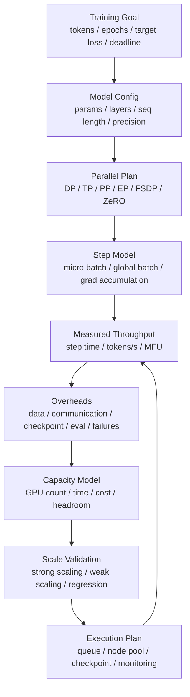

# 训练容量建模：Tokens/s、Step Time、MFU 与扩展效率

训练容量建模回答的不是“这批 GPU 峰值算力有多高”，而是：

> 在指定模型、数据、并行策略、训练配置和容错策略下，完成目标训练量需要多少 GPU、多少时间、多少成本，以及扩展到更多 GPU 后效率会怎样变化？

训练容量规划如果只看 GPU 数量，会很容易误判。

常见错误包括：

- 用理论 FLOPS 推算训练时间。
- 用单机 tokens/s 线性外推到千卡。
- 只看 step time，不看 DataLoader、通信、checkpoint 和故障恢复。
- 只看 MFU，不看排队、重启、评测和数据处理。
- 只看平均 step time，不看长尾、straggler 和周期性 checkpoint spike。
- 只算一次训练运行成本，不算失败重试和实验探索成本。

训练系统的真实容量取决于一条长链：

```text
data
  -> dataloader
  -> forward/backward
  -> communication
  -> optimizer
  -> checkpoint/eval
  -> failure recovery
  -> queue and scheduling
```

任何一环变慢，最终 tokens/s 都会下降。

## 一张总图



这张图表达一个闭环：

- 先定义训练目标。
- 再定义模型和训练配置。
- 用实际 benchmark 得到 step time、tokens/s 和 MFU。
- 把数据、通信、checkpoint、评测和故障恢复纳入容量模型。
- 扩展到更多 GPU 前，用强扩展/弱扩展验证效率。
- 执行中持续校准模型。

## 先定义训练目标

训练容量建模必须从目标开始。

目标可能是：

- 训练 N tokens。
- 训练 N epochs。
- 在某个 deadline 前达到目标 loss。
- 完成某个模型规模的预训练。
- 在预算内完成多个实验。
- 每周固定产出若干 fine-tune。

一个更完整的目标例子：

```text
model: 70B dense transformer
training tokens: 2T
sequence length: 4096
precision: BF16/FP8 mixed precision
global batch: 4M tokens
target time: 14 days
hardware: H100 80GB
availability: tolerate node failure with checkpoint resume
```

如果只写“训练 70B 模型”，容量模型无法成立。

## 核心指标

### Step Time

Step time 是一次 optimizer update 的时间。

它通常包括：

```text
data loading
  + forward
  + backward
  + gradient communication
  + optimizer
  + optional recompute
  + logging/eval/checkpoint overhead
```

有些报告只统计纯训练 step，不含 checkpoint 和 eval；有些报告统计端到端 step。两者必须区分。

### Tokens/s

训练吞吐通常用 tokens/s 表示：

```text
tokens_per_second = global_batch_tokens / step_time
```

其中：

```text
global_batch_tokens = micro_batch_size * sequence_length * data_parallel_size * gradient_accumulation_steps
```

实际公式会因 packing、padding、多模态 token、loss mask 而变化。

### Tokens/s/GPU

用于比较不同 GPU 数量：

```text
tokens_per_second_per_gpu = tokens_per_second / num_gpus
```

它能帮助观察扩展效率下降，但不能单独代表好坏。大规模训练为了缩短总时间，可能接受 tokens/s/GPU 降低。

### MFU

MFU 是 model FLOPs utilization，表示模型理论计算量相对硬件峰值的利用程度。

粗略理解：

```text
MFU = model_flops_per_second / hardware_peak_flops
```

Megatron-LM 文档和论文中常用 MFU 衡量大模型训练效率，并展示了在不同模型规模和 GPU 数下的 MFU 与扩展表现。

MFU 的价值是观察计算效率；局限是它不直接包含数据读取、checkpoint、排队和故障恢复。

### Scaling Efficiency

扩展效率衡量加 GPU 后吞吐是否接近线性增长。

强扩展：

```text
strong_scaling_efficiency(N)
  = throughput(N) / (throughput(1) * N)
```

如果基线不是 1 GPU，也可以用：

```text
efficiency(N vs B)
  = throughput(N) / throughput(B) / (N / B)
```

弱扩展：

```text
weak_scaling_efficiency(N)
  = step_time(B) / step_time(N)
```

前提是每 GPU workload 保持近似不变。

### End-to-End Training Time

训练总时间不能只用纯 step time 算。

更完整：

```text
total_time
  = train_steps * avg_step_time
  + checkpoint_time
  + eval_time
  + restart_time
  + data_preparation_wait
  + queue_wait
  + debugging_overhead
```

容量规划至少要把可量化的 checkpoint、eval、failure/restart 和 queue wait 纳入。

## Step Time 拆解

训练 step 可以拆成：

```text
step_time
  = data_time
  + forward_time
  + backward_time
  + communication_time
  + optimizer_time
  + overhead_time
```

更实际的是：

```text
step_time = max(compute_path, overlapped_comm_path, data_path) + exposed_overheads
```

因为通信和数据读取可能与计算重叠。

### Data Time

包括：

- 数据读取。
- 解压和解码。
- tokenization。
- packing。
- batch collation。
- host-to-device copy。

如果 DataLoader 等待暴露在 step 时间里，GPU 会空转。

### Forward/Backward

模型主要计算部分。

受影响因素：

- 模型结构。
- sequence length。
- batch size。
- precision。
- attention 实现。
- activation checkpointing。
- compiler/kernel fusion。
- Tensor Core 使用率。

### Communication

通信包括：

- data parallel gradient all-reduce。
- ZeRO/FSDP reduce-scatter/all-gather。
- tensor parallel all-reduce/all-gather。
- pipeline parallel activation send/recv。
- expert parallel all-to-all。

通信能否被计算隐藏，决定扩展效率。

### Optimizer

优化器阶段可能包含：

- 参数更新。
- optimizer state 读写。
- master weight。
- gradient clipping。
- sharded optimizer state communication。

Adam 类优化器状态较重；Muon 等优化器还可能引入额外矩阵操作或通信需求，容量模型要按具体实现测量。

### Checkpoint 和 Eval

Checkpoint 和 eval 不是每一步都有，但会影响端到端训练时间。

如果每 1000 step 保存一次 checkpoint，每次耗时 10 分钟，那么平均摊到 step 上：

```text
checkpoint_overhead_per_step = 600s / 1000 = 0.6s
```

如果纯 step time 是 2s，这就是 30% 开销。

## 训练步数

如果以 token 数为目标：

```text
train_steps = total_training_tokens / global_batch_tokens
```

例子：

```text
total_training_tokens = 2T
global_batch_tokens = 4M
train_steps = 500000
```

如果 step time 是 2s：

```text
pure_train_time = 500000 * 2s = 1,000,000s ~= 11.6 days
```

但实际总时间还要加 checkpoint、eval、失败恢复和排队。

## Global Batch 与 Micro-batch

训练容量模型必须区分：

- micro batch。
- gradient accumulation。
- data parallel size。
- sequence length。
- global batch。

关系：

```text
global_batch_samples
  = micro_batch_samples
  * gradient_accumulation_steps
  * data_parallel_size

global_batch_tokens
  = global_batch_samples * sequence_length
```

当 GPU 数增加时，如果保持 global batch 不变，就是强扩展；如果每 GPU batch 不变，global batch 随 GPU 增加，就是弱扩展。

大 batch 会影响：

- 优化稳定性。
- learning rate schedule。
- loss 曲线。
- checkpoint/eval 节奏。
- tokens/s。

所以容量规划不能随意增大 global batch 来获得更好吞吐。

## 强扩展与弱扩展

### 强扩展

固定总 workload，增加 GPU，目标是缩短训练时间。

例如：

```text
same model
same global batch
same total tokens
GPU: 256 -> 512 -> 1024
```

风险：

- 每 GPU workload 变小。
- 通信占比上升。
- pipeline bubble 变大。
- scaling efficiency 下降。

适合回答：

> 为了赶 deadline，多加 GPU 是否值得？

### 弱扩展

每 GPU workload 近似不变，GPU 增加时整体 workload 增加。

例如：

```text
per-GPU batch fixed
GPU: 256 -> 512 -> 1024
global batch grows
```

风险：

- 优化超参数需要调整。
- global batch 太大可能影响收敛。
- 数据和 checkpoint 压力增加。

适合回答：

> 系统能否高效支撑更大模型或更大 batch？

## 并行策略对容量的影响

### Data Parallel

Data parallel 简单，但通信量随参数规模增长。

容量风险：

- gradient all-reduce 暴露。
- 大模型 optimizer state 重。
- 网络瓶颈。

### Tensor Parallel

Tensor parallel 切分单层计算。

容量风险：

- 层内通信频繁。
- 对 NVLink/NVSwitch 和节点内拓扑敏感。
- 多节点 TP 通常更难。

### Pipeline Parallel

Pipeline parallel 切分层。

容量风险：

- pipeline bubble。
- micro-batch 数不足时效率低。
- stage 不均衡导致 straggler。

### Expert Parallel

MoE 训练使用 expert parallel 时会引入 all-to-all。

容量风险：

- expert load imbalance。
- token routing 波动。
- all-to-all 网络压力。
- 大 EP/小 EP 选择影响通信域和负载均衡。

### FSDP / ZeRO

FSDP 和 ZeRO 通过 sharding 降低显存压力。

容量风险：

- 参数 all-gather。
- gradient reduce-scatter。
- optimizer state 分片。
- overlap 设置影响 step time。
- checkpoint 和 resharding 更复杂。

PyTorch FSDP 文档强调它会 shard parameters、gradients 和 optimizer states，并在执行中按需要 all-gather，这说明显存节省和通信开销必须一起建模。

## 有效训练吞吐

训练容量应该使用 effective tokens/s，而不是理想 tokens/s。

定义：

```text
effective_tokens_per_second
  = useful_training_tokens / wall_clock_time
```

其中 wall clock 应包含：

- 数据等待。
- checkpoint。
- eval。
- 失败重启。
- 编译和 warmup。
- job restart。
- 必要同步。

如果报告只看 steady-state step tokens/s，会高估真实产能。

## Checkpoint 对容量的影响

Checkpoint 影响：

- 训练暂停时间。
- 存储吞吐。
- 恢复时间。
- 可容忍故障间隔。
- 失败后丢失工作量。

Checkpoint 间隔可以用一个简单权衡理解：

```text
expected_lost_work_per_failure ~= checkpoint_interval / 2
```

间隔太短：

- checkpoint 开销大。
- 存储压力大。
- 多 job 同时 checkpoint 容易拥塞。

间隔太长：

- 故障后重跑多。
- 风险高。

容量模型应包含：

```text
checkpoint_overhead_ratio
  = checkpoint_time_per_interval / interval_training_time
```

## 故障与重启

大规模训练越大，越要考虑故障。

如果 1024 GPU 训练运行 14 天，单个节点故障就可能导致整个 job 重启或部分恢复。

容量模型要估算：

- 平均故障间隔。
- checkpoint 间隔。
- restart time。
- lost work。
- queue re-admission。
- 数据和环境重新 warmup。

简单模型：

```text
failure_overhead
  = failures * (restart_time + expected_lost_work)
```

这只是近似，但比完全忽略故障更真实。

## Queue Wait 与资源准入

训练容量不只是运行中吞吐。

对用户来说：

```text
time_to_result = queue_wait + startup_time + training_time + eval_time
```

大 job 常常排队很久，因为：

- gang size 大。
- 拓扑要求强。
- 特定 GPU flavor 不足。
- quota 不足。
- 资源碎片。

因此容量规划要区分：

- cluster theoretical capacity。
- schedulable capacity。
- admitted capacity。
- effective training capacity。

第 7 章的资源碎片和调度治理，会直接影响训练容量。

## 容量建模步骤

### 1. 定义训练目标

```text
total_tokens
target_time
model_size
sequence_length
quality constraints
budget
```

### 2. 固定训练配置

```text
global batch tokens
micro batch
gradient accumulation
precision
optimizer
parallelism
checkpoint interval
eval interval
```

### 3. 测基线

在小规模或目标规模上测：

- step time。
- tokens/s。
- MFU。
- memory peak。
- communication ratio。
- data wait。
- checkpoint time。
- failure/restart。

### 4. 做扩展曲线

测试：

```text
N GPUs -> throughput(N)
```

得到：

```text
scaling_efficiency(N)
```

不要只测两个点。至少要覆盖计划扩展范围内的几个关键规模。

### 5. 建立端到端模型

```text
train_steps = total_tokens / global_batch_tokens
pure_training_time = train_steps * avg_step_time
total_time = pure_training_time + checkpoint + eval + failure + queue + startup
```

### 6. 做情景分析

例如：

- 512 GPU 能否 30 天内完成？
- 1024 GPU 比 512 GPU 节省多少 wall clock？
- 扩到 2048 GPU 的效率是否值得？
- 如果 checkpoint 慢 2 倍，deadline 是否受影响？
- 如果故障率提高，最优 checkpoint interval 是否变化？

## 一个简化例子

目标：

```text
total_tokens = 1T
global_batch_tokens = 4M
step_time = 2.5s
checkpoint every 1000 steps
checkpoint_time = 300s
eval_time_total = 6h
failure_overhead = 8h
queue_wait = 12h
```

计算：

```text
train_steps = 1T / 4M = 250000
pure_training_time = 250000 * 2.5s = 625000s ~= 7.23 days
checkpoint_count = 250
checkpoint_time_total = 250 * 300s = 75000s ~= 20.8h
total_time ~= 7.23d + 0.87d + 0.25d + 0.33d + 0.5d = 9.18d
```

如果只看 step time，会估计 7.23 天；加入端到端开销后接近 9.18 天。

## MFU 与容量规划

MFU 高通常说明计算效率好，但容量规划不能只追 MFU。

例如：

| 配置 | MFU | tokens/s | checkpoint | 总时间 |
| --- | --- | --- | --- | --- |
| A | 48% | 高 | 慢 | 中 |
| B | 45% | 略低 | 快 | 更短 |

如果 B 的端到端时间更短，就不能因为 MFU 低一点而否定它。

MFU 适合回答：

- kernel 和并行策略是否有效。
- 模型计算是否接近硬件能力。
- 扩展后计算效率是否下降。

端到端容量还要看：

- 数据。
- 通信暴露。
- checkpoint。
- 故障。
- 排队。
- 成本。

## 成本模型

基础：

```text
gpu_hours = num_gpus * total_wall_clock_hours
cost = gpu_hours * cost_per_gpu_hour
```

更完整：

```text
total_cost
  = training_gpu_cost
  + queue_reserved_cost
  + data_pipeline_cost
  + checkpoint_storage_cost
  + eval_cost
  + failure_retry_cost
  + engineering_debug_cost
```

常用单位：

- cost / training token。
- cost / successful run。
- cost / experiment。
- cost / eval point。
- cost / checkpoint.

如果实验失败率高，成功实验成本会远高于单次运行成本。

## 能效模型

能效可以写成：

```text
energy_per_token = total_energy / useful_training_tokens
```

需要记录：

- GPU power。
- CPU 和内存功耗。
- 网络和存储功耗。
- cooling/PUE 是否计入。
- idle 和 queue 是否计入。

高 MFU 通常有助于能效，但不是充分条件。通信等待、数据等待和 checkpoint spike 也会浪费能量。

## Benchmark 设计

训练容量 benchmark 应覆盖：

- 单节点。
- 多节点。
- 目标并行策略。
- 目标 sequence length。
- 目标 global batch。
- synthetic data 和真实数据。
- checkpoint save/restore。
- eval。
- 目标节点池和网络拓扑。
- 多个 GPU 规模。

建议结果表：

| GPUs | Step Time | Tokens/s | Tokens/s/GPU | MFU | Comm Ratio | Data Wait | Checkpoint Overhead | Efficiency |
| --- | --- | --- | --- | --- | --- | --- | --- | --- |
| 128 | | | | | | | | |
| 256 | | | | | | | | |
| 512 | | | | | | | | |

只有这张表还不够，还要给出 profiler 证据解释效率变化。

## 生产校准

训练运行中要持续校准：

```text
predicted_step_time vs actual_step_time
predicted_tokens_s vs actual_tokens_s
predicted_checkpoint_time vs actual_checkpoint_time
predicted_failure_overhead vs actual_failure_overhead
predicted_total_time vs actual_total_time
```

如果偏差很大，常见原因是：

- 数据读取比 benchmark 慢。
- checkpoint 存储被其他 job 干扰。
- 实际节点拓扑不同。
- 某些 rank 慢。
- 通信没有按预期 overlap。
- batch packing 效率低。
- 训练中途 loss/eval/保存策略变化。
- 故障率高于假设。

容量模型要根据实际运行更新，而不是只在立项时做一次。

## 常见误区

### 误区一：理论 FLOPS 可以直接推训练时间

理论 FLOPS 不包含数据、通信、checkpoint、故障和调度。

### 误区二：单机吞吐可以线性外推

多机后通信、同步、拓扑和 straggler 会改变效率。

### 误区三：MFU 越高端到端越好

MFU 是计算效率，不等于总训练效率。

### 误区四：增加 GPU 一定缩短时间

强扩展效率下降后，新增 GPU 的边际收益会降低。

### 误区五：checkpoint 只是可靠性问题

Checkpoint 也是容量和成本问题。保存太慢会直接影响训练总时间。

### 误区六：队列等待不属于训练容量

从用户视角看，time-to-result 包含 queue wait。大 job 的可准入性是容量规划的一部分。

## 设计检查清单

- 是否定义 total tokens、target time、模型规模和 sequence length。
- 是否明确 global batch、micro batch、gradient accumulation。
- 是否说明 DP/TP/PP/EP/FSDP/ZeRO 并行策略。
- 是否测量 step time、tokens/s、tokens/s/GPU 和 MFU。
- 是否拆分 data、forward/backward、communication、optimizer、checkpoint。
- 是否区分纯训练 step 和端到端 wall clock。
- 是否有强扩展或弱扩展曲线。
- 是否计算 scaling efficiency。
- 是否纳入 checkpoint overhead。
- 是否纳入 eval overhead。
- 是否估算 failure/restart overhead。
- 是否纳入 queue wait 和 startup。
- 是否评估成本和能效。
- 是否用真实数据验证 synthetic benchmark。
- 是否记录硬件、driver、CUDA、框架、镜像和节点拓扑。
- 是否上线后持续校准预测与实际。

## 小结

训练容量建模可以简化成：

```text
training goal
  -> model and batch config
  -> parallel strategy
  -> measured step throughput
  -> scaling efficiency
  -> checkpoint/eval/failure overhead
  -> total time and cost
  -> production calibration
```

关键原则是：

```text
不要用理论 FLOPS 算训练时间。
用实测端到端有效 tokens/s 建模。
```

当模型结构、global batch、并行策略、数据路径、checkpoint 策略或 GPU 规模变化时，训练容量模型都需要重新校准。

## 延伸阅读

- [NVIDIA Megatron-LM](https://github.com/NVIDIA/Megatron-LM)
- [NVIDIA NeMo Parallelisms Guide](https://docs.nvidia.com/nemo-framework/user-guide/latest/nemotoolkit/features/parallelisms.html)
- [PyTorch Fully Sharded Data Parallel](https://docs.pytorch.org/docs/stable/fsdp.html)
- [MLPerf Training Benchmark](https://mlcommons.org/benchmarks/training/)
- [NVIDIA Nsight Systems User Guide](https://docs.nvidia.com/nsight-systems/UserGuide/index.html)
