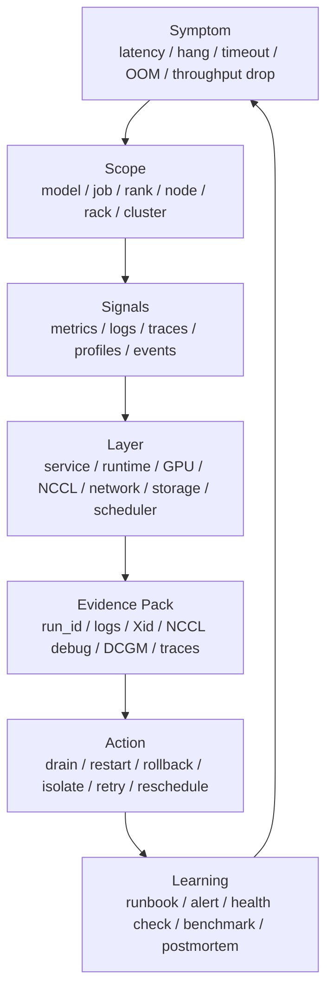

# AI 系统故障模式：GPU、NCCL、网络、存储与 Runtime

AI 系统故障排查最难的地方，不是没有指标，而是同一个症状可能来自很多层。

例如训练 step time 变长，可能是：

- DataLoader 慢。
- 某个 rank 卡住。
- NCCL collective 等待。
- RDMA 丢包或拥塞。
- 某张 GPU 降频。
- HBM ECC 错误导致节点被隔离。
- checkpoint 写入阻塞。
- 调度把任务放到了拓扑不好的节点上。

推理 TTFT 变长，也可能是：

- prefill 队列积压。
- router 热点。
- KV Cache 不足。
- tokenizer CPU 饱和。
- 某个 GPU 出现 Xid。
- 网络调用 RAG 检索变慢。
- 新版本改变了 batch 或 cache 策略。

所以故障定位不能从“猜原因”开始，而要从“分层、定界、找证据”开始。

本篇重点回答：

> AI 推理、训练和集群系统中常见 GPU、NCCL、网络、存储和 Runtime 故障有哪些？如何用可观测性信号识别影响范围、收集证据、隔离问题并沉淀为 runbook 和 benchmark？

## 一张总图



这张图强调一个原则：

```text
故障处理不是从错误码开始，
而是从症状、影响范围、证据和行动闭环开始。
```

错误码很重要，但错误码只能解释局部事实。工程上更重要的是知道它影响了谁、是否还在发生、能否隔离、是否会复发。

## 故障定位的基本路径

推荐使用固定路径，避免排障时随意跳层。

```text
1. 识别用户或任务症状
2. 定界影响范围
3. 对齐时间线
4. 分层定位
5. 收集证据包
6. 执行止损动作
7. 验证恢复
8. 沉淀复盘、runbook、alert 和 benchmark
```

每一步都要能回答问题。

| 步骤 | 核心问题 |
| --- | --- |
| 症状 | 用户、任务或 SLO 看到什么坏了 |
| 范围 | 是单请求、单模型、单 job、单节点、单机架还是全局 |
| 时间线 | 何时开始，是否与 deploy、配置、调度、节点事件重合 |
| 分层 | 问题更像服务层、runtime、GPU、通信、网络、存储还是调度 |
| 证据 | 哪些日志、metrics、trace、profile、event 支持判断 |
| 止损 | rollback、drain、reschedule、throttle、fallback 哪个最小有效 |
| 恢复 | SLO、错误率、任务进度、资源指标是否回到正常 |
| 沉淀 | 下次如何更早发现、更快定位、更少复发 |

这种路径比“先重启试试”慢一点，但长期更可靠。

## 影响范围优先于根因猜测

事故开始时，不要急着猜根因。

先问：

- 影响一个请求，还是一类请求？
- 影响一个模型，还是所有模型？
- 影响一个训练 job，还是同节点的多个 job？
- 影响一个 rank，还是多个 rank？
- 影响一个节点、一个机架、一个 node pool，还是全集群？
- 只影响性能，还是有错误、数据损坏、任务失败？
- 是否与最近变更、调度、扩容、维护有关？

影响范围决定止损动作。

| 范围 | 常见动作 |
| --- | --- |
| 单请求 | 记录 trace，按策略重试或返回错误 |
| 单 replica | 摘除 replica，保留日志和 profiler |
| 单 GPU | cordon/drain 节点或隔离 GPU，跑诊断 |
| 单节点 | drain 节点，迁移任务，检查硬件和系统日志 |
| 单机架/网络域 | 降低调度权重，限制新任务，检查交换机和 RDMA |
| 单版本 | rollback 或停止 rollout |
| 全局容量不足 | 限流、排队、扩容、调整优先级 |

如果范围判断错了，后续动作也会错。

例如全局网络拥塞时只重启某个训练 job，不会解决问题；单节点 GPU 故障时全局回滚版本，也可能误伤正常服务。

## 故障分层模型

AI 系统可以按下面层次看故障。

| 层级 | 典型故障 | 典型信号 |
| --- | --- | --- |
| 用户/任务层 | TTFT 超标、job hang、checkpoint 过旧 | SLO burn、job progress、queue wait |
| 服务层 | router 热点、队列积压、admission reject | request metrics、structured logs、trace |
| Runtime 层 | OOM、scheduler 卡住、allocator 碎片、kernel launch gap | runtime logs、profile、memory metrics |
| GPU 层 | Xid、ECC、降频、掉卡、HBM 错误 | dmesg、DCGM、nvidia-smi、events |
| 通信层 | NCCL timeout、collective hang、rank mismatch | NCCL logs、rank progress、network metrics |
| 网络层 | RDMA/RoCE 拥塞、丢包、链路降速、PFC 问题 | NIC counters、switch telemetry、NCCL perf |
| 存储层 | checkpoint 写慢、dataset 读慢、对象存储错误 | IO latency、throughput、error logs |
| 调度层 | placement 差、拓扑不匹配、资源碎片 | scheduler events、node labels、queue metrics |
| 环境层 | driver/CUDA/NCCL 版本不一致、镜像漂移 | run manifest、node profile、image digest |

同一个事故可能跨多层。

例如 NCCL timeout 可能来自：

- 某个 rank 进程崩溃。
- GPU Xid 导致 CUDA context 异常。
- IB/RoCE 网络不通。
- NCCL 使用了错误网卡。
- 拓扑检测异常。
- 某个节点 CPU 卡住，不能推进通信。
- 应用代码在某个 rank 没有进入 collective。

所以不要看到 `NCCL timeout` 就立即判断为网络问题。

## GPU 故障模式

GPU 故障是 AI 集群最常见、也最容易误判的故障来源之一。

常见类型：

- GPU 不可见。
- CUDA context 异常。
- Xid error。
- ECC error。
- HBM page retirement。
- thermal throttling。
- power throttling。
- clock 降低。
- PCIe/NVLink 问题。
- MIG/MPS 配置异常。
- driver reset。
- GPU memory OOM。

### Xid Error

NVIDIA Xid 是驱动报告 GPU 相关异常的一类错误消息。它们通常出现在系统日志、`dmesg`、`journalctl` 或平台采集的 node event 中。

Xid 的意义是：

```text
GPU、driver、firmware、应用或硬件路径发生了某类异常，
需要结合 Xid code、上下文和复现情况判断影响。
```

不要只记住某个 Xid code 的“含义”。更好的做法是记录：

- Xid code。
- GPU UUID。
- PCI bus id。
- node id。
- 时间。
- 当时运行的 job/request。
- driver/CUDA 版本。
- 是否伴随进程崩溃。
- 是否伴随 ECC、NVLink、PCIe、thermal 事件。
- 是否在同一节点反复出现。
- 是否能通过 DCGM 或压力测试复现。

示例证据：

```text
node_id: gpu-node-42
gpu_uuid: GPU-...
pci_bus_id: 0000:82:00.0
xid: 79
time: 2026-06-12T10:18:32Z
job_id: pretrain-abc
rank: 37
driver: 550.xx
cuda: 12.x
action: drain node, collect logs, run dcgmi diag
```

Xid 处理不要只靠人工查表。应接入：

- node event。
- alert。
- 自动 cordon/drain 策略。
- GPU health state。
- RMA/维护流程。
- 事故证据包。

### ECC 与 HBM 错误

ECC error 不一定立刻导致任务失败，但会影响节点可信度。

需要区分：

- corrected ECC。
- uncorrected ECC。
- volatile error。
- aggregate error。
- retired pages。
- pending page retirements。

一般原则：

- corrected ECC 需要趋势观察和阈值。
- uncorrected ECC 需要更严格处理。
- 同卡重复出现应进入维护。
- 关键训练任务应避免调度到可疑 GPU。
- benchmark 结果应记录 ECC 状态。

对于长时间训练，ECC 和 HBM 错误还可能带来 silent data corruption 风险。即使任务没有崩溃，也要关注 loss、grad norm、checksum、checkpoint 校验和 eval 异常。

### Thermal 与 Power Throttling

GPU 没坏，也可能因为功耗或散热限制而变慢。

常见信号：

```text
gpu_power_watts
gpu_temperature
sm_clock
memory_clock
throttle_reason
tokens_per_second
step_time
fan / inlet temperature
```

典型表现：

- 吞吐下降但没有错误。
- 同一机架节点更慢。
- 白天或高负载时段更明显。
- power cap 后性能变化。
- GPU clocks 低于预期。

处理动作：

- 检查 power cap 和 clock。
- 检查机房/机柜热状态。
- 检查风道、风扇、灰尘、进风温度。
- 用能效 benchmark 重新确认持续吞吐。
- 调度时避免把高功耗任务集中到同一热域。

### GPU OOM

GPU OOM 可以发生在训练和推理。

训练 OOM 常见原因：

- batch/micro-batch 太大。
- sequence length 增长。
- activation checkpointing 关闭。
- optimizer state 增加。
- FSDP/ZeRO 配置不当。
- fragmentation。
- data batch 形状异常。

推理 OOM 常见原因：

- KV Cache token 超预算。
- 长上下文请求过多。
- batch 策略过激。
- 模型并行切分错误。
- 多模型共驻显存不足。
- CUDA graph capture workspace 增加。

排查时不要只看 `allocated memory`，还要看：

- reserved memory。
- fragmentation。
- peak memory。
- KV cache occupancy。
- request length distribution。
- batch shape。
- concurrent requests。
- model weight footprint。

OOM 是系统设计问题，不只是“显存不够”。应沉淀成 admission control、capacity model 和 benchmark case。

## DCGM 与 GPU 健康门禁

NVIDIA DCGM Diagnostics 适合做节点入池、故障后诊断和维护验证。

它的价值不只是“跑一次测试”，而是把 GPU 健康从人工经验变成平台门禁：

- 入池前跑 readiness diagnostic。
- 任务失败后跑 failure epilogue。
- 可疑节点跑长时间诊断。
- 维护后跑回归验证。
- 诊断结果进入 node manifest。

可检测方向包括：

- 软件和驱动访问。
- NVML/CUDA 版本和权限。
- PCIe/NVLink。
- GPU memory。
- memory bandwidth。
- power/thermal stress。
- NCCL tests。
- topology limitation。
- cgroup/permission。

建议在平台中维护 GPU health state：

```yaml
gpu_health:
  node_id: "gpu-node-42"
  gpu_uuid: "GPU-..."
  state: "suspect"
  reason:
    - "repeated_xid"
    - "dcgm_diag_failed"
  last_good_diag: "2026-06-10T12:00:00Z"
  last_failed_diag: "2026-06-12T10:30:00Z"
  scheduling_action: "do_not_schedule_critical_jobs"
```

健康状态要进入调度，而不是只停留在监控页面。

## NCCL 故障模式

NCCL 故障最常见于分布式训练，也会影响多 GPU 推理。

常见症状：

- 初始化 hang。
- communicator 创建失败。
- all-reduce timeout。
- 某个 rank 卡住。
- throughput 下降。
- 单节点正常，多节点失败。
- 同机通信正常，跨机通信失败。
- 只有特定节点组合失败。
- 只有大 message size 慢。

NCCL 故障要分清几类：

| 类型 | 常见原因 |
| --- | --- |
| 初始化失败 | rank/world size、env、端口、DNS、MPI/launcher、接口选择 |
| topology 异常 | GPU/NIC 拓扑、NVLink、PCIe ACS、NUMA、容器可见性 |
| 网络连接问题 | 错网卡、端口不通、IB/RoCE 配置、GID、PFC/ECN |
| collective hang | 某 rank 未进入 collective、进程崩溃、shape/order 不一致 |
| 性能下降 | 算法选择、通道数、GDR 路径、拥塞、CPU affinity、message size |
| 异步错误 | CUDA error、GPU reset、网络 async event、进程异常 |

### NCCL Debug 证据

排查时常需要保留：

```text
NCCL_DEBUG
NCCL_DEBUG_SUBSYS
NCCL_DEBUG_FILE
NCCL_TOPO_DUMP_FILE
rank logs
launcher logs
env vars
hostfile / node list
GPU/NIC topology
network interface list
```

但不要长期默认开启过高 debug 级别。它会产生大量日志，并可能影响性能。

推荐策略：

- 正常运行保留关键错误和版本信息。
- 失败重试或复现时提高 NCCL debug。
- 关键 benchmark 保存 topology dump。
- 事故证据包保存 rank logs 和 NCCL env。

### Collective Hang

Collective hang 不一定是 NCCL 的问题。

常见原因：

- 某个 rank 在 collective 前崩溃。
- 某个 rank 数据分支不同，没有进入同一个 collective。
- collective 调用顺序不一致。
- tensor shape 或 dtype 不一致。
- 某个 rank 被 DataLoader 或 CPU 阻塞。
- 某张 GPU 出现 Xid。
- 网络路径不可用。

定位方法：

- 看每个 rank 的最后日志。
- 看 rank progress 和 step。
- 看是否所有 rank 进入同一个 collective。
- 看 NCCL logs 中最后一次 collective 信息。
- 看 GPU/CPU/network metrics。
- 看是否有 node event、Xid、OOM、kill、eviction。

对训练系统，建议所有 rank 统一记录：

```text
job_id
step
rank
local_rank
node_id
process_group
phase
collective_type
tensor_shape
timestamp
```

这样 hang 时才能快速知道哪个 rank 落后。

### NCCL Timeout

NCCL timeout 是结果，不是根因。

它可以来自：

- 网络不可达。
- rank 崩溃。
- GPU 错误。
- 代码分支不一致。
- 数据加载卡住。
- checkpoint 阻塞。
- CPU oversubscription。
- 容器被 OOM killer 杀。
- launcher/rendezvous 异常。

因此 runbook 应写：

```text
NCCL timeout -> collect rank states -> inspect node/GPU/network events -> identify first failure
```

不要写：

```text
NCCL timeout -> increase timeout
```

增大 timeout 可能掩盖问题，让故障发现更慢。

## 网络故障模式

AI 集群网络故障通常表现为训练变慢、collective timeout、跨节点推理抖动、checkpoint 读写慢或节点间通信失败。

常见层次：

- IP 网络。
- InfiniBand。
- RoCE。
- RDMA。
- GPU Direct RDMA。
- NVLink/NVSwitch。
- PCIe。
- ToR/spine 交换机。
- 多 rail 配置。

常见问题：

- 选错网卡。
- MTU 不一致。
- GID index 错误。
- RoCE PFC/ECN 配置异常。
- IB link down 或降速。
- NIC error counter 增长。
- retransmit 增加。
- 多 rail 不均衡。
- 某条链路拥塞。
- GPU-to-NIC 拓扑不佳。
- ACS/IOMMU 影响 GPU Direct。
- 容器网络和 host network 配置不一致。

### 网络问题的症状

| 症状 | 可能方向 |
| --- | --- |
| 单机训练正常，多机训练 hang | 跨节点网络、NCCL 初始化、接口选择 |
| 小模型正常，大模型慢 | message size、带宽、拥塞 |
| 某些节点组合失败 | 拓扑、交换机、NIC、线缆、配置漂移 |
| 同一机架慢 | ToR、PFC/ECN、热区、链路 |
| NCCL all-reduce 慢但 GPU compute 正常 | RDMA/NCCL/拓扑 |
| checkpoint 慢且训练通信也慢 | 网络或存储共享瓶颈 |

### 网络证据

建议保留：

```text
node_id
nic_name
nic_firmware
link_speed
link_state
rdma_device
gid_index
mtu
rx/tx bytes
packet errors
retransmit
ecn marks
pfc pause frames
switch port
topology path
nccl-tests result
ib_write_bw / ib_read_bw result
```

对于 RoCE，PFC/ECN 配置和交换机 telemetry 很重要。没有交换机侧证据，很多拥塞问题只能猜。

### 网络故障处理

常见止损动作：

- 从调度中隔离可疑节点或机架。
- 降低可疑 node pool 权重。
- 将训练 job reschedule 到同一健康网络域。
- 暂停大规模多机任务启动。
- 回滚网络配置。
- 禁止新任务使用异常 NIC。
- 对可疑链路做带宽和延迟测试。

网络故障不要只看应用日志。必须把应用、NCCL、NIC、交换机和调度 placement 放在同一时间线上。

## 存储故障模式

AI 系统对存储的依赖比表面上更重。

训练依赖：

- dataset shard 读取。
- tokenizer/cache 读取。
- checkpoint 写入。
- checkpoint 恢复。
- eval artifact 写入。

推理依赖：

- 模型权重加载。
- adapter 加载。
- tokenizer/config 读取。
- RAG index/document 读取。
- trace/log 写入。

常见故障：

- 对象存储延迟升高。
- 并行文件系统元数据瓶颈。
- 本地 NVMe cache miss。
- checkpoint 写入超时。
- checkpoint manifest 不一致。
- 权限或凭证过期。
- 小文件过多。
- 数据集 shard 热点。
- 节点磁盘满。
- image/model pull 风暴。

### 存储问题的症状

| 症状 | 可能方向 |
| --- | --- |
| 训练 step time 周期性变长 | checkpoint 或 eval 写入 |
| GPU 利用率低且 DataLoader time 高 | dataset 读取瓶颈 |
| 大量任务启动慢 | image/model pull 或 shared filesystem |
| 恢复失败 | checkpoint 缺失、manifest 不一致、权限 |
| RAG 延迟抖动 | index/document store 延迟 |
| 节点磁盘满 | logs、cache、checkpoint 临时文件 |

### Checkpoint 特殊性

Checkpoint 不是普通文件写入。

它是训练恢复协议的一部分。

需要关注：

- 是否 two-phase commit。
- 是否有 manifest。
- shard 是否完整。
- latest/committed 语义是否清晰。
- 写入失败是否回滚。
- 恢复前是否校验。
- 保留策略是否误删仍被引用的 checkpoint。
- 多 rank 写入是否有协调。

存储故障常常不是立刻表现为“写失败”，而是表现为：

- checkpoint 变慢。
- backlog 增加。
- 训练 step time 抖动。
- 恢复时才发现文件不完整。
- object listing 和 manifest 不一致。

所以 checkpoint SLO 和存储 SLI 应连在一起。

## Runtime 与应用故障模式

不是所有故障都在硬件或基础设施。

Runtime 和应用层也常出问题。

推理常见：

- scheduler deadlock。
- queue backlog。
- admission control 失效。
- prefix cache 命中率骤降。
- KV cache leak。
- tokenizer CPU 饱和。
- streaming backpressure。
- router 热点。
- speculative decoding acceptance rate 降低。
- model reload 阻塞。

训练常见：

- DataLoader hang。
- distributed sampler 不一致。
- rank 间 batch 不一致。
- autograd graph 意外保留导致显存增长。
- loss NaN/Inf。
- optimizer state 不一致。
- checkpoint resume 后 step/seed/scheduler 错位。
- eval 队列积压。

Runtime 问题的特点是：

- 指标看起来像资源问题。
- 但根因在状态机、队列、缓存、并发或数据分支。

定位时要结合：

- phase-level metrics。
- structured logs。
- trace。
- profiler。
- request/job manifest。
- 最近代码和配置变更。

## 调度与 Placement 故障模式

调度错误会把健康资源变成低效资源。

常见问题：

- 多机训练跨越不合适网络域。
- GPU-to-NIC 拓扑不匹配。
- CPU NUMA 和 GPU 不匹配。
- 多个高 IO 任务被放到同一存储域。
- 高功耗任务集中到同一机柜。
- MIG 碎片导致请求长期 pending。
- 大作业被小作业碎片阻塞。
- best-effort 任务干扰关键任务。

症状：

- 同样代码在不同 placement 下性能差异很大。
- 某些 job 总是慢。
- 某些 node pool 故障率高。
- 队列看似有空闲 GPU，但大作业启动不了。
- 跨 rack job NCCL 更慢。

证据：

```text
job_id
requested_resources
allocated_nodes
gpu_ids
topology
rack_id
network_domain
storage_domain
node_taints
priority_class
preemption_events
```

调度故障通常需要和容量治理联动，不能只靠运维修节点。

## 环境与版本漂移

AI 系统对环境版本极其敏感。

常见漂移：

- driver 版本不一致。
- CUDA/ROCm 版本不一致。
- NCCL/RCCL 版本不一致。
- PyTorch 版本不一致。
- container image tag 被覆盖。
- Python package lock 漂移。
- OFED/firmware 版本不一致。
- GPU Operator 或 device plugin 版本不一致。
- kernel 参数不同。
- cgroup、ulimit、shared memory 配置不同。

表现：

- 只有部分节点失败。
- 同一镜像在不同节点结果不同。
- 新节点入池后故障增加。
- 性能 benchmark 波动。
- NCCL 拓扑或接口选择变化。

处理方式：

- 所有任务保存 run manifest。
- 节点保存 node profile。
- 镜像使用 digest，不只用 tag。
- driver/CUDA/NCCL 使用支持矩阵。
- 节点入池做环境验收。
- benchmark 报告记录环境版本。
- 版本升级分批 canary。

环境漂移是事故复盘中最容易被低估的根因之一。

## 故障证据包

每次关键故障都应该形成 evidence pack。

最小内容：

```text
incident_id
start_time / end_time
affected service / model / job / tenant
SLO impact
run_id / job_id / request_id
node list
GPU UUID / bus id
rank mapping
recent deploy/config/scheduler events
metrics snapshot
structured logs
trace/profile links
Xid / ECC / DCGM result
NCCL debug logs
network counters
storage errors
mitigation action
recovery evidence
```

证据包的目的不是审计形式，而是让故障可复盘、可学习、可转化为 runbook 和 benchmark。

没有证据包，复盘会退化成“谁记得当时发生了什么”。

## Runbook 模板

故障 runbook 应该写成可执行流程。

例如 NCCL timeout：

```text
1. 确认影响范围
   - 单 job / 多 job / 单节点 / 机架 / 全局

2. 收集 rank 状态
   - 每个 rank 最后 step
   - 每个 rank 最后 collective
   - 是否有 rank 进程退出

3. 检查节点和 GPU 事件
   - Xid
   - ECC
   - OOM killer
   - pod eviction
   - node drain

4. 检查网络
   - NCCL interface selection
   - NIC link state
   - RDMA counters
   - switch events

5. 止损
   - 若单节点异常，drain node 并 reschedule
   - 若全局网络异常，暂停大规模任务启动
   - 若版本相关，rollback

6. 证据保留
   - NCCL logs
   - rank logs
   - node events
   - DCGM diagnostic
   - topology dump
```

Runbook 要避免模糊指令：

```text
检查网络。
```

应该写成：

```text
检查哪些 counters、在哪个 dashboard、阈值是什么、异常后做什么。
```

## 自动化检测与隔离

AI 集群应该尽量把高频故障自动化。

适合自动化的动作：

- Xid 事件采集。
- ECC error 计数。
- GPU health state 更新。
- Node Problem Detector 上报 node condition。
- DCGM readiness 检查。
- 可疑节点 cordon。
- 故障后自动跑诊断。
- 任务失败证据包收集。
- checkpoint freshness 告警。
- NCCL timeout 证据采集。

不应完全自动化的动作：

- 大范围驱逐关键训练任务。
- 删除 checkpoint。
- 自动 RMA 判断。
- 自动修改 NCCL/网络参数。
- 全局 rollback。

自动化要分级：

| 等级 | 动作 |
| --- | --- |
| observe | 只记录事件 |
| warn | 提醒 owner |
| isolate | 隔离单卡/单节点 |
| drain | 停止新任务并迁移可迁移任务 |
| escalate | 进入人工 incident |

自动化的原则是先保护用户和任务，再保护证据，最后再做修复。

## 与 SLO 的关系

故障模式要和 SLO 关联。

例如：

| 故障 | 影响的 SLO |
| --- | --- |
| GPU Xid 导致 replica 崩溃 | 推理 availability、TTFT |
| NCCL timeout | 训练 job progress、recovery RTO |
| checkpoint 写失败 | checkpoint freshness、training recovery |
| RoCE 拥塞 | training step time、job progress |
| KV cache OOM | 推理 success rate、admission reject |
| node disk full | job start、logging、checkpoint |
| tokenizer CPU 饱和 | TTFT、queue wait |

这样告警才不会停留在“某个底层指标异常”，而是能说明它正在影响什么服务目标。

## 与 Benchmark 的关系

每个重要故障都应考虑能否转成 benchmark 或健康检查。

例子：

- NCCL timeout 事故 -> 多节点 nccl-tests + topology manifest。
- checkpoint 阻塞 -> checkpoint write benchmark。
- KV cache OOM -> 长上下文推理压力测试。
- thermal throttling -> 稳态能效 benchmark。
- DataLoader stall -> dataset shard 读取 benchmark。
- RoCE 拥塞 -> RDMA bandwidth/latency and all-reduce benchmark。
- 环境漂移 -> node readiness validation。

故障复盘如果不能转成可重复验证的东西，下一次很可能还会靠人肉排查。

## 常见误区

### 误区一：看到 NCCL timeout 就认为是网络问题

不一定。

NCCL timeout 可能来自 rank 崩溃、GPU Xid、DataLoader 卡住、代码分支不一致、CPU 卡住、checkpoint 阻塞或网络问题。必须先看 rank 状态和第一故障点。

### 误区二：GPU 利用率正常就说明硬件没问题

不够。

GPU 利用率可能正常，但有 ECC 趋势、Xid、降频、NVLink 错误、PCIe replay、HBM 带宽异常。需要结合 DCGM、Xid、clock、power、temperature 和 profiler。

### 误区三：重启成功就算解决

不算。

重启只是恢复动作，不是根因。必须保留证据、确认是否复发、决定是否需要隔离、补充 runbook 和 alert。

### 误区四：只看应用日志

不够。

AI 故障经常跨应用、runtime、GPU、NIC、storage 和 scheduler。只有应用日志会遗漏硬件和基础设施事实。

### 误区五：所有异常节点都立即 RMA

不合理。

RMA 需要证据。应先区分软件配置、环境漂移、散热、网络、可复现硬件故障和偶发应用错误。

### 误区六：故障检测越自动越好

自动化要有边界。

自动隔离单节点通常可行；自动大范围驱逐训练任务、删除数据、修改网络参数则风险很高。

## 检查清单

故障发生时：

- 是否确认用户或任务症状？
- 是否确认影响范围？
- 是否对齐开始时间和最近变更？
- 是否识别第一失败点？
- 是否收集 request/job/rank/node/GPU 关联字段？
- 是否保留日志、metrics、trace、profile、events？

GPU 方向：

- 是否有 Xid？
- 是否有 ECC 或 retired page？
- 是否有 thermal/power throttling？
- 是否有 clock 异常？
- 是否有 DCGM 诊断结果？
- 是否确认 GPU UUID 和 bus id？

NCCL/通信方向：

- 是否收集所有 rank 的最后状态？
- 是否确认 collective 顺序和 shape 一致？
- 是否有 NCCL debug logs？
- 是否有 topology dump？
- 是否确认网络接口选择？
- 是否有 NIC/switch/RDMA counter？

存储方向：

- 是否检查 dataset read latency？
- 是否检查 checkpoint write latency？
- 是否有 checkpoint manifest？
- 是否检查节点磁盘空间？
- 是否检查对象存储或文件系统错误？

调度和环境方向：

- 是否记录 placement？
- 是否检查 GPU-to-NIC/NUMA/机架拓扑？
- 是否检查 driver/CUDA/NCCL/PyTorch 版本？
- 是否检查 image digest？
- 是否检查节点是否刚入池或刚升级？

恢复后：

- SLO 是否恢复？
- 故障节点是否继续被调度？
- 是否生成 evidence pack？
- 是否更新 runbook？
- 是否补充 alert？
- 是否沉淀 benchmark 或健康检查？

## 小结

AI 系统故障定位的核心是分层证据链。

一句话：

```text
先定界影响范围，
再定位故障层级，
再收集可复现证据，
再执行最小止损动作，
最后把经验沉淀成 runbook、alert 和 benchmark。
```

GPU、NCCL、网络、存储和 Runtime 故障都可能表现为 latency、hang、timeout、OOM 或 throughput drop。不要被表面错误码带偏，要用 metrics、logs、traces、profiles、events 把症状和证据连起来。

## 参考资料

- [NVIDIA Xid Errors](https://docs.nvidia.com/deploy/xid-errors/index.html)
- [NVIDIA NCCL Troubleshooting](https://docs.nvidia.com/deeplearning/nccl/user-guide/docs/troubleshooting.html)
- [NVIDIA NCCL Environment Variables](https://docs.nvidia.com/deeplearning/nccl/user-guide/docs/env.html)
- [NVIDIA DCGM Diagnostics](https://docs.nvidia.com/datacenter/dcgm/latest/user-guide/dcgm-diagnostics.html)
- [Kubernetes: Monitor Node Health](https://kubernetes.io/docs/tasks/debug/debug-cluster/monitor-node-health/)
