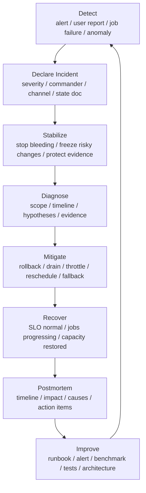

# Incident Response、Runbook 与故障复盘：从止血到可复现改进

监控发现问题，SLO 判断问题严重程度，故障模式帮助定位方向。

但真正发生事故时，团队还需要回答另一类问题：

```text
谁来指挥？
谁能改系统？
谁对外同步状态？
当前最小止损动作是什么？
哪些证据必须保留？
什么时候算恢复？
恢复后如何避免同类问题复发？
```

如果没有事故响应流程，故障现场很容易失控：

- 多个人同时改系统，互相不知道。
- 技术负责人忙于排障，没人同步影响范围。
- 管理者反复追问 ETA，打断排障。
- 看到一个可能原因就立即操作，导致二次事故。
- 重启恢复后没人保留证据，复盘无法还原。
- 复盘只写“加强监控”，没有可验证行动项。

AI 系统事故更复杂，因为它同时涉及推理服务、训练任务、GPU、NCCL、网络、存储、调度、模型版本和数据链路。

本篇重点回答：

> AI 系统发生事故时，如何组织 Incident Response，如何编写可执行 Runbook，如何做故障复盘，并把事故转化为可验证、可复现、可被 AI 检索的知识资产？

## 一张总图



这张图强调一点：

```text
事故处理不是找到根因才开始行动，
而是在保护证据的同时尽快降低影响，
恢复后再系统性学习和改进。
```

## Incident 是什么

Incident 不是“有一个告警”。

Incident 是一个需要协调响应的异常事件。

可以用下面条件判断是否应该宣告事故：

- 用户或关键任务正在受影响。
- SLO burn rate 快速升高。
- 需要多个团队协同处理。
- 影响范围正在扩大。
- 需要执行高风险操作，例如 rollback、drain、限流、禁用功能。
- 已经排查一段时间仍没有明确缓解方案。
- 问题涉及数据一致性、训练 checkpoint、模型输出可信度或安全边界。
- 需要管理层、业务方或用户同步状态。

宣告事故不是承认失败，而是启动一种更清晰的协作模式。

早宣告、早关闭，通常比拖到失控后再组织响应更好。

## 严重级别

Severity 要服务于行动，不是为了给事故贴标签。

一个简单分级：

| 级别 | 典型影响 | 响应 |
| --- | --- | --- |
| SEV1 | 大范围用户不可用、关键训练全停、数据损坏风险 | 立即 page，多团队响应，冻结高风险变更 |
| SEV2 | 重要模型/队列受影响，SLO 快速燃烧，有明确用户影响 | 立即响应，按需升级 |
| SEV3 | 局部退化、可绕过、影响有限 | 工作时间处理或低优先级 page |
| SEV4 | 风险、异常趋势、未造成明显影响 | ticket、观察、后续修复 |

AI 系统可以按对象细化：

| 对象 | SEV1 例子 |
| --- | --- |
| 在线推理 | 主力模型大面积 5xx、TTFT SLO 快速燃烧、无法流式返回 |
| RAG/Agent | 检索或 tool 层故障导致核心 workflow 大面积失败 |
| 训练平台 | 多个关键训练 job hang，checkpoint 无法提交，恢复风险扩大 |
| GPU 集群 | 大规模 node pool 不可调度，NCCL 全局异常，网络域故障 |
| 存储系统 | checkpoint 或模型权重读写不可用，存在数据完整性风险 |
| 环境发布 | driver/CUDA/NCCL/engine 升级导致多任务失败 |

Severity 要允许动态调整。初期不知道范围时，可以先按较高等级组织响应，确认影响有限后再降级。

## Incident 角色

事故中最重要的不是所有人都冲上去修，而是职责清晰。

推荐至少有四类角色。

| 角色 | 责任 |
| --- | --- |
| Incident Commander | 统筹响应、确定优先级、授权行动、控制节奏 |
| Operations Lead | 执行系统变更、rollback、drain、限流、恢复动作 |
| Communications Lead | 维护对内/对外状态更新、同步影响范围和 ETA |
| Scribe / Planning | 维护 live doc、记录时间线、跟踪行动项和 handoff |

复杂事故还会需要：

- 推理系统 SME。
- 训练系统 SME。
- 网络 SME。
- 存储 SME。
- GPU/硬件 SME。
- 调度平台 SME。
- 产品或用户代表。
- 安全/合规代表。

关键原则：

```text
只有被授权的人执行生产变更；
所有变更都记录到 incident state document；
技术排障和沟通同步分开处理。
```

没有角色分离时，最懂系统的人往往被沟通、协调和管理问题打断，真正恢复反而更慢。

## 何时宣告事故

可以把宣告条件写成规则。

推理服务：

- page 级 SLO burn-rate alert 触发。
- 主力模型错误率超过阈值并持续。
- TTFT/TPOT 大面积超过 SLO。
- admission reject 或 fallback ratio 异常升高。
- 多副本同时 crash 或 OOM。
- RAG/Agent workflow 大面积失败。

训练平台：

- critical job progress SLO 触发。
- 多个关键 job NCCL timeout 或 hang。
- checkpoint freshness SLO 触发。
- 恢复失败导致 RPO/RTO 风险。
- 队列调度异常影响多个团队。

集群基础设施：

- 大规模 GPU node pool 不可用。
- 某网络域出现训练集体通信异常。
- 存储写入影响 checkpoint。
- driver/CUDA/NCCL 升级导致多任务失败。
- GPU Xid/ECC 异常集中出现。

如果一个问题需要第二个团队介入，或者单人排查超过固定时间还未收敛，也应考虑宣告事故。

## Incident State Document

事故现场必须有一个 live document。

它可以是 Markdown、wiki、云文档或 issue，但要实时更新、多人可见、后续可归档。

建议模板：

```yaml
incident_id: "INC-2026-0612-001"
title: "llama70b interactive TTFT SLO burn rate high"
severity: "SEV2"
status: "mitigating"
commander: "..."
ops_lead: "..."
comms_lead: "..."
scribe: "..."
started_at: "2026-06-12T10:18:00Z"
detected_by: "slo-burn-alert"

impact:
  services:
    - "llm-serving"
  models:
    - "llama-70b"
  users_or_tenants:
    - "interactive-tier"
  slo:
    - "ttft_slo burn_rate_1h=18x"

current_hypothesis:
  - "prefill worker capacity dropped after node drain"

current_mitigation:
  - "rollback routing configB"
  - "disable new long-context admissions"

evidence:
  dashboard: "..."
  trace_query: "..."
  logs: "..."
  runbook: "..."

timeline:
  - time: "10:18"
    event: "SLO burn alert fired"
  - time: "10:22"
    event: "Incident declared, SEV2"
  - time: "10:27"
    event: "Routing rollback started"
```

Live doc 的作用：

- 让新加入的人快速了解状态。
- 防止重复操作。
- 记录时间线。
- 降低口头沟通损耗。
- 为复盘提供原始材料。

不要等事故结束再补文档。事后补写的时间线通常不准确。

## 事故响应生命周期

### 1. Detect

检测来源包括：

- SLO burn-rate alert。
- dashboard anomaly。
- 用户报障。
- training job failure。
- scheduler queue anomaly。
- node/GPU health event。
- benchmark regression。
- 人工巡检。

检测阶段要确认：

- 这是单点噪声还是持续问题？
- 是否影响 SLO 或关键任务？
- 是否需要宣告事故？

不要在检测阶段做太多根因猜测。先判断是否需要组织响应。

### 2. Declare

宣告事故时要明确：

- severity。
- incident commander。
- incident channel。
- live document。
- 初始影响范围。
- 下一次状态更新时间。

示例：

```text
Declared SEV2 for llama70b interactive TTFT regression.
IC: Alice
Ops: Bob
Comms: Carol
Incident doc: ...
Next update: 10 minutes.
```

这样所有人知道在哪里协作、谁有决策权、什么时候会有下一次信息。

### 3. Stabilize

Stabilize 的目标是止血。

常见动作：

- 暂停 rollout。
- freeze 高风险变更。
- rollback 最近版本。
- drain 可疑节点。
- 限制长上下文请求。
- 降级 RAG/Agent 部分能力。
- 暂停大规模训练任务启动。
- 调整 routing。
- 提高容量或切流。
- 保护 checkpoint 和证据。

注意：

```text
止血不是根因分析。
```

在事故早期，选择可逆、低风险、影响明确的动作优先。

### 4. Diagnose

诊断阶段建立假设并找证据。

建议格式：

```text
Hypothesis:
  TTFT 上升来自 prefill 队列积压。

Evidence:
  prefill queue wait p99 同步上升。
  decode TPOT 基本稳定。
  10:12 后 prefill worker 可用数从 32 降到 18。

Disconfirming evidence:
  GPU clocks 正常。
  RAG retrieval latency 正常。

Next test:
  回滚 routing configB 并观察 prefill queue wait。
```

这样能避免“凭感觉改系统”。

### 5. Mitigate

Mitigation 是降低影响，不一定恢复到最终状态。

推理常见 mitigation：

- rollback engine 或 config。
- 切回较小模型。
- 降低 max input/output tokens。
- 限制低优先级租户。
- 开启 admission control。
- 暂停高风险功能。
- 暂时关闭 speculative decoding。
- 调整 prefill/decode routing。

训练常见 mitigation：

- 暂停新大作业。
- reschedule 到健康 node pool。
- 从上一个 checkpoint 恢复。
- 降低并行规模。
- 禁用可疑节点/机架。
- 暂停 eval 或 checkpoint 频率。
- 回滚镜像/driver/NCCL 配置。

基础设施常见 mitigation：

- cordon/drain 节点。
- 隔离 GPU。
- 降低网络域调度权重。
- 回滚存储配置。
- 限制模型权重拉取并发。
- 提高 cache 命中。

Mitigation 后必须验证 SLO 或任务指标确实恢复。

### 6. Recover

恢复不是“没有告警”。

恢复条件要提前定义：

- SLO burn rate 回落。
- 错误率低于阈值。
- TTFT/TPOT 恢复到正常范围。
- critical job 继续推进。
- checkpoint freshness 恢复。
- GPU pool readiness 恢复。
- 降级策略已解除或明确保留。
- 临时变更已经记录。

如果只是告警静默，但系统仍在降级，就不能算完全恢复。

### 7. Close

关闭事故前要确认：

- 用户影响结束。
- 关键任务恢复。
- 临时 mitigation 有 owner。
- 证据包完整。
- postmortem owner 确定。
- action items 初步记录。
- 是否需要后续用户或团队沟通。

关闭事故不等于关闭所有修复。它只是表示紧急响应阶段结束。

## AI 系统事故类型

### 推理服务事故

常见触发：

- TTFT SLO burn。
- TPOT 上升。
- stream interruption。
- 5xx/timeout。
- KV cache OOM。
- router 热点。
- RAG dependency failure。
- Agent tool storm。
- 模型加载失败。
- 多副本同时 OOM。

响应重点：

- 快速确认影响模型和租户。
- 区分 prefill、decode、queue、RAG、tool、streaming。
- 判断是否与 rollout、routing、cache、scheduler 相关。
- 优先降低用户影响，例如 fallback、限流、降级。
- 保留 request trace、profile、raw metrics 和 config diff。

### 训练任务事故

常见触发：

- job hang。
- NCCL timeout。
- NaN/Inf。
- OOM。
- checkpoint 写失败。
- resume 失败。
- 多 rank 进度不一致。
- 数据读取异常。
- eval backlog。

响应重点：

- 保护 checkpoint。
- 判断是否能安全重启。
- 定位 first bad rank。
- 收集 rank logs、NCCL logs、node events、GPU events。
- 避免盲目 kill 导致证据丢失。
- 验证恢复后的 loss、step、scheduler、optimizer 状态。

### 集群与平台事故

常见触发：

- GPU node pool 不可用。
- 调度系统异常。
- 存储不可用。
- RDMA/RoCE 异常。
- driver/CUDA/NCCL 升级回归。
- node problem detector 大量上报。
- image/model pull storm。
- 多租户隔离失效。

响应重点：

- 定界资源池、机架、网络域和队列。
- 暂停高风险调度。
- 隔离可疑节点或域。
- 保留 node profile、event、diagnostic。
- 确认受影响任务和租户。
- 与容量和发布治理联动。

## Runbook 设计

Runbook 是事故中的可执行操作手册。

它不应该只写背景知识，而要能让值班工程师执行。

一个好的 runbook 包含：

| 模块 | 内容 |
| --- | --- |
| 适用场景 | 哪类告警或事故使用 |
| 影响判断 | 如何确认是否用户/任务受影响 |
| 快速止血 | 可逆、低风险、优先执行的动作 |
| 证据收集 | 必须保存的日志、trace、profile、event |
| 分层排查 | 从症状到可能原因的检查顺序 |
| 升级路径 | 什么时候叫哪个团队 |
| 禁止动作 | 事故中不能随便做的事 |
| 恢复验证 | 什么指标证明恢复 |
| 复盘输入 | 哪些信息必须进 postmortem |

示例结构：

```text
Runbook: TTFT SLO Burn

Trigger:
  - llama serving TTFT SLO page alert

Impact:
  - check model, tenant, cluster, request class

Quick mitigation:
  - freeze rollout
  - rollback latest routing config
  - enable long-context admission limit
  - shift traffic to healthy pool

Evidence:
  - SLO dashboard
  - request traces for slow samples
  - scheduler queue metrics
  - prefill/decode worker health
  - recent deploy/config events

Escalation:
  - serving runtime owner
  - cluster scheduling owner
  - RAG/tool owner if workflow-level impact

Recovery:
  - burn_rate_5m and burn_rate_1h below threshold
  - TTFT p99 back to normal
  - no abnormal fallback/reject ratio
```

Runbook 要定期演练。没有演练过的 runbook 在事故中很可能不可用。

## Runbook 的反模式

### 反模式一：只有命令，没有判断

例如：

```text
restart service
```

这不够。

要写清楚：

- 什么情况下可以重启。
- 重启影响哪些请求或任务。
- 重启前要保存什么证据。
- 重启后如何验证。
- 重启失败怎么办。

### 反模式二：只有排查，没有止血

事故现场的第一目标是降低影响。

Runbook 要先给出安全止血路径，再进入深度排查。

### 反模式三：过度依赖某个工具

如果事故影响了监控、云文档、聊天系统或身份系统，runbook 也可能打不开。

关键 runbook 应有：

- 离线副本。
- 命令行路径。
- 备用沟通渠道。
- 只读诊断命令。
- 最小恢复步骤。

### 反模式四：没有 owner

无人维护的 runbook 很快过期。

每个 runbook 都应有 owner、更新时间、验证记录和适用版本。

## 沟通节奏

事故沟通要稳定，不要等有人追问才更新。

建议：

- SEV1：每 10-15 分钟更新。
- SEV2：每 15-30 分钟更新。
- SEV3：按阶段更新。

每次更新包含：

```text
Status:
  investigating / mitigating / recovering / monitoring

Impact:
  affected services, models, tenants, jobs

Current understanding:
  what is known, what is unknown

Actions:
  what changed since last update

Next:
  next planned action and next update time
```

好的沟通不是制造确定性，而是明确已知、未知和下一步。

## Handoff

长事故必须做 handoff。

Handoff 不能只说：

```text
你接一下。
```

至少包含：

- 当前 commander。
- 当前 severity。
- 当前影响范围。
- 已执行动作。
- 哪些动作有效或无效。
- 当前假设。
- 待验证假设。
- 临时 mitigation。
- 风险和禁止动作。
- 下一个更新时间。

建议明确说：

```text
你现在是 Incident Commander，是否确认接管？
```

这能避免责任模糊。

## Postmortem 何时需要

不是所有小问题都需要完整 postmortem。

但下面情况应该写：

- SEV1/SEV2。
- 用户或关键任务受影响。
- SLO 错误预算明显消耗。
- 数据损坏或训练 checkpoint 风险。
- 多团队协作处理。
- 需要回滚或大规模隔离。
- 检测、响应或恢复明显低效。
- 同类问题重复发生。
- 有重要经验可沉淀。

对于小问题，可以写 lightweight incident note。

关键是不要让重要事故只停留在聊天记录里。

## Postmortem 模板

建议模板：

```text
Title:
  concise incident name

Summary:
  what happened, who was affected, how it was resolved

Impact:
  users / tenants / models / jobs / GPUs / SLO / cost

Timeline:
  detection, declaration, key actions, mitigation, recovery, close

Root causes and contributing factors:
  technical causes, process gaps, missing guardrails

What went well:
  detection, response, runbook, rollback, collaboration

What went poorly:
  delays, missing signals, confusing ownership, failed mitigation

Where we got lucky:
  conditions that reduced impact but should not be relied on

Detection:
  how it was detected, how it should be detected next time

Mitigation:
  what stopped the bleeding and why

Evidence:
  dashboards, logs, traces, profiles, events, manifests

Action items:
  owner, deadline, verification method

Follow-up:
  benchmark, alert, runbook, architecture, test, capacity
```

AI 系统复盘还应额外记录：

- model。
- engine/runtime。
- workload class。
- request length distribution。
- training job id。
- rank/node/GPU mapping。
- checkpoint state。
- driver/CUDA/NCCL/PyTorch versions。
- node pool / rack / network domain。
- data source 或 RAG dependency。
- benchmark case 是否需要新增。

## Root Cause 与 Contributing Factors

复盘不要只写一个 root cause。

复杂系统事故通常是多个因素叠加：

```text
直接触发因素 + 系统薄弱点 + 检测缺口 + 流程缺口 + 恢复缺口
```

例如：

```text
Trigger:
  routing config rollout changed prefill placement.

Technical factor:
  prefill workers had insufficient headroom.

Observability gap:
  no alert on prefill queue wait by model.

Process gap:
  rollout skipped long-context canary.

Recovery gap:
  rollback runbook did not mention cache warmup impact.
```

这种写法比：

```text
root cause: bad config
```

更有学习价值。

## Blameless 不等于 No Accountability

Blameless 的意思不是“不追责、不改进”。

它的意思是：

```text
复盘关注系统如何让这个错误变得可能，
以及如何改变系统让同类错误更难发生。
```

仍然需要 accountability：

- 行动项有 owner。
- 截止时间明确。
- 验证方式明确。
- 高风险变更要补 guardrail。
- 重复事故要升级治理。

避免在复盘中写：

```text
某工程师操作失误。
```

改写为：

```text
发布系统允许单人绕过 long-context canary，
且配置 diff 没有标记 prefill placement 风险。
```

后一种才能产生系统改进。

## 行动项质量

好的 action item 是可验证的。

差的行动项：

- 加强监控。
- 提高稳定性。
- 优化流程。
- 后续关注。
- 避免再犯。

好的行动项：

```text
Add model+request_class prefill_queue_wait histogram alert.
Owner: serving-observability
Due: 2026-06-30
Verification: trigger alert in staging replay with trace long-context-2026w22.
```

行动项至少包含：

- 具体改动。
- owner。
- deadline。
- 验证方式。
- 关联 incident。
- 优先级。
- 是否阻塞 release。

没有验证方式的行动项，很容易变成任务列表里的噪声。

## 从事故到 Benchmark

AI 系统事故很适合沉淀成 benchmark。

映射关系：

| 事故 | Benchmark |
| --- | --- |
| long-context TTFT 事故 | 长上下文 trace replay |
| prefix cache 失效 | cache hit/miss 分桶 benchmark |
| NCCL timeout | 多节点 collective health benchmark |
| checkpoint 写慢 | checkpoint write/read benchmark |
| RAG dependency 抖动 | workflow latency replay |
| DataLoader stall | dataset shard read benchmark |
| thermal throttling | steady-state power/thermal benchmark |
| queue overload | open-loop load test with goodput |

Postmortem 应回答：

```text
这次事故是否可以转成一个可重复实验？
如果可以，谁负责补 benchmark？
这个 benchmark 是否进入 regression suite？
```

这能把事故经验从文字变成工程防线。

## 从事故到 Alert

复盘也要问：

- 事故是怎么被发现的？
- 是否由用户先发现？
- 告警是否太晚？
- 告警是否太吵？
- 是否缺少 SLO？
- 是否缺少分桶指标？
- 是否缺少事件关联？

常见改进：

- 新增 SLO burn-rate alert。
- 改静态阈值为错误预算告警。
- 增加 model/workload/tenant 分桶。
- 增加 queue wait、checkpoint freshness、rank progress。
- 降低无动作告警。
- 增加 incident evidence link。

不要只增加更多告警。每个告警都要有 owner 和 runbook。

## 从事故到 Runbook

每次事故后，runbook 至少要检查：

- 是否存在相关 runbook。
- 现场是否找得到。
- 止血动作是否有效。
- 是否有错误或过期步骤。
- 是否缺少证据收集步骤。
- 是否缺少升级路径。
- 是否需要离线备用版本。

如果事故中有人口头传授关键步骤，这些步骤必须进入 runbook。

## 从事故到架构改进

不是所有事故都能靠 runbook 解决。

有些问题需要架构改进：

- 缺少隔离域。
- 单点调度组件。
- 没有 fallback。
- checkpoint 协议不完整。
- 发布系统缺少 canary。
- cache 失效导致全局雪崩。
- 模型权重分发没有限流。
- 多租户隔离不足。
- 单集群容量没有 headroom。

复盘要区分：

| 改进类型 | 作用 |
| --- | --- |
| detection | 更早发现 |
| mitigation | 更快止血 |
| prevention | 降低复发概率 |
| recovery | 更快恢复 |
| resilience | 降低影响范围 |
| learning | 更好复现和沉淀 |

不要把所有行动项都写成检测类。只会更早发现但不能止血或预防，长期价值有限。

## Incident Knowledge Card

为了让 AI 助手能检索事故经验，建议为重要事故生成结构化 knowledge card。

```yaml
incident_id: "INC-2026-0612-001"
title: "llama70b TTFT regression after routing config rollout"
date: "2026-06-12"
severity: "SEV2"
domains:
  - inference
  - scheduling
  - observability
signals:
  - "ttft_slo_burn_rate"
  - "prefill_queue_wait"
  - "routing_config_event"
root_causes:
  - "routing config shifted long-context traffic to underprovisioned prefill pool"
contributing_factors:
  - "long-context canary missing"
  - "prefill queue alert missing model/request_class labels"
mitigations:
  - "rollback routing config"
  - "temporary long-context admission limit"
benchmarks_added:
  - "long-context-trace-replay-2026w22"
runbooks_updated:
  - "ttft-slo-burn"
action_items:
  - "add prefill queue wait alert by model/request_class"
  - "add routing config canary gate"
```

这类 card 不替代 postmortem，而是帮助知识库和 AI 快速索引：

- 事故类型。
- 相关信号。
- 根因模式。
- 有效 mitigation。
- 后续 benchmark。
- 更新过的 runbook。

## 事故数据库

长期看，事故不应只是散落在文档里。

事故数据库至少支持按这些字段查询：

- severity。
- domain。
- model。
- engine。
- node pool。
- workload class。
- failure mode。
- SLO。
- root cause category。
- mitigation。
- action item status。
- benchmark added。
- repeated incident。

典型查询：

```text
过去 6 个月 NCCL timeout 事故中，多少与网络配置有关？
哪些 TTFT 事故最终都和 prefill queue wait 有关？
哪些 action items 逾期后导致同类事故复发？
哪个 node pool 的 GPU Xid 事故最多？
哪些事故补充了 regression benchmark？
```

如果这些问题只能靠人回忆，说明事故知识没有沉淀成资产。

## 演练与 GameDay

事故响应流程需要演练。

AI 系统可以设计 GameDay：

- 模拟推理服务 TTFT SLO burn。
- 模拟某 node pool GPU Xid 激增。
- 模拟 NCCL timeout。
- 模拟 checkpoint 存储写入失败。
- 模拟 RAG dependency 延迟。
- 模拟模型权重分发雪崩。
- 模拟调度系统不可用。

演练不只是测试系统，也测试人和流程：

- 是否能快速宣告事故。
- commander 是否清楚。
- live doc 是否可用。
- runbook 是否能执行。
- 备用沟通渠道是否可用。
- mitigation 是否真的有效。
- 证据是否被保留。

没有演练过的事故流程，事故中通常会变形。

## 常见误区

### 误区一：事故时人人都去排障

不对。

事故需要指挥、执行、沟通、记录和专家支持。所有人都盯日志，沟通和决策就会失控。

### 误区二：先找到根因再缓解

危险。

用户或关键任务正在受影响时，应优先止血。根因分析可以在保护证据后继续。

### 误区三：恢复后就结束

不够。

恢复只是响应阶段结束。真正的工程价值来自 postmortem、action items、runbook、alert 和 benchmark。

### 误区四：复盘只追一个 root cause

过于简化。

AI 系统事故通常有触发因素、系统薄弱点、检测缺口、流程缺口和恢复缺口。

### 误区五：行动项没有验证方式

没有验证方式，行动项就无法证明完成。

要写清楚如何在 staging、benchmark、replay、chaos test 或 production guardrail 中验证。

### 误区六：只沉淀文字，不沉淀实验

不够。

重要事故应尽可能变成 benchmark、health check、regression rule 或 fault injection case。

### 误区七：AI 助手直接自动修复生产事故

风险很高。

AI 助手适合检索 runbook、汇总证据、生成假设、查找相似事故、起草更新和复盘。生产变更仍应有权限、审批、审计和人类确认。

## 检查清单

宣告事故时：

- 是否有 incident commander？
- 是否有 channel？
- 是否有 live doc？
- 是否定义 severity？
- 是否说明初始影响范围？
- 是否约定下一次更新时间？

响应中：

- 是否冻结高风险变更？
- 是否明确谁能改生产？
- 是否保留关键证据？
- 是否记录所有操作？
- 是否区分 mitigation 和 root cause？
- 是否定期更新状态？
- 是否需要升级 severity？

恢复时：

- SLO 是否恢复？
- 关键任务是否恢复推进？
- 临时降级是否解除或记录？
- 可疑节点或配置是否仍被使用？
- 是否确认没有二次影响？
- 是否确定 postmortem owner？

复盘时：

- 时间线是否来自 live doc 和系统事件？
- 影响范围是否量化？
- 是否包含 contributing factors？
- 是否写 what went well / poorly / lucky？
- action items 是否有 owner、deadline、verification？
- 是否更新 runbook？
- 是否补充 alert？
- 是否生成 benchmark 或 health check？
- 是否生成 AI-readable incident card？

月度/季度评审：

- 哪类事故最多？
- 哪些 action items 逾期？
- 哪些事故重复发生？
- 哪些事故由用户先发现？
- 哪些事故补充了 benchmark？
- 哪些 runbook 被事故验证过？

## 小结

事故响应的核心不是“谁最快找到根因”，而是组织团队在压力下稳定行动。

一句话：

```text
Incident Response 负责止血和协调，
Runbook 负责把经验变成可执行步骤，
Postmortem 负责把事故变成系统改进，
Benchmark 和 Alert 负责防止同类问题再次悄悄发生。
```

对 AI 系统来说，每次事故都应该尽量沉淀出四类资产：

- 更清晰的 SLO 或告警。
- 更可执行的 runbook。
- 更可复现的 benchmark 或健康检查。
- 更结构化的 incident knowledge card。

这样事故才不会只是一段痛苦经历，而会变成知识库和系统能力的一部分。

## 参考资料

- [Google SRE: Effective Troubleshooting](https://sre.google/sre-book/effective-troubleshooting/)
- [Google SRE: Emergency Response](https://sre.google/sre-book/emergency-response/)
- [Google SRE: Managing Incidents](https://sre.google/sre-book/managing-incidents/)
- [Google SRE: Postmortem Culture](https://sre.google/sre-book/postmortem-culture/)
- [Google SRE Workbook: Incident Response](https://sre.google/workbook/incident-response/)
