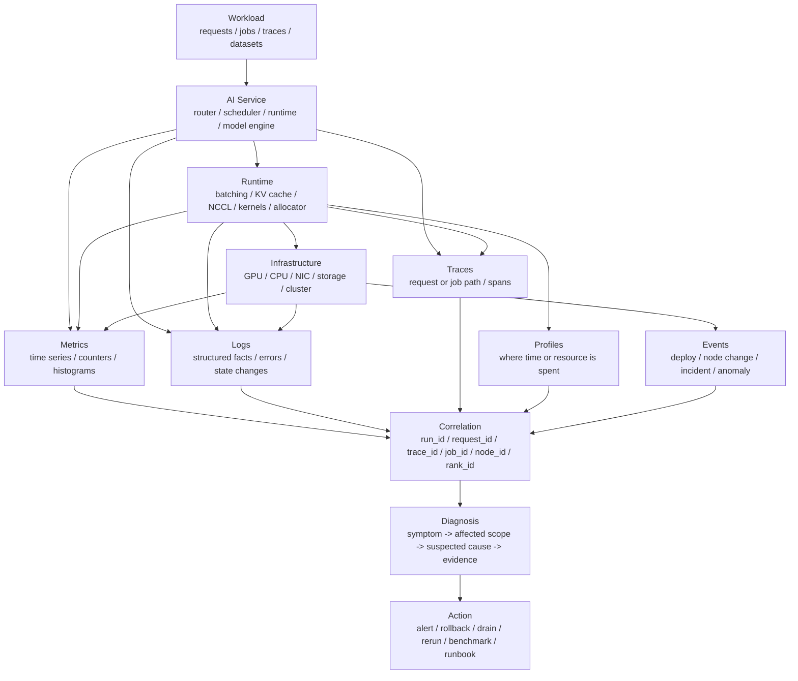

# AI 系统可观测性总览：Metrics、Logs、Traces、Profiles 与 Events

可观测性不是“有很多 dashboard”。

对 AI 系统来说，可观测性要回答的是：

```text
系统现在是否正常？
如果不正常，影响了谁？
发生在哪个 workload、模型、节点、GPU、rank、请求或 step？
是负载变化、代码变化、资源耗尽、硬件异常、通信异常，还是数据问题？
能否快速止损、定位、复现，并把经验沉淀成 benchmark、runbook 和复盘？
```

AI 系统的复杂性来自多层叠加：

- 模型本身有长上下文、KV Cache、MoE、batching、采样、训练 step 等状态。
- Runtime 有 scheduler、executor、communication、memory allocator、compiler、kernel。
- 集群有 GPU、NIC、NVMe、RDMA、NCCL、Kubernetes/Slurm、storage、network。
- 业务侧有 RAG、Agent、tool call、多轮请求、SLA、租户和优先级。

如果只看 GPU 利用率，很多故障看不见。如果只看日志，很多趋势看不见。如果只看平均延迟，p99 和队列崩溃看不见。

本篇先建立一套基础框架：

> 如何理解 metrics、logs、traces、profiles、events 这些观测信号，以及它们在 AI 推理、训练和集群系统中的分工？

## 一张总图



这张图强调一点：

```text
单个观测信号通常只能说明一部分事实，
可靠诊断依赖多种信号之间可以关联。
```

## 可观测性解决什么问题

可观测性不是为了收集数据而收集数据，而是为了支持几类动作。

| 动作 | 需要回答的问题 |
| --- | --- |
| 发现问题 | 是否有用户、任务或资源正在受影响 |
| 定界影响 | 影响哪个模型、租户、队列、节点池、机架、版本 |
| 定位原因 | 是代码、负载、硬件、网络、存储、调度还是数据 |
| 快速止损 | 是否需要限流、降级、切流、drain、rollback、重启 |
| 复现实验 | 是否能把线上问题转成 benchmark 或故障注入 |
| 长期改进 | 是否形成 runbook、alert rule、capacity rule、postmortem action |

如果一套监控只能画图，不能帮助这些动作，就还不是完整可观测性。

## Monitoring、Observability 与 Debugging

这三个词容易混用。

可以这样区分：

| 概念 | 重点 | 典型问题 |
| --- | --- | --- |
| monitoring | 已知信号的持续观察和告警 | p99 是否超 SLA？GPU 是否掉卡？ |
| observability | 通过多种信号理解未知问题 | 为什么这批请求突然变慢？ |
| debugging | 针对具体问题做深入定位 | 哪个 kernel、rank、节点或代码路径导致异常？ |

Monitoring 更像“守门员”，负责及时发现明确问题。

Observability 更像“证据系统”，负责让工程师能从症状追到原因。

Debugging 更像“局部手术”，会用 profiler、trace、日志、dump、复现实验等工具深入某个问题。

三者不是替代关系。好的系统会把它们连起来：

```text
alert -> dashboard -> trace/log/profile -> runbook -> mitigation -> postmortem -> regression test
```

## 五类核心观测信号

OpenTelemetry 把 telemetry signals 组织为 traces、metrics、logs、baggage，并持续发展 events、profiles 等能力。对 AI 系统工程来说，可以先把常用信号理解为五类。

| 信号 | 适合回答 | 不适合回答 |
| --- | --- | --- |
| metrics | 趋势、聚合、告警、SLO、容量 | 单个请求为什么慢 |
| logs | 具体事实、错误、状态变化、上下文 | 大规模趋势和高频路径 |
| traces | 一次请求或任务经过哪些组件、每段耗时 | GPU kernel 内部瓶颈 |
| profiles | CPU/GPU/kernel/内存/锁/通信时间花在哪里 | 所有请求是否达标 |
| events | 部署、重启、drain、硬件异常、配置变化 | 高频数值变化 |

它们应该互补，而不是互相替代。

## Metrics：看趋势、门限和容量

Metrics 是按时间持续记录的数值信号。

典型形式包括：

- counter：只增不减的计数，例如请求数、token 数、错误数。
- gauge：某个时刻的值，例如队列长度、显存占用、GPU 温度。
- histogram：分布，例如 TTFT、TPOT、step time、batch size。
- summary/quantile：聚合分位数，但跨实例聚合要谨慎。

Metrics 适合：

- dashboard。
- alerting。
- SLO/SLI。
- capacity planning。
- trend analysis。
- regression detection。

AI 推理常见 metrics：

```text
request_rate
input_tokens_per_second
output_tokens_per_second
ttft_ms_bucket
tpot_ms_bucket
e2e_latency_ms_bucket
queue_wait_ms_bucket
prefill_tokens_per_second
decode_tokens_per_second
kv_cache_used_tokens
kv_cache_hit_rate
batch_size
running_requests
waiting_requests
error_rate
timeout_rate
```

AI 训练常见 metrics：

```text
step_time_ms
tokens_per_second
samples_per_second
mfu
loss
learning_rate
grad_norm
optimizer_time_ms
forward_time_ms
backward_time_ms
communication_time_ms
checkpoint_time_ms
eval_time_ms
gpu_memory_allocated
gpu_memory_reserved
rank_progress
```

集群和硬件常见 metrics：

```text
gpu_utilization
sm_active
hbm_bandwidth
gpu_memory_used
gpu_power_watts
gpu_temperature
gpu_clock
ecc_error_count
xid_error_count
pcie_tx_rx
rdma_tx_rx
nic_retransmit
storage_iops
storage_latency
node_ready
pod_pending
job_queue_wait
```

Metrics 的优势是便宜、连续、适合告警。

但 metrics 有两个常见陷阱。

第一个陷阱是只看平均值。

AI 推理服务最重要的常常是尾延迟，尤其是 TTFT p95/p99、TPOT p95/p99 和 E2E latency p99。平均值变好，不代表用户体验变好。

第二个陷阱是标签失控。

例如把 `request_id`、`prompt_hash`、`user_id` 当作 metric label，会造成 cardinality 爆炸。高基数字段应该进入 logs、traces 或样本记录，而不是进入高频 metrics label。

## Logs：记录具体事实

Logs 是离散文本或结构化事件记录。

AI 系统中，日志不应该只是：

```text
something failed
```

而应该尽量结构化：

```json
{
  "timestamp": "2026-06-12T10:30:12.120Z",
  "level": "error",
  "service": "decode-worker",
  "run_id": "run-20260612",
  "request_id": "req-abc",
  "trace_id": "trace-xyz",
  "model": "llama-70b",
  "replica": "decode-7",
  "node_id": "node-42",
  "gpu_id": 3,
  "event": "kv_cache_allocation_failed",
  "kv_cache_used_tokens": 1048576,
  "requested_tokens": 8192,
  "action": "request_rejected"
}
```

Logs 适合记录：

- 错误发生时的上下文。
- 状态机切换。
- 请求被拒绝、取消、超时。
- scheduler 决策。
- 模型加载、卸载、热更新。
- checkpoint 保存和恢复。
- NCCL 初始化和通信错误。
- 节点 drain、pod eviction、rank restart。
- 配置变更。

日志的关键不是“多”，而是“可查询、可关联、可解释”。

推荐原则：

- 使用结构化日志，而不是只写自然语言。
- 每条关键日志携带 `trace_id`、`request_id`、`job_id`、`rank_id`、`node_id` 等关联字段。
- 错误日志包含错误类型、影响范围、是否可重试、系统采取的动作。
- 控制日志级别，高频路径不要无节制打 info。
- 对 prompt、输出、RAG 文档、tenant 信息做脱敏和访问控制。

日志的弱点是数据量大、噪声高、难以直接做长期趋势。它更适合解释“某一刻发生了什么”。

## Traces：还原请求或任务路径

Trace 描述一次请求或任务经过系统的路径。

对推理请求来说，一个 trace 可以包含：

```text
API gateway
  -> auth / quota
  -> tokenizer
  -> router
  -> prefill queue
  -> prefill worker
  -> KV cache allocation
  -> decode queue
  -> decode worker
  -> stream response
```

每一段可以是一个 span：

```text
span: router.select_replica
span: scheduler.wait
span: prefill.execute
span: kv_cache.allocate
span: decode.iteration
span: stream.write
```

Trace 适合回答：

- 请求到底卡在哪一段。
- 排队时间占多少，执行时间占多少。
- Prefill 和 Decode 是否分离后引入额外网络等待。
- RAG/Agent 中检索、rerank、LLM、tool call 哪一段慢。
- 多服务之间是否有重试放大。
- 某个租户、模型、长度分桶是否受到特定组件影响。

训练系统也可以用 trace，但粒度通常不同。

训练 trace 可以围绕 step 或 job：

```text
data_loading
  -> host_to_device
  -> forward
  -> loss
  -> backward
  -> all_reduce / reduce_scatter / all_gather
  -> optimizer
  -> checkpoint
  -> evaluation
```

分布式训练的 trace 要带：

- job_id。
- step。
- rank。
- node。
- process group。
- collective type。
- tensor shape。
- communication stream。

Trace 的核心是 context propagation。请求进入系统后，trace id 要能穿过 API、router、worker、runtime、日志和 metrics exemplars。否则 trace 只能看局部，不能串起全链路。

Trace 的弱点是成本高。高 QPS 推理服务不可能对每个请求都完整采样。常见策略是：

- 对错误请求全采样。
- 对慢请求 tail sampling。
- 对关键租户或实验流量提高采样率。
- 对普通成功请求低比例采样。
- 把 trace 与 metrics histogram exemplars 关联。

## Profiles：解释时间和资源花在哪里

Profiles 关注“资源消耗分布”。

常见 profile 类型：

- CPU profile。
- GPU kernel profile。
- memory allocation profile。
- lock contention profile。
- network/IO profile。
- Python runtime profile。
- PyTorch profiler trace。
- Nsight Systems / Nsight Compute。
- pprof。

Profiles 适合回答：

- CPU 时间花在 tokenizer、scheduler、serialization 还是 Python overhead。
- GPU 时间花在哪些 kernel。
- HBM 带宽是否打满。
- kernel launch gap 是否过多。
- NCCL collective 是否等待。
- allocator 是否碎片化。
- DataLoader 是否成为训练瓶颈。
- checkpoint 是否阻塞训练。

Profiles 和 metrics 的关系是：

```text
metrics 发现问题范围，
profiles 解释瓶颈细节。
```

例如 metrics 看到 TPOT p99 上升，trace 看到 decode worker 执行阶段变长，profile 才能进一步判断是：

- batch size 变小导致 GPU 利用率下降。
- attention kernel 变慢。
- KV cache 访问带宽受限。
- CPU scheduler 跟不上。
- NCCL/网络等待增加。
- thermal throttling 降频。

Profiles 不适合一直高频开启。它们成本高、文件大、可能扰动性能。实践上应结合：

- 采样 profiling。
- 按需 profiling。
- 低频巡检 profiling。
- benchmark 前后对比 profiling。
- incident 现场保留 profiling。

## Events：记录系统状态变化

Events 是离散状态变化。

它们通常不是请求数据，也不是持续指标，但对排障极其重要。

AI 系统常见 events：

- deployment。
- config change。
- model rollout。
- image upgrade。
- driver/CUDA/NCCL 升级。
- node join/leave。
- pod restart。
- GPU Xid。
- ECC error。
- thermal throttling。
- power cap change。
- network flap。
- storage latency spike。
- checkpoint save failure。
- autoscaler scale up/down。
- queue policy change。
- incident start/end。

没有 events，很多问题只能凭记忆。

例如：

```text
10:10 p99 TTFT 上升
10:12 vLLM image rollout started
10:15 node pool A 开始出现 GPU Xid
10:20 autoscaler scale-up failed
```

这些信息如果不能放在同一时间线上，排障会非常慢。

Events 还应该进入复盘和知识库：

- 哪次变更触发了事故。
- 哪个节点批次有硬件异常。
- 哪个版本引入性能回归。
- 哪个 mitigation 有效。
- 哪个 runbook 被执行。

## AI 系统的四个黄金信号

Google SRE 提出的四个黄金信号是 latency、traffic、errors、saturation。AI 系统可以沿用这个框架，但要改成符合 AI workload 的口径。

| 黄金信号 | AI 推理口径 | AI 训练口径 |
| --- | --- | --- |
| latency | TTFT、TPOT、E2E、queue wait、tool call latency | step time、data time、forward/backward/optimizer time、checkpoint time |
| traffic | requests/s、input tokens/s、output tokens/s、concurrency | tokens/s、samples/s、global batch、active jobs |
| errors | timeout、cancelled、OOM、HTTP/gRPC error、wrong output policy error | NaN/Inf、OOM、NCCL timeout、rank failure、checkpoint failure |
| saturation | GPU/HBM/KV cache/queue/network/storage/client saturation | GPU/HBM/network/storage/DataLoader/checkpoint bandwidth saturation |

这四个信号的价值是简单。

每个线上服务、训练平台、集群队列都应该能回答：

```text
现在慢不慢？
现在负载有多大？
现在错了多少？
现在最满的资源是什么？
```

如果回答不了这四个问题，先不要急着建设复杂的根因分析平台。

## 分层观测：从用户症状到硬件事实

AI 系统可观测性应分层。

| 层级 | 关注对象 | 典型信号 |
| --- | --- | --- |
| 用户/任务层 | 请求、job、tenant、SLO | latency、success rate、tokens/s、queue wait |
| 服务层 | API、router、scheduler、worker | routing、batching、cache、replica health |
| 模型/runtime 层 | model engine、KV cache、NCCL、allocator、kernel | prefill/decode、step phase、memory、communication |
| 集群层 | node、pod、job、queue、storage、network | pending、eviction、restarts、RDMA、NVMe |
| 硬件层 | GPU、NIC、CPU、HBM、power、thermal | Xid、ECC、clocks、power、temperature、bandwidth |

排障时不要从最底层直接猜。

更稳的路径是：

```text
用户症状
  -> 影响范围
  -> 相关 workload
  -> 服务阶段
  -> runtime 资源
  -> 集群/硬件证据
```

例如推理 p99 TTFT 升高：

1. 确认是所有模型还是某个模型。
2. 确认是所有请求还是长输入请求。
3. 看 queue wait、prefill time、scheduler wait。
4. 看 GPU/HBM/KV cache/CPU/network。
5. 看是否有部署、配置、节点、硬件事件。
6. 用 trace/profile 找证据。

这样比直接看 GPU utilization 更可靠。

## Black-box 与 White-box

Black-box monitoring 从外部看系统症状。

例如：

- synthetic request 是否成功。
- 端到端 TTFT 是否达标。
- 用户请求错误率是否升高。
- RAG workflow 是否能完整返回。

White-box monitoring 从内部看系统状态。

例如：

- queue length。
- KV cache occupancy。
- decode batch size。
- rank progress。
- NCCL retry。
- GPU temperature。
- storage latency。

两者都需要。

Black-box 的好处是贴近用户症状，适合告警。

White-box 的好处是解释原因，适合定位和提前发现风险。

一个常见错误是只做 white-box，然后因为某个底层指标异常就频繁报警。更好的原则是：

```text
用户影响决定是否 page；
内部信号帮助定位和预防。
```

## 观测信号的关联字段

AI 系统最大的问题不是“没有数据”，而是“数据不能关联”。

建议在 metrics、logs、traces、profiles、events 中尽量统一这些字段：

```text
service
environment
cluster
node_id
gpu_id
pod_id
replica_id
model_id
model_revision
engine
engine_version
tenant
request_id
trace_id
span_id
job_id
run_id
step
rank
local_rank
world_size
workload_id
config_digest
image_digest
commit
```

不是每种信号都需要全部字段，但关键字段要稳定。

推理请求至少要能从：

```text
request_id -> trace -> logs -> replica -> node/GPU -> metrics/profile
```

训练任务至少要能从：

```text
job_id + step + rank -> logs -> NCCL trace/profile -> node/GPU/network metrics
```

benchmark 至少要能从：

```text
run_id -> manifest -> raw metrics -> traces/profiles -> report
```

如果缺少这些关联字段，事故复盘会变成手工拼图。

## 标签、Cardinality 与成本

指标标签是可观测性系统里最容易失控的部分。

合理标签：

```text
model
engine
cluster
node_pool
replica
tenant_class
request_type
priority_class
hardware_type
workload_bucket
```

危险标签：

```text
request_id
trace_id
user_id
prompt_hash
document_id
session_id
full_error_message
dynamic_file_path
```

危险标签会导致 time series 数量爆炸，增加存储、查询和告警成本。

原则是：

- 低基数字段适合 metrics label。
- 高基数字段进入 logs/traces。
- 长文本和敏感字段不要进入 metrics。
- 需要 drill-down 时用 exemplar 或 trace link，而不是把 request_id 放进 label。

AI 场景尤其要注意：

- prompt hash。
- RAG document id。
- tool name + dynamic argument。
- tenant/user/session。
- model output category。
- error message。

这些字段很有用，但不应该随意成为高频 metric label。

## 指标命名和单位

好的指标名要稳定、清晰、可聚合。

建议：

- 指标名表达测量对象。
- 单位写在指标名或 metadata 中。
- latency 用 histogram，而不是只上报 p99。
- counter 用 `_total` 或明确语义。
- label 使用稳定枚举，不使用自由文本。
- 区分 input tokens 和 output tokens。
- 区分 request latency、queue latency、compute latency。
- 区分 offered load、throughput 和 goodput。

示例：

```text
ai_inference_requests_total
ai_inference_request_duration_ms_bucket
ai_inference_ttft_ms_bucket
ai_inference_tpot_ms_bucket
ai_inference_input_tokens_total
ai_inference_output_tokens_total
ai_inference_kv_cache_tokens
ai_training_step_duration_ms_bucket
ai_training_tokens_total
ai_training_checkpoint_duration_ms_bucket
ai_gpu_power_watts
ai_gpu_temperature_celsius
```

不要用模糊指标名：

```text
latency
speed
gpu
error
tokens
```

这些名字在小项目里看似方便，进入多模型、多集群、多团队后会很快失控。

## Alerting：告警不是 dashboard 截图

告警的目标不是告诉你“有个指标异常”，而是让人采取行动。

好的告警应该包含：

- 影响对象。
- 影响程度。
- 持续时间。
- 可能原因。
- 证据链接。
- runbook。
- 最近变更。
- 建议动作。

例如：

```text
Alert: llama70b-prod p99 TTFT burn rate high
Scope: model=llama70b, cluster=prod-a, tenant_class=interactive
Impact: 2% error budget consumed in 1h window
Evidence:
  - TTFT p99: 820 ms, SLO: 500 ms
  - prefill queue wait p99: 410 ms
  - node_pool=h100-a GPU memory pressure high
Recent events:
  - model rollout configB at 10:12
Runbook:
  - check prefill/decode split
  - compare prefix cache hit rate
  - rollback configB if queue wait remains high
```

SLO 告警通常比静态阈值更有工程意义。

静态阈值示例：

```text
p99 TTFT > 500 ms for 10 minutes
```

SLO burn-rate 告警关注的是错误预算消耗速度：

```text
系统正在以多快速度消耗未来一段时间允许失败的预算？
```

这更接近“是否值得打断人”的问题。

AI 系统也可以使用多窗口、多 burn-rate 的策略：

- 短窗口发现快速事故。
- 长窗口避免短暂抖动。
- page 级告警对应真实用户影响。
- ticket 级告警对应慢性问题。

## Dashboard：按问题组织，而不是按工具堆图

Dashboard 应该回答问题。

一个推理服务 dashboard 可以按下面结构组织：

1. 用户症状：success rate、TTFT、TPOT、E2E、SLO burn rate。
2. 流量形态：QPS、input/output tokens、concurrency、长度分桶。
3. 调度状态：queue wait、running/waiting、batch size、priority。
4. KV Cache：occupancy、hit rate、eviction、allocation failure。
5. Runtime：prefill/decode tokens/s、CPU overhead、GPU utilization。
6. 资源：HBM、SM active、power、temperature、network、storage。
7. 事件：deploy、config、node、error、autoscaling。

一个训练 dashboard 可以按下面结构组织：

1. 任务进度：step、tokens、ETA、rank progress。
2. 性能：step time、tokens/s、MFU、communication ratio。
3. 稳定性：loss、grad norm、NaN/Inf、OOM、restart。
4. 数据：DataLoader time、sample rate、data error。
5. 通信：all-reduce/reduce-scatter/all-gather time、NCCL error。
6. Checkpoint/eval：耗时、失败、backlog。
7. 资源：GPU、HBM、network、storage、power、thermal。

不要把所有图都放到一个页面。

推荐分层：

- 首页只放症状和关键容量信号。
- Drill-down 页面按模型、租户、节点池、job、rank 展开。
- Incident 页面按时间线聚合 metrics、logs、traces、events。
- Benchmark 页面只展示可复现实验数据。

## Sampling 与 Retention

观测数据不能无限保存。

不同信号的保存策略不同：

| 信号 | 高频保存 | 长期保存 |
| --- | --- | --- |
| metrics | 原始短期，高分辨率 | 降采样长期，保留关键 SLO |
| logs | 错误和关键状态较长 | debug/info 短期或按需 |
| traces | 错误/慢请求优先 | 关键 incident 或 benchmark 采样 |
| profiles | 按需或低频 | 关键问题证据包 |
| events | 全量长期 | 变更、事故、硬件事件长期 |

AI 系统还要注意：

- prompt 和输出可能敏感。
- RAG 文档和 tool 参数可能敏感。
- profiler 和日志可能包含路径、token、tenant 信息。
- trace 可能泄露请求结构。

因此 retention 必须同时考虑：

- 诊断价值。
- 存储成本。
- 合规和隐私。
- 是否进入 incident evidence。
- 是否进入 benchmark run manifest。

## 可观测性与 Benchmark 的关系

第 8 章讲 benchmark 数据治理，第 9 章讲线上系统可观测性。两者应该互相打通。

Benchmark 需要可观测性提供：

- workload 执行时的系统 metrics。
- profiler trace。
- logs。
- environment events。
- run manifest。
- quality gates。

线上可观测性需要 benchmark 提供：

- 关键指标的正常范围。
- 容量边界。
- 饱和拐点。
- 版本回归证据。
- 事故复现负载。
- 修复前后对比。

一次线上事故如果能沉淀为：

```text
incident -> workload trace -> benchmark case -> regression test -> alert rule -> runbook
```

可观测性就不只是救火工具，而是知识沉淀系统。

## 可观测性最小闭环

对一个新 AI 服务，最小闭环可以从下面开始。

第一层，用户症状：

- request success rate。
- TTFT / TPOT / E2E latency histogram。
- timeout/cancel/error。
- tokens/s。
- SLO burn rate。

第二层，服务内部：

- queue wait。
- batch size。
- running/waiting requests。
- KV cache used/hit/eviction/allocation failure。
- prefill/decode throughput。
- replica health。

第三层，资源和硬件：

- GPU utilization / SM active。
- HBM used/bandwidth。
- GPU power/temperature/clocks。
- CPU usage。
- network tx/rx/retransmit。
- storage latency。
- GPU Xid/ECC。

第四层，关联和证据：

- structured logs。
- request trace。
- slow/error trace sampling。
- deploy/config/node events。
- incident runbook link。

先把这四层打通，再考虑复杂自动根因分析。

## 常见误区

### 误区一：GPU 利用率高就代表系统健康

不一定。

GPU 利用率高可能意味着有效计算多，也可能意味着错误重试、无效 padding、低效 kernel、过载或热降频。必须结合 latency、goodput、错误率、功耗、batch shape 和 profiler 判断。

### 误区二：只有出错才需要 trace

不够。

慢请求、重试请求、长上下文请求、cache miss 请求也需要 trace。否则只能看到失败，看不到性能退化路径。

### 误区三：日志越多越好

不对。

高频日志会增加成本、污染查询、影响性能。关键是结构化、可关联、按级别和采样策略控制。

### 误区四：告警越多越安全

相反。

低质量告警会让值班人员忽略真正事故。告警应该围绕用户影响、SLO、错误预算和明确动作设计。

### 误区五：Dashboard 能替代复盘

不能。

Dashboard 展示现象，复盘需要时间线、影响范围、根因证据、缓解动作和改进项。

### 误区六：Benchmark 和线上监控可以完全分开

不应该。

线上问题应转化成 benchmark case；benchmark 的容量边界也应反哺线上告警和容量规划。

## 检查清单

设计指标时：

- 是否覆盖 latency、traffic、errors、saturation？
- 是否区分 TTFT、TPOT、E2E、queue wait？
- 是否使用 histogram 而不是只记录平均值？
- labels 是否控制 cardinality？
- input tokens 和 output tokens 是否分开？
- offered load、throughput、goodput 是否分开？

设计日志时：

- 是否结构化？
- 是否包含 trace_id/request_id/job_id/rank_id/node_id？
- 错误是否有明确 error_type？
- 是否记录系统动作，例如 retry、reject、fallback、drain？
- 是否避免保存敏感 prompt、输出和文档内容？

设计 trace 时：

- 是否覆盖 router、scheduler、prefill、decode、stream 等关键阶段？
- 是否对错误和慢请求提高采样率？
- 是否能从 trace 跳到日志和关键 metrics？
- RAG/Agent 的 tool call 和外部依赖是否有 span？

设计 profile 时：

- 是否明确 profile 要回答的问题？
- 是否记录 workload、版本、硬件和配置？
- 是否控制 profiling 成本和性能扰动？
- 是否能与 benchmark 或 incident 关联？

设计告警时：

- 是否基于用户影响或 SLO？
- 是否有 runbook？
- 是否包含证据链接？
- 是否区分页级告警和工单级告警？
- 是否记录最近部署、配置和节点事件？

## 小结

AI 系统可观测性的核心不是堆工具，而是建立证据链。

一句话：

```text
metrics 告诉你是否异常，
logs 告诉你发生了什么，
traces 告诉你路径在哪里卡住，
profiles 告诉你资源花在哪里，
events 告诉你系统状态何时改变。
```

这些信号通过统一的 request、job、rank、node、run 关联起来，才能支持告警、定位、复现、容量规划和故障复盘。

下一步的可靠性章节，可以在这个总览之上继续展开：

- SLO、SLI、错误预算和告警策略。
- GPU/NCCL/网络/存储故障模式。
- 推理服务降级、限流和过载保护。
- 训练任务容错和恢复。
- 事故复盘和 runbook。

## 参考资料

- [OpenTelemetry Signals](https://opentelemetry.io/docs/concepts/signals/)
- [Google SRE: Monitoring Distributed Systems](https://sre.google/sre-book/monitoring-distributed-systems/)
- [Google SRE Workbook: Alerting on SLOs](https://sre.google/workbook/alerting-on-slos/)
