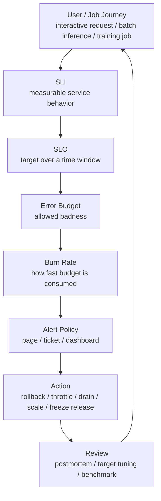

# SLO、SLI、错误预算与告警策略：从用户体验到行动门槛

可观测性告诉我们系统发生了什么。

SLO 告诉我们：

```text
这些现象是否已经坏到需要采取行动？
```

没有 SLO 的监控系统，很容易变成两种极端：

- 指标很多，但不知道哪个真的重要。
- 告警很多，但不知道哪个值得打断人。

对 AI 系统尤其如此。

推理服务可能同时有 TTFT、TPOT、E2E latency、tokens/s、queue wait、KV cache、batch size、GPU power、tool call latency、RAG recall 等指标。

训练平台可能同时有 step time、tokens/s、MFU、loss、NaN、OOM、NCCL timeout、checkpoint、eval backlog、rank progress、queue wait 等指标。

如果没有 SLO，团队会在事故中反复争论：

```text
这到底算不算故障？
需要 page 吗？
需要回滚吗？
需要停止发布吗？
用户是否真的受影响？
```

本篇重点回答：

> 如何为 AI 推理、训练和集群平台定义 SLI、SLO、错误预算和告警策略，让可靠性判断从“看感觉”变成可执行的工程契约？

## 一张总图



这张图的逻辑是：

```text
先定义用户或任务真正关心什么，
再定义如何测量，
再定义目标，
再把目标转成可消耗的错误预算，
最后把预算消耗速度转成告警和行动。
```

不要从“已有哪个指标”开始设计 SLO。应该从“用户或任务在什么情况下认为系统不可用、不可接受或不可信”开始。

## 基本术语

### SLI

SLI 是 Service Level Indicator。

它是一个可量化的服务水平指标。

例如：

```text
过去 30 天内，成功且 TTFT <= 500 ms 的交互式推理请求比例。
```

SLI 的重点是“定义清楚”。

同样叫 latency SLI，下面几种完全不同：

- server receive 到 first token。
- client send 到 first token。
- last token 完成时间。
- 不含排队时间的 GPU execution time。
- 只统计成功请求。
- 失败请求也算 bad event。
- 按请求统计。
- 按 token 统计。
- 按租户、模型、优先级分桶统计。

SLI 没定义清楚，SLO 就没有意义。

### SLO

SLO 是 Service Level Objective。

它是 SLI 在某个时间窗口内要达到的目标。

例如：

```text
30 天滚动窗口内，99.5% 的交互式请求满足：
  success == true
  TTFT <= 500 ms
  TPOT p99 <= 50 ms
```

SLO 的重点是“有时间窗口、有目标、有测量口径”。

一个 SLO 至少要包含：

- 服务或 workload。
- 统计对象。
- SLI 公式。
- 好事件和坏事件定义。
- 时间窗口。
- 目标值。
- 数据来源。
- 排除条件。
- 负责人。
- 违反时的行动。

### SLA

SLA 是 Service Level Agreement。

它通常是对外或跨组织的协议，可能带有补偿、扣费、责任或合同后果。

工程团队日常更常用的是 SLO。

可以这样理解：

```text
SLI：怎么量。
SLO：要达到什么目标。
SLA：如果没达到，对外承诺有什么后果。
```

内部知识库里应优先把 SLI 和 SLO 定义清楚，再讨论是否需要 SLA。

### Error Budget

错误预算是 SLO 允许系统“不完美”的空间。

如果 SLO 是 99.9%，那么错误预算就是：

```text
1 - 99.9% = 0.1%
```

在 30 天窗口中，如果有 1000 万次有效请求，0.1% 错误预算就是：

```text
10,000,000 * 0.001 = 10,000 个 bad events
```

错误预算的价值是把可靠性和研发速度连接起来：

- 预算充足，可以继续发布、实验和优化。
- 预算快速燃烧，需要减慢变更、回滚或投入稳定性工作。
- 预算耗尽，应冻结高风险发布，优先恢复可靠性。

### Burn Rate

Burn rate 是错误预算消耗速度。

如果一个服务 30 天 SLO 的错误预算是 0.1%，而最近 1 小时的错误率是 1%，那么它正在以：

```text
1% / 0.1% = 10x
```

的速度消耗预算。

Burn rate 的意义是：

```text
不是只看现在错了多少，
而是看如果这种状态持续下去，多久会烧完预算。
```

这比单纯的静态阈值更适合告警。

## SLO Contract

建议把每个 SLO 写成 contract。

最小结构如下：

```yaml
slo_id: "llama70b-interactive-ttft"
service: "llm-serving"
workload_class: "interactive"
model: "llama-70b"
owner: "serving-platform"
window:
  type: "rolling"
  duration: "30d"
sli:
  type: "good_events_ratio"
  good_event: "success == true and ttft_ms <= 500"
  total_event: "valid interactive inference request"
  data_source: "server metrics + request logs"
target: 0.995
budget:
  bad_event_ratio: 0.005
alerting:
  page:
    - burn_rate: 14.4
      long_window: "1h"
      short_window: "5m"
  ticket:
    - burn_rate: 3
      long_window: "24h"
      short_window: "2h"
actions:
  budget_low: "freeze risky rollout"
  page: "follow runbook llm-serving-ttft"
exclusions:
  - "synthetic load tests"
  - "requests explicitly cancelled by client before scheduling"
caveats:
  - "does not cover RAG tool latency"
```

Contract 的好处是：

- 新人能看懂目标。
- AI 助手能检索和解释。
- 告警规则能从 contract 生成。
- dashboard 能自动链接 SLO。
- 事故复盘能引用同一份定义。
- benchmark 能复用同一套指标口径。

OpenSLO 这类规范的价值也在这里：把 SLO、SLI、数据源、告警策略等写成可交换、可版本化的 YAML 对象，而不是散落在不同监控系统界面里。

## 从用户旅程开始

SLO 不应该从底层资源开始。

比如：

```text
GPU utilization > 70%
```

这不是一个好 SLO。

GPU 利用率是资源效率指标，不是用户体验指标。GPU 利用率低可能是浪费，也可能是低负载；GPU 利用率高可能是有效吞吐，也可能是过载、重试或低效 kernel。

好的 SLO 从用户或任务旅程开始。

推理场景：

| 用户旅程 | 用户关心什么 | 候选 SLO |
| --- | --- | --- |
| 交互式聊天 | 首 token 快、流式稳定、少失败 | TTFT、TPOT、success rate |
| 批量离线推理 | 总完成时间、成本、失败可重试 | job completion、tokens/hour、retry success |
| RAG 问答 | 端到端时延、检索成功、答案可用 | workflow latency、tool success、LLM success |
| Agent workflow | 多轮调用成功、工具错误可恢复 | workflow success、step timeout、fallback |
| 多模态推理 | 图片/视频处理成功、首响应时间 | preprocessing latency、E2E success |

训练场景：

| 用户旅程 | 用户关心什么 | 候选 SLO |
| --- | --- | --- |
| 预训练任务 | 训练持续推进、故障可恢复 | job progress、checkpoint freshness、restart success |
| 微调任务 | 在预期时间内完成、结果可取回 | completion latency、success rate |
| 分布式实验 | rank 不挂、NCCL 不频繁 timeout | step success、collective failure rate |
| 评估任务 | 指标按时生成、结果可信 | eval completion、artifact availability |
| 平台队列 | 等待时间可预期、公平调度 | queue wait、admission latency |

集群平台场景：

| 用户旅程 | 用户关心什么 | 候选 SLO |
| --- | --- | --- |
| 申请 GPU | 作业能在合理时间启动 | queue wait / scheduling latency |
| 使用节点 | 节点健康、GPU 可用 | allocatable GPU availability |
| 访问数据 | 数据可读、checkpoint 可写 | storage availability / latency |
| 使用网络 | 分布式训练通信稳定 | RDMA/NCCL success rate |
| 升级环境 | 镜像、驱动、Runtime 可复现 | environment readiness |

先选旅程，再选 SLI。

## AI 推理 SLI 设计

推理服务最常见的 SLI 是可用性和延迟。

### Availability SLI

基础形式：

```text
good_requests / valid_requests
```

good request 可以定义为：

```text
HTTP/gRPC status success
and no server timeout
and no engine error
and no policy-level failure
```

但 AI 推理需要更细。

很多请求不是简单成功或失败：

- client 主动取消。
- 生成到一半断流。
- tool call 失败但有 fallback。
- RAG 检索失败但模型仍返回。
- safety policy 拒绝。
- 超过最大 token 限制。
- 低优先级请求被 admission control 拒绝。

这些情况要明确计入口径。

例如：

| 情况 | 建议 |
| --- | --- |
| client 发送后立即取消 | 可从 total 中排除，前提是未进入调度 |
| 已调度后取消 | 通常计入 total，是否 bad 取决于产品语义 |
| server timeout | bad |
| OOM / KV cache allocation failed | bad |
| rate limit reject | 可单独统计，不一定进入服务可用性 SLO |
| safety rejection | 通常不是 infra bad event |
| fallback 成功 | 可以计为 degraded success，另设 degraded ratio |

### Latency SLI

推理 latency 不应该只用一个 E2E。

推荐至少拆：

```text
TTFT: client send 或 server receive 到 first token
TPOT: decode 阶段平均/分位 token 间隔
E2E: 请求开始到最后 token
queue wait: 进入服务到开始执行
```

交互式请求常用：

```text
99% of valid interactive requests have TTFT <= 500 ms
99% of generated tokens have TPOT <= 50 ms
```

但 TPOT 有两种口径：

- 按请求统计每个请求的平均 TPOT。
- 按 token 统计每个 token interval。

二者不同。按 token 统计会让长输出请求权重更大；按请求统计会让短输出请求权重更大。Contract 必须说明。

### Goodput SLI

吞吐不是 SLO，goodput 更适合作为可靠性/容量交界指标。

例如：

```text
goodput = 满足 TTFT/TPOT/error 条件的成功请求数 / 秒
```

如果系统 QPS 很高但大量请求超时，throughput 看起来高，goodput 其实低。

Goodput SLI 适合用于：

- capacity guardrail。
- autoscaling。
- release gate。
- benchmark 与线上校准。

### Degraded Mode SLI

AI 服务常有降级：

- 关闭 prefix cache。
- 降低 max output tokens。
- 使用较小模型 fallback。
- 禁用 tool call。
- 降低检索 top-k。
- 限制低优先级租户。

这些不一定是 hard failure，但用户体验已经下降。

建议单独统计：

```text
degraded_success_ratio
fallback_ratio
admission_reject_ratio
stream_interruption_ratio
```

否则系统可能“全部成功”，但实际一直在降级。

## AI 训练 SLI 设计

训练系统的 SLO 和在线推理不同。

训练任务不是每个请求都立刻返回，而是长时间运行。

常见 SLI：

### Job Start SLI

衡量任务能否启动：

```text
valid jobs scheduled within target queue wait / valid jobs submitted
```

可按资源类型分桶：

- 1 GPU。
- 8 GPU。
- 64 GPU。
- 512 GPU。
- H100。
- A100。
- 特定网络拓扑。

大作业和小作业不能混在一个 SLO 中，否则大作业会被平均值掩盖。

### Job Progress SLI

衡量任务是否持续推进：

```text
training jobs with step progress in last N minutes / running training jobs
```

或者：

```text
steps completed successfully / expected steps attempted
```

这能发现：

- hang。
- DataLoader 卡住。
- rank 某一侧停滞。
- NCCL collective 等待。
- checkpoint 阻塞。
- storage stall。

### Checkpoint Freshness SLI

训练可靠性很大程度上取决于 checkpoint。

可以定义：

```text
running critical jobs with committed checkpoint age <= 30 min / running critical jobs
```

或者：

```text
successful checkpoint saves / checkpoint attempts
```

这比只看 job 是否 alive 更有效。一个任务活着但 6 小时没有成功 checkpoint，实际恢复风险很高。

### Restart Recovery SLI

衡量故障后能否恢复：

```text
jobs recovered to previous progress within RTO / recoverable failed jobs
```

也可以按 RPO/RTO：

- RPO：最多丢多少训练进度。
- RTO：多久恢复到继续训练。

训练平台的可靠性不能只看“是否失败”，还要看“失败后是否可恢复”。

### Numerical Health SLI

训练不是只要跑完就行。

一些数值问题应该进入 reliability 视角：

- NaN。
- Inf。
- loss spike。
- grad norm abnormal。
- optimizer state corruption。
- checkpoint load mismatch。

这些可以作为 guardrail SLI，而不一定作为 page 级 SLO。

例如：

```text
critical training jobs with no NaN/Inf in last 24h / critical training jobs
```

## 集群平台 SLI 设计

集群平台服务的是训练、推理、Notebook、benchmark、数据处理等任务。

它的 SLO 不应只看 Kubernetes node ready 或 Slurm daemon alive。

更有意义的是：

### GPU Allocatable SLI

```text
allocatable healthy GPUs / expected GPUs
```

要区分：

- physically present。
- driver visible。
- scheduler allocatable。
- not cordoned。
- not in maintenance。
- passed health check。
- workload-ready。

一张卡在 `nvidia-smi` 能看到，不代表它可以被训练任务可靠使用。

### Scheduling SLI

```text
jobs admitted and started within target time / valid jobs
```

需要按资源规格和队列分桶。

例如：

```text
95% of 8xH100 interactive training jobs start within 30 min
90% of 64xH100 batch training jobs start within 12h
```

队列等待不是单纯可靠性问题，也涉及容量、公平性和优先级。因此 SLO contract 要写明适用队列和优先级。

### Network/Storage SLI

对分布式训练，网络和存储是服务能力的一部分。

候选 SLI：

```text
successful NCCL health checks / attempted checks
RDMA path available nodes / expected nodes
checkpoint write success / checkpoint write attempts
dataset shard read latency within target / reads
```

这些 SLI 既可用于告警，也可用于入池门禁。

## Good Events、Bad Events 与 Total Events

SLO 最核心的工程细节是事件定义。

一个 ratio SLI 可以写成：

```text
good_events / total_events
```

也可以写成：

```text
1 - bad_events / total_events
```

关键是 `total_events` 必须定义清楚。

推理 total event 可能是：

- 所有 API 请求。
- 进入 scheduler 的请求。
- 通过 admission control 的请求。
- interactive 请求。
- 某个模型的请求。
- 某个租户等级的请求。
- 某个长度分桶的请求。

训练 total event 可能是：

- 提交的 job。
- 通过 admission 的 job。
- 已启动的 job。
- step attempt。
- checkpoint attempt。
- recoverable failure。

不同 total event 会得到完全不同的 SLO。

一个常见错误是把被 admission control 拒绝的请求排除掉，导致系统看起来很可靠，但用户看到的是“请求被拒绝”。更好的做法是：

- 服务内部 SLO 可以排除未进入服务的请求。
- 用户体验 SLO 应把 admission reject 作为单独 SLI。
- 容量治理需要单独追踪 reject 和 queue wait。

## Occurrence、Time Slice 与 Ratio Time Slice

错误预算常见三种口径。

| 口径 | 解释 | 适合场景 |
| --- | --- | --- |
| occurrence | 按事件数统计好坏 | 高 QPS 请求、token、step |
| time slice | 按时间片是否达标统计 | 低流量服务、平台可用性 |
| ratio time slice | 每个时间片先算比例，再聚合 | 流量波动大但每片有足够样本 |

推理服务高 QPS 时，occurrence 很自然：

```text
good_requests / valid_requests
```

但低流量服务会有问题。假设 1 小时只有 10 个请求，失败 1 个就是 10% 错误率，可能触发很高 burn rate，但未必代表系统性故障。

低流量服务可以考虑：

- synthetic traffic。
- time-slice SLO。
- 合并多个同类服务。
- 降低 page 级告警敏感度。
- 使用 ticket 级告警。

训练平台适合混合：

- step success 用 occurrence。
- job progress 用 time slice。
- GPU pool availability 用 time slice。
- checkpoint save success 用 occurrence。

## Error Budget 计算

假设 SLO：

```text
30 天内 99.5% 的交互式请求满足 TTFT <= 500 ms 且成功返回
```

那么：

```text
budget_ratio = 1 - 0.995 = 0.005
```

如果 30 天内有 2000 万个有效请求：

```text
allowed_bad_events = 20,000,000 * 0.005 = 100,000
```

如果已经有 35,000 个 bad events：

```text
budget_consumed = 35,000 / 100,000 = 35%
budget_remaining = 65%
```

错误预算可以转成行动规则：

| 预算状态 | 建议动作 |
| --- | --- |
| remaining > 50% | 正常发布和实验 |
| remaining 20%-50% | 关注趋势，限制高风险变更 |
| remaining 0%-20% | 冻结高风险发布，优先稳定性修复 |
| remaining <= 0% | 停止非紧急变更，复盘并恢复可靠性 |

这不是唯一策略，但必须提前写清楚。

如果每次事故后才临时讨论是否冻结发布，SLO 就没有发挥治理作用。

## Burn Rate 告警

静态告警常写成：

```text
p99_ttft_ms > 500 for 10m
```

它有几个问题：

- 不知道消耗多少错误预算。
- 不区分轻微抖动和严重事故。
- 低流量时噪声大。
- 高流量时可能发现太晚。

Burn rate 告警更关注预算消耗速度。

定义：

```text
burn_rate = observed_error_ratio / budget_error_ratio
```

例如 SLO 99.9%，预算错误率 0.1%。

如果最近 5 分钟错误率 2%：

```text
burn_rate = 2% / 0.1% = 20x
```

这意味着如果持续下去，30 天预算会在：

```text
30 days / 20 = 1.5 days
```

内烧完。

Burn rate 告警的好处是把短期现象和长期目标连接起来。

## 多窗口、多 Burn Rate

单窗口告警容易误判。

只看短窗口：

- 发现快。
- 噪声高。
- 容易被瞬时抖动触发。

只看长窗口：

- 精度高。
- 发现慢。
- 对严重事故不敏感。

更常见的策略是短窗口和长窗口同时满足。

例如：

```text
page if:
  error_rate_1h > 14.4 * budget_error_rate
  and
  error_rate_5m > 14.4 * budget_error_rate
```

含义是：

- 1 小时窗口确认这不是瞬时毛刺。
- 5 分钟窗口确认问题仍在发生。

也可以设置慢性问题告警：

```text
ticket if:
  error_rate_24h > 3 * budget_error_rate
  and
  error_rate_2h > 3 * budget_error_rate
```

page 适合需要立即响应的事故。

ticket 适合持续消耗预算但不需要半夜叫醒人的问题。

AI 系统中，page 级告警应该尽量绑定用户影响，例如：

- interactive requests SLO burn rate high。
- training critical jobs not making progress。
- checkpoint freshness SLO burning fast。
- GPU pool allocatable SLO below target and affecting scheduled jobs。

不要因为单个 GPU temperature 偶发升高就 page。硬件指标可以作为诊断证据或 ticket，除非它已经造成用户或任务影响。

## 推理服务 SLO 示例

### 交互式聊天

```yaml
slo_id: "chat-interactive-availability-latency"
service: "llm-chat"
workload_class: "interactive"
window: "30d rolling"
target: 99.5%
sli:
  total: "valid interactive requests admitted by router"
  good: |
    request_success == true
    and stream_started == true
    and ttft_ms <= 500
    and request_e2e_ms <= 30000
bad_event_notes:
  - server timeout is bad
  - kv cache allocation failure is bad
  - client cancel before admission is excluded
  - safety rejection is tracked separately
```

这里把 TTFT 和 E2E 合在一个 SLO 中，适合用户体验导向。

也可以拆成多个 SLO：

- availability。
- TTFT。
- stream continuity。
- degraded mode ratio。

拆得太细会增加治理成本，所以要控制数量。

### Decode 流式稳定性

```yaml
slo_id: "chat-streaming-token-cadence"
sli:
  total: "generated token intervals for valid interactive requests"
  good: "token_interval_ms <= 80"
target: 99.0%
window: "7d rolling"
```

这个 SLO 更关注流式体验。

注意它按 token interval 统计，不是按请求统计。长回复会贡献更多样本。是否接受这种权重，需要在 contract 中说明。

### RAG Workflow

RAG 不应该只看 LLM 调用。

端到端 SLO 可以定义：

```yaml
slo_id: "rag-answer-workflow"
sli:
  total: "valid RAG user questions"
  good: |
    workflow_success == true
    and retrieval_success == true
    and llm_success == true
    and e2e_ms <= 8000
target: 99.0%
window: "30d rolling"
```

同时保留分阶段 SLI：

- retrieval latency。
- rerank latency。
- context packing error。
- LLM TTFT/TPOT。
- tool call timeout。

端到端 SLO 用来判断用户体验，分阶段 SLI 用来定位原因。

## 训练平台 SLO 示例

### Critical Training Job Progress

```yaml
slo_id: "critical-training-progress"
service: "training-platform"
workload_class: "critical-training"
window: "30d rolling"
target: 99.0%
sli:
  total: "5-minute time slices for running critical training jobs"
  good: |
    job_has_completed_step_in_slice == true
    or job_state in ["checkpointing", "evaluating"] within allowed_window
```

这个 SLO 关注“任务是否持续推进”。

如果只看进程是否 alive，很多 hang 发现不了。

### Checkpoint Freshness

```yaml
slo_id: "training-checkpoint-freshness"
sli:
  total: "running critical jobs requiring checkpoint"
  good: "latest_committed_checkpoint_age_minutes <= 30"
target: 98.0%
window: "7d rolling"
```

这个 SLO 会推动团队建设：

- checkpoint manifest。
- committed/latest 语义。
- 保存失败告警。
- 存储容量治理。
- 恢复演练。

### Recovery SLO

```yaml
slo_id: "training-recovery-rto"
sli:
  total: "recoverable failed critical jobs"
  good: "job_resumed_to_previous_progress_within_minutes <= 20"
target: 95.0%
window: "30d rolling"
```

训练平台不能保证永不失败，但应该保证失败后能恢复。

这类 SLO 比“job failure count”更有工程意义。

## 集群平台 SLO 示例

### GPU Pool Readiness

```yaml
slo_id: "h100-pool-workload-ready"
sli:
  total: "expected H100 GPUs in production pool time slices"
  good: |
    gpu_present == true
    and driver_ready == true
    and scheduler_allocatable == true
    and health_check_passed == true
    and not maintenance
target: 99.0%
window: "30d rolling"
```

这个 SLO 比 node ready 更接近 AI workload。

### Scheduling Latency

```yaml
slo_id: "interactive-training-start-latency"
sli:
  total: "valid interactive training jobs requesting <= 8 H100"
  good: "job_start_latency_minutes <= 30"
target: 95.0%
window: "7d rolling"
```

这个 SLO 不等于“所有训练任务 30 分钟内启动”。大规模训练和批处理任务应有不同队列、不同目标。

### Storage Write Availability

```yaml
slo_id: "checkpoint-storage-write"
sli:
  total: "checkpoint write attempts from production training jobs"
  good: "write_success == true and commit_latency_seconds <= 120"
target: 99.5%
window: "30d rolling"
```

Checkpoint 存储的 SLO 会直接影响训练 RPO/RTO。

## 多目标和 Guardrail

AI 系统常常需要多个目标。

例如推理服务：

- availability >= 99.9%。
- TTFT good event ratio >= 99.5%。
- stream interruption <= 0.1%。
- degraded mode ratio <= 1%。
- cost/request 不超过预算。

但是 SLO 数量不能无限增长。

建议区分：

| 类型 | 作用 |
| --- | --- |
| primary SLO | 决定 page、发布、稳定性优先级 |
| guardrail SLI | 防止局部优化破坏其他目标 |
| diagnostic metric | 用于定位原因，不直接告警 |
| business metric | 用于产品/成本决策，不等于可靠性 SLO |

例如 GPU 利用率通常是 diagnostic 或 efficiency metric，不应直接作为 primary SLO。

Prefix cache hit rate 也是诊断指标。它下降可能导致 TTFT/TPOT 变差，但不应天然 page。

## 按 Workload Class 分 SLO

AI 系统很少只有一种 workload。

同一个集群可能同时跑：

- 交互式聊天。
- 批量推理。
- RAG workflow。
- Agent workflow。
- Notebook。
- 训练。
- 评估。
- benchmark。

这些 workload 的可靠性目标不同。

例如：

| workload | 更关注 | 目标倾向 |
| --- | --- | --- |
| interactive inference | TTFT、TPOT、availability | 高可靠、低延迟 |
| batch inference | completion time、cost、retry | 可延迟、可重试 |
| training | progress、checkpoint、recovery | 可恢复、长期稳定 |
| eval | result availability、artifact correctness | 准确完成 |
| notebook | start latency、session stability | 交互可用 |
| benchmark | reproducibility、environment integrity | 可复现 |

不要给所有 workload 套同一个 99.9% availability。

过高目标会增加成本，过低目标会伤害关键用户。

## 测量窗口

SLO 必须有时间窗口。

常见窗口：

- 7 天滚动。
- 28/30 天滚动。
- 月度 calendar window。
- 季度 window。

滚动窗口适合连续运营和告警。

Calendar window 适合报告、结算和管理。

AI 系统中可以同时使用：

- 短窗口看事故。
- 30 天窗口看可靠性。
- 季度窗口看平台成熟度。

注意，窗口越短，抖动越大；窗口越长，反馈越慢。

## 排除条件

SLO contract 必须写排除条件。

但排除条件不能滥用。

合理排除：

- 用户在请求进入服务前主动取消。
- 明确标记的压测流量。
- 实验环境。
- 明确不受保障的 best-effort 队列。
- 上游依赖已声明不可用且 contract 另有定义。

危险排除：

- 所有超时都排除。
- 所有 OOM 都排除。
- 所有低优先级租户都排除但产品仍承诺可用。
- 所有高负载时段都排除。
- 事后临时排除某次事故。

排除条件应可审计，并在报告中显示。

如果一个 SLO 需要经常事后排除，说明 SLO 定义或系统能力有问题。

## 告警分级

不是所有 SLO 违反都应该 page。

可以分级：

| 等级 | 触发 | 动作 |
| --- | --- | --- |
| page | 快速燃烧错误预算、用户正在受影响 | 立即响应 |
| ticket | 慢性消耗预算、有可靠性风险 | 工作时间处理 |
| dashboard | 需要观察，但无需行动 | 趋势分析 |
| report | 月度/季度可靠性评审 | 治理和规划 |

Page 级告警要非常克制。

一个好的 page 应该满足：

- 真实用户或关键任务正在受影响。
- 有明确 owner。
- 有 runbook。
- 有可执行动作。
- 不是单纯噪声。

如果一个告警没有明确动作，就不应该 page。

## 告警内容模板

告警应该带上下文，而不是只发指标名。

```text
Alert:
  SLO burn rate high for llama70b interactive TTFT

Scope:
  service: llm-serving
  model: llama-70b
  workload_class: interactive
  cluster: prod-a

SLO:
  target: 99.5% good requests over 30d
  good_event: success and TTFT <= 500 ms

Current:
  burn_rate_1h: 18x
  burn_rate_5m: 22x
  error_budget_consumed_30d: 42%

Evidence:
  ttft_p99_ms: 920
  queue_wait_p99_ms: 480
  prefill_workers_available: 18/32
  kv_cache_allocation_failure_rate: 0.8%

Recent events:
  model config rollout at 10:12
  node pool h100-a drain at 10:18

Links:
  dashboard: ...
  trace search: ...
  runbook: ...
```

这种告警能直接引导行动。

不要只发：

```text
HighLatency
```

## 发布治理和错误预算

错误预算不仅用于告警，也用于发布治理。

可以约定：

```text
如果关键 SLO 的 30 天错误预算剩余 < 20%，暂停高风险发布。
如果某次发布导致 page 级 burn rate，自动回滚或进入 canary hold。
如果连续两次发布触发同类 SLO 事故，必须补充 regression benchmark。
```

对 AI 系统，发布风险包括：

- model engine 升级。
- scheduler 策略变更。
- KV cache 策略变更。
- CUDA/NCCL/driver 升级。
- quantization 配置变更。
- speculative decoding 开关。
- model rollout。
- routing 策略变更。
- checkpoint 格式变更。

这些变更不一定改变功能，但可能改变 latency、tail、stability 和 recovery。

SLO 可以把“是否允许继续发布”从主观判断变成工程规则。

## SLO 与容量规划

SLO 也会推动容量规划。

例如推理服务：

```text
SLO: 99.5% interactive requests TTFT <= 500 ms
```

如果在 QPS 增长后 burn rate 持续升高，说明系统已经接近容量边界。

此时可能需要：

- 增加 prefill 副本。
- 做 prefill/decode 分离。
- 优化 routing。
- 提高 prefix cache hit rate。
- 限制超长输入。
- 增加 GPU。
- 改 batch 策略。

训练平台：

```text
SLO: 95% of 8xH100 interactive jobs start within 30 min
```

如果长期不达标，可能说明：

- GPU 容量不足。
- 队列优先级错误。
- 碎片严重。
- 大作业占用资源。
- 节点维护比例过高。
- 资源请求规格不合理。

SLO 是容量问题的输入，而不是只用于事故响应。

## SLO 与 Benchmark

Benchmark 应该使用与线上 SLO 相同或可映射的指标口径。

例如线上 SLO 是：

```text
interactive TTFT <= 500 ms
TPOT <= 50 ms
```

那么 benchmark 不应只报告：

```text
tokens/s
```

而应报告：

- goodput at TTFT/TPOT SLA。
- p95/p99 TTFT。
- p95/p99 TPOT。
- queue wait。
- error/timeout。
- 输入输出长度分桶。

这样 benchmark 才能回答：

```text
这个优化是否真的改善 SLO？
```

线上事故也应反向沉淀成 benchmark case：

```text
SLO burn incident -> trace/workload sample -> benchmark case -> regression rule
```

## AI 特有的 SLO 难点

### 输出质量难以量化

基础设施 SLO 通常先关注可用性、延迟、恢复和稳定性。

输出质量可以作为产品或模型评估 SLO，但很难和系统 reliability 直接绑定。

例如：

- 回答是否正确。
- RAG 是否引用正确文档。
- Agent 是否完成任务。
- 多模态理解是否准确。

这些可以进入 workflow-level SLI，但需要明确 evaluator、sample set、judge 口径和版本。

### Streaming 部分成功

流式响应可能：

- 首 token 成功但中途断开。
- 用户取消。
- 生成被截断。
- backend timeout。

因此要定义：

- stream started 是否算成功。
- stream completed 是否算成功。
- partial answer 是否 degraded。
- token cadence 是否单独统计。

### 长尾请求

长上下文、长输出、复杂 RAG 和 Agent 请求天然更慢。

建议按 request class 或 length bucket 定义 SLO：

```text
short interactive
long context interactive
batch
rag
agent
```

不要用一个 latency 目标覆盖所有请求。

### 多租户和优先级

不同租户、队列和优先级可能有不同保障。

Contract 应明确：

- 哪些租户属于 guaranteed。
- 哪些属于 best-effort。
- preemption 是否允许。
- admission reject 是否计入用户 SLO。
- 降级策略是否允许。

## 常见误区

### 误区一：把所有指标都做成 SLO

不需要。

SLO 应少而关键。太多 SLO 会稀释注意力，让告警和评审变复杂。

### 误区二：SLO 只写目标，不写测量口径

不够。

`TTFT 99% < 500 ms` 如果不说明统计对象、窗口、数据来源、失败口径和排除条件，就无法执行。

### 误区三：用平均 latency 做 SLO

危险。

AI 服务常被尾延迟支配。应优先使用 histogram 和分位数，或者用 good event ratio 表达“满足阈值的请求比例”。

### 误区四：把资源指标当用户 SLO

GPU 利用率、显存占用、网络带宽是诊断指标，不是用户目标。

它们可以触发 ticket 或容量治理，但 page 级告警应尽量绑定用户影响。

### 误区五：追求 100% SLO

不现实，也不经济。

100% 目标会消灭错误预算，让团队无法在可靠性和研发速度之间做理性取舍。

### 误区六：错误预算耗尽后没有动作

如果预算耗尽后仍照常发布，错误预算就是摆设。

必须提前定义预算状态对应动作。

### 误区七：事后修改 SLO 来掩盖事故

SLO 可以迭代，但不能为了让某次事故看起来没发生而事后改定义。

如果定义确实有问题，应记录变更原因，并保留旧 SLO 下的事故事实。

## 检查清单

定义 SLO 前：

- 用户或任务旅程是否明确？
- 是推理、训练、平台队列、存储、网络还是 benchmark？
- 是否区分 workload class、模型、租户、优先级？
- 是否知道用户最不能接受什么？

定义 SLI 时：

- good event 是什么？
- bad event 是什么？
- total event 是什么？
- 数据来源是什么？
- 是按请求、按 token、按 step、按 job，还是按时间片？
- 是否使用 histogram 或 good event ratio？
- 是否定义了排除条件？

定义 SLO 时：

- 目标值是多少？
- 时间窗口是多少？
- 是 rolling 还是 calendar？
- 是否有 owner？
- 是否有 caveats？
- 是否能被 dashboard 和 AI 检索？

定义错误预算时：

- 预算如何计算？
- 预算剩余多少时采取什么动作？
- 是否用于发布治理？
- 是否用于容量规划？
- 是否进入月度/季度评审？

定义告警时：

- page、ticket、dashboard 如何区分？
- 是否使用 burn rate？
- 是否有短窗口和长窗口？
- 是否包含 runbook？
- 是否包含最近变更和证据链接？
- 是否能从告警跳到 trace、logs、profiles 和 dashboard？

运行后评审：

- 告警是否有用？
- 有没有误报和漏报？
- SLO 是否过严或过松？
- 是否有 SLO 无法驱动行动？
- 线上事故是否沉淀为 benchmark 和 runbook？

## 小结

SLO 的核心不是写一个漂亮目标，而是建立行动边界。

一句话：

```text
SLI 定义怎么量，
SLO 定义要达到什么，
错误预算定义能坏多少，
burn rate 定义坏得有多快，
告警定义什么时候必须行动。
```

对 AI 系统来说，SLO 应从用户旅程和任务旅程出发，再映射到 TTFT、TPOT、成功率、job progress、checkpoint freshness、GPU pool readiness、queue wait 等指标。

好的 SLO 会把可观测性、Benchmark、容量规划、发布治理和事故复盘连成闭环。

## 参考资料

- [Google SRE: Service Level Objectives](https://sre.google/sre-book/service-level-objectives/)
- [Google SRE Workbook: Alerting on SLOs](https://sre.google/workbook/alerting-on-slos/)
- [OpenSLO Specification](https://github.com/OpenSLO/OpenSLO)
