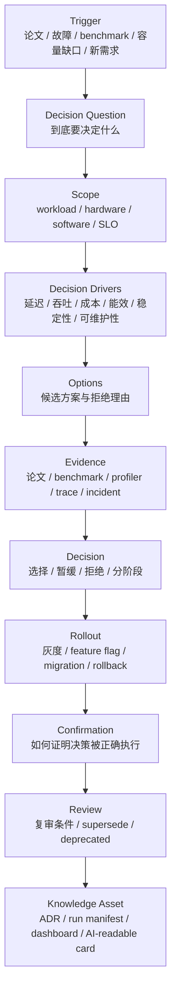

# 技术决策记录：从 Benchmark 证据到可追溯选择

AI Infra 里的很多技术选择，事后看都像“显然应该这么做”。

但在做决定的当时，通常并不显然。

例如：

- 推理引擎用 vLLM、TensorRT-LLM、SGLang，还是自研 runtime？
- KV Cache 要不要量化？
- 是否采用 Prefill/Decode 分离部署？
- 分布式训练用 DeepSpeed、Megatron-LM、PyTorch FSDP，还是组合使用？
- MoE 的 EP size 怎么选？
- 集群调度用 Slurm、Kubernetes、Ray、Volcano、Kueue，还是混合方案？
- 是否引入 FP8 训练？
- 是否为了 p99 延迟牺牲一部分吞吐？
- 是否把更多预算投入网络、HBM、NVMe、冗余容量或冷备？

这些问题不是单纯“谁更先进”，而是取决于 workload、硬件、软件栈、团队能力、风险、成本和未来演进。

如果没有技术决策记录，几个月后团队往往只记得结论：

> 当时我们选了 A。

但忘了更重要的部分：

> 当时为什么没选 B？证据是什么？适用边界是什么？什么时候需要重新评估？

技术决策记录，也就是 ADR，负责保存这部分知识。

本页关注 AI Infra 场景下的 ADR 写法。

它不是普通的软件架构 ADR 的简单搬运，而是把 AI 系统特有的 workload、benchmark、profiling、capacity、reliability、cost 和 rollback 纳入决策过程。

## 一张总图



ADR 的核心不是“写文档”。

它的核心是把技术选择变成可追溯的工程证据链：

```text
问题 -> 约束 -> 候选方案 -> 证据 -> 决策 -> 后果 -> 验证 -> 复审
```

## ADR 是什么

ADR 是 Architecture Decision Record，通常翻译为架构决策记录。

在更宽泛的工程实践里，也可以理解为 Any Decision Record：任何对系统长期演进有重要影响的决策，都应该被记录。

一个 ADR 至少回答四件事：

| 字段 | 问题 |
| --- | --- |
| Context | 当时处在什么背景下？ |
| Decision | 我们决定做什么？ |
| Consequences | 这个决定带来什么后果？ |
| Status | 这个决定现在处于什么状态？ |

对 AI Infra 来说，还必须补充三类信息：

| 字段 | 为什么必须补 |
| --- | --- |
| Workload Contract | AI 系统结论高度依赖模型、shape、batch、序列长度、并发和训练规模。 |
| Evidence | 技术选择不能只靠偏好，必须连接论文、benchmark、profiler、incident 或生产数据。 |
| Revisit Condition | 模型规模、上下文长度、硬件、runtime 和业务流量变化后，旧决策可能失效。 |

因此，一个好的 AI Infra ADR 应该让未来读者知道：

- 当时决策要解决什么问题；
- 当时有哪些候选方案；
- 为什么选择这个方案；
- 用什么证据支持；
- 放弃了什么；
- 风险是什么；
- 如何上线；
- 如何回滚；
- 未来什么条件下需要重开决策。

## 为什么 AI Infra 更需要 ADR

AI Infra 的技术选择有几个特点。

### 1. 决策成本高

选择训练框架、推理 runtime、集群调度系统、网络拓扑或 checkpoint 格式，不是改一个函数。

它会影响：

- 代码结构；
- 模型适配；
- 性能调优；
- 人员技能；
- 监控告警；
- 故障排查；
- 成本模型；
- 未来升级。

决策一旦落地，迁移成本很高。

### 2. 证据容易过期

AI 系统变化很快。

一年前的结论可能因为下面因素失效：

- 新 GPU/NPU 架构；
- 新模型结构；
- 更长上下文；
- 更高并发；
- 新 attention kernel；
- 新 runtime；
- 新 NCCL/CUDA/driver；
- 新量化格式；
- 新 benchmark trace。

ADR 必须记录“证据版本”，否则未来会误用旧结论。

### 3. 指标相互冲突

AI Infra 决策很少只优化一个指标。

常见冲突包括：

| 决策目标 | 可能牺牲 |
| --- | --- |
| 更低 TTFT | 更低吞吐、更高资源空闲 |
| 更高 GPU 利用率 | 更差 p99、更难隔离 |
| 更低显存 | 更多重算、更高延迟 |
| 更低成本 | 更低冗余、更高故障风险 |
| 更强隔离 | 更低资源利用率 |
| 更快上线 | 更高维护风险 |
| 更激进优化 | 更难 debug、更难升级 |

ADR 要把这些 trade-off 写清楚。

### 4. 需要跨角色协作

一个 AI Infra 决策可能影响：

- 模型研发；
- 训练平台；
- 推理平台；
- Kernel/Compiler；
- 集群运维；
- 硬件架构；
- Benchmark；
- SRE；
- 成本治理；
- 安全和合规。

没有决策记录，跨团队沟通会不断重复。

### 5. AI 也需要读懂决策

这个知识库要同时给人和 AI 使用。

如果 ADR 写得结构化，AI 可以回答：

- 为什么当初选这个 runtime；
- 某个优化是否仍适合当前 workload；
- 哪些决策和当前故障有关；
- 哪些 benchmark 支持某个配置；
- 哪些决策已经过期；
- 如果要改一个技术方案，需要检查哪些前置决策。

ADR 是知识库从“文章集合”变成“决策记忆”的关键部分。

## 什么决策需要 ADR

不是所有事情都要写 ADR。

ADR 应该用于“未来有人会问为什么”的决策。

### 适合写 ADR 的决策

| 类别 | 示例 |
| --- | --- |
| 推理 runtime | 选择 vLLM、TensorRT-LLM、SGLang、自研 runtime 或混合方案 |
| 调度策略 | continuous batching、priority queue、deadline-aware scheduling、admission control |
| 缓存策略 | Prefix Cache、KV Cache block size、KV quantization、cache eviction |
| 部署形态 | Prefill/Decode 分离、单机多副本、多机 TP/PP/EP、active-active |
| 训练框架 | DeepSpeed、Megatron-LM、PyTorch FSDP、JAX/XLA、混合并行策略 |
| 并行策略 | DP/FSDP、TP、PP、EP、CP/SP 的组合 |
| 数值策略 | BF16、FP16、FP8、loss scaling、optimizer、gradient clipping |
| Kernel/Compiler | 使用 Triton、CUTLASS、TorchInductor、自研 kernel 或 vendor library |
| 集群调度 | Slurm、Kubernetes、Ray、Volcano、Kueue、队列与 quota 策略 |
| 网络与存储 | RDMA/RoCE/InfiniBand、checkpoint 存储、数据缓存、模型分发 |
| 可观测性 | 指标命名、trace 关联、profile 采样、SLO、告警策略 |
| 可靠性 | checkpoint 间隔、自动重启、节点隔离、降级策略、错误预算 |
| Benchmark | 采用哪套 workload、指标口径、trace replay、回归门禁 |
| 成本与容量 | GPU 副本数、headroom、power cap、成本归因、showback/chargeback |

### 不适合写 ADR 的事情

| 类型 | 原因 |
| --- | --- |
| 临时 bug fix | 写 issue、PR 或 incident note 更合适 |
| 没有备选方案的小改动 | ADR 不是变更日志 |
| 没有长期影响的配置调整 | 可以记录在 runbook 或 config history |
| 纯粹个人偏好 | ADR 必须有问题、约束和证据 |
| 还没定义清楚的问题 | 先写 problem statement 或 RFC |

一个实用判断：

> 如果半年后新人看到这个系统，会问“为什么是这样”，那就应该考虑写 ADR。

## ADR 的生命周期

ADR 不是一次性文档。

它有状态。

| 状态 | 含义 |
| --- | --- |
| Proposed | 已提出，等待评审 |
| Accepted | 已接受，成为当前决策 |
| Rejected | 已拒绝，但保留拒绝原因 |
| Superseded | 被新的 ADR 替代 |
| Deprecated | 不再推荐，但历史系统可能仍使用 |
| Revisit Required | 触发复审条件，等待重新评估 |

建议使用不可变原则：

- Accepted 或 Rejected 后，不直接改写原决策；
- 如果新证据改变结论，创建新的 ADR；
- 新 ADR 明确 supersede 哪个旧 ADR；
- 旧 ADR 保留历史背景，避免未来重复讨论。

这种做法对 AI Infra 特别重要。

因为很多技术结论不是“错了”，而是“当时成立，现在条件变了”。

## AI Infra ADR 流程

建议用下面流程。

### 1. Trigger

先写清楚为什么现在要做决策。

触发来源可能是：

- 新 workload；
- p99 超过 SLO；
- GPU 显存不够；
- 训练 step time 过长；
- NCCL 故障频繁；
- 新论文或新 runtime 出现；
- 成本超预算；
- incident 复盘要求；
- 硬件代际切换；
- 旧方案维护成本过高。

如果没有 trigger，决策可能只是“想试试新东西”。

### 2. Decision Question

把问题写成一个可回答的问题。

不好：

```text
研究一下 vLLM。
```

好：

```text
在 32K context、p99 TTFT < 2s、p99 TPOT < 80ms 的 RAG workload 下，是否用 vLLM 替换当前推理 runtime 作为默认 serving engine？
```

不好：

```text
是否使用 FP8？
```

好：

```text
在 70B dense model 的预训练任务中，是否启用 FP8 mixed precision，以在 loss 曲线不劣化的前提下降低 step time 和显存压力？
```

问题越具体，证据越容易收集。

### 3. Scope

写清楚适用范围。

Scope 至少包括：

- 模型；
- workload；
- 输入/输出长度；
- batch 或 global batch；
- 并发；
- 硬件；
- 软件版本；
- 数据路径；
- SLO；
- 成本边界；
- 不包含的范围。

ADR 不需要对所有场景成立。

它只需要对声明范围负责。

### 4. Decision Drivers

Drivers 是决策依据。

AI Infra 常见 drivers：

- p99 TTFT；
- p99 TPOT；
- throughput；
- goodput at SLO；
- GPU memory headroom；
- GPU utilization；
- MFU；
- step time；
- checkpoint freshness；
- recovery time；
- cost per token；
- cost per training token；
- energy per token；
- reliability；
- isolation；
- maintainability；
- portability；
- team learning cost。

建议明确 primary driver 和 guardrail drivers。

例如：

```yaml
primary_driver: "goodput at p99 TTFT/TPOT SLO"
guardrails:
  - "error rate must not increase"
  - "cost per output token must not increase by more than 10%"
  - "rollback must be possible within one release window"
```

没有 primary driver 的决策，很容易变成各说各话。

### 5. Options

至少写两个候选方案。

如果只有一个方案，也要写“继续使用现状”作为 baseline。

```yaml
options:
  - id: A
    name: "keep current runtime"
  - id: B
    name: "adopt vLLM"
  - id: C
    name: "adopt TensorRT-LLM for NVIDIA-only high-throughput pool"
  - id: D
    name: "keep current runtime but introduce prefix cache"
```

候选方案要有可比较边界。

不要把成熟产品、论文 idea、未验证自研方案直接放在同一层比较而不说明成熟度。

### 6. Evidence

证据分层。

| 等级 | 证据 | 可信度 |
| --- | --- | --- |
| E0 | 观点、经验、博客、口头判断 | 只能用于提出假设 |
| E1 | 论文或官方文档 | 可解释机制，但不能直接证明适合本系统 |
| E2 | 小规模本地实验 | 可验证方向，但不能覆盖生产复杂性 |
| E3 | 可复现 benchmark + raw data + manifest | 可支持工程判断 |
| E4 | production trace replay / shadow / canary | 可支持上线决策 |
| E5 | 线上长期运行 + SLO/incident/cost 数据 | 可支持默认方案和长期治理 |

ADR 不要求一开始就有 E5。

但必须写清当前证据等级和缺口。

### 7. Decision

决策要写成清晰句子。

例如：

```text
我们决定在长上下文 RAG 推理池中采用 vLLM 作为默认 runtime，
适用范围为 7B/14B dense model、最大 32K context、NVIDIA H100 pool。
短上下文低延迟池和多模态 serving 暂不迁移。
```

或者：

```text
我们暂不采用 FP8 训练作为默认配置。
原因是当前 L2 benchmark 显示 step time 有收益，但 loss spike 和 checkpoint/resume 路径还没有完成验证。
```

“暂不采用”也是决策。

### 8. Consequences

后果要写完整，不只写好处。

包括：

- 正面影响；
- 负面影响；
- 中性影响；
- 新的运维负担；
- 新的监控需求；
- 对后续决策的约束；
- 对团队能力的要求；
- 对成本模型的影响。

### 9. Rollout and Rollback

AI Infra 决策必须写上线和回滚。

至少回答：

- 如何灰度；
- 如何关闭；
- 是否需要 downtime；
- 是否需要重启 job；
- 是否影响 checkpoint；
- 是否影响模型 artifact；
- 是否影响客户端协议；
- 是否有双写或 shadow；
- 回滚后数据是否兼容；
- 回滚成功如何确认。

如果无法回滚，必须写清楚不可逆点。

### 10. Confirmation

Confirmation 是“如何证明决策被正确执行”。

例如：

- CI benchmark 门禁；
- dashboard；
- SLO burn rate；
- profiler trace；
- config lint；
- deployment policy；
- code review checklist；
- runbook；
- incident drill；
- weekly capacity report。

没有 confirmation 的 ADR 很容易停留在文档层。

### 11. Revisit Condition

写清楚什么时候重开决策。

例如：

- 上下文长度从 32K 提升到 128K；
- H100 pool 迁移到 B200/MI300/自研 NPU；
- p99 SLO 改变；
- 模型从 dense 变成 MoE；
- output token 分布显著变化；
- 新 runtime 发布关键能力；
- incident 超过阈值；
- 成本每月超过预算；
- benchmark 回归超过 10%；
- 团队维护成本不可接受。

ADR 不追求永久正确。

它追求“当前正确，并知道何时可能不再正确”。

## ADR 模板

下面是适合 AI Infra 的模板。

```markdown
---
title: ADR-0001 使用 vLLM 作为长上下文推理 runtime
status: proposed
date: 2026-06-12
decision_owner: inference-platform
decision_makers:
  - inference-platform
consulted:
  - benchmark
  - sre
  - model-serving
  - cluster-platform
informed:
  - downstream-app-teams
supersedes: []
related:
  - "benchmark-run-2026-06-12-vllm-long-context"
  - "incident-2026-05-xx-ttft-slo-burn"
---

# ADR-0001 使用 vLLM 作为长上下文推理 runtime

## Status

Proposed / Accepted / Rejected / Superseded / Deprecated / Revisit Required

## Context

当前系统遇到什么问题？
为什么现在必须做决策？
如果不做决策，会发生什么？

## Decision Question

用一个可验证的问题描述本次决策。

## Scope

### In Scope

- workload:
- model:
- hardware:
- software:
- traffic:
- SLO:

### Out of Scope

- 不覆盖的模型、场景、硬件或团队。

## Decision Drivers

### Primary Driver

- 本次决策最优先优化的目标。

### Guardrails

- 不能恶化的指标。
- 必须满足的可靠性、成本或维护约束。

## Considered Options

| Option | 描述 | 成熟度 | 主要风险 |
| --- | --- | --- | --- |
| A | 维持现状 | production | 性能瓶颈持续 |
| B | 采用候选方案 | benchmarked | 迁移复杂 |
| C | 自研或混合方案 | prototype | 维护成本高 |

## Evidence

### Papers / Docs

- 相关论文、官方文档、设计说明。

### Benchmark Evidence

- run id:
- workload:
- hardware:
- baseline:
- primary metrics:
- raw data:
- profiler:

### Production Evidence

- trace:
- incident:
- SLO:
- cost:

### Evidence Gaps

- 还缺哪些验证。

## Decision

我们决定做什么？
适用于哪些范围？
哪些范围暂不采用？

## Consequences

### Positive

- 正面后果。

### Negative

- 负面后果。

### Neutral / Operational

- 中性变化、运维负担、文档和培训要求。

## Rollout Plan

- 阶段 1:
- 阶段 2:
- 阶段 3:

## Rollback Plan

- 回滚触发条件:
- 回滚步骤:
- 回滚验证:
- 不可逆点:

## Confirmation

- 如何确认系统遵守该决策。
- 如何监控决策效果。
- 哪些测试或 benchmark 作为门禁。

## Revisit Conditions

- 哪些条件发生时必须重开决策。

## Links

- benchmark report:
- dashboard:
- runbook:
- PR:
- related ADRs:
```

模板不需要每次都填到很长。

但核心字段不能缺：

- context；
- question；
- scope；
- options；
- evidence；
- decision；
- consequences；
- rollback；
- revisit。

## 示例一：推理 runtime 选择

```yaml
title: "ADR-0007 长上下文 RAG 推理池采用 vLLM"
status: accepted
decision_question: "是否在长上下文 RAG 推理池中用 vLLM 替换当前 runtime?"
scope:
  workload: "RAG chat, input p50=8K, p95=28K, output p95=1K"
  model: "dense decoder-only 7B/14B"
  hardware: "H100 80GB, single-node serving"
  slo:
    ttft_p99: "< 2s"
    tpot_p99: "< 80ms"
primary_driver: "goodput at SLO"
guardrails:
  - "error rate 不升高"
  - "cost/output token 不升高超过 10%"
  - "rollback within 30 minutes"
options:
  A: "保持当前 runtime"
  B: "vLLM"
  C: "TensorRT-LLM"
  D: "当前 runtime + prefix cache"
evidence:
  level: "E3"
  benchmark: "trace replay with 7-day sampled request lengths"
  finding: "vLLM 在长上下文下 goodput 更高，TTFT p99 满足 SLO"
decision: "在长上下文 RAG 推理池采用 vLLM；短上下文低延迟池暂不迁移。"
revisit:
  - "模型升级到 MoE"
  - "context length 提升到 128K"
  - "p99 TTFT 连续两周 burn rate 超过阈值"
```

这个 ADR 的关键不是“vLLM 更好”，而是：

- 在什么 workload 下更好；
- 和谁比；
- 用什么指标；
- 哪些池子不迁移；
- 什么时候重新评估。

## 示例二：KV Cache 量化

```yaml
title: "ADR-0012 在特定长上下文推理池启用 KV Cache FP8 量化"
status: proposed
decision_question: "是否启用 KV Cache FP8 量化以提升长上下文并发?"
scope:
  model: "14B dense chat model"
  context: "32K to 64K"
  hardware: "H100"
primary_driver: "concurrency under memory pressure"
guardrails:
  - "quality regression within accepted threshold"
  - "p99 TPOT 不恶化超过 5%"
  - "fallback to non-quantized KV"
options:
  A: "不量化 KV Cache"
  B: "FP8 KV Cache"
  C: "INT8 KV Cache"
  D: "缩短 max context / admission control"
evidence:
  level: "E2"
  gaps:
    - "缺真实 trace replay"
    - "缺多轮对话质量评估"
    - "缺回滚演练"
decision: "暂不作为默认配置；先在 shadow workload 做 E3 benchmark。"
```

这里“暂不默认启用”是合理决策。

因为量化会影响质量和数值路径，不能只看显存收益。

## 示例三：训练框架选择

```yaml
title: "ADR-0020 70B 预训练采用 Megatron-LM + FSDP 混合方案"
status: accepted
decision_question: "70B dense model 预训练使用哪套分布式训练栈?"
scope:
  model: "70B dense decoder-only"
  sequence_length: "8K"
  cluster: "256 H100, 8 GPU per node"
  target: "稳定训练到指定 token budget"
primary_driver: "tokens/s/GPU with acceptable stability"
guardrails:
  - "checkpoint resume success"
  - "loss curve no regression"
  - "operator/team can debug NCCL and rank failures"
options:
  A: "DeepSpeed ZeRO"
  B: "Megatron-LM TP/PP + Distributed Optimizer"
  C: "PyTorch FSDP"
  D: "Megatron-LM + FSDP hybrid"
evidence:
  level: "E3"
  benchmark:
    - "weak scaling step time"
    - "checkpoint save/load"
    - "failure injection restart"
decision: "采用 Megatron-LM + FSDP hybrid；保留 DeepSpeed ZeRO 作为小规模 fine-tune 默认方案。"
revisit:
  - "world size > 1024"
  - "MoE architecture adopted"
  - "checkpoint time > budget"
```

训练框架 ADR 必须包含 checkpoint、resume 和故障处理。

只看 tokens/s 不够。

## 示例四：集群调度系统

```yaml
title: "ADR-0031 训练集群采用 Slurm，推理与 Notebook 采用 Kubernetes"
status: accepted
decision_question: "混合集群是否统一使用 Kubernetes，还是按 workload 分调度系统?"
scope:
  workloads:
    - "large-scale pretraining"
    - "online inference"
    - "notebook"
    - "batch preprocessing"
primary_driver: "workload fit and operational reliability"
guardrails:
  - "queue fairness"
  - "topology-aware placement"
  - "multi-tenant isolation"
  - "operator skill availability"
options:
  A: "全部 Kubernetes"
  B: "全部 Slurm"
  C: "训练 Slurm，推理/Notebook Kubernetes"
  D: "Ray 统一抽象上层调度"
evidence:
  level: "E3"
  benchmark:
    - "gang scheduling success rate"
    - "pending reason distribution"
    - "GPU fragmentation"
    - "failure recovery"
decision: "训练主池使用 Slurm；在线推理、Notebook 和服务型 workload 使用 Kubernetes；通过统一 quota 和成本系统做跨池治理。"
```

这类 ADR 的后果比性能更复杂。

它会影响组织边界、运维职责、资源归因和故障排查。

## Evidence Pack

每个重要 ADR 应该附 evidence pack。

最小 evidence pack：

```yaml
evidence_pack:
  decision_id: "ADR-0007"
  benchmark_runs:
    - run_id: "bench-2026-06-12-001"
      report: "docs/benchmarks/..."
      raw_data: "s3://..."
      manifest: "..."
  profiler_traces:
    - "nsys-..."
    - "torch-profiler-..."
  production_signals:
    - dashboard: "..."
    - slo_report: "..."
  incidents:
    - "incident-2026-05-..."
  papers:
    - "PagedAttention"
  related_docs:
    - "03-inference-systems/paged-attention.md"
    - "08-benchmark-capacity/inference-capacity-modeling.md"
```

Evidence pack 的原则：

- 结论必须可追溯到数据；
- 图表必须可追溯到 raw data；
- raw data 必须可追溯到 run manifest；
- run manifest 必须可追溯到代码、配置、环境和硬件。

## Decision Readiness

不是所有 ADR 都应该立刻进入评审。

建议定义 decision readiness。

一个 AI Infra ADR 进入评审前，至少满足：

- [ ] decision question 清晰；
- [ ] scope 明确；
- [ ] primary driver 明确；
- [ ] guardrail metrics 明确；
- [ ] 至少两个候选方案；
- [ ] baseline 明确；
- [ ] 证据等级标注；
- [ ] evidence gaps 写清楚；
- [ ] rollout 和 rollback 有草案；
- [ ] 复审条件有草案；
- [ ] 相关团队已 consulted。

如果这些条件不满足，评审会退化成观点辩论。

## Decision Done

Accepted 不等于 Done。

一个 ADR 真正完成，需要：

- 决策已接受；
- owner 明确；
- 实施计划已建立；
- benchmark 或测试门禁已落地；
- dashboard 或监控已落地；
- runbook 已更新；
- rollback 已演练或至少可执行；
- 相关配置或代码已链接；
- 旧 ADR 已标记 superseded；
- revisit 条件已进入跟踪系统。

ADR 不是把想法写进 Markdown 就结束。

它应该推动系统状态改变。

## ADR Review

评审 ADR 时，不要只问“同不同意结论”。

应该问下面问题。

### 问题是否清楚

- 决策问题是否可回答？
- 是否混入多个独立决策？
- 是否把实现细节当成问题本身？

### 范围是否清楚

- 适用 workload 是否明确？
- 不适用范围是否明确？
- 模型、硬件、软件和 SLO 是否明确？

### 证据是否足够

- 当前证据等级是多少？
- benchmark 是否可复现？
- baseline 是否公平？
- raw data 是否可追溯？
- 是否缺关键 guardrail？
- 是否只验证了 happy path？

### 后果是否完整

- 是否写了负面后果？
- 是否写了运维负担？
- 是否写了对其他团队的影响？
- 是否写了未来约束？

### 上线是否安全

- 是否能灰度？
- 是否能回滚？
- 是否有监控？
- 是否有 SLO 或 error budget 策略？
- 是否需要 runbook？

### 复审是否明确

- 什么条件下这个决策失效？
- 谁负责复审？
- 如何发现复审条件被触发？

## ADR 与 Benchmark 的关系

ADR 不等于 benchmark 报告。

两者关系如下：

| 文档 | 作用 |
| --- | --- |
| Benchmark Report | 记录实验设计、数据和结果 |
| Profiler Report | 解释瓶颈证据 |
| Capacity Model | 推导资源需求和 headroom |
| Incident Report | 记录故障和改进项 |
| ADR | 基于上述证据做出选择，并记录取舍 |

ADR 应引用 benchmark，而不是复制所有 benchmark 数据。

一个常见结构：

```text
ADR: 采用某方案
  -> Benchmark Report: 为什么性能满足要求
  -> Profiler Report: 为什么瓶颈被改善
  -> Capacity Model: 为什么资源规模合理
  -> Incident Report: 为什么可靠性风险可接受
  -> Runbook: 上线后如何运维
```

这样文档不会互相混淆。

## ADR 与论文复现的关系

上一篇讲论文复现。

论文复现可以成为 ADR 的 evidence，但不能替代 ADR。

原因是论文回答：

> 方法在论文环境里是否有效？

ADR 回答：

> 在我们的 workload、硬件、软件、团队和风险约束下，是否应该采用？

两者之间还需要迁移验证。

迁移验证要看：

- 模型是否相似；
- shape 是否相似；
- 硬件是否相似；
- runtime 是否相似；
- 指标口径是否相似；
- 失败模式是否可接受；
- 维护成本是否可接受。

## ADR 与 SLO / Error Budget 的关系

可靠性相关决策要连接 SLO 和 error budget。

例如：

- 是否为了更低成本降低冗余；
- 是否为了更高吞吐提高 GPU 利用率；
- 是否为了更快发布放松回归门禁；
- 是否为了更低延迟预留更多 headroom；
- 是否启用自动降级策略；
- 是否把某类故障从 page 改为 ticket。

这些决策本质上是在分配风险。

因此 ADR 应写清：

- 影响哪个 SLI；
- 是否改变 SLO；
- 是否消耗 error budget；
- 是否需要告警策略变化；
- 是否需要 incident runbook；
- 是否影响发布冻结策略。

## ADR 与成本模型的关系

AI Infra 决策常常有显著成本影响。

成本字段至少写：

- cost/request；
- cost/input token；
- cost/output token；
- cost/training token；
- cost/successful run；
- GPU hour；
- energy per token；
- headroom；
- failure/retry/checkpoint/eval 成本；
- 人力维护成本；
- 迁移成本；
- 供应商锁定成本。

例如：

```yaml
cost_impact:
  expected:
    cost_per_output_token: "-18%"
    gpu_hours_per_day: "-12%"
  added_cost:
    engineering_migration: "2 person-months"
    new_monitoring: "required"
    rollback_capacity: "keep old pool for 2 weeks"
  caveat:
    - "does not include future model migration cost"
```

成本不是唯一目标，但不能缺席。

## AI-readable ADR Card

为了让 AI 能准确使用 ADR，建议在每篇 ADR 中加入结构化 card。

```yaml
adr_card:
  id: "ADR-0007"
  title: "Adopt vLLM for long-context RAG serving"
  status: "accepted"
  domain: "inference-serving"
  decision:
    chosen: "vLLM"
    rejected:
      - "current-runtime"
      - "TensorRT-LLM for this pool"
  applies_to:
    workload:
      - "long-context RAG"
    model:
      - "7B dense"
      - "14B dense"
    hardware:
      - "H100"
  does_not_apply_to:
    - "short-context low-latency serving"
    - "MoE model serving"
  primary_driver: "goodput at TTFT/TPOT SLO"
  evidence_level: "E3"
  benchmark_refs:
    - "bench-2026-06-12-001"
  risk:
    - "runtime migration complexity"
    - "kernel/version compatibility"
  rollback:
    possible: true
    max_time: "30 minutes"
  revisit_when:
    - "context length >= 128K"
    - "model architecture changes to MoE"
    - "p99 TTFT SLO burns for 2 consecutive weeks"
```

AI 使用 ADR 时，应优先读取这些字段，再读取正文。

## ADR 文件组织

建议按领域组织，而不是把所有 ADR 扔在一个目录。

示例：

```text
docs/10-papers-cases/decisions/
  inference/
    ADR-0001-adopt-vllm-long-context-serving.md
    ADR-0002-enable-prefix-cache-for-shared-system-prompts.md
  training/
    ADR-0101-use-megatron-fsdp-for-70b-pretraining.md
    ADR-0102-checkpoint-format-and-retention-policy.md
  cluster/
    ADR-0201-slurm-for-training-kubernetes-for-serving.md
    ADR-0202-rdma-roce-configuration-baseline.md
  benchmark/
    ADR-0301-standard-inference-trace-replay-workload.md
```

也可以统一放在一个目录，通过 front matter 的 `domain` 字段分类。

关键是可检索、可链接、可 supersede。

## 常见误区

### 误区一：把 ADR 写成会议纪要

会议纪要记录讨论过程。

ADR 记录决策及其理由。

ADR 不需要完整复述谁说了什么，但需要保留影响决策的证据和取舍。

### 误区二：只写最终方案，不写拒绝原因

拒绝原因很重要。

未来团队看到旧方案时，最容易重复问：

> 当时为什么不用 B？

如果 ADR 没写拒绝原因，讨论会反复发生。

### 误区三：证据只写结论，不写来源

不好：

```text
Benchmark 显示 B 更快。
```

好：

```text
bench-2026-06-12-001 在 H100、32K context、RAG trace replay 下显示 B 的 goodput at SLO 比 A 高 38%，raw data 和 manifest 见链接。
```

### 误区四：把适用范围写得过大

“采用某 runtime 作为统一推理平台”通常太大。

更好的写法是：

- 对哪些模型；
- 对哪些流量；
- 对哪些硬件；
- 对哪些 SLO；
- 对哪些团队；
- 哪些暂不适用。

### 误区五：没有 rollback

AI Infra 变更影响大。

如果没有 rollback，就要明确写：

- 为什么不可回滚；
- 不可逆点是什么；
- 如何降低风险；
- 是否需要更高等级审批；
- 是否需要更长 shadow/canary。

### 误区六：Accepted 后再偷偷改

这会破坏历史。

如果结论变了，应写新 ADR supersede 旧 ADR。

旧 ADR 的价值是记录当时为什么那样选。

### 误区七：没有复审条件

AI 系统变化太快。

没有 revisit condition 的 ADR 很容易变成“历史包袱”。

### 误区八：ADR 过长但没有结论

ADR 不是论文。

正文可以解释背景，但必须让读者很快看到：

- 决策是什么；
- 为什么；
- 适用范围；
- 风险；
- 如何验证；
- 什么时候重审。

## 检查清单

写完 ADR 后，逐项检查。

### 问题

- [ ] 决策问题是否用一句话说清？
- [ ] 是否真的需要 ADR，而不是 issue、PR、runbook 或 incident note？
- [ ] 是否拆分了多个独立决策？

### 范围

- [ ] 是否写清 workload？
- [ ] 是否写清模型、shape、batch、并发或 world size？
- [ ] 是否写清硬件和软件版本？
- [ ] 是否写清适用和不适用范围？

### 指标

- [ ] 是否有 primary driver？
- [ ] 是否有 guardrail metrics？
- [ ] 是否涉及 SLO、error budget 或成本？
- [ ] 指标口径是否明确？

### 方案

- [ ] 是否至少有两个候选方案？
- [ ] 是否包含“保持现状”作为 baseline？
- [ ] 是否写了拒绝原因？
- [ ] 是否说明方案成熟度？

### 证据

- [ ] 是否标注 evidence level？
- [ ] 是否链接 benchmark report？
- [ ] 是否保留 raw data 和 run manifest？
- [ ] 是否有 profiler、trace、incident 或生产信号？
- [ ] 是否写了 evidence gaps？

### 决策

- [ ] 决策句子是否清晰？
- [ ] 是否写清分阶段采用或暂不采用范围？
- [ ] 是否写了正面和负面后果？
- [ ] 是否写了对其他团队的影响？

### 上线与回滚

- [ ] 是否有 rollout plan？
- [ ] 是否有 rollback plan？
- [ ] 是否有监控和告警？
- [ ] 是否需要 runbook？
- [ ] 是否定义了回滚成功条件？

### 后续

- [ ] 是否有 confirmation？
- [ ] 是否有 revisit condition？
- [ ] 是否指定 owner？
- [ ] 是否链接相关 ADR、论文、benchmark、incident 和 dashboard？
- [ ] 是否包含 AI-readable ADR card？

## 小结

技术决策记录的价值不是“多写一份文档”，而是保存工程判断。

在 AI Infra 中，判断必须建立在具体 workload、指标、硬件、软件、benchmark、风险和成本上。

好的 ADR 应该让未来的人和 AI 都能回答：

- 当时为什么做这个决定；
- 它解决什么问题；
- 它适用于什么范围；
- 它依赖什么证据；
- 它拒绝了哪些方案；
- 它带来什么后果；
- 它如何上线和回滚；
- 它什么时候需要被重新评估。

如果一个团队能持续写好 ADR，很多技术知识就不会停留在会议、聊天记录和个别专家记忆里，而会变成可检索、可复用、可审查的系统资产。

## 参考资料

- [Documenting Architecture Decisions](https://cognitect.com/blog/2011/11/15/documenting-architecture-decisions)
- [Architectural Decision Records](https://adr.github.io/)
- [Markdown Architectural Decision Records](https://adr.github.io/madr/)
- [AWS Prescriptive Guidance: Using architectural decision records](https://docs.aws.amazon.com/prescriptive-guidance/latest/architectural-decision-records/welcome.html)
- [AWS Prescriptive Guidance: ADR process](https://docs.aws.amazon.com/prescriptive-guidance/latest/architectural-decision-records/adr-process.html)
- [Kubernetes Enhancement Proposal Template](https://github.com/kubernetes/enhancements/blob/master/keps/NNNN-kep-template/README.md)
- [Google SRE: Embracing Risk](https://sre.google/sre-book/embracing-risk/)
