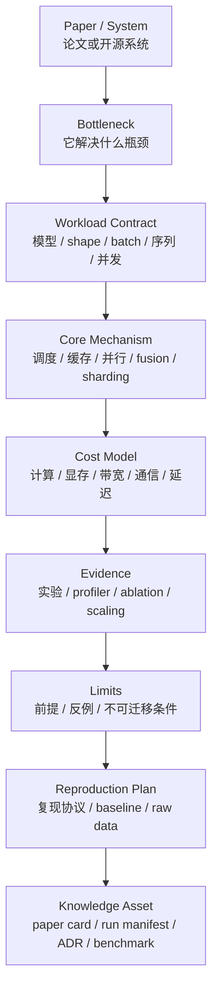

# AI 系统论文与架构：从论文贡献到可复现实验

AI 系统论文读起来经常很“硬”。

同一篇论文里可能同时出现模型结构、CUDA Kernel、runtime 调度、分布式通信、集群拓扑、benchmark 和系统实现。刚入门时，很容易只记住一个结论：

- FlashAttention 很快。
- vLLM 用了 PagedAttention。
- ZeRO 省显存。
- Megatron-LM 做张量并行。
- Switch Transformer 是 MoE。

这些结论没有错，但不够。

对 AI Systems / AI Infra 方向来说，读论文的目标不是背术语，而是回答：

> 这篇论文到底解决了哪个系统瓶颈？它靠什么机制成立？它依赖什么 workload、硬件和软件前提？它的实验能不能复现？它的结论能不能迁移到我们的系统里？

本页给出一个统一的论文分析框架。

它适用于：

- 推理 serving 论文；
- 训练并行论文；
- attention/kernel/compiler 论文；
- MoE 和稀疏计算论文；
- AI 加速器与互连论文；
- benchmark、profiling 和容量建模论文；
- 开源系统架构分析；
- 内部技术决策和复现实验沉淀。

## 一张总图



一篇系统论文读完后，应该留下的不是“论文摘要”，而是一组可复用资产：

- paper card：论文解决什么问题、方法是什么、适用边界是什么；
- mechanism card：核心机制如何在系统里工作；
- experiment card：实验如何复现，数据如何记录；
- decision note：这个方法是否值得采用，采用条件是什么；
- follow-up list：哪些问题需要进一步验证。

## 什么是 AI 系统论文

AI 系统论文关注的不是“模型是否更聪明”，而是“AI workload 如何被更高效、更稳定、更可扩展地执行”。

它通常回答下面几类问题。

| 问题类型 | 典型方向 | 例子 |
| --- | --- | --- |
| 计算更快 | kernel、compiler、operator fusion、tiling | FlashAttention、Triton、TorchInductor |
| 显存更省 | KV Cache、activation、optimizer state、parameter sharding | PagedAttention、ZeRO、FSDP |
| 通信更少 | tensor parallel、pipeline parallel、expert parallel、collective 优化 | Megatron-LM、GShard、Switch Transformer |
| 调度更好 | batching、admission control、prefill/decode 分离、cluster scheduling | vLLM、Orca 类 serving、AI cluster scheduler |
| 更可扩展 | automatic sharding、distributed runtime、elastic training | Alpa、GShard、DeepSpeed |
| 更稳定 | checkpoint、fault tolerance、observability、SLO | training fault tolerance、incident systems |
| 更可度量 | benchmark、profiler、capacity model、cost model | MLPerf、Roofline、trace replay |

这些论文的共同点是：它们都必须落到系统对象上。

系统对象包括：

- request；
- token；
- sequence；
- batch；
- KV block；
- activation；
- gradient；
- parameter shard；
- optimizer state；
- expert；
- rank；
- process group；
- GPU；
- node；
- NIC；
- storage object；
- trace；
- benchmark run。

如果读论文时没有看清这些对象，就很难真正理解论文贡献。

## 读论文的核心问题

读 AI 系统论文时，先不要急着看公式和实现细节。

先回答 8 个问题。

| 问题 | 为什么重要 |
| --- | --- |
| 1. 它优化哪个 workload？ | 同一个方法在训练、推理、短上下文、长上下文、多模态、MoE 上可能完全不同。 |
| 2. 它解决哪个瓶颈？ | 计算、显存、内存带宽、网络、调度、可靠性不是一类问题。 |
| 3. 它改变了哪个系统对象？ | 例如 KV Cache layout、attention tile、gradient shard、expert routing。 |
| 4. 它为什么成立？ | 需要用成本模型解释，而不只是说“效果更好”。 |
| 5. 它引入了什么代价？ | 很多方法省显存但增计算，降延迟但增复杂度，提吞吐但伤尾延迟。 |
| 6. 它的 baseline 是否公平？ | baseline 配置、版本、batch、shape、硬件和调优程度会决定结论。 |
| 7. 它在哪些条件下失效？ | 系统论文的边界往往比贡献更有价值。 |
| 8. 如何把它复现成实验？ | 不能复现的结论很难进入技术决策。 |

这 8 个问题构成了论文笔记的骨架。

## 七层阅读框架

AI 系统论文可以按七层拆解。

| 层级 | 关注对象 | 典型问题 |
| --- | --- | --- |
| Workload | 模型、shape、batch、序列长度、并发、trace | 实验 workload 是否代表真实场景？ |
| Algorithm Semantics | attention、MoE、optimizer、loss、decode | 方法是否改变数学语义？是否 exact？ |
| Runtime | scheduler、executor、memory manager、process group | 状态如何管理？请求或 step 如何流动？ |
| Kernel / Compiler | tiling、fusion、layout、codegen、autotune | 快在哪里？瓶颈从哪里转移到哪里？ |
| Memory / Communication | HBM、SRAM、KV Cache、activation、AllReduce、AllToAll | 节省了哪些 bytes？增加了哪些通信？ |
| Hardware / Cluster | GPU、TPU、NIC、NVLink、RDMA、node topology | 结论是否依赖特定硬件或拓扑？ |
| Measurement | latency、throughput、MFU、memory、cost、energy、tail | 指标是否能支持论文声称？ |

一篇论文不一定覆盖全部七层，但至少要知道它主要工作在哪几层。

例如：

- FlashAttention 主要在 Algorithm Semantics、Kernel / Compiler、Memory 层；
- PagedAttention / vLLM 主要在 Runtime、Memory、Measurement 层；
- Megatron-LM 主要在 Runtime、Communication、Hardware / Cluster 层；
- ZeRO 主要在 Memory、Communication、Runtime 层；
- GShard 和 Alpa 主要在 Runtime、Compiler、Cluster 层；
- Switch Transformer 横跨 Algorithm Semantics、Runtime、Communication 和 Training Stability。

## 第一遍：30 分钟建立结构

第一遍阅读不追细节，只建立结构。

建议按下面顺序读：

1. 标题和摘要：判断论文属于哪类系统问题。
2. Introduction：找出作者声称的瓶颈。
3. Motivation / Background：确认旧方法为什么不够。
4. System Overview：画出系统对象和数据流。
5. Evaluation 开头：看实验 workload、硬件、baseline 和指标。
6. Conclusion / Limitations：找适用边界。

第一遍只产出一个简短 card。

```yaml
paper: "Efficient Memory Management for Large Language Model Serving with PagedAttention"
year: 2023
layer:
  - inference-runtime
  - memory-management
workload:
  model: "autoregressive LLM"
  phase: "serving"
  key_state: "KV Cache"
bottleneck: "KV Cache 动态增长导致显存碎片和 batch size 受限"
mechanism: "把 KV Cache 切成 block，用 block table 管理逻辑块到物理块的映射"
primary_metric:
  - throughput
  - latency
  - memory utilization
questions:
  - "block size 如何影响 kernel efficiency 和 fragmentation?"
  - "prefix sharing、beam search 和普通 serving 的收益是否一样?"
  - "在不同 attention kernel 和硬件上是否仍然成立?"
```

第一遍的目标是“知道该从哪里下钻”。

## 第二遍：拆机制

第二遍要拆清楚核心机制。

建议强制写出下面 6 件事。

### 1. 输入对象

方法处理什么输入？

可能是：

- token sequence；
- prompt prefix；
- Q/K/V tensor；
- hidden state；
- gradient bucket；
- parameter shard；
- expert tokens；
- checkpoint shard；
- request trace；
- job queue。

不同输入对象决定系统边界。

例如 FlashAttention 的输入是 attention 计算中的 Q/K/V tensor 和 mask；PagedAttention 的输入不是一个新的模型结构，而是 serving runtime 中不断增长的 KV Cache；ZeRO 处理的是训练时被 data parallel 重复保存的 optimizer state、gradient 和 parameter。

### 2. 状态对象

系统方法通常不是只做一次计算，而是维护状态。

常见状态包括：

- KV block table；
- scheduler queue；
- CUDA graph cache；
- communication group；
- optimizer partition；
- activation checkpoint boundary；
- routing table；
- expert load statistics；
- checkpoint manifest；
- profiling trace。

状态对象决定实现复杂度，也决定故障模式。

### 3. 关键路径

系统论文一定要看 critical path。

推理系统的关键路径可能是：

```text
request admission -> prefill scheduling -> GPU execution -> KV allocation -> decode loop -> streaming output
```

训练系统的关键路径可能是：

```text
data loading -> forward -> loss -> backward -> gradient communication -> optimizer step -> checkpoint
```

Kernel 论文的关键路径可能是：

```text
load from HBM -> tile in SRAM -> compute -> online reduction -> write output
```

如果论文只优化关键路径之外的部分，端到端收益可能很小。

### 4. 成本模型

至少写出它减少了什么、增加了什么。

| 成本项 | 典型问题 |
| --- | --- |
| FLOPs | 计算量是否变化？是否只是更好利用硬件？ |
| HBM bytes | 读写主存次数是否下降？中间结果是否减少？ |
| SRAM / shared memory | tile 是否适配片上存储？ |
| GPU memory capacity | 参数、KV、activation、optimizer state 是否减少？ |
| Network bytes | AllReduce、AllGather、ReduceScatter、AllToAll 是否变化？ |
| Synchronization | 是否增加 barrier、launch、等待和依赖？ |
| Scheduler overhead | 是否增加复杂状态管理？ |
| Engineering complexity | 是否要求重写 kernel、修改 runtime 或绑定硬件？ |

一个好的系统论文贡献，通常可以用成本转移解释：

- 用更多计算换更少显存；
- 用更复杂 runtime 换更高 batch；
- 用通信换单卡显存；
- 用离线 profiling 换线上调度效率；
- 用编译时间换执行时间；
- 用近似或低精度换吞吐与成本。

### 5. 正确性边界

读系统论文时要分清：

- 是否改变模型数学结果；
- 是否只是改变执行顺序；
- 是否使用近似；
- 是否依赖低精度；
- 是否引入 non-determinism；
- 是否影响训练收敛；
- 是否影响生成质量；
- 是否只保证统计意义上的接近。

例如 FlashAttention 是 exact attention 的 IO-aware 实现，核心价值在于不改变 attention 语义的前提下降低 HBM 访问；量化、稀疏、speculative decoding、MoE routing 则可能需要额外验证质量或收敛影响。

### 6. 系统边界

问清楚论文没有解决什么。

常见边界：

- 只在某类 GPU 上验证；
- 只支持固定 shape；
- 只支持特定模型结构；
- 只测离线 throughput，没有测 tail latency；
- 只测单租户，没有测多租户；
- 只测短时间 benchmark，没有测长时间稳定性；
- 没有包含数据加载、tokenizer、network、checkpoint；
- 没有开源代码；
- 代码版本已经和论文不同。

论文边界不是缺点列表，而是复现计划的输入。

## 代表性论文如何拆

下面不是完整综述，而是示范如何把论文放进同一张系统地图。

| 论文 / 系统 | 主要瓶颈 | 核心机制 | 复现时重点看什么 |
| --- | --- | --- | --- |
| FlashAttention | 标准 attention 中间矩阵和 HBM 读写开销 | 用 tiling 和 online softmax 在片上存储中分块计算 exact attention | seq length、head dim、dtype、mask、forward/backward、端到端收益 |
| PagedAttention / vLLM | LLM serving 中 KV Cache 动态增长造成显存碎片和冗余 | block-based KV Cache 管理、block table、cache sharing | 长上下文、parallel sampling、beam search、prefix reuse、latency-throughput 曲线 |
| Megatron-LM | 大 Transformer 单卡放不下或计算效率低 | intra-layer model parallel，把矩阵和 attention head 切到多 GPU | TP 通信量、rank mapping、scaling efficiency、模型结构限制 |
| ZeRO | Data Parallel 中参数、梯度、optimizer state 重复保存 | 对 optimizer state、gradient、parameter 分阶段切分 | 显存账、通信量、offload、checkpoint、可用 batch |
| GShard | 巨型稀疏模型难以手工 sharding | annotation + compiler sharding，结合 MoE 条件计算 | sharding 规则、TPU 拓扑、load balance、all-to-all |
| Switch Transformer | MoE routing 复杂、通信和训练稳定性问题 | 简化 top-1 routing，降低 routing 复杂度 | expert load、capacity factor、drop token、bfloat16 稳定性 |
| Alpa | 手工组合 DP/TP/PP 等并行策略复杂 | 自动搜索 inter-operator 与 intra-operator parallel plan | search space、cost model、runtime overhead、异构模型泛化 |

这张表可以帮助新同学建立一个直觉：

系统论文不是孤立技巧。

它们都在回答同一个问题：

> 给定某个 AI workload，系统如何重新安排计算、状态、内存、通信和调度，让同样的硬件产出更多有效工作？

## 从贡献到架构图

系统论文里的架构图通常有三类。

### 1. Data Plane 图

Data Plane 图描述数据怎么流。

例如：

- token 如何进入 serving engine；
- request 如何进入 scheduler；
- KV Cache 如何分配；
- Q/K/V 如何被 kernel 读取；
- gradient 如何在 ranks 间同步；
- expert token 如何 dispatch/combine。

读 Data Plane 图时，要标出：

- 每条边传什么对象；
- 对象大小是多少；
- 是否跨 GPU、跨 node、跨 NIC；
- 是否在关键路径；
- 是否可 batch；
- 是否可 overlap；
- 是否可缓存。

### 2. Control Plane 图

Control Plane 图描述谁做决策。

例如：

- scheduler 决定哪些 request 进入 batch；
- memory manager 决定 KV block 分配；
- compiler 决定 sharding plan；
- runtime 决定 pipeline schedule；
- cluster scheduler 决定 job placement；
- autoscaler 决定副本扩缩容。

读 Control Plane 图时，要问：

- 决策依据是什么；
- 决策多久发生一次；
- 决策是否需要全局状态；
- 决策错误的代价是什么；
- 决策是否影响公平性和尾延迟；
- 决策是否容易观测和复盘。

### 3. Evaluation 图

Evaluation 图描述证据。

不要只看最高 speedup。

要看：

- 横轴是什么；
- 纵轴是什么；
- baseline 是谁；
- workload 是否变化；
- 是否有 error bar；
- 是否有 ablation；
- 是否有端到端结果；
- 是否有 profiler 证据；
- 是否有资源占用；
- 是否有成本或能效；
- 是否有失败点。

系统论文的图如果只展示单点峰值，结论通常不够。

更有价值的是曲线：

- seq length sweep；
- batch size sweep；
- concurrency sweep；
- model size sweep；
- GPU count sweep；
- context length sweep；
- request length distribution sweep；
- fault / recovery sweep；
- power cap sweep；
- cost per token sweep。

曲线能暴露拐点，拐点往往比峰值更重要。

## 复现实验分级

不是每篇论文都能完整复现。

可以把复现分成 6 级。

| 级别 | 目标 | 产出 |
| --- | --- | --- |
| L0 读懂 | 能解释问题、机制、成本模型和边界 | paper card |
| L1 跑通 | 在作者代码或开源实现上跑通最小 case | run log |
| L2 小规模复现 | 用小模型、小数据、小硬件验证趋势 | mini benchmark |
| L3 对齐论文 | 尽量复现论文主结果或关键曲线 | reproduction report |
| L4 迁移验证 | 换模型、shape、硬件或 workload 验证是否仍成立 | transfer benchmark |
| L5 工程决策 | 用生产近似 workload 评估是否采用 | ADR / design note |

很多研究组和工程团队最常见的问题是跳过 L2、L4，直接做 L5。

这会让决策建立在不稳的证据上。

更好的顺序是：

1. 小规模跑通；
2. 对齐一个关键现象；
3. 做一个维度 sweep；
4. 做一个 ablation；
5. 换成自己的 workload；
6. 再写技术决策。

## 复现协议

每次复现系统论文，都应该写清楚下面内容。

### 1. Reproduction Contract

```yaml
paper: "FlashAttention"
claim_to_reproduce: "长序列 attention 中通过减少 HBM 访问获得更高吞吐和更低显存占用"
scope:
  model_or_kernel: "attention forward/backward"
  sequence_length: [1024, 2048, 4096, 8192]
  head_dim: [64, 128]
  dtype: ["fp16", "bf16"]
hardware:
  gpu: "..."
  driver: "..."
  cuda: "..."
software:
  framework: "..."
  implementation: "..."
baseline:
  name: "standard attention / framework attention"
  tuning: "same dtype, same shape, same warmup"
metrics:
  - latency_ms
  - throughput_tokens_per_s
  - max_memory_allocated
  - achieved_bandwidth
  - correctness_error
```

Contract 的作用是防止实验变成“随手跑一下”。

### 2. Baseline

baseline 必须公平。

需要明确：

- baseline 版本；
- baseline 是否打开同等优化；
- baseline 是否使用相同 dtype；
- baseline 是否调过 batch；
- baseline 是否使用相同输入分布；
- baseline 是否包含相同系统开销；
- baseline 是否能代表当前真实替代方案。

如果 baseline 没调好，speedup 没有意义。

### 3. Sanity Check

性能实验之前先做正确性检查。

常见 sanity checks：

- 输出 shape 是否一致；
- 数值误差是否在预期范围；
- mask、position、padding 是否一致；
- decode 结果是否一致或统计接近；
- loss 是否一致；
- 单卡与多卡结果是否一致；
- resume 后结果是否连续；
- profiler 是否证明确实走了目标实现。

如果没有 sanity check，后面的性能数据可能是在测错误路径。

### 4. Sweep

系统论文不能只复现一个点。

至少选一个关键维度做 sweep。

例如：

| 论文方向 | 推荐 sweep |
| --- | --- |
| attention kernel | sequence length、head dim、dtype、mask |
| serving runtime | input/output length、concurrency、cache hit rate、SLO |
| training parallelism | GPU count、global batch、micro-batch、TP/PP/DP size |
| MoE | expert count、top-k、capacity factor、token distribution |
| ZeRO/FSDP | model size、shard strategy、offload、checkpoint interval |
| compiler | shape dynamism、graph break、fusion group、compile time |
| cluster scheduler | queue depth、job size、priority、preemption |

只有 sweep 才能看出适用范围和失效点。

### 5. Ablation

Ablation 用来确认“到底是谁带来了收益”。

常见 ablation：

- 关闭 cache sharing；
- 改变 block size；
- 关闭 fusion；
- 关闭 overlap；
- 固定 batch；
- 固定 placement；
- 改变 sharding strategy；
- 替换 attention kernel；
- 关闭 quantization；
- 关闭 prefetch；
- 使用不同 routing policy。

如果论文方法包含多个优化，但没有 ablation，就无法知道真正关键的机制。

### 6. Raw Data

系统实验必须保留 raw data。

至少包括：

- 每次 run 的 manifest；
- per-request 或 per-step 指标；
- profiler trace；
- system metrics；
- stdout/stderr；
- git commit；
- config；
- environment；
- hardware topology；
- failed runs；
- excluded runs 及原因。

只保存一张图是不够的。

AI 知识库以后要被 AI 检索和复用，raw data 与 manifest 比口头结论更重要。

## Paper Card 模板

建议每篇论文都沉淀成一个 card。

```yaml
title: ""
authors: []
venue: ""
year: ""
link: ""

problem:
  bottleneck: ""
  why_existing_methods_fail: ""
  affected_workload: ""

system_position:
  layer:
    - workload
    - runtime
    - kernel
    - compiler
    - accelerator
    - cluster
    - measurement
  objects:
    - ""

mechanism:
  summary: ""
  data_plane: ""
  control_plane: ""
  state: ""
  cost_model: ""

evidence:
  workload: ""
  hardware: ""
  baselines: []
  primary_metrics: []
  ablations: []
  profiler_evidence: ""

limits:
  assumptions: []
  failure_cases: []
  portability_risk: []

reproduction:
  level: "L0/L1/L2/L3/L4/L5"
  reproduced_claims: []
  open_questions: []
  artifacts:
    - run_manifest: ""
    - raw_data: ""
    - report: ""

decision:
  adopt_now: false
  adopt_conditions: []
  follow_up_experiments: []
```

这个模板的价值是统一读论文、复现实验和技术决策的语言。

## Mechanism Card 模板

有些论文的核心机制值得单独拆。

例如 PagedAttention、FlashAttention、ZeRO、pipeline schedule、MoE routing 都可以写 mechanism card。

```yaml
mechanism: "PagedAttention"
problem: "KV Cache dynamic allocation and fragmentation"
objects:
  logical_block: "request-local block index"
  physical_block: "GPU memory block"
  block_table: "mapping from logical blocks to physical blocks"
critical_path:
  - "allocate block when sequence grows"
  - "lookup block table during attention"
  - "share or copy-on-write blocks when sequences share prefix"
benefit:
  - "reduce reserved but unused KV memory"
  - "increase feasible batch size"
cost:
  - "attention kernel must support block table access"
  - "runtime must manage reference counts and allocation"
metrics:
  - "memory utilization"
  - "throughput at latency target"
  - "allocation overhead"
failure_modes:
  - "block fragmentation still high under bad block size"
  - "kernel overhead outweighs benefit on small context"
```

Mechanism card 应该比论文摘要更工程化。

它要说明“如果我们实现这个机制，需要改哪些系统对象”。

## Experiment Card 模板

实验卡片用于复现实验和后续对比。

```yaml
experiment_id: "2026-06-12-flashattention-seqlen-sweep"
question: "FlashAttention 在当前 GPU 上的收益从哪个 seq length 开始明显?"
paper_claim: "IO-aware attention reduces HBM traffic and improves long-sequence performance"
implementation:
  baseline: "..."
  candidate: "..."
workload:
  sequence_length: [1024, 2048, 4096, 8192]
  batch_size: [1, 2, 4]
  head_dim: [64, 128]
  dtype: "bf16"
environment:
  gpu: "..."
  driver: "..."
  cuda: "..."
  framework: "..."
metrics:
  primary: "latency_ms"
  secondary:
    - "max_memory_allocated"
    - "achieved_bandwidth"
    - "correctness_error"
result:
  summary: ""
  caveats: []
  raw_data: ""
  profiler_trace: ""
decision_impact: ""
```

这个 card 可以直接进入第 8 章的 benchmark 数据治理体系。

## 如何判断论文结论是否能迁移

论文结果通常来自特定环境。

迁移到自己的系统前，要做 5 类检查。

### 1. Workload 是否相似

比较：

- 模型结构；
- 参数规模；
- hidden size；
- attention head / KV head；
- context length；
- input/output token 分布；
- batch 和并发；
- 训练 global batch；
- 数据 pipeline；
- MoE expert 分布；
- 多模态输入比例。

如果 workload 不同，论文 speedup 不能直接套用。

### 2. 硬件是否相似

比较：

- GPU/NPU/TPU 架构；
- HBM 容量和带宽；
- Tensor Core / Matrix Core 支持；
- FP8/BF16/INT8 路径；
- NVLink / PCIe / RDMA；
- CPU NUMA；
- NIC 数量；
- 存储路径；
- 集群拓扑。

很多 kernel 和通信论文高度依赖硬件。

### 3. 软件栈是否相似

比较：

- PyTorch / CUDA / ROCm / XLA 版本；
- compiler 后端；
- attention kernel；
- NCCL/RCCL 版本；
- serving engine；
- scheduler；
- tokenizer；
- checkpoint format；
- container image；
- driver。

系统论文复现失败时，软件版本差异经常比算法差异更关键。

### 4. 指标口径是否相同

比较：

- latency 是 mean、p95、p99 还是 end-to-end；
- throughput 是 requests/s、tokens/s 还是 goodput；
- memory 是 reserved、allocated、peak 还是 active；
- FLOPs 是 theoretical、executed 还是 useful；
- scaling efficiency 的 baseline 是单卡还是小规模多卡；
- cost 是否包含 idle、失败、checkpoint、eval、warmup；
- 是否包含 tokenizer、network、storage 和 queueing。

指标口径不同，数字不能直接比较。

### 5. 工程复杂度是否可接受

问：

- 是否需要重写 kernel；
- 是否需要改 serving runtime；
- 是否需要维护 fork；
- 是否绑定特定硬件；
- 是否难以 debug；
- 是否增加 incident 风险；
- 是否影响可观测性；
- 是否让后续升级更困难。

有些论文方法非常漂亮，但工程维护成本过高。

## 论文阅读中的常见误区

### 误区一：只看 speedup

Speedup 必须回答：

- 相对谁；
- 在什么 workload；
- 用什么硬件；
- 什么指标；
- 是否端到端；
- 是否包含失败样本；
- 是否牺牲质量、稳定性或成本。

没有上下文的 speedup 没有工程意义。

### 误区二：把 toy benchmark 当真实 workload

toy benchmark 可以验证机制，但不能直接证明线上收益。

例如只测固定长度 prompt，不能代表真实 serving 中的长尾长度分布；只测单机 kernel，不能代表多机训练中的通信瓶颈。

### 误区三：忽略 baseline 调优

系统论文常常比较多个实现。

如果 baseline 没有使用当前最佳实践，结论会夸大。

复现时应尽量把 baseline 调到合理水平，否则只能说“在该 baseline 下有效”。

### 误区四：忽略尾延迟

推理系统不能只看平均吞吐。

batching、cache、prefill/decode、调度策略都可能提高吞吐但恶化 p99。

论文如果没有 tail latency，就需要自己补实验。

### 误区五：忽略失败和恢复

训练系统和集群系统不能只看成功路径。

要看：

- checkpoint 是否可恢复；
- rank failure 后怎么办；
- node 失效后怎么办；
- cache 损坏怎么办；
- OOM 后是否自动降级；
- 网络抖动是否导致 hang；
- restart 是否改变数据顺序。

可靠性也是系统贡献的一部分。

### 误区六：把论文实现等同于生产实现

论文代码通常用于证明 idea。

生产实现还需要：

- observability；
- admission control；
- error handling；
- rollback；
- config validation；
- version compatibility；
- security；
- multi-tenancy；
- operational runbook。

从论文到生产之间还有一层系统工程。

### 误区七：只写“能不能用”，不写“为什么”

论文笔记如果只写“值得采用”或“不值得采用”，后续很难复用。

应该写：

- 哪个 workload 值得采用；
- 哪个瓶颈下值得采用；
- 需要满足什么前提；
- 有哪些证据；
- 还缺哪些实验。

## 从论文到 ADR

当一篇论文可能影响技术路线时，应转成 ADR。

ADR 不是论文复述，而是决策记录。

建议把论文信息映射成下面结构。

| ADR 字段 | 来自论文分析的内容 |
| --- | --- |
| Context | 当前 workload、瓶颈、约束 |
| Options | 论文方法、现有方案、替代方案 |
| Evidence | 论文实验、本地复现、profiler、benchmark |
| Decision | 是否采用、在哪些范围采用 |
| Consequences | 性能收益、复杂度、风险、维护成本 |
| Follow-up | 需要继续验证的 shape、模型、硬件和 failure case |

例如：

```yaml
decision: "在长上下文推理服务中评估 PagedAttention 类 KV Cache 管理"
context:
  bottleneck: "KV Cache memory pressure limits concurrency"
  workload: "long context chat and RAG"
evidence:
  paper: "PagedAttention / vLLM reports higher serving throughput under KV pressure"
  local_reproduction:
    status: "L2 mini benchmark completed"
    gap: "need production trace replay"
risks:
  - "attention kernel and runtime coupling"
  - "block size tuning required"
  - "debugging complexity increases"
follow_up:
  - "run trace replay with real input/output length distribution"
  - "measure p99 TTFT and TPOT under SLO"
  - "compare prefix cache interaction"
```

这样，论文就从“读过”变成了“能影响工程决策的证据”。

## 阅读组工作流

如果一个团队要长期积累 AI 系统知识，可以用下面流程。

### 1. 选题

每次只选一个系统问题：

- 长上下文 serving；
- KV Cache 管理；
- MoE all-to-all；
- FP8 training；
- NCCL congestion；
- checkpoint resume；
- cluster scheduling；
- compiler fusion。

不要按“热门论文”选题，而要按“当前系统问题”选题。

### 2. 预读

每个人预读时只填 paper card 的前半部分：

- bottleneck；
- workload；
- mechanism；
- evidence；
- limits；
- questions。

### 3. 讨论

讨论时不要逐页讲论文。

建议按问题讨论：

- 论文真正解决的问题是什么；
- 成本模型是否说得通；
- baseline 是否公平；
- 哪个实验最关键；
- 哪个边界最危险；
- 如果复现，只做一个实验应该做什么。

### 4. 复现

阅读组结束后，只选择一个最关键 claim 做 L1/L2 复现。

不要一开始追求完整复现。

### 5. 沉淀

最终产出：

- paper card；
- mechanism card；
- experiment card；
- raw data；
- ADR 或 follow-up；
- 可被 AI 检索的摘要。

## 面向 AI 的知识沉淀

这个知识库既给人看，也给 AI 看。

因此论文笔记要避免只有自然语言描述。

建议每篇文章包含：

- 清晰标题；
- front matter；
- 关键词；
- 结构化 YAML card；
- 表格化对比；
- 实验 manifest；
- 参考链接；
- 明确 caveats；
- 关联章节链接。

AI 检索时最需要的是：

- 术语和同义词；
- 问题到机制的映射；
- 机制到指标的映射；
- 指标到实验的映射；
- 实验到结论的映射；
- 结论到适用边界的映射。

例如：

```yaml
query_intent: "KV Cache 显存碎片导致并发上不去"
relevant_papers:
  - "PagedAttention / vLLM"
related_chapters:
  - "03-inference-systems/kv-cache.md"
  - "03-inference-systems/paged-attention.md"
  - "08-benchmark-capacity/inference-capacity-modeling.md"
  - "09-reliability-observability/slo-sli-error-budget-alerting.md"
recommended_experiments:
  - "concurrency sweep under fixed p99 TTFT"
  - "input/output length trace replay"
  - "block size ablation"
```

这类结构化信息会让 AI 更容易把论文知识转成工程建议。

## 检查清单

读完一篇 AI 系统论文后，检查下面问题。

### 问题与范围

- [ ] 能否用一句话说清论文解决的系统瓶颈？
- [ ] 是否明确 workload：训练、推理、kernel、compiler、cluster 还是 benchmark？
- [ ] 是否明确模型、shape、batch、序列长度、并发或 GPU 数？
- [ ] 是否知道论文不解决什么？

### 机制

- [ ] 是否画出了 data plane？
- [ ] 是否画出了 control plane？
- [ ] 是否列出了核心状态对象？
- [ ] 是否说明减少了什么成本？
- [ ] 是否说明增加了什么成本？
- [ ] 是否区分 exact、approximate、low precision 和 heuristic？

### 证据

- [ ] 是否记录 baseline？
- [ ] 是否记录硬件和软件环境？
- [ ] 是否知道 primary metric 和 guardrail metric？
- [ ] 是否看过 ablation？
- [ ] 是否有 profiler 或系统级证据？
- [ ] 是否知道结果的置信度和噪声？

### 复现

- [ ] 是否定义了 reproduction level？
- [ ] 是否写了 reproduction contract？
- [ ] 是否有 sanity check？
- [ ] 是否设计了至少一个 sweep？
- [ ] 是否保留 raw data？
- [ ] 是否记录失败实验？

### 决策

- [ ] 是否能判断是否适合当前系统？
- [ ] 是否列出采用条件？
- [ ] 是否列出迁移风险？
- [ ] 是否写入 ADR 或 follow-up？
- [ ] 是否能被后续 AI 检索并正确引用？

## 小结

AI 系统论文的价值不在于“又知道一个新方法”，而在于把方法放回系统中：

- 它服务哪个 workload；
- 它解决哪个瓶颈；
- 它改变哪些系统对象；
- 它用什么成本换什么收益；
- 它有哪些证据；
- 它在哪些条件下失效；
- 它能否被复现；
- 它如何转化为工程决策。

对新同学来说，读系统论文最重要的习惯是：

> 不要只记方法名，要把论文贡献还原成 workload、机制、成本模型、实验和边界。

只要每篇论文都按这个框架沉淀，知识库就会逐渐从“资料收藏”变成“可验证、可复用、可被 AI 调用的系统知识资产”。

## 参考资料

- [FlashAttention: Fast and Memory-Efficient Exact Attention with IO-Awareness](https://arxiv.org/abs/2205.14135)
- [Efficient Memory Management for Large Language Model Serving with PagedAttention](https://arxiv.org/abs/2309.06180)
- [Megatron-LM: Training Multi-Billion Parameter Language Models Using Model Parallelism](https://arxiv.org/abs/1909.08053)
- [ZeRO: Memory Optimizations Toward Training Trillion Parameter Models](https://arxiv.org/abs/1910.02054)
- [GShard: Scaling Giant Models with Conditional Computation and Automatic Sharding](https://arxiv.org/abs/2006.16668)
- [Switch Transformers: Scaling to Trillion Parameter Models with Simple and Efficient Sparsity](https://arxiv.org/abs/2101.03961)
- [Alpa: Automating Inter- and Intra-Operator Parallelism for Distributed Deep Learning](https://arxiv.org/abs/2201.12023)
- [Improving Reproducibility in Machine Learning Research](https://arxiv.org/abs/2003.12206)
