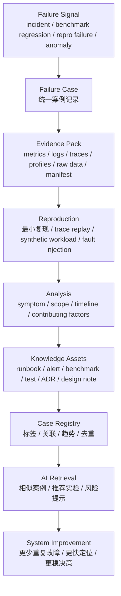

# 故障案例库：从失败复现到系统改进

第 9 章已经讲了 Incident Response、Runbook 和故障复盘。

那一章关注的是事故发生时怎么办：

- 如何宣告 incident；
- 如何设置 severity；
- 谁做 Incident Commander；
- 如何止血；
- 如何写 postmortem；
- 如何把 action item 落地。

本页关注的是另一个问题：

> 事故结束以后，如何把失败沉淀成可检索、可复现、可比较、可转化为工程改进的案例库？

AI Infra 里的失败不只来自线上事故。

它还包括：

- 推理压测发现 p99 崩溃；
- 训练任务在 5000 step 后 loss spike；
- checkpoint 恢复后数据顺序漂移；
- kernel 优化在某个 shape 上反而变慢；
- 编译器 fusion 触发数值误差；
- NCCL hang 只在某个 topology 上复现；
- 存储带宽在多任务并发时出现周期性抖动；
- 论文复现结果和论文曲线不一致；
- 某个“优化”上线后成本下降但故障率上升。

这些都应该进入 failure case library。

故障案例库不是“事故墓地”。

它是 AI 系统知识库中最有价值的部分之一，因为真实失败最能暴露系统边界。

## 一张总图



核心思想是：

```text
失败信号 -> 案例记录 -> 证据包 -> 复现实验 -> 可执行改进 -> 案例库 -> 未来检索
```

如果一个失败只停留在聊天记录里，它很快会丢失。

如果它被写成结构化案例，它可以在未来变成：

- 新同学的学习材料；
- AI 助手的检索上下文；
- benchmark 的回归用例；
- runbook 的触发条件；
- ADR 的反例证据；
- 可靠性评审的输入；
- 架构改进的优先级依据。

## 什么是 Failure Case

Failure case 是一次系统没有按预期工作的可学习样本。

它不一定是线上事故。

它可以来自任何阶段。

| 来源 | 示例 | 价值 |
| --- | --- | --- |
| 线上事故 | 推理服务 p99 TTFT 超过 SLO | 暴露真实用户影响和响应流程缺口 |
| 压测失败 | QPS 到某个点后 goodput 突然下降 | 暴露容量边界和排队拐点 |
| 性能回归 | kernel 合并后某些 shape 慢 30% | 暴露优化适用边界 |
| 论文复现失败 | 复现 FlashAttention 某曲线不一致 | 暴露环境、shape、baseline 或实现差异 |
| 训练异常 | loss spike、NaN、梯度爆炸 | 暴露数值稳定性和数据问题 |
| 分布式 hang | NCCL timeout、rank 卡住 | 暴露通信、topology、runtime 状态机 |
| 可靠性演练 | node kill 后 checkpoint restore 失败 | 暴露恢复协议缺口 |
| 运维变更 | driver 升级后吞吐下降 | 暴露环境漂移和兼容性 |
| 成本异常 | 单 token 成本突然升高 | 暴露缓存、调度或容量配置问题 |

Failure case 的目标不是追责。

它的目标是把一次失败转化为未来可复用的知识。

## Case 与 Incident、Postmortem 的区别

这几个概念容易混淆。

| 概念 | 关注点 | 典型产出 |
| --- | --- | --- |
| Incident | 现在系统出问题，必须恢复服务 | incident channel、state doc、mitigation |
| Postmortem | 事故结束后理解影响、原因和行动项 | postmortem、action items |
| Failure Case | 把失败抽象成可复用案例 | case card、evidence pack、repro、benchmark/test |
| Benchmark Case | 用于重复测量的负载和指标 | workload spec、raw data、report |
| Regression Test | 用于防止同类问题再次进入系统 | CI test、nightly benchmark、release gate |
| ADR Evidence | 用于支持或反驳技术选择 | decision evidence、caveats |

同一个事件可以同时产生多个文档。

例如：

```text
线上 TTFT p99 爆炸
  -> Incident Response 负责止血
  -> Postmortem 记录影响、时间线、行动项
  -> Failure Case 抽象为 "prefill/decode 资源冲突导致 tail latency 崩溃"
  -> Benchmark Case 用真实 trace replay 复现拐点
  -> Runbook 增加排查和缓解步骤
  -> ADR 更新 runtime/scheduling 选择依据
```

Failure case 的价值在于把“某次事故”变成“某类问题”。

## 为什么 AI Infra 需要案例库

AI Infra 的故障有几个特点。

### 1. 跨层

一个表面症状可能来自很多层。

例如“训练 hang”可能来自：

- 某个 rank OOM；
- DataLoader 卡住；
- NCCL collective 顺序不一致；
- RDMA 丢包；
- checkpoint 写阻塞；
- 某个 kernel 卡死；
- CPU 线程池耗尽；
- 共享文件系统抖动；
- topology mapping 错误；
- 某个节点 GPU Xid。

没有案例库，排查会反复从零开始。

### 2. 强依赖 workload

AI 系统的失败高度依赖：

- 模型结构；
- hidden size；
- context length；
- input/output token 分布；
- batch；
- world size；
- parallelism 组合；
- expert routing；
- precision；
- hardware topology；
- traffic burst。

同一个 runtime 在短上下文表现很好，在长上下文可能失败。

案例库必须记录 workload contract。

### 3. 不一定每次都报错

很多 AI Infra 失败不是 crash，而是“悄悄变差”。

例如：

- throughput 下降；
- p99 上升；
- GPU 利用率虚高但 goodput 下降；
- MFU 降低；
- loss 曲线变差；
- energy/token 变高；
- cache hit rate 降低；
- retry 增加；
- tail latency 变厚；
- cost/token 变贵。

这类问题如果没有指标和 case，就很难被组织记住。

### 4. 失败很容易被错误归因

AI 系统里常见错误归因：

- 把所有 timeout 都归因给网络；
- 把所有 OOM 都归因给 batch 太大；
- 把所有慢都归因给 GPU 利用率低；
- 把所有 loss spike 都归因给数据；
- 把所有 benchmark 差异都归因给硬件；
- 把所有 serving 抖动都归因给 runtime。

案例库需要保留证据链，减少凭经验猜测。

### 5. 失败样本能训练工程直觉

新同学读十个高质量 failure cases，往往比读十个成功案例更快建立系统直觉。

因为 failure case 会迫使读者看到：

- 系统假设；
- 边界条件；
- 指标盲区；
- 复杂交互；
- 人和流程的影响；
- 工程取舍。

## 案例分类法

建议用多维标签，而不是只写一个 root cause。

### 按 workload 分类

| 标签 | 示例 |
| --- | --- |
| inference-online | 在线推理、chat、RAG、agent |
| inference-batch | 离线批量推理、embedding、rerank |
| pretraining | 大规模预训练 |
| post-training | SFT、DPO、RLHF、GRPO |
| finetuning | LoRA、QLoRA、adapter |
| kernel-benchmark | 单算子、attention、matmul、fusion |
| cluster-benchmark | 调度、网络、存储、容量 |
| paper-reproduction | 论文复现和系统复现 |

### 按症状分类

| 标签 | 示例 |
| --- | --- |
| latency-regression | TTFT、TPOT、E2E latency 上升 |
| throughput-drop | tokens/s、requests/s、goodput 下降 |
| oom | HBM OOM、host OOM、KV OOM |
| hang | training hang、NCCL hang、deadlock |
| numerical | NaN、Inf、loss spike、quality regression |
| correctness | 输出错误、数据污染、checkpoint 错误 |
| availability | 服务不可用、job failed、node not ready |
| cost-regression | cost/token、GPU hour、energy 上升 |
| reliability | retry、error rate、restart、recovery 失败 |

### 按系统层分类

| 标签 | 示例 |
| --- | --- |
| workload | prompt length、output length、data mix |
| model | architecture、MoE、attention、tokenizer |
| runtime | scheduler、executor、memory manager、process group |
| kernel | Triton、CUDA、FlashAttention、fused op |
| compiler | TorchInductor、graph break、guard、fusion |
| memory | HBM、KV Cache、activation、allocator |
| communication | NCCL、AllReduce、AllToAll、RDMA |
| storage | dataset、checkpoint、model loading、NVMe |
| hardware | GPU、NIC、CPU、thermal、power、ECC/Xid |
| scheduler | Slurm、Kubernetes、placement、quota |
| process | rollout、config、runbook、alert、ownership |

### 按影响分类

| 标签 | 示例 |
| --- | --- |
| sev1/sev2/sev3 | 线上影响等级 |
| user-visible | 用户可见 |
| internal-only | 内部任务或实验 |
| benchmark-only | 只影响 benchmark |
| recurring | 重复出现 |
| silent | 没有告警但结果变差 |
| near-miss | 差点造成事故 |
| learning-case | 适合作为训练材料 |

多维标签比单一 root cause 更适合 AI 检索。

例如：

```yaml
tags:
  workload:
    - inference-online
    - rag
  symptom:
    - latency-regression
    - cache-miss
  layer:
    - runtime
    - memory
    - scheduler
  impact:
    - sev2
    - user-visible
  assets:
    - benchmark-case
    - runbook
    - adr-evidence
```

未来 AI 查询“RAG 长上下文 TTFT p99 上升怎么办”时，就能找到相关案例。

## Failure Case Card

建议每个案例都先写一个 card。

```yaml
case_id: "FC-2026-06-12-ttft-prefill-decode-contention"
title: "长上下文 RAG 流量导致 Prefill/Decode 资源竞争，TTFT p99 超过 SLO"
status: "accepted"
date: "2026-06-12"
owner: "inference-platform"

summary:
  one_sentence: "输入长度分布右移后，prefill 占用 GPU 时间片，decode 请求排队，导致 TTFT 和 TPOT 尾延迟同时恶化。"
  impact: "RAG chat pool p99 TTFT 从 1.4s 上升到 5.8s，持续 38 分钟。"

classification:
  workload:
    - inference-online
    - rag
    - long-context
  symptom:
    - latency-regression
    - queueing
  layer:
    - runtime
    - scheduler
    - kv-cache
  impact:
    - user-visible
    - sev2

workload_contract:
  model: "14B dense decoder-only"
  input_tokens:
    p50: 6000
    p95: 28000
  output_tokens:
    p50: 400
    p95: 1200
  traffic_pattern: "burst after batch ingestion"
  hardware: "H100 80GB"
  runtime: "..."

symptom:
  first_signal: "SLO burn alert on p99 TTFT"
  user_visible: true
  metrics:
    - "ttft_p99"
    - "tpot_p99"
    - "queue_wait_ms"
    - "prefill_tokens_per_batch"
    - "kv_cache_occupancy"

evidence:
  incident_doc: "..."
  dashboards: []
  traces: []
  profiles: []
  logs: []
  raw_data: []
  run_manifest: "..."

analysis:
  trigger: "input token distribution shifted after upstream retrieval change"
  contributing_factors:
    - "scheduler did not reserve decode capacity"
    - "cache hit rate dropped"
    - "alert did not include prefill/decode split"
  not_causes:
    - "GPU hardware failure"
    - "network packet loss"

reproduction:
  level: "trace replay"
  workload: "7-day sampled RAG request trace with input/output token distribution"
  command_or_report: "..."
  reproduced: true

actions:
  immediate:
    - "cap max prefill batch tokens"
    - "route long-context requests to separate pool"
  preventive:
    - "add prefill/decode split dashboard"
    - "add trace replay benchmark to release gate"
    - "evaluate prefill/decode disaggregation"
  owners:
    - "..."

knowledge_assets:
  runbook: "..."
  benchmark_case: "..."
  regression_test: "..."
  related_adr: "..."
  related_docs:
    - "03-inference-systems/prefill-decode.md"
    - "08-benchmark-capacity/queueing-model-tail-latency.md"
```

Card 的重点是可检索。

正文可以详细解释，card 负责让人和 AI 快速定位。

## 案例正文结构

每篇 failure case 建议用下面结构。

### 1. 一句话总结

先用一句话讲清楚：

```text
什么 workload，在什么条件下，出现什么症状，最终定位到哪类机制或系统边界。
```

不好：

```text
推理服务变慢。
```

好：

```text
长上下文 RAG 请求比例上升后，prefill 占满 GPU 时间片，decode 请求排队，导致 TTFT 和 TPOT p99 同时恶化。
```

### 2. 影响

影响要量化。

包括：

- 用户影响；
- 时间窗口；
- 影响范围；
- SLO burn；
- 错误率；
- latency；
- throughput；
- cost；
- 失败任务数量；
- GPU hour 损失；
- 是否有数据损坏；
- 是否有质量退化。

如果没有精确数据，写估计值和估计方法。

### 3. 时间线

时间线要记录事实，不写推测。

```text
10:02 SLO burn alert fired: TTFT p99 > 2s
10:05 On-call declared SEV2
10:08 Dashboard shows queue_wait_ms rising
10:12 Long-context request ratio identified as abnormal
10:18 Mitigation: route long-context traffic to backup pool
10:31 TTFT p99 recovered below threshold
10:45 Incident closed
```

时间线可以来自 incident state doc。

### 4. Workload Contract

AI failure case 必须写 workload。

至少包括：

- 模型；
- context length；
- input/output token 分布；
- batch；
- concurrency；
- global batch；
- sequence length；
- precision；
- parallelism；
- hardware；
- runtime；
- data path；
- traffic pattern。

没有 workload contract 的案例，很难复现。

### 5. 症状和证据

把症状和证据分开。

症状是“我们看到了什么”。

证据是“什么数据支持这个观察”。

| 症状 | 证据 |
| --- | --- |
| TTFT p99 上升 | serving metrics、request trace |
| GPU 利用率高但 goodput 下降 | DCGM、tokens/s、queue metrics |
| NCCL timeout | rank logs、NCCL debug、network counters |
| checkpoint save 变慢 | storage metrics、write latency、job timeline |
| kernel regression | profiler trace、shape sweep、baseline diff |

不要把猜测写成证据。

### 6. 分层定位

建议用分层定位。

```yaml
suspected_layers:
  workload: "input length distribution changed"
  runtime: "scheduler queueing increased"
  memory: "KV cache occupancy high"
  kernel: "no regression found in attention kernel"
  network: "no packet loss or RDMA retry spike"
  hardware: "no Xid/ECC/thermal throttling"
```

这能避免“只写找到的原因，不写排除过什么”。

### 7. Contributing Factors

不要只写单一 root cause。

AI 系统故障通常由多个因素叠加：

- trigger；
- latent condition；
- missing signal；
- unsafe default；
- bad rollback；
- insufficient benchmark；
- weak runbook；
- ownership gap；
- capacity assumption；
- changed workload。

例如：

```yaml
trigger: "upstream retrieval increased average context length"
latent_conditions:
  - "scheduler did not reserve decode capacity"
  - "benchmark did not include long-tail input length"
  - "dashboard did not split prefill and decode"
  - "runbook only mentioned scaling replicas, not long-context routing"
```

这种写法比“根因是流量变长”更有用。

### 8. 复现实验

Failure case 必须尽量转成可复现实验。

复现方式分级：

| 等级 | 含义 | 示例 |
| --- | --- | --- |
| R0 | 只能描述，无法复现 | 已丢失日志或环境 |
| R1 | 手工复现 | 用旧配置手工重跑 |
| R2 | 最小 synthetic 复现 | 构造固定 shape 或短 trace |
| R3 | trace replay 复现 | 使用真实请求或 job trace |
| R4 | fault injection 复现 | 注入 node/network/storage/kernel failure |
| R5 | 自动回归测试 | 进入 CI/nightly/release gate |

目标不一定是 R5。

但至少要说明当前复现等级和升级路径。

### 9. 改进项

改进项不要只写“加强监控”。

应该分层：

| 类型 | 示例 |
| --- | --- |
| mitigation | 限流、降级、回滚、隔离节点 |
| detection | 新指标、新告警、新 dashboard |
| diagnosis | runbook、evidence pack、trace correlation |
| prevention | regression test、benchmark gate、config validation |
| architecture | scheduler 改造、缓存策略、分离部署 |
| process | ADR、review checklist、release gate |
| knowledge | case card、reading club、AI-readable index |

每个 action item 要有：

- owner；
- priority；
- due date；
- success criteria；
- verification method；
- link。

### 10. 学到的边界

案例最后要写系统边界。

例如：

- 当前 runtime 在 input p95 > 32K 时需要单独容量模型；
- 该 kernel 优化只适用于 head_dim=128；
- 该 checkpoint 策略在 world size 改变时不可直接恢复；
- 当前 benchmark 没覆盖 RAG 工具调用尾部流量；
- 当前 SLO dashboard 没有区分 prefill 和 decode。

边界比口号更有价值。

## Evidence Pack

每个 failure case 都应该有证据包。

最小证据包：

```yaml
evidence_pack:
  case_id: "FC-..."
  source:
    incident_doc: "..."
    benchmark_report: "..."
    reproduction_report: "..."
  time_window:
    start: "..."
    end: "..."
  metrics:
    - dashboard: "..."
    - raw_series: "..."
  logs:
    - service_logs: "..."
    - runtime_logs: "..."
    - nccl_logs: "..."
  traces:
    - request_trace: "..."
    - distributed_trace: "..."
  profiles:
    - nsys: "..."
    - pytorch_profiler: "..."
    - dcgm: "..."
  environment:
    run_manifest: "..."
    image_digest: "..."
    git_commit: "..."
    driver_cuda: "..."
    topology: "..."
  artifacts:
    - config: "..."
    - workload_trace: "..."
    - raw_data: "..."
```

证据包不是为了把文档写得很重。

它是为了让未来的人能回答：

> 这个结论怎么来的？我能不能重新验证？

## 从案例到 Benchmark

高价值 failure case 应该尽量转成 benchmark case。

转换过程：

```text
失败现象 -> 关键变量 -> 可控 workload -> 指标 -> baseline -> pass/fail rule
```

示例：

| Failure Case | Benchmark Case |
| --- | --- |
| 长上下文 TTFT p99 爆炸 | RAG trace replay + input length distribution sweep |
| KV Cache OOM | max concurrency under fixed context length |
| NCCL timeout | multi-node all-reduce/all-to-all stress + topology sweep |
| checkpoint 保存过慢 | checkpoint size x interval x storage backend benchmark |
| kernel 某 shape 变慢 | shape sweep + baseline kernel comparison |
| loss spike | fixed data shard + seed + precision/optimizer sweep |

Benchmark case 要写清：

- 问题；
- workload；
- 参数范围；
- baseline；
- primary metric；
- guardrail metric；
- pass/fail rule；
- raw data；
- run manifest。

例如：

```yaml
benchmark_case:
  name: "long-context-rag-ttft-tail"
  derived_from: "FC-2026-06-12-ttft-prefill-decode-contention"
  question: "长上下文请求比例上升时，serving runtime 是否仍满足 p99 TTFT/TPOT SLO?"
  workload:
    trace: "sampled-rag-requests-7d"
    input_length_p95: [8000, 16000, 32000, 64000]
    output_length_p95: [512, 1024, 2048]
  metrics:
    primary:
      - "goodput_at_slo"
      - "ttft_p99"
      - "tpot_p99"
    guardrail:
      - "error_rate"
      - "cost_per_output_token"
  pass_fail:
    ttft_p99: "< 2s"
    tpot_p99: "< 80ms"
```

## 从案例到测试

不是所有 failure case 都适合 benchmark。

有些更适合转成测试。

| Failure | Test |
| --- | --- |
| config 少写字段导致使用默认危险值 | config validation test |
| checkpoint manifest 缺 shard | checkpoint integrity test |
| tokenizer 版本不一致 | artifact compatibility test |
| dynamic shape 触发 compile fallback | compiler regression test |
| rank 顺序不一致导致 collective hang | distributed unit/integration test |
| 权重文件损坏后服务仍启动 | startup health check |
| node 标记不正确导致调度到坏节点 | scheduler admission test |

测试的目标是把 MTTR 变成 zero MTTR：

在变更进入生产前就挡住。

## 从案例到 Runbook

案例中重复出现的诊断步骤应该进入 runbook。

转写规则：

| Case 内容 | Runbook 内容 |
| --- | --- |
| first signal | 触发条件和入口 |
| impact | severity 判断 |
| evidence | 需要看的 dashboard/log/profile |
| mitigation | 安全止血步骤 |
| diagnosis | 分层排查流程 |
| exclusions | 如何排除常见误判 |
| recovery | 恢复确认 |
| follow-up | 复盘和 case 更新 |

Runbook 要写成可执行流程，而不是故事。

案例负责保留故事和细节。

## 从案例到 ADR

Failure case 也可以成为 ADR 的反例证据。

例如：

- 某 runtime 在长上下文 tail latency 上失败；
- 某 kernel 优化在特定 shape 上不稳定；
- 某训练框架 checkpoint 恢复成本过高；
- 某调度方案在多租户场景下碎片严重；
- 某低精度方案导致质量回归。

ADR 中应引用 case：

```yaml
decision_evidence:
  supporting_cases:
    - "FC-2026-06-12-vllm-long-context-stable"
  cautionary_cases:
    - "FC-2026-05-20-current-runtime-ttft-tail"
    - "FC-2026-05-28-kv-quant-quality-regression"
```

这样技术决策不会只引用成功 benchmark，也能保留失败证据。

## 从案例到可观测性

每个 failure case 都应该问：

> 这次失败下次能不能更早发现？

常见输出：

- 新 SLI；
- 新 dashboard；
- 新 alert；
- 新 log field；
- 新 trace attribute；
- 新 profile marker；
- 新 event；
- 新 cardinality 控制；
- 新 run id / request id / rank id 关联字段。

例如：

| Failure | 可观测性改进 |
| --- | --- |
| TTFT 上升但不知道 prefill/decode 谁导致 | 增加 prefill/decode 分阶段 latency |
| GPU 利用率高但 goodput 低 | 增加 useful tokens/s、queue wait、batch composition |
| NCCL hang 难定位第一故障 rank | 增加 rank heartbeat、collective id、last progress timestamp |
| checkpoint 慢 | 增加 checkpoint stage latency、bytes written、storage backend |
| kernel regression | 增加 shape、dtype、kernel name、compiled graph id |

可观测性改进要写入 action item，并在 case 中链接。

## 从案例到 AI 检索

为了让 AI 能查阅 failure case，案例要结构化。

AI 检索最需要这些字段：

- symptoms；
- workload；
- system layer；
- metrics；
- evidence；
- diagnosis path；
- excluded causes；
- mitigation；
- reproduction；
- related docs；
- final lessons。

建议每篇案例包含 `case_card`。

```yaml
case_card:
  id: "FC-2026-06-12-ttft-prefill-decode-contention"
  symptoms:
    - "ttft_p99 increased"
    - "decode queue wait increased"
    - "gpu utilization high but goodput low"
  workload:
    - "long-context RAG"
    - "decoder-only LLM serving"
  layers:
    - "runtime"
    - "scheduler"
    - "kv-cache"
  diagnosis:
    first_check:
      - "prefill/decode split latency"
      - "input token distribution"
      - "queue wait by request length bucket"
    excluded:
      - "GPU Xid"
      - "network packet loss"
  mitigation:
    - "route long-context traffic to separate pool"
    - "cap prefill batch tokens"
  reproduction:
    method: "trace replay"
    benchmark: "long-context-rag-ttft-tail"
  related_docs:
    - "03-inference-systems/prefill-decode.md"
    - "03-inference-systems/scheduling.md"
    - "08-benchmark-capacity/queueing-model-tail-latency.md"
```

AI 回答问题时，不应该只输出“可能是 KV Cache 问题”。

它应该能给出：

- 相似案例；
- 需要先看的指标；
- 需要排除的原因；
- 安全缓解路径；
- 可复现实验；
- 相关 runbook；
- 相关 ADR。

## 案例库索引

案例库需要一个 registry。

建议字段：

```yaml
case_registry:
  - case_id: "FC-2026-06-12-ttft-prefill-decode-contention"
    title: "长上下文 RAG 导致 prefill/decode 资源竞争"
    date: "2026-06-12"
    status: "accepted"
    domain: "inference-serving"
    severity: "sev2"
    workload:
      - "rag"
      - "long-context"
    symptom:
      - "ttft_p99"
      - "tpot_p99"
    layers:
      - "runtime"
      - "scheduler"
    assets:
      benchmark: "BENCH-long-context-rag-ttft-tail"
      runbook: "RB-serving-ttft-slo-burn"
      adr: "ADR-0007"
    recurrence:
      repeated: false
      related_cases: []
```

Registry 让团队能做趋势分析：

- 哪类故障最多；
- 哪类故障影响最大；
- 哪类 action item 最常拖延；
- 哪些系统层最常出问题；
- 哪些 workload 最容易触发边界；
- 哪些案例已经转成 benchmark；
- 哪些案例只写了故事但没有验证。

## 真实案例写作示例

下面是一个简化示例。

### 标题

```text
FC-2026-06-12 长上下文 RAG 请求导致 Prefill/Decode 资源竞争
```

### 一句话总结

长上下文请求比例上升后，prefill 阶段占用更多 GPU 时间片，decode 请求排队，导致 TTFT 和 TPOT p99 同时恶化。

### 影响

```yaml
impact:
  service: "rag-chat"
  window: "38 minutes"
  ttft_p99_before: "1.4s"
  ttft_p99_during: "5.8s"
  tpot_p99_before: "65ms"
  tpot_p99_during: "180ms"
  user_visible: true
  severity: "sev2"
```

### 关键证据

```yaml
evidence:
  request_trace:
    finding: "input token p95 shifted from 12K to 28K"
  serving_metrics:
    finding: "queue_wait_ms increased for decode requests"
  gpu_metrics:
    finding: "GPU utilization high but output tokens/s decreased"
  cache_metrics:
    finding: "prefix cache hit rate dropped"
  excluded:
    - "no GPU Xid"
    - "no network retransmit spike"
    - "no model weight reload"
```

### 复现

```yaml
reproduction:
  method: "trace replay"
  trace: "7-day sampled RAG request trace"
  reproduced: true
  key_variable: "input token p95"
  result: "when input p95 exceeds 24K, goodput at SLO drops sharply"
```

### 输出资产

```yaml
assets:
  benchmark_case: "long-context-rag-ttft-tail"
  runbook: "ttft-slo-burn-serving-runbook"
  dashboard: "prefill-decode-split-dashboard"
  adr: "evaluate-prefill-decode-disaggregation"
```

这个例子不要求读者记住某个具体事故。

它教会读者：

- 长上下文会改变 prefill/decode 资源结构；
- 不能只看 GPU utilization；
- 必须按 request length bucket 看队列；
- 真实 trace replay 比固定长度 toy benchmark 更有价值。

## 质量标准

高质量 failure case 至少满足下面条件。

### 事实清楚

- 时间线可读；
- 影响量化；
- 证据可追溯；
- 推测和事实分开；
- 排除项明确。

### 机制清楚

- 症状背后的系统机制解释清楚；
- 不是只写“服务变慢”；
- 能说明为什么这个 workload 触发了问题；
- 能说明瓶颈在哪一层。

### 复现清楚

- 当前复现等级明确；
- 复现 workload 明确；
- raw data 和 manifest 可追溯；
- 知道哪些部分无法复现。

### 改进清楚

- action item 有 owner；
- action item 有验证方法；
- 至少一个改进能转成 benchmark、test、runbook 或 dashboard；
- 防止同类问题再次发生，而不是只修这一次。

### 检索清楚

- 标签完整；
- 相关章节链接完整；
- case card 结构化；
- 适合 AI 通过症状、workload、layer 检索。

## 案例评审

Failure case 也需要 review。

评审问题：

### 影响是否清楚

- 影响了谁；
- 影响多久；
- 影响什么指标；
- 是否用户可见；
- 是否影响成本或训练产出。

### 证据是否足够

- 是否有 metrics/logs/traces/profiles；
- 是否有 run manifest；
- 是否有 raw data；
- 是否能复现；
- 是否写清了缺失证据。

### 归因是否谨慎

- 是否区分 trigger 和 contributing factors；
- 是否避免单一 root cause 幻觉；
- 是否写了排除项；
- 是否避免 blame；
- 是否避免没有证据的猜测。

### 改进是否可验证

- action item 是否有 owner；
- 是否能检查完成；
- 是否能证明有效；
- 是否转成 benchmark/test/runbook/ADR；
- 是否有复审时间。

### 是否值得进入案例库

- 是否代表一类问题；
- 是否有复用价值；
- 是否能帮助新同学学习；
- 是否能帮助 AI 检索；
- 是否涉及敏感信息需要脱敏。

## 案例脱敏

公开知识库或跨团队分享时，要注意脱敏。

可以保留：

- 系统层级；
- workload 形态；
- 指标变化比例；
- 故障机制；
- 复现方法；
- 改进项类型。

需要删除或泛化：

- 客户名称；
- 真实请求内容；
- 用户数据；
- 内部 IP、host、账号；
- 未公开模型名称；
- 安全漏洞细节；
- 商业敏感成本；
- 未发布硬件细节。

脱敏后仍要保留工程价值。

不好：

```text
某服务出了问题，后来修好了。
```

好：

```text
长上下文 RAG serving 在 input length p95 上升后出现 prefill/decode 资源竞争，p99 latency 超过 SLO。案例保留 token 分布、队列指标和复现方法，移除客户标识和真实请求内容。
```

## 常见误区

### 误区一：只写故事，不写证据

故事容易读，但难复用。

必须链接 metrics、logs、traces、profiles、raw data 或 run manifest。

### 误区二：只写 root cause

AI 系统失败通常是多个因素叠加。

只写一个 root cause 会误导未来排查。

### 误区三：把“扩容”当成唯一改进

扩容可以止血，但不一定解决系统边界。

还要问：

- 为什么容量模型没发现；
- 为什么 benchmark 没覆盖；
- 为什么 SLO 预警不够早；
- 是否需要调度、缓存或架构改造。

### 误区四：没有复现

无法复现不代表不能记录。

但必须写：

- 为什么无法复现；
- 缺哪些数据；
- 下次如何补采；
- 是否能做近似复现。

### 误区五：只记录线上事故

实验失败、论文复现失败、benchmark 回归也很有价值。

很多生产事故可以在这些阶段提前暴露。

### 误区六：案例没有标签

没有标签，AI 和人都很难检索。

至少要标 workload、symptom、layer、impact、assets。

### 误区七：行动项无法验证

“加强监控”“优化调度”“提升稳定性”都不够。

要写成可验证的改进：

```text
新增 prefill/decode split dashboard，并在 TTFT burn 时展示 queue_wait_ms by request length bucket。
```

### 误区八：重复故障没有聚合

如果相似案例重复出现，要从单案例转向趋势分析。

问：

- action item 是否没关；
- action item 是否无效；
- 是否需要架构级改造；
- 是否需要 ADR；
- 是否需要资源投入；
- 是否当前 SLO 或 error budget 策略不合理。

## 检查清单

### 案例基本信息

- [ ] 是否有 case id？
- [ ] 是否有一句话总结？
- [ ] 是否有 owner？
- [ ] 是否有状态？
- [ ] 是否有日期？

### 分类

- [ ] 是否标注 workload？
- [ ] 是否标注 symptom？
- [ ] 是否标注 system layer？
- [ ] 是否标注 impact？
- [ ] 是否标注相关资产？

### 影响

- [ ] 是否量化影响范围？
- [ ] 是否说明用户可见性？
- [ ] 是否说明 SLO、成本或训练产出影响？
- [ ] 是否记录时间窗口？

### 证据

- [ ] 是否有 metrics？
- [ ] 是否有 logs？
- [ ] 是否有 traces 或 profiles？
- [ ] 是否有 raw data？
- [ ] 是否有 run manifest？
- [ ] 是否写清缺失证据？

### 分析

- [ ] 是否区分 trigger、contributing factors 和 latent conditions？
- [ ] 是否记录排除项？
- [ ] 是否解释系统机制？
- [ ] 是否避免 blame？

### 复现

- [ ] 是否定义 reproduction level？
- [ ] 是否有最小复现或 trace replay 计划？
- [ ] 是否能转成 benchmark？
- [ ] 是否能转成 regression test？

### 改进

- [ ] 是否有 owner、priority、due date？
- [ ] 是否有验证方法？
- [ ] 是否更新 runbook？
- [ ] 是否更新 dashboard 或 alert？
- [ ] 是否链接 ADR 或设计文档？

### AI 可读

- [ ] 是否有 case card？
- [ ] 是否有结构化标签？
- [ ] 是否链接相关章节？
- [ ] 是否写清适用范围和不适用范围？
- [ ] 是否能通过症状检索到该案例？

## 小结

Failure case library 的目标不是保存失败情绪，而是保存系统知识。

对 AI Infra 来说，失败往往最能说明：

- workload 边界；
- runtime 假设；
- kernel 适用范围；
- 通信和存储瓶颈；
- 训练稳定性问题；
- benchmark 盲区；
- 监控缺口；
- 决策风险。

高质量案例应该做到：

- 事实可追溯；
- 机制可解释；
- 复现可执行；
- 改进可验证；
- 标签可检索；
- 结论可迁移。

当案例库积累起来，团队就能从“遇到问题靠资深同学记忆”转向“遇到问题先查相似案例、证据链、复现实验和已有改进”。

这也是知识库真正变成 AI-readable system memory 的关键。

## 参考资料

- [Google SRE: Postmortem Culture](https://sre.google/sre-book/postmortem-culture/)
- [Google SRE Workbook: Postmortem Culture](https://sre.google/workbook/postmortem-culture/)
- [Google SRE: Tracking Outages](https://sre.google/sre-book/tracking-outages/)
- [Google SRE: Testing for Reliability](https://sre.google/sre-book/testing-reliability/)
- [Google SRE Workbook: Incident Response](https://sre.google/workbook/incident-response/)
