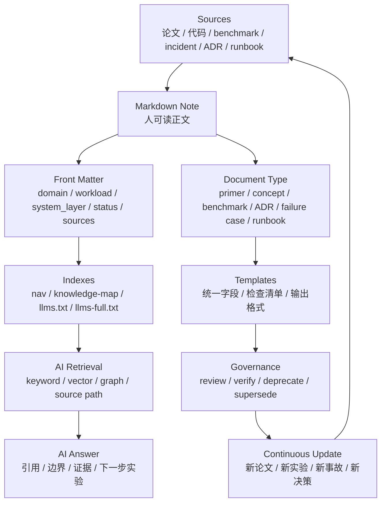

# 知识组织、模板与 AI 可读索引

前面的章节讲 AI 系统知识本身：

- AI workload；
- 推理系统；
- 训练系统；
- Kernel 与编译；
- 加速器；
- 集群；
- Benchmark；
- 可靠性；
- 论文复现；
- 技术决策；
- 故障案例。

这一章讲知识库本身。

也就是：

> 如何组织这些 Markdown 文档，让人能读懂，让新同学能学习，让维护者能持续更新，让 AI 能检索、引用、组合，并在需要时转化为可执行建议？

AI Infra 知识有一个特别麻烦的特点：

同一句结论，离开 workload、硬件、软件、指标和证据，就可能变成误导。

例如：

- “PagedAttention 能提高吞吐”必须说明模型、上下文长度、KV Cache 压力和 serving workload；
- “FP8 训练更快”必须说明硬件、scale 策略、loss 曲线和 checkpoint/resume；
- “某 runtime 更适合长上下文”必须说明 trace、SLO、p99、成本和回滚策略；
- “某故障来自 NCCL”必须说明 rank 状态、网络证据、first failure point 和排除项。

所以本知识库不能只是一堆文章。

它应该是一个可演进的知识系统：

- 文档有类型；
- 结论有上下文；
- 数据有来源；
- 实验可复现；
- 决策可追溯；
- 故障可检索；
- AI 可读取；
- 更新有流程。

## 一张总图



核心原则：

```text
知识不是写完就结束，而是要能被定位、被验证、被引用、被更新。
```

## 设计目标

这个知识库同时服务三类读者。

| 读者 | 需要什么 |
| --- | --- |
| 新同学 | 清晰路径、低门槛解释、必要术语、下一步阅读 |
| 研究/工程人员 | 可复现 benchmark、系统机制、决策依据、故障案例 |
| AI Agent | 稳定路径、结构化元数据、上下文边界、可引用来源、任务约束 |

因此知识组织要同时满足：

- 人类可浏览；
- AI 可摄取；
- 结论可追溯；
- 文档可维护；
- 内容可扩展；
- 公共和内部知识可分层；
- 长期不会变成混乱资料堆。

## 文档类型

先定义文档类型，后面才有模板和索引。

建议将文档分成下面几类。

| 类型 | 作用 | 例子 |
| --- | --- | --- |
| Primer | 给新手建立基本概念 | Transformer、训练、推理、多模态 |
| Concept | 解释一个机制或技术点 | KV Cache、PagedAttention、Tensor Parallel |
| System Guide | 解释一个系统链路或架构 | 单机推理服务、多机分布式推理、集群架构 |
| Benchmark Guide | 解释如何测量和分析 | Roofline、Trace Replay、成本模型 |
| Tool / Runtime Case | 分析具体工具或 runtime | vLLM、TensorRT-LLM、SGLang、TorchInductor |
| Paper Note | 分析论文贡献、机制和复现 | FlashAttention、ZeRO、GShard |
| Experiment Report | 记录一次 benchmark 或复现实验 | 某模型某硬件上的 trace replay |
| ADR | 保存技术决策 | 是否采用某 runtime、是否启用 FP8 |
| Failure Case | 保存失败案例 | NCCL hang、TTFT p99 回归、loss spike |
| Runbook | 事故或任务操作手册 | TTFT SLO burn、NCCL timeout 排查 |
| Template | 统一写作结构 | 知识点模板、ADR 模板、Benchmark 模板 |
| Index | 面向人或 AI 的入口 | 知识地图、llms.txt、章节索引 |

每类文档的质量标准不同。

Primer 要浅显。

Benchmark Guide 要严格。

ADR 要讲清决策证据。

Failure Case 要有证据包和复现等级。

Runbook 要可执行。

如果不区分文档类型，所有文章都会变成“长篇解释”，维护成本会越来越高。

## Diataxis 视角

技术文档可以借鉴 Diataxis 的四类需求：

- tutorial：带读者完成学习；
- how-to guide：帮助读者完成任务；
- reference：提供准确查表信息；
- explanation：解释原理和背景。

AI Infra 知识库可以对应成：

| Diataxis 类型 | 本知识库对应 |
| --- | --- |
| Tutorial | 入门导读、AI 基础概念、训练/推理 primer |
| How-to | Benchmark 方法、Runbook、复现协议、调优流程 |
| Reference | 指标定义、元数据字段、模板、API/配置表 |
| Explanation | Transformer 原理、并行策略、故障机制、架构取舍 |

很多文章会混合几种类型，但主类型要明确。

例如：

- `AI 基础概念` 主要是 tutorial / explanation；
- `Benchmark 数据治理` 主要是 how-to / reference；
- `技术决策记录` 主要是 how-to；
- `故障案例库` 主要是 how-to / reference；
- `vLLM` 主要是 explanation / system case；
- `llms.txt` 入口主要是 index / reference。

## Front Matter

每篇 Markdown 都应该有 front matter。

最小字段：

```yaml
---
title: ""
domain: ""
status: draft
owner: maintainers
license: CC-BY-4.0
updated: 2026-06-12
---
```

建议扩展字段：

```yaml
---
title: "PagedAttention"
domain: inference-systems
doc_type: concept
status: reviewed
owner: inference-platform
license: CC-BY-4.0
updated: 2026-06-12

workload:
  - llm-serving
  - long-context
system_layer:
  - runtime
  - memory
  - attention
hardware:
  - gpu
software:
  - vllm
  - cuda
metrics:
  - ttft
  - tpot
  - throughput
  - kv_cache_occupancy
sources:
  - type: paper
    title: "Efficient Memory Management for Large Language Model Serving with PagedAttention"
    url: "https://arxiv.org/abs/2309.06180"
related:
  - "03-inference-systems/kv-cache.md"
  - "08-benchmark-capacity/inference-capacity-modeling.md"
---
```

并不是每篇都必须填满。

但对 benchmark、ADR、failure case、paper note，建议尽量填完整。

## 元数据字段规范

### title

标题要清晰表达主题，不要太营销化。

好：

```yaml
title: "推理容量建模：QPS、并发、TTFT、TPOT 与 GPU 副本数"
```

不好：

```yaml
title: "让推理飞起来"
```

标题应该能帮助 AI 判断文档用途。

### domain

建议固定枚举。

```yaml
domain:
  - ai-workloads
  - inference-systems
  - training-systems
  - kernels-compilers
  - accelerators-architecture
  - cluster-infra
  - benchmark-capacity
  - reliability-observability
  - papers-cases
  - knowledge-index
```

不要每篇随手创造新 domain。

### doc_type

建议固定枚举。

```yaml
doc_type:
  - primer
  - concept
  - system-guide
  - benchmark-guide
  - tool-case
  - paper-note
  - experiment-report
  - adr
  - failure-case
  - runbook
  - template
  - index
```

doc_type 决定 AI 应该如何使用这篇文章。

例如：

- primer 可以用于解释；
- runbook 可以用于操作建议；
- ADR 可以用于判断历史决策；
- failure-case 可以用于相似故障检索；
- experiment-report 可以用于引用具体数据。

### status

建议状态流转：

| 状态 | 含义 |
| --- | --- |
| draft | 初稿，结构可能还会改 |
| reviewed | 已人工读过，内容逻辑基本可靠 |
| verified | 有实验、构建或来源验证支撑 |
| superseded | 被新文档替代 |
| deprecated | 不再推荐使用，但保留历史 |
| stale | 长期未更新，可能需要复核 |

状态不是装饰。

AI 回答时应该区别对待：

- `verified` 可以更放心引用；
- `draft` 要提示可能仍在整理；
- `deprecated` 只能作为历史背景；
- `superseded` 应优先跳转到新文档。

### workload

AI Infra 结论必须绑定 workload。

建议使用结构化词汇：

```yaml
workload:
  - llm-serving
  - rag
  - agent
  - long-context
  - batch-inference
  - pretraining
  - post-training
  - sft
  - dpo
  - rlhf
  - grpo
  - lora
  - moe
  - multimodal
  - kernel-benchmark
  - cluster-benchmark
```

例如，“KV Cache 量化有收益”必须说明是 serving workload，不是训练 workload。

### system_layer

建议使用下面层级：

```yaml
system_layer:
  - workload
  - model
  - tokenizer
  - runtime
  - scheduler
  - memory
  - kernel
  - compiler
  - communication
  - storage
  - accelerator
  - cluster
  - observability
  - benchmark
  - reliability
  - process
```

这会帮助 AI 做分层检索。

用户问“TTFT p99 变差怎么办”，AI 可以优先找：

- inference serving；
- scheduler；
- prefill/decode；
- queueing；
- KV Cache；
- SLO；
- failure cases。

### hardware

硬件字段要能表达约束。

```yaml
hardware:
  accelerator:
    - h100
    - a100
    - mi300
    - tpu
    - npu
  interconnect:
    - nvlink
    - pcie
    - infiniband
    - roce
  memory:
    - hbm
    - nvme
    - object-storage
```

不要只写“GPU”。

有些结论高度依赖 H100、HBM 容量、NVLink、RDMA 和 CPU NUMA。

### software

软件字段要包含版本敏感对象。

```yaml
software:
  framework:
    - pytorch
  runtime:
    - vllm
    - tensorrt-llm
    - sglang
  compiler:
    - torchinductor
    - triton
  comm:
    - nccl
  driver:
    - cuda
    - rocm
  orchestration:
    - kubernetes
    - slurm
```

Benchmark 或 failure case 中，应尽量在 run manifest 里写具体版本。

### metrics

指标字段要避免泛化。

```yaml
metrics:
  - ttft
  - tpot
  - e2e_latency
  - p95
  - p99
  - throughput
  - goodput_at_slo
  - tokens_per_second
  - step_time
  - mfu
  - gpu_memory_peak
  - kv_cache_occupancy
  - cost_per_token
  - joules_per_token
  - recovery_time
```

AI 回答性能问题时，应优先引用有指标字段的文档。

### sources

sources 字段用于溯源。

```yaml
sources:
  - type: paper
    title: ""
    url: ""
  - type: official-doc
    title: ""
    url: ""
  - type: benchmark
    run_id: ""
    report: ""
  - type: incident
    case_id: ""
  - type: adr
    id: ""
```

来源要尽量区分：

- paper；
- official documentation；
- source code；
- benchmark raw data；
- profiler trace；
- incident；
- ADR；
- internal note；
- blog。

不同来源可信度不同。

## 证据等级

建议在需要时标注 evidence_level。

| 等级 | 含义 |
| --- | --- |
| E0 | 经验、观点、博客、口头判断 |
| E1 | 论文、官方文档、源码说明 |
| E2 | 小规模本地实验 |
| E3 | 可复现 benchmark + raw data + manifest |
| E4 | production trace replay、shadow、canary |
| E5 | 线上长期运行数据、SLO、incident 和成本闭环 |

例如：

```yaml
evidence_level: E3
evidence:
  benchmark_report: "..."
  raw_data: "..."
  run_manifest: "..."
```

AI 引用时可以这样表达：

```text
这个结论在当前知识库中属于 E3：有可复现 benchmark 和 run manifest，但还没有 production canary。
```

这比直接说“有效”更可靠。

## 文档状态流转

建议流程：

```text
draft -> reviewed -> verified
                 -> stale
                 -> deprecated
                 -> superseded
```

### draft

适合：

- 初稿；
- 结构未定；
- 资料还在补；
- 需要更多 reviewer。

AI 使用 draft 时，应提示谨慎。

### reviewed

适合：

- 内容已经人工读过；
- 术语和逻辑基本准确；
- 但不一定有实验验证。

### verified

适合：

- benchmark 结果可复现；
- 构建和链接通过；
- source 已核查；
- 示例可运行；
- 或该文档是模板/索引且经过维护流程验证。

### stale

适合：

- 超过复审周期；
- 依赖技术更新频繁；
- 可能仍有价值，但需要重新确认。

例如：

- runtime 版本更新；
- CUDA/NCCL 版本变化；
- 新 GPU 代际出现；
- benchmark trace 过期；
- 模型结构变化。

### superseded / deprecated

旧文档不一定要删除。

但要写清：

```yaml
status: superseded
superseded_by: "path/to/new-doc.md"
reason: "新 runtime 版本改变了默认实现"
```

这样 AI 不会误用旧结论。

## 文档关系

知识库不是线性书。

它应该是一个有关系的图。

常见关系：

| 关系 | 含义 |
| --- | --- |
| explains | A 解释 B 的原理 |
| depends_on | A 需要先理解 B |
| benchmark_for | A 是 B 的 benchmark |
| evidence_for | A 支持某个 ADR 或结论 |
| contradicts | A 与 B 的结论有冲突或边界差异 |
| supersedes | A 替代 B |
| related_failure | A 关联某个 failure case |
| runbook_for | A 是某类事故的 runbook |
| source_of | A 是 B 的来源 |

可以在 front matter 或正文里写：

```yaml
relations:
  explains:
    - "03-inference-systems/prefill-decode.md"
  benchmark_for:
    - "08-benchmark-capacity/inference-capacity-modeling.md"
  evidence_for:
    - "10-papers-cases/adr.md"
  related_failure:
    - "10-papers-cases/failure-cases.md"
```

关系图的价值在于：

- 人能顺着路径学习；
- AI 能做上下文扩展；
- 维护者能发现孤立文档；
- 决策能追溯到证据；
- 故障能关联到 runbook 和 benchmark。

## 人类导航

人类导航有三层。

### 1. MkDocs 导航

`mkdocs.yml` 是网页左侧导航的权威来源。

规则：

- 章节顺序代表学习路径；
- 标题要和文档 H1 尽量一致；
- 新文档必须加入导航；
- 不要把草稿隐藏在目录里无人发现；
- 同一主题下的文章顺序应从基础到高级。

### 2. 知识地图

`docs/knowledge-map.md` 面向概览和跳转。

它回答：

- 这个知识库有哪些大块；
- 读者按目标怎么走；
- 各模块依赖什么；
- 新同学先读什么；
- 系统方向如何关联。

知识地图不是普通目录。

它应该表达学习路径和知识依赖。

### 3. 章节入口页

每个章节的 `index.md` 应该回答：

- 本章解决什么问题；
- 适合谁读；
- 推荐阅读顺序；
- 每篇文章的作用；
- 本章和其他章节怎么连接。

如果只有导航，没有章节入口，新读者会迷路。

## AI 可读入口

本知识库维护两个 AI 入口文件：

| 文件 | 位置 | 作用 |
| --- | --- | --- |
| `llms.txt` | 仓库根目录与站点根路径 | 给 AI 的入口索引，说明知识库目标、推荐阅读路径、主要文档和 Markdown 源地址。 |
| `llms-full.txt` | 仓库根目录与站点根路径 | 聚合 `docs/` 下 Markdown 文档，适合 AI 无法逐页抓取时一次性摄取上下文。 |

`llms.txt` 目前是一个社区提案，不是强制 Web 标准。

但它很适合作为 AI 入口，因为它把网站内容组织成：

- 一个 H1 标题；
- 简短说明；
- 若干链接分组；
- 每个链接附带用途说明；
- 可选的次要链接。

这个知识库的 `llms.txt` 不是替代搜索引擎，也不是权限控制。

它的作用是告诉 AI：

- 这是什么知识库；
- 先读哪些内容；
- 哪些文档最重要；
- Markdown 源地址在哪里；
- 如果需要完整上下文，去哪里读。

推荐把下面几项一起提供给 AI：

```text
GitHub: https://github.com/AmourSec/aikg
Docs: https://amoursec.github.io/aikg/
LLM index: https://amoursec.github.io/aikg/llms.txt
Full context: https://amoursec.github.io/aikg/llms-full.txt
```

建议提示语：

```text
请先读取 llms.txt，按其中的推荐路径理解知识库结构。
需要完整上下文时读取 llms-full.txt。
回答时优先引用仓库中的 Markdown 源路径。
如果结论依赖 workload、硬件、软件或 benchmark，请明确说明适用范围。
```

## llms.txt 维护规则

`scripts/generate_llms_files.py` 是当前 AI 入口生成脚本。

当新增、删除或重排文档后，应重新生成：

```bash
python3 scripts/generate_llms_files.py
```

维护规则：

- 新增重要文档时，加入 `PRIORITY_DOCS`；
- 给每篇重要文档写 `DESCRIPTIONS`；
- 描述要说明“这篇文档能解决什么问题”，不要只重复标题；
- `llms.txt` 保持精简；
- `llms-full.txt` 可以更完整；
- 生成后必须构建验证；
- 不要手工编辑生成文件后忘记同步脚本。

一个好的 `DESCRIPTIONS` 示例：

```python
"03-inference-systems/prefill-decode.md": (
    "Prefill 与 Decode 两阶段的计算形态、指标关系和系统瓶颈。"
)
```

不好：

```python
"03-inference-systems/prefill-decode.md": "Prefill 与 Decode。"
```

AI 需要知道用途，而不是只知道名字。

## llms-full.txt 的边界

`llms-full.txt` 是完整上下文入口，但不是越大越好。

它适合：

- 一次性给 AI 摄取知识库；
- 离线检索；
- RAG pipeline 建索引；
- 没有浏览能力的 agent；
- 需要跨章节总结的场景。

它不适合：

- 每次问答都完整塞入上下文；
- 代替精确检索；
- 代替文档源路径；
- 代替版本控制；
- 混入大体积 raw benchmark data。

对于大型实验数据，应在文档中链接 manifest 和 raw data，而不是直接放进 `llms-full.txt`。

## AI 引用策略

AI 回答时应遵循：

1. 先定位相关章节；
2. 再读取具体文档；
3. 检查 front matter；
4. 检查文档状态；
5. 检查 workload、hardware、software、metrics；
6. 找证据和来源；
7. 说明适用范围；
8. 引用 Markdown 源路径；
9. 对不确定内容明确说明；
10. 对工程建议给出验证步骤。

不要让 AI 直接把知识库中的一句话当通用真理。

例如：

```text
根据知识库中的推理容量建模章节，这个估算方法适用于 LLM serving 的容量规划。
但如果你的 workload 是 MoE、长上下文 RAG 或多模态请求，需要重新检查 input/output token 分布、KV Cache 占用和 p99 SLO。
```

这比直接给结论更安全。

## 向量索引

如果后续要给 AI 做 RAG，可以基于 Markdown 构建向量索引。

建议 chunk 方式：

- 按文档分组；
- 按 heading 切块；
- 每个 chunk 保留 front matter；
- 每个 chunk 保留路径；
- 每个 chunk 保留 heading 层级；
- 每个 chunk 保留上一层摘要；
- benchmark/ADR/failure case 的 card 单独切块；
- 表格和 YAML 不要随意拆散。

Chunk metadata 示例：

```yaml
chunk_id: "03-inference-systems/prefill-decode.md#prefill"
doc_path: "docs/03-inference-systems/prefill-decode.md"
title: "Prefill 与 Decode"
heading_path:
  - "Prefill 与 Decode"
  - "Prefill 是什么"
domain: "inference-systems"
doc_type: "concept"
workload:
  - "llm-serving"
system_layer:
  - "runtime"
  - "scheduler"
metrics:
  - "ttft"
  - "tpot"
status: "draft"
updated: "2026-06-12"
```

检索返回给 AI 时，不要只返回文本。

应该返回：

- chunk text；
- title；
- source path；
- heading path；
- status；
- updated；
- related docs；
- evidence level。

## 知识图谱

向量检索擅长语义相似。

知识图谱擅长关系推理。

AI Infra 很适合建立轻量图谱。

### 实体

常见实体：

- workload；
- model；
- runtime；
- kernel；
- compiler；
- hardware；
- metric；
- benchmark；
- incident；
- ADR；
- paper；
- failure case；
- runbook；
- optimization；
- bottleneck。

### 关系

常见关系：

```yaml
relations:
  - from: "PagedAttention"
    relation: "optimizes"
    to: "KV Cache memory management"
  - from: "KV Cache"
    relation: "affects"
    to: "concurrency"
  - from: "Prefill"
    relation: "affects"
    to: "TTFT"
  - from: "Decode"
    relation: "affects"
    to: "TPOT"
  - from: "Trace Replay"
    relation: "validates"
    to: "Inference Capacity Model"
  - from: "Failure Case FC-..."
    relation: "evidence_for"
    to: "ADR-..."
```

图谱不必一开始就复杂。

可以先从 Markdown 里的 front matter、links、YAML card 和标题自动抽取。

## Source of Truth

知识库里会出现很多不同来源。

必须定义 source of truth。

| 内容 | 权威来源 |
| --- | --- |
| 文档结构 | `mkdocs.yml`、章节 `index.md`、`knowledge-map.md` |
| AI 入口 | `scripts/generate_llms_files.py` 生成的 `llms.txt` / `llms-full.txt` |
| 技术解释 | Markdown 正文 + 参考资料 |
| Benchmark 结论 | benchmark report + raw data + run manifest |
| 技术决策 | ADR |
| 故障结论 | failure case + evidence pack |
| 操作步骤 | runbook |
| 模板 | `docs/99-templates/` |

不要让多个文档互相冲突。

如果冲突不可避免，要写明：

- 哪个是旧结论；
- 哪个 supersede 旧结论；
- 冲突来自 workload、硬件、版本还是指标口径；
- 哪个用于当前默认场景。

## Provenance

知识必须有来源。

W3C PROV 的核心思想是记录 entity、activity 和 agent：

- entity：产出的东西，比如文档、数据、图表；
- activity：产生它的活动，比如 benchmark、incident、review；
- agent：参与者，比如人、脚本、系统。

知识库可以用简化版 provenance。

```yaml
provenance:
  generated_by:
    activity: "benchmark"
    run_id: "bench-2026-06-12-001"
  used:
    - "request-trace-2026-06-01"
    - "config.yaml"
    - "git:abcdef"
  attributed_to:
    - "benchmark-team"
  generated_at: "2026-06-12T10:00:00Z"
```

对 AI Infra 来说，provenance 很关键。

因为很多结论不只是“谁写的”，还要知道：

- 用什么代码；
- 用什么配置；
- 用什么硬件；
- 用什么数据；
- 什么时候跑的；
- 哪些 run 被排除；
- 哪个图来自哪个 raw data。

## FAIR 思路

FAIR 原则强调数据要 Findable、Accessible、Interoperable、Reusable。

可以把它借鉴到知识库。

| FAIR | 知识库落地 |
| --- | --- |
| Findable | 稳定路径、标题、标签、索引、搜索、llms.txt |
| Accessible | Markdown 源文件、公开文档站、可下载上下文 |
| Interoperable | 统一 front matter、固定枚举、结构化 card |
| Reusable | license、来源、适用范围、证据等级、模板 |

AI-readable 不等于“给 AI 塞很多字”。

真正可复用的知识必须有结构、来源和边界。

## 文件命名

文件命名要稳定。

规则：

- 使用小写英文；
- 用连字符分隔；
- 避免日期放在长期文档名里；
- 避免过度缩写；
- 文件名表达主题，不表达状态；
- 不随便改已经公开的路径。

好：

```text
prefill-decode.md
benchmark-data-governance-run-records.md
incident-response-runbook-postmortem.md
```

不好：

```text
new.md
v2-final.md
awesome-optimization.md
2026-06-12-note.md
```

实验报告和案例可以使用 id：

```text
FC-2026-06-12-ttft-prefill-decode-contention.md
ADR-0007-adopt-vllm-long-context-serving.md
BENCH-2026-06-12-vllm-trace-replay.md
```

长期教程和概念文档不要频繁改路径。

## 链接规范

内部链接使用相对路径：

```markdown
[KV Cache](../03-inference-systems/kv-cache.md)
```

站点中的导航链接由 MkDocs 处理。

AI-readable 文档中应尽量保留 Markdown 源路径，方便 AI 精确引用。

外部链接优先顺序：

1. 官方文档；
2. 论文；
3. 源码仓库；
4. 标准规范；
5. 可信技术博客；
6. 新闻和二手资料。

外部链接要能说明用途：

```markdown
- [W3C PROV Overview](https://www.w3.org/TR/prov-overview/)：用于理解 provenance 的 entity/activity/agent 模型。
```

不要堆链接。

## 模板体系

模板用于降低写作成本，也用于提高 AI 可读性。

当前模板：

- [知识点模板](../99-templates/knowledge-note.md)
- [技术决策模板](../99-templates/adr.md)
- [基准实验报告模板](../99-templates/benchmark-report.md)

建议后续增加：

- paper note template；
- experiment report template；
- failure case template；
- runbook template；
- incident state doc template；
- AI-readable card template；
- source/evidence pack template。

模板不是形式主义。

模板要保证关键字段不会遗漏：

- workload；
- system layer；
- metrics；
- sources；
- assumptions；
- caveats；
- verification；
- related docs；
- status。

## 写作规范

### 面向新同学

Primer 和基础章节应做到：

- 先讲为什么；
- 再讲流程；
- 再讲每一步为什么成立；
- 少用未经解释的缩写；
- 不追公式细节；
- 不把实现细节提前塞给读者。

### 面向系统研究

系统章节应做到：

- 明确 workload；
- 明确瓶颈；
- 明确数据对象；
- 明确计算/显存/通信/调度成本；
- 明确 benchmark 方法；
- 明确适用边界。

### 面向 AI

AI-friendly 文档应做到：

- 标题稳定；
- heading 层次清楚；
- 表格字段明确；
- YAML card 可解析；
- 结论靠近证据；
- caveats 明确；
- related docs 明确；
- 不用太多隐喻；
- 不把多个主题混在一个 section。

## 质量门禁

每次新增或大改文章，至少运行：

```bash
python3 scripts/generate_llms_files.py
.venv/bin/mkdocs build --strict
git diff --check
```

并检查：

- 导航是否包含新文档；
- 章节入口是否更新；
- 知识地图是否需要更新；
- `llms.txt` 是否包含新文档；
- `llms-full.txt` 是否同步；
- 标题是否和导航一致；
- Mermaid 是否能构建；
- 外部链接是否合理；
- 文档状态是否正确；
- 是否有明显过时日期。

重要文档还应检查：

- 是否有参考资料；
- 是否有适用范围；
- 是否有检查清单；
- 是否有 AI-readable card；
- 是否有 related docs；
- 是否有 evidence 或 caveats。

## 维护节奏

建议维护节奏：

| 频率 | 动作 |
| --- | --- |
| 每次新增文档 | 更新导航、章节入口、AI 入口、构建验证 |
| 每周 | 检查新增内容是否有孤立文档 |
| 每月 | 检查 draft 是否需要 review |
| 每季度 | 检查 runtime、GPU、NCCL、CUDA、benchmark 是否过期 |
| 重大事故后 | 新增 failure case、runbook、benchmark 或 ADR |
| 重大技术决策后 | 新增 ADR，链接 evidence pack |
| 新硬件/新模型后 | 复审 benchmark 和架构结论 |

知识库不需要一次性完美。

但需要稳定的维护机制。

## Public 与 Internal

当前仓库是公开知识库。

公开内容应避免：

- 公司内部信息；
- 客户信息；
- 真实生产事故细节；
- 未公开硬件参数；
- 私有 benchmark 数据；
- 安全敏感配置；
- 账号、路径、IP、主机名；
- 未公开模型或业务策略。

但可以保留抽象后的工程知识：

- workload 类型；
- 指标变化比例；
- 系统机制；
- 复现方法；
- 改进项类型；
- 模板结构；
- 通用经验。

如果未来有内部版本，可以采用双层结构：

```text
public:
  通用原理、公开资料、脱敏案例、模板
internal:
  真实实验数据、内部事故、供应商细节、业务约束、私有架构
```

AI 使用时也要区分：

- public AI context；
- internal AI context；
- sensitive context；
- no-export context。

## 安全与隐私

知识库面向 AI 时，容易误把敏感内容放进上下文。

建议规则：

- 不在公开 Markdown 放 secrets；
- 不放真实用户数据；
- 不放 access token；
- 不放内部 IP 和主机名；
- 不放未脱敏日志；
- 不放完整安全漏洞利用细节；
- 不放不可公开的供应商信息；
- 不把 private benchmark raw data 聚合进 `llms-full.txt`。

对于内部知识库，可以增加字段：

```yaml
visibility: public | internal | restricted
sensitivity:
  - none
  - customer-data
  - security
  - vendor-confidential
  - business-confidential
ai_usage:
  allowed: true
  export_allowed: false
  citation_required: true
```

公开仓库当前应默认：

```yaml
visibility: public
sensitivity:
  - none
```

## AI Agent 使用协议

如果把知识库交给 AI Agent，建议给出明确协议。

```text
你正在使用 AI Knowledge Graph。

请遵守：
1. 先读取 llms.txt，理解文档结构。
2. 回答问题前，定位相关章节和源 Markdown。
3. 如果问题涉及性能、容量、成本、可靠性或决策，必须说明 workload、硬件、软件和指标口径。
4. 如果引用 benchmark、ADR 或 failure case，必须说明证据等级和适用边界。
5. 不要把 draft 文档当作 verified 结论。
6. 不确定时，提出需要补充的实验或证据。
7. 输出建议时，给出验证步骤。
```

这个协议比“请阅读仓库”更有效。

## AI 检索失败模式

AI 使用知识库时也会出错。

常见失败模式：

### 1. 语义相似但场景不同

用户问训练显存，AI 找到了推理 KV Cache。

解决：

- chunk metadata 必须包含 workload；
- 回答时检查 workload 是否匹配。

### 2. 旧结论覆盖新结论

AI 引用 superseded ADR。

解决：

- status 字段；
- superseded_by 字段；
- 检索时优先 current 文档。

### 3. 只引用结论，不引用证据

AI 说某方案更好，但不说明 benchmark。

解决：

- evidence_level；
- benchmark report link；
- answer protocol 要求说明证据。

### 4. 忽略硬件差异

AI 把 H100 上的 FP8 结论迁移到其他硬件。

解决：

- hardware 字段；
- caveats；
- transfer checklist。

### 5. 混淆 incident 与 failure case

AI 把现场止血步骤当长期架构建议。

解决：

- doc_type；
- runbook、postmortem、failure case、ADR 分开。

### 6. 把模板当真实案例

AI 引用模板里的示例数据。

解决：

- template doc_type；
- 示例字段标注 sample；
- AI answer 中禁止把模板示例当证据。

## 知识库演进路线

可以分阶段演进。

### v1：Markdown 文档库

目标：

- 文章完整；
- 结构清晰；
- MkDocs 可浏览；
- `llms.txt` 可作为 AI 入口；
- `llms-full.txt` 可提供完整上下文。

当前仓库已经处在这个阶段。

### v2：结构化元数据

目标：

- 统一 front matter；
- doc_type 固定；
- workload/system_layer/metrics 枚举；
- ADR/failure/benchmark cards 标准化；
- 脚本检查元数据完整性。

### v3：检索索引

目标：

- 自动 chunk；
- 生成 chunk metadata；
- 建向量索引；
- 保留 source path；
- 支持按 domain/workload/status 过滤。

### v4：知识图谱

目标：

- 抽取实体和关系；
- 支持 related docs；
- 支持 ADR evidence graph；
- 支持 failure case similarity；
- 支持 benchmark-to-decision lineage。

### v5：Agent Skills

目标：

- 把稳定流程转成 skills；
- 例如 benchmark 设计 skill、ADR 评审 skill、failure case 编写 skill；
- 每个 skill 引用知识库文档；
- skill 输出必须带验证步骤。

不要一开始就追 v5。

先把 Markdown 知识写扎实。

## 最小维护清单

新增一篇文章时：

- [ ] front matter 完整；
- [ ] H1 和 title 一致；
- [ ] 加入 `mkdocs.yml`；
- [ ] 更新章节 `index.md`；
- [ ] 必要时更新 `knowledge-map.md`；
- [ ] 更新 `scripts/generate_llms_files.py` 的描述；
- [ ] 运行 `python3 scripts/generate_llms_files.py`；
- [ ] 运行 `.venv/bin/mkdocs build --strict`；
- [ ] 运行 `git diff --check`；
- [ ] 检查 `llms.txt` 中的描述；
- [ ] 提交并推送。

更新一篇文章时：

- [ ] 更新 `updated`；
- [ ] 检查相关链接；
- [ ] 检查 status 是否变化；
- [ ] 检查旧结论是否需要 deprecated；
- [ ] 检查 AI 入口是否需要更新；
- [ ] 重新生成和构建。

新增 benchmark、ADR、failure case 时：

- [ ] 添加结构化 card；
- [ ] 添加 evidence pack；
- [ ] 添加相关文档链接；
- [ ] 添加 owner；
- [ ] 添加验证方法；
- [ ] 添加 revisit condition。

## 检查清单

### 人类可读

- [ ] 是否有清晰标题？
- [ ] 是否有适合新同学的上下文？
- [ ] 是否解释为什么重要？
- [ ] 是否给出阅读路径？
- [ ] 是否避免未解释术语？

### AI 可读

- [ ] front matter 是否完整？
- [ ] doc_type 是否明确？
- [ ] workload/system_layer/metrics 是否可解析？
- [ ] 是否有稳定路径？
- [ ] 是否有结构化 card？
- [ ] 是否有 related docs？

### 证据可追溯

- [ ] 是否有 sources？
- [ ] benchmark 是否有 raw data 和 manifest？
- [ ] ADR 是否有 evidence pack？
- [ ] failure case 是否有 logs/metrics/traces/profiles？
- [ ] 是否说明 evidence level？

### 可维护

- [ ] 是否加入导航？
- [ ] 是否更新章节入口？
- [ ] 是否更新知识地图？
- [ ] 是否更新 `llms.txt` 描述？
- [ ] 是否构建通过？
- [ ] 是否有过期或 supersede 机制？

### 安全

- [ ] 是否没有 secret？
- [ ] 是否没有未脱敏用户数据？
- [ ] 是否没有内部 IP/主机名？
- [ ] 是否没有不该公开的供应商或业务信息？
- [ ] 是否清楚 public/internal 边界？

## 小结

知识库的价值不只取决于文章数量。

更取决于：

- 文档类型是否清楚；
- 元数据是否稳定；
- 结论是否有上下文；
- 证据是否可追溯；
- 路径是否可导航；
- AI 是否能正确检索；
- 更新是否有流程；
- 旧结论是否能退场。

对 AI Infra 这种高度依赖 workload、硬件、软件和指标口径的领域，知识组织不是附属工作，而是知识能否长期复用的核心。

当文档、模板、索引、证据、关系和 AI 入口一起工作时，这个仓库才真正成为：

> 面向人类学习，也面向 AI 推理的系统知识库。

## 参考资料

- [The /llms.txt file](https://llmstxt.org/)
- [Diataxis documentation framework](https://diataxis.fr/)
- [Google developer documentation style guide](https://developers.google.com/style)
- [W3C PROV Overview](https://www.w3.org/TR/prov-overview/)
- [FAIR Principles](https://www.go-fair.org/fair-principles/)
