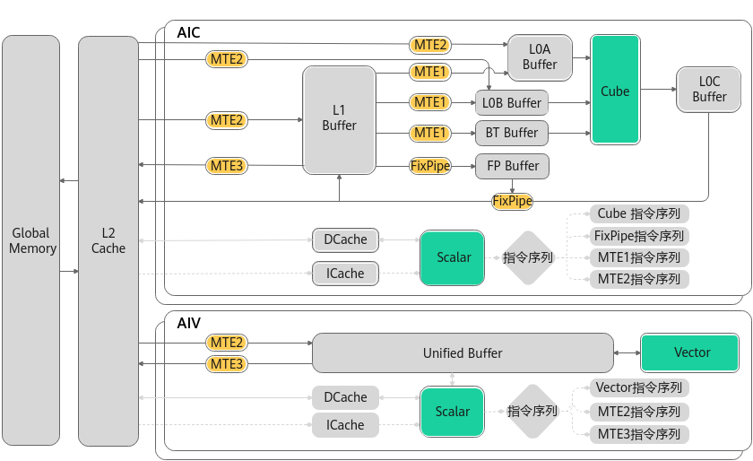
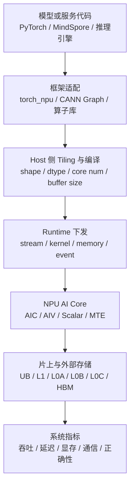
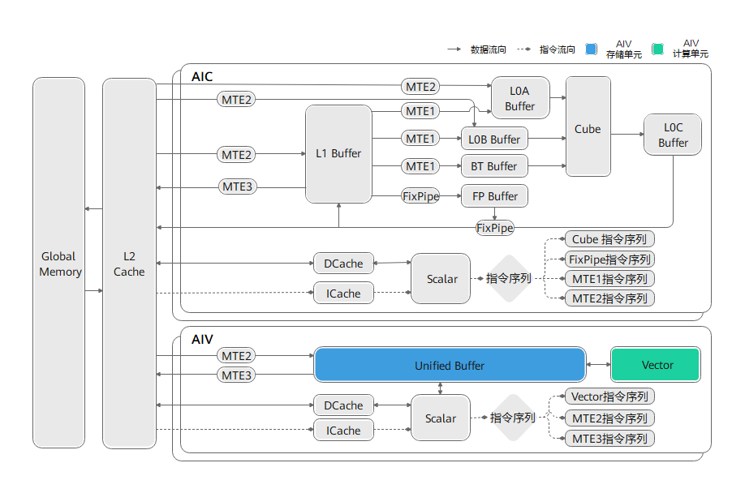
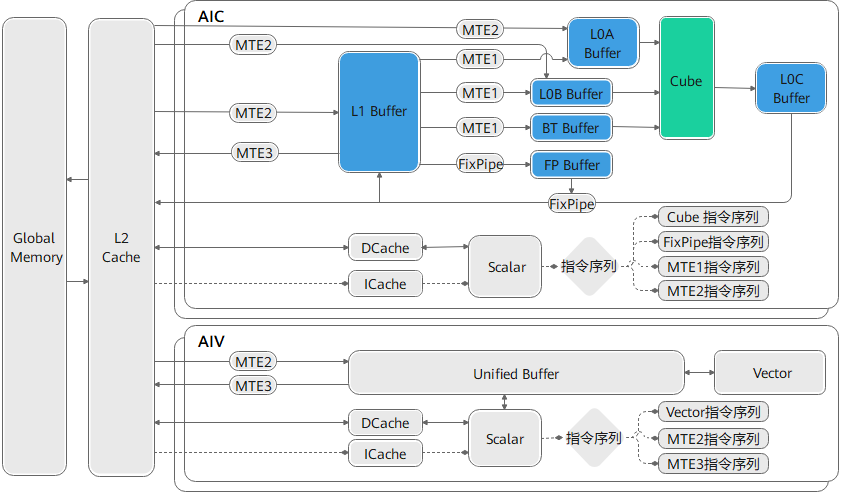
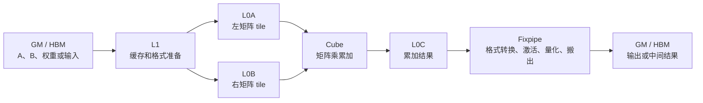
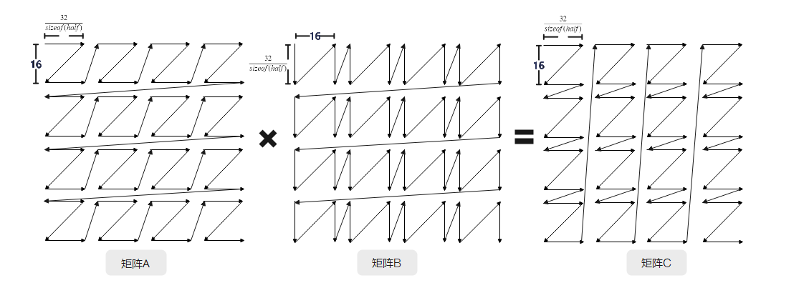
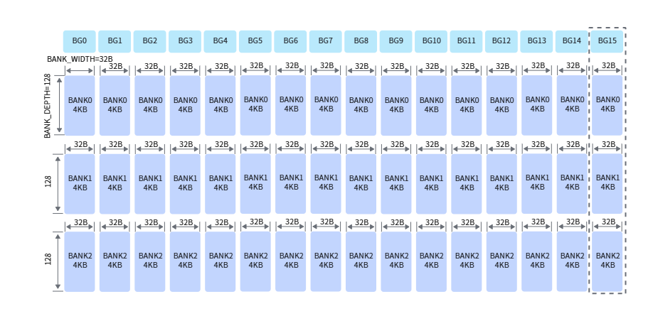
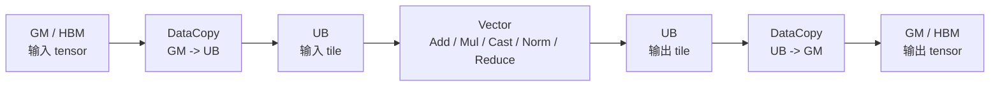
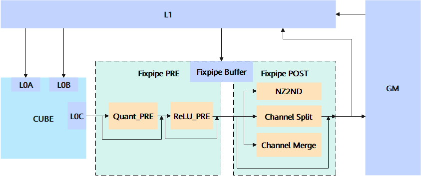

# Ascend 910 系列平台要点

Ascend 910 系列是学习服务器侧昇腾 AI 计算时最应该先掌握的一条线。这里的重点不是背某个 SKU 的峰值参数，而是理解：模型里的矩阵乘、向量计算、数据搬运、片上存储和多卡通信，最终怎么落到 NPU 硬件和 CANN 软件栈上。

本篇主要用 `Ascend 910B / 910_93` 常关联的 Atlas A2/A3、`DAV_2201` 资料来解释。更早的 Ascend 910 可用于理解产品历史和迁移背景，但做工程判断时要以当前设备实际返回的 `SocVersion`、`NpuArch`、CANN 版本和 profiler 证据为准。

> 图像说明：本篇引用 CANN/asc-devkit 中的官方或准官方架构图。为保证 GitHub Pages 稳定显示，仓库在 `docs/assets/images/ascend/` 保存了这些图片的静态副本；图片版权和授权边界仍归原项目或原厂所有，来源见图注。

## 先看哪些架构图

| 先后 | 图或资料 | 适合用来理解什么 |
| --- | --- | --- |
| 1 | [Atlas A2/A3 architecture](https://gitcode.com/cann/asc-devkit/blob/master/docs/api/figures/atlas_a2_a3_architecture.png) | 从服务器或加速卡视角看 CPU、NPU、HBM、互连和系统软件的关系。 |
| 2 | [A2/A3 NPU architecture](https://gitcode.com/cann/asc-devkit/blob/master/docs/api/figures/a2a3_npu_arch.png) | 从芯片内部视角看 AI Core、片上存储、搬运通路和 Global Memory。 |
| 3 | [Cube compute unit A2/A3](https://gitcode.com/cann/asc-devkit/blob/master/docs/api/figures/architecture_of_cube_compute_unit_a2a3.png) | 理解矩阵乘为什么走 Cube，L0A/L0B/L0C 分别承担什么角色。 |
| 4 | [A2/A3 UB memory structure](https://gitcode.com/cann/asc-devkit/blob/master/docs/api/figures/a2a3_UB内存结构图.png) | 理解 UB 为什么会影响向量算子、tiling、bank conflict 和 fusion。 |
| 5 | [Fractals involved in matrix calculation](https://gitcode.com/cann/asc-devkit/blob/master/docs/api/figures/fractals_involved_in_matrix_calculation_a2a3.png) | 理解矩阵在 L0/L1 中不是普通二维数组，而是按硬件友好的分形格式摆放。 |
| 6 | [Fixpipe execution flow A2/A3](https://gitcode.com/cann/asc-devkit/blob/master/docs/api/figures/fixpipe_execution_flow_a2a3.png) | 理解 Cube 结果从 L0C 搬出时，为什么可以顺带做量化、激活和格式转换。 |
| 7 | [CANNBot npu-arch skill](https://gitcode.com/cann/cannbot-skills/blob/master/ops/npu-arch/SKILL.md) | 查 `SocVersion`、`NpuArch`、`__NPU_ARCH__`、典型 buffer 和跨代差异。 |

这些图解决的是三层问题：第一层是设备和系统软件怎么连起来；第二层是 NPU 内部的计算和存储单元怎么协作；第三层是写算子或调性能时，数据到底应该放在哪个 buffer、用哪个计算单元、走哪条搬运路径。

## 平台视角：CPU、NPU、HBM 和软件栈

[](https://gitcode.com/cann/asc-devkit/blob/master/docs/api/figures/atlas_a2_a3_architecture.png)

来源：[CANN asc-devkit - Atlas A2/A3 architecture](https://gitcode.com/cann/asc-devkit/blob/master/docs/api/figures/atlas_a2_a3_architecture.png)

读这类平台图时，不要先看型号参数，先看数据和控制流：

- `Host CPU` 运行 Python、框架、推理服务、tokenizer、调度逻辑和 operator tiling 代码。
- `CANN / runtime / driver` 把框架图或自定义算子下发到设备侧，管理 stream、内存、kernel launch 和错误上报。
- `NPU device` 执行 AI Core kernel、数据搬运和部分通信任务。
- `HBM / Global Memory` 存权重、activation、KV Cache、临时 buffer、optimizer state 和输出。
- `HCCS / HCCL / 网络` 决定多卡训练、分布式推理、MoE 和大规模通信是否能扩展。

所以，一条 AI workload 在 910B 这类平台上不是“模型直接跑在芯片上”，而是：



如果推理慢，原因可能在 tokenizer、batching、框架 fallback、kernel、HBM 带宽、KV Cache、通信或调度；不能只盯着 NPU 峰值算力。

## NPU 内部：2201 的 AIC / AIV 分离架构

[](https://gitcode.com/cann/asc-devkit/blob/master/docs/api/figures/a2a3_npu_arch.png)

来源：[CANN asc-devkit - A2/A3 NPU architecture](https://gitcode.com/cann/asc-devkit/blob/master/docs/api/figures/a2a3_npu_arch.png)

`DAV_2201` 的一个核心特征是 AIC 和 AIV 分离：

- `AIC` 主要面向矩阵计算，核心硬件是 Cube。
- `AIV` 主要面向向量计算，核心硬件是 Vector。
- AIC 与 AIV 的常见配比是 `1:2`。
- 每个 AIC/AIV 都有自己的 Scalar 控制单元，可以独立加载自己的代码段。
- AIC 和 AIV 之间的数据交互通常要经过 Global Memory，这会影响 Cube + Vector 融合算子的设计。

这件事对新手很关键：910B 上很多优化并不是把所有东西塞进一个“万能核”，而是把矩阵计算、向量后处理、数据搬运和同步拆清楚，再尽量减少中间结果写回 HBM 的次数。

## 主要硬件单元和常见用法

| 模块单元 | 作用 | 一般用法 | 对 AI workload 的影响 |
| --- | --- | --- | --- |
| Host CPU | 准备输入、提交任务、执行 tiling、运行服务逻辑。 | tokenizer、请求调度、CANN runtime 调用、profiling 控制。 | Host 侧排队或频繁同步会让 NPU 空转。 |
| CANN runtime / compiler | 连接框架、算子库、自定义算子和硬件。 | 图编译、算子选择、TilingData、kernel launch、stream/event 管理。 | 决定模型是否走到高效 NPU 路径。 |
| Global Memory / HBM | 设备侧大容量内存。 | 存权重、activation、KV Cache、optimizer state、临时 buffer。 | 容量和带宽会限制长上下文、并发和训练规模。 |
| AI Core | 执行 NPU kernel 的主要入口。 | 多核切分，每个 core 处理一段 tensor 或一个 tile。 | 核数利用率、尾块浪费和调度方式影响吞吐。 |
| AIC / Cube | 执行矩阵乘、卷积等 dense 计算。 | MatMul、QKV projection、MLP、Attention score、训练 backward GEMM。 | Transformer 主要 FLOPs 在这里，Cube 利用率非常关键。 |
| AIV / Vector | 执行向量、逐元素、归一化、类型转换等计算。 | Add、Mul、Cast、RMSNorm、Softmax 局部步骤、量化/反量化。 | 小算子过多或 UB 组织不好会拖慢端到端。 |
| Scalar | 做地址、循环、分支、mask 和同步控制。 | offset 计算、尾块处理、flag/event、条件逻辑。 | 动态 shape 和复杂控制流会增加开销。 |
| MTE / DataCopy | 在 HBM 和片上 buffer 间搬数据。 | GM 到 UB/L1，L1 到 L0A/L0B，L0C 经 Fixpipe 搬出。 | 数据供不上，Cube/Vector 就会等待。 |
| UB | AIV 的主要片上工作区。 | 向量输入输出、临时结果、双缓冲、分块处理。 | UB 容量、32B 对齐和 bank conflict 影响向量性能。 |
| L1 | AIC 侧靠近 Cube 的缓存和重排空间。 | 缓存矩阵 tile，再搬到 L0A/L0B。 | 影响矩阵 tile 复用和格式转换成本。 |
| L0A / L0B | Cube 左右输入操作数 buffer。 | L0A 放左矩阵 tile，L0B 放右矩阵 tile。 | 对齐、分形格式和 tile shape 决定 Cube 喂数效率。 |
| L0C | Cube 累加结果 buffer。 | 保存矩阵乘结果或中间累加结果。 | 决定 epilogue、Fixpipe 和结果搬出路径。 |
| Fixpipe | AIC 内部的随路后处理和搬出单元。 | L0C 搬出时做量化/反量化、ReLU/LeakyReLU、NZ2ND 等格式转换。 | 减少单独后处理 kernel 和额外 HBM 往返。 |
| HCCL / HCCS | 多卡通信和物理链路相关能力。 | AllReduce、ReduceScatter、AllGather、AllToAll、跨卡 DataCopy。 | 训练扩展、MoE、分布式推理会被通信限制。 |

## Cube：矩阵乘为什么走 L0A / L0B / L0C

[](https://gitcode.com/cann/asc-devkit/blob/master/docs/api/figures/architecture_of_cube_compute_unit_a2a3.png)

来源：[CANN asc-devkit - Cube compute unit A2/A3](https://gitcode.com/cann/asc-devkit/blob/master/docs/api/figures/architecture_of_cube_compute_unit_a2a3.png)

Cube 的主要任务是把矩阵乘用专用硬件高速执行。它不是直接从 HBM 读一整块大矩阵，而是按 tile 和硬件格式，把数据逐级搬入片上 buffer：



这里有几个基础原则：

- L0A、L0B、L0C 不是普通缓存名，而是 Cube 矩阵计算专用的片上存储层次。
- 2201 中 L0A 推荐 `FRACTAL_ZZ`，L0B 推荐 `FRACTAL_ZN`，L0C 推荐 `FRACTAL_NZ`。
- L0A/L0B 访问通常要求更严格的分形和对齐，不能把任意二维数组直接塞进去。
- L0C 保存的是累加结果，后续通常通过 Fixpipe 搬出到 GM 或 L1。
- GEMM 的性能不只看 Cube 峰值，还要看 L1/L0 的 tile 设计、格式转换、双缓冲和结果搬出。

[](https://gitcode.com/cann/asc-devkit/blob/master/docs/api/figures/fractals_involved_in_matrix_calculation_a2a3.png)

来源：[CANN asc-devkit - Fractals involved in matrix calculation A2/A3](https://gitcode.com/cann/asc-devkit/blob/master/docs/api/figures/fractals_involved_in_matrix_calculation_a2a3.png)

分形格式可以先理解成“硬件更喜欢的矩阵摆放方式”。它的目标是让 Cube 读取固定大小的小块时更连续、更对齐、更容易流水化。新手写文档或 skill 时，不要把 `ND`、`NZ`、`ZZ`、`ZN` 当作普通名字列出来，要说明它们会改变数据在片上 buffer 里的物理排布。

## UB：向量算子的工作台

[](https://gitcode.com/cann/asc-devkit/blob/master/docs/api/figures/a2a3_UB内存结构图.png)

来源：[CANN asc-devkit - A2/A3 UB memory structure](https://gitcode.com/cann/asc-devkit/blob/master/docs/api/figures/a2a3_UB内存结构图.png)

UB 可以先理解成 AIV 上的高速片上工作区。常见向量算子的流程是：



UB 的一般用法包括：

- 把输入 tensor 分块搬到 UB，再在 UB 上做 Vector 计算。
- 用双缓冲让“搬下一块”和“算当前块”重叠。
- 为 elementwise、norm、softmax 局部步骤、类型转换、量化/反量化提供临时空间。
- 通过合理分配 UB 区域避免 bank conflict。
- 根据 `GetCoreMemSize(CoreMemType::UB, size)` 查询实际可用容量，避免按网上参数硬编码。

如果一个算子很小、很多、反复读写 GM，中间结果就会频繁穿过 HBM。此时应该优先考虑 fusion、tiling 和 UB 复用，而不是只增加启动核数。

## Fixpipe：Cube 结果搬出时的后处理

[](https://gitcode.com/cann/asc-devkit/blob/master/docs/api/figures/fixpipe_execution_flow_a2a3.png)

来源：[CANN asc-devkit - Fixpipe execution flow A2/A3](https://gitcode.com/cann/asc-devkit/blob/master/docs/api/figures/fixpipe_execution_flow_a2a3.png)

Fixpipe 位于 AIC 路径上，主要配合 Cube 的 L0C 结果搬出。它的价值在于：矩阵乘结果离开 L0C 时，不一定只做简单拷贝，可以顺带做一些硬件化后处理。

常见用法：

- `量化 / 反量化`：例如 FP32/FP16/BF16 与整数类型之间的转换路径。
- `激活函数`：例如 ReLU、PReLU、LeakyReLU 等随路处理。
- `格式转换`：例如把适合 Cube 的分形格式转换成下游更容易消费的格式。
- `结果搬出`：把 L0C 中的结果搬到 GM 或 L1，为后续算子准备输入。

在 2201 这条线里，AIC 和 AIV 之间常常需要通过 GM 交换数据。因此做 MatMul + 激活、MatMul + 量化、MatMul + Norm 这类融合时，要先判断后处理能不能放在 Fixpipe 路径里；如果必须交给 AIV，就要评估 L0C -> GM -> UB 的额外成本。

## 训练、推理和算子优化怎么落到 910 系列

| 场景 | 更应该先看什么 | 典型结论形式 |
| --- | --- | --- |
| 训练 | 数据输入、显存组成、并行策略、通信、checkpoint、数值稳定。 | “瓶颈在 ReduceScatter 与 backward GEMM 重叠不足”，而不是只说训练慢。 |
| Prefill 推理 | GEMM/Attention 吞吐、长上下文、KV 写入、batching。 | “Prefill 受 Cube/内存带宽约束，适合提高 batch 或优化 attention kernel”。 |
| Decode 推理 | KV Cache 读取、batch 调度、小 batch 利用率、采样和 host 调度。 | “Decode 受 KV 带宽和调度影响，单 token 延迟需要单独剖析”。 |
| 自定义算子 | NpuArch、buffer 容量、数据格式、对齐、tiling、同步。 | “该算子要按 2201 的 AIC/AIV 分离和 GM 中转设计”。 |
| 多卡系统 | HCCL、拓扑、rank mapping、通信与计算重叠。 | “AllToAll 尾延迟来自跨节点链路或 expert placement”。 |

做任何性能结论时，都应该记录：

- 设备实际型号、`SocVersion`、`NpuArch`、driver、CANN、framework。
- 模型、shape、dtype、batch、sequence length、并行策略。
- profiler 中的热点 kernel、内存、通信、runtime timeline。
- 是否存在 fallback、动态 shape 重编译、算子不支持或同步等待。

## 经典场景代码：Host 侧查询平台能力并做 Tiling

下面代码展示的是“如何根据实际平台查询核数和片上 buffer 容量”，不是完整生产算子。关键思想是：不要把 910B 的 core 数、UB/L1/L0C 容量写死到代码里，而是从 CANN 的平台信息接口查询。

```cpp
#include "register/tilingdata_base.h"
#include "tiling/platform/platform_ascendc.h"

struct AddTilingData {
    uint32_t totalLength;
    uint32_t tileLength;
    uint32_t blockLength;
};

ge::graphStatus TilingVectorAdd(gert::TilingContext* context)
{
    auto platform = platform_ascendc::PlatformAscendC(context->GetPlatformInfo());

    const uint32_t aivNum = platform.GetCoreNumAiv();
    const uint32_t aicNum = platform.GetCoreNumAic();

    uint64_t ubSize = 0;
    uint64_t l1Size = 0;
    uint64_t l0cSize = 0;
    platform.GetCoreMemSize(platform_ascendc::CoreMemType::UB, ubSize);
    platform.GetCoreMemSize(platform_ascendc::CoreMemType::L1, l1Size);
    platform.GetCoreMemSize(platform_ascendc::CoreMemType::L0_C, l0cSize);

    const uint32_t totalLength = GetInputElementCount(context, 0);
    const uint32_t blockDim = aivNum;
    context->SetBlockDim(blockDim);

    AddTilingData tiling {};
    tiling.totalLength = totalLength;
    tiling.blockLength = (totalLength + blockDim - 1) / blockDim;

    // 留出输入 x、输入 y、输出 z 三块 UB 空间，并按 32B 对齐。
    const uint32_t bytesPerElement = sizeof(half);
    const uint32_t maxElementsInUb =
        static_cast<uint32_t>(ubSize / (3 * bytesPerElement));
    tiling.tileLength = AlignDown(maxElementsInUb, 16);

    SaveTilingData(context, tiling);
    return ge::GRAPH_SUCCESS;
}
```

这段代码体现了几个工程习惯：

- 用 `GetCoreNumAiv()` 决定向量算子启动多少个 AIV。
- 如果算子包含矩阵计算，再用 `GetCoreNumAic()` 和 `CalcTschNumBlocks()` 处理 AIC/AIV 混合调度。
- 用 `GetCoreMemSize()` 查询 UB、L1、L0C 等容量。
- tile 大小根据 buffer 容量和 dtype 推导，而不是固定成某个经验值。
- 32B、64B、512B 等对齐要求要进入 tiling 逻辑。

## 经典场景代码：Vector Add 的 AI Core 骨架

下面是一个极简 Vector Add 结构，用来说明 `GM -> UB -> Vector -> UB -> GM` 这条路径。真实工程需要补齐 CANN 工程模板、TilingData 定义、错误处理、shape 校验、对齐和边界处理。

```cpp
#include "kernel_operator.h"

using namespace AscendC;

class KernelVectorAdd {
public:
    __aicore__ inline void Init(
        GM_ADDR x, GM_ADDR y, GM_ADDR z,
        uint32_t totalLength, uint32_t blockLength, uint32_t tileLength)
    {
        const uint32_t blockId = GetBlockIdx();
        offset_ = blockId * blockLength;
        totalLength_ = totalLength;
        blockLength_ = Min(blockLength, totalLength - offset_);
        tileLength_ = tileLength;

        xGm_.SetGlobalBuffer((__gm__ half*)x + offset_, blockLength_);
        yGm_.SetGlobalBuffer((__gm__ half*)y + offset_, blockLength_);
        zGm_.SetGlobalBuffer((__gm__ half*)z + offset_, blockLength_);

        pipe_.InitBuffer(inQueueX_, 2, tileLength_ * sizeof(half));
        pipe_.InitBuffer(inQueueY_, 2, tileLength_ * sizeof(half));
        pipe_.InitBuffer(outQueueZ_, 2, tileLength_ * sizeof(half));
    }

    __aicore__ inline void Process()
    {
        for (uint32_t begin = 0; begin < blockLength_; begin += tileLength_) {
            const uint32_t length = Min(tileLength_, blockLength_ - begin);
            CopyIn(begin, length);
            Compute(length);
            CopyOut(begin, length);
        }
    }

private:
    __aicore__ inline void CopyIn(uint32_t begin, uint32_t length)
    {
        LocalTensor<half> xLocal = inQueueX_.AllocTensor<half>();
        LocalTensor<half> yLocal = inQueueY_.AllocTensor<half>();
        DataCopy(xLocal, xGm_[begin], length);
        DataCopy(yLocal, yGm_[begin], length);
        inQueueX_.EnQue(xLocal);
        inQueueY_.EnQue(yLocal);
    }

    __aicore__ inline void Compute(uint32_t length)
    {
        LocalTensor<half> xLocal = inQueueX_.DeQue<half>();
        LocalTensor<half> yLocal = inQueueY_.DeQue<half>();
        LocalTensor<half> zLocal = outQueueZ_.AllocTensor<half>();
        Add(zLocal, xLocal, yLocal, length);
        outQueueZ_.EnQue(zLocal);
        inQueueX_.FreeTensor(xLocal);
        inQueueY_.FreeTensor(yLocal);
    }

    __aicore__ inline void CopyOut(uint32_t begin, uint32_t length)
    {
        LocalTensor<half> zLocal = outQueueZ_.DeQue<half>();
        DataCopy(zGm_[begin], zLocal, length);
        outQueueZ_.FreeTensor(zLocal);
    }

    TPipe pipe_;
    TQue<TPosition::VECIN, 2> inQueueX_;
    TQue<TPosition::VECIN, 2> inQueueY_;
    TQue<TPosition::VECOUT, 2> outQueueZ_;
    GlobalTensor<half> xGm_;
    GlobalTensor<half> yGm_;
    GlobalTensor<half> zGm_;
    uint32_t offset_ = 0;
    uint32_t totalLength_ = 0;
    uint32_t blockLength_ = 0;
    uint32_t tileLength_ = 0;
};

extern "C" __global__ __aicore__ void vector_add(
    GM_ADDR x, GM_ADDR y, GM_ADDR z, GM_ADDR tiling)
{
    GET_TILING_DATA(tilingData, tiling);
    KernelVectorAdd op;
    op.Init(x, y, z,
            tilingData.totalLength,
            tilingData.blockLength,
            tilingData.tileLength);
    op.Process();
}
```

这段骨架对应硬件单元：

- `GlobalTensor` 对应 GM/HBM。
- `LocalTensor` 对应 UB 中的一段片上空间。
- `DataCopy` 对应 MTE 搬运。
- `Add` 对应 Vector 计算。
- `TQue` 和双缓冲让搬运、计算、搬出更容易流水化。

## 经典场景代码：按架构选择 2201 路径

如果一个算子要同时支持 910B/910_93 和 950PR/950DT，不应该靠字符串猜型号，而应该用 `NpuArch` 或 `__NPU_ARCH__` 明确分支。

```cpp
#include "tiling/platform/platform_ascendc.h"

ge::graphStatus TilingWithArchBranch(gert::TilingContext* context)
{
    auto platform = platform_ascendc::PlatformAscendC(context->GetPlatformInfo());
    const auto arch = platform.GetCurNpuArch();
    const auto soc = platform.GetSocVersion();

    if (arch == platform_ascendc::NpuArch::DAV_2201) {
        // 910B / 910_93 常见路径：
        // AIC 与 AIV 分离，CV 融合经常需要考虑 GM 中转。
        BuildTilingForDav2201(context, soc);
    } else {
        // 其他架构走保守路径，或交给专门适配分支。
        BuildPortableTiling(context, soc);
    }

    return ge::GRAPH_SUCCESS;
}
```

Device 侧也可以用编译宏保护架构相关实现：

```cpp
#if defined(__NPU_ARCH__) && (__NPU_ARCH__ == 2201)
// 2201 专用实现：按 AIC/AIV 分离、GM 中转、2201 分形格式和同步约束设计。
#else
// 通用或其他架构实现。
#endif
```

这类分支非常适合沉淀成 AI skill：输入设备日志、CANN 版本、`SocVersion`、`NpuArch`、编译宏和 profiler 证据，输出“当前 workload 应该走哪个代码路径，哪些参数不能硬编码，哪些图和文档要查”。

## 实验清单

| 阶段 | 必要检查 |
| --- | --- |
| 建立基线 | 记录设备、CANN、driver、framework、模型、dtype、shape、并行策略。 |
| 功能验证 | 用小 batch、小输入、固定随机种子验证能否稳定运行。 |
| 精度验证 | 对比 CPU/GPU/已知正确输出，记录误差口径和容忍范围。 |
| 性能验证 | 区分 warmup 和测量窗口，记录吞吐、延迟、显存、功耗和 profiler。 |
| 瓶颈定位 | 区分 data、host、framework、compiler、kernel、memory、communication、scheduler。 |
| 结论沉淀 | 形成 benchmark report、failure case、ADR 或 skill。 |

## 参考资料

- [CANN asc-devkit](https://gitcode.com/cann/asc-devkit) 提供 CANN/Ascend C 示例、API、架构图和编程指南。
- [NPU 架构版本 2201](https://gitcode.com/cann/asc-devkit/blob/master/docs/guide/编程指南/高级编程/硬件实现/架构规格/NPU架构版本2201.md) 是理解 A2/A3、AIC/AIV 分离、存储层次、Fixpipe 和同步约束的重要入口。
- [PlatformAscendC](https://gitcode.com/cann/asc-devkit/blob/master/docs/api/Utils-API/平台信息获取/PlatformAscendC/PlatformAscendC.md) 用于 Host 侧 tiling 时查询核数、内存大小、SocVersion 和 NpuArch。
- [CANNBot npu-arch skill](https://gitcode.com/cann/cannbot-skills/blob/master/ops/npu-arch/SKILL.md) 展示了把架构识别、硬件参数和跨代差异组织成 AI skill 的方式。
