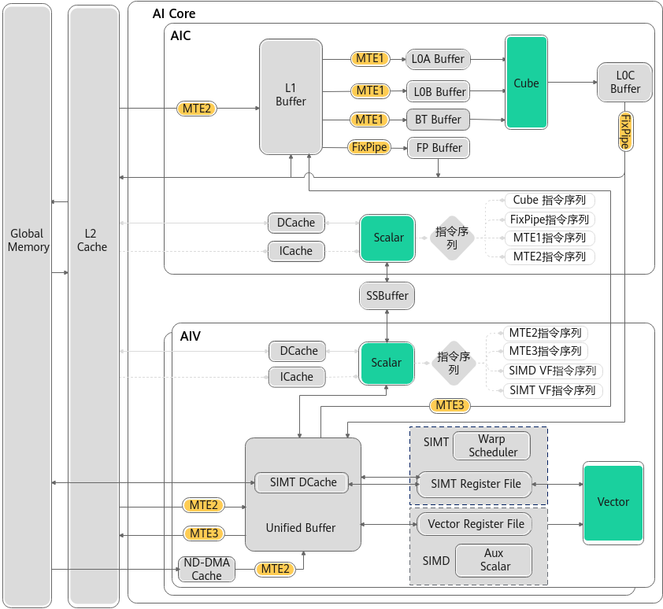
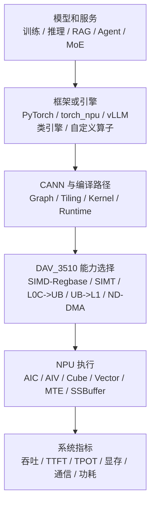
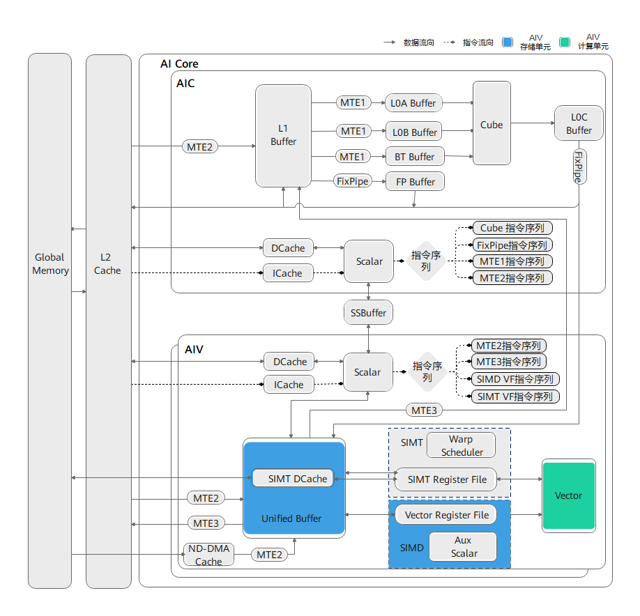
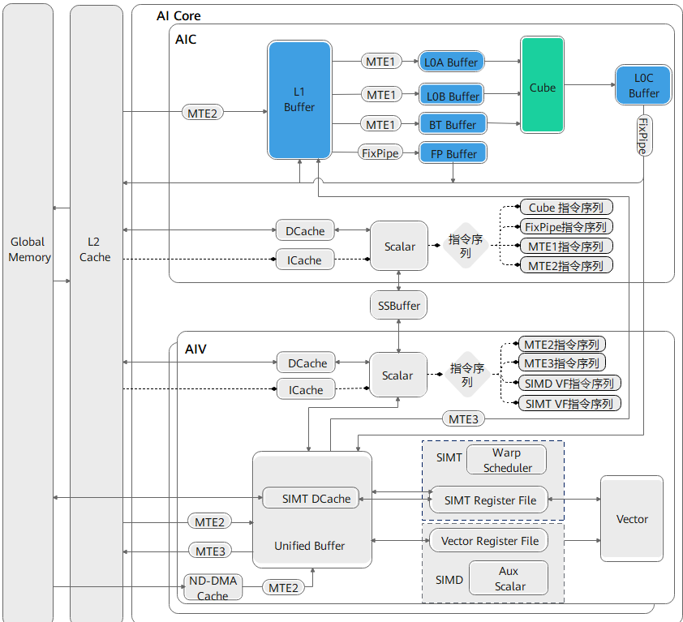
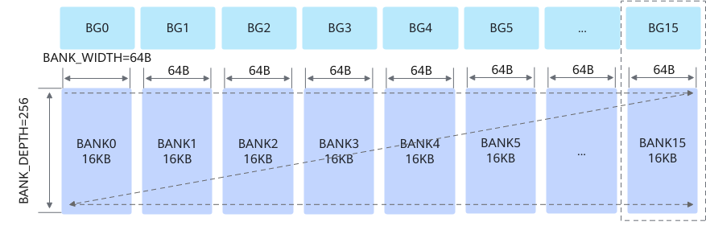
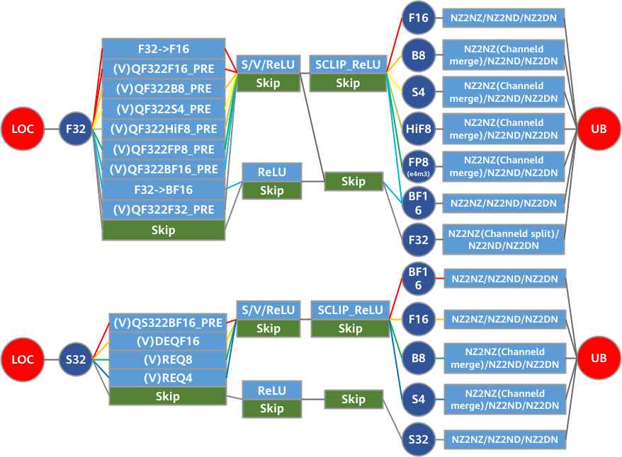
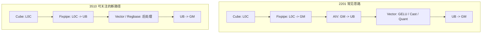
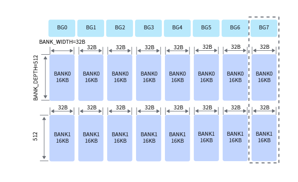
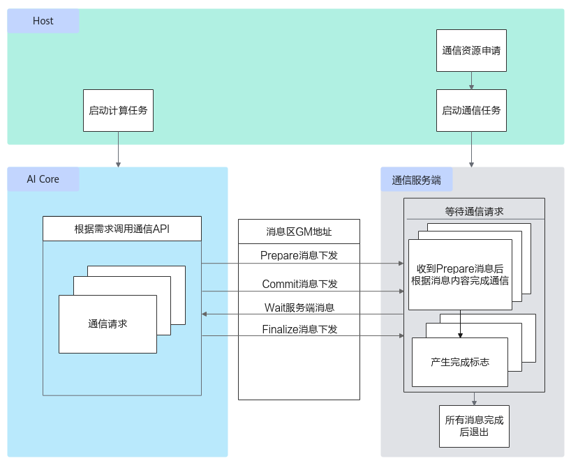

# Ascend 950 系列平台要点

Ascend 950 系列应当作为新一代服务器侧 NPU 平台来学习。对 AI Infra 和算子/编译方向来说，最重要的不是媒体报道里的路线图，而是公开 CANN/asc-devkit 资料已经暴露出的架构能力：`Ascend 950PR / Ascend 950DT`、`__NPU_ARCH__ = 3510`、`DAV_3510`、SIMT、Regbase、L0C->UB、UB->L1、SSBuffer、ND-DMA、FP8/MX/HiF8 等。

本篇只写公开资料能支撑的技术主线。具体 SKU 参数、可用功能、驱动/CANN 支持状态和性能结论，必须以实际设备查询、当前 CANN 文档、编译日志和 profiler 结果为准。

> 图像说明：本篇引用 CANN/asc-devkit 中的官方或准官方架构图。为保证 GitHub Pages 稳定显示，仓库在 `docs/assets/images/ascend/` 保存了这些图片的静态副本；图片版权和授权边界仍归原项目或原厂所有，来源见图注。

## 先看哪些架构图

| 先后 | 图或资料 | 适合用来理解什么 |
| --- | --- | --- |
| 1 | [Ascend 950PR/950DT architecture](https://gitcode.com/cann/asc-devkit/blob/master/docs/api/figures/ascend_950pr_950dt_architecture.png) | 从平台视角看 950PR/950DT 的系统结构和软件栈位置。 |
| 2 | [950 NPU architecture](https://gitcode.com/cann/asc-devkit/blob/master/docs/api/figures/950_npu_arch.png) | 从 NPU 内部视角看 3510 的 AI Core、片上存储、搬运和新增执行单元。 |
| 3 | [Cube compute unit 950](https://gitcode.com/cann/asc-devkit/blob/master/docs/api/figures/architecture_of_cube_compute_unit_950.png) | 理解 950 上 Cube、低精度矩阵乘和 L0A/L0B/L0C 的角色。 |
| 4 | [950 UB memory structure](https://gitcode.com/cann/asc-devkit/blob/master/docs/api/figures/950_UB内存结构图.png) | 理解 3510 UB bank 结构和向量/Regbase/SIMT 工作区。 |
| 5 | [L0C memory structure 950](https://gitcode.com/cann/asc-devkit/blob/master/docs/api/figures/L0C_Memory_Structure_950.png) | 理解 L0C 作为 Cube 累加结果区，为什么会影响 epilogue 和融合。 |
| 6 | [L0C2UB function combination 950](https://gitcode.com/cann/asc-devkit/blob/master/docs/api/figures/L0C2UB_Function_Combination_950.png) | 理解 950 上 Cube 结果直达 UB，为什么能减少 GM 中转。 |
| 7 | [950 HCCL task mechanism](https://gitcode.com/cann/asc-devkit/blob/master/docs/api/figures/Ascend-950PR-Ascend-950DT-AI-Core下发HCCL通信任务机制.png) | 理解通信任务与 AI Core/系统软件之间的关系。 |
| 8 | [Ascend 950PR/950DT feature guide](https://gitcode.com/cann/asc-devkit/blob/master/docs/asc_950_feature_guide.md) | 快速查 3510 相对 2201 的新增特性、API 和实践资料入口。 |

读 950 资料时，建议先建立一个对比坐标：如果 910B/910_93 的学习主线是 `DAV_2201`，那么 950PR/950DT 的学习主线就是 `DAV_3510`。很多新增能力的意义，都要放在“2201 到 3510 的变化”里看。

## 平台视角：950PR / 950DT 在系统里做什么

[](https://gitcode.com/cann/asc-devkit/blob/master/docs/api/figures/ascend_950pr_950dt_architecture.png)

来源：[CANN asc-devkit - Ascend 950PR/950DT architecture](https://gitcode.com/cann/asc-devkit/blob/master/docs/api/figures/ascend_950pr_950dt_architecture.png)

950 系列可以先从 workload 角度理解：

- `950PR` 更适合优先关注 Prefill、大 batch、长上下文、低精度推理和高吞吐推理路径。
- `950DT` 更适合优先关注 Decode、训练、通信扩展和大规模系统形态。
- 这不是严格功能边界，而是学习和实验优先级。真实部署仍然取决于硬件形态、CANN 支持、框架/引擎适配和模型路径。

在系统链路里，950 和 910B 一样，都不是孤立芯片，而是硬件、driver、CANN、框架、推理引擎、算子实现和 workload 的组合：



950 的新增能力主要影响 `D -> E` 这一段：同样一个 MatMul + 后处理，到了 3510 可能不再需要完全沿用 2201 的 GM 中转路径；同样一个离散向量类算子，可能可以考虑 SIMT 或 SIMD/Regbase 的新写法。

## NPU 内部：3510 的新能力在哪里

[](https://gitcode.com/cann/asc-devkit/blob/master/docs/api/figures/950_npu_arch.png)

来源：[CANN asc-devkit - 950 NPU architecture](https://gitcode.com/cann/asc-devkit/blob/master/docs/api/figures/950_npu_arch.png)

`DAV_3510` 仍然保留 AIC/AIV 分离的基本视角：

- `AIC` 主要负责 Cube 矩阵计算。
- `AIV` 主要负责 Vector 和新增 SIMT/SIMD-Regbase 相关路径。
- AIC 与 AIV 常见配比仍可按 `1:2` 理解。
- 每个核仍有 Scalar 控制能力。

但 3510 相对 2201 的关键变化在于：它补了很多“让数据少绕路”的能力，也增加了更接近通用线程模型的 SIMT 能力。

| 新增或增强能力 | 简单理解 | 为什么重要 |
| --- | --- | --- |
| `L0C -> UB` | Cube 结果可以直接到 AIV 的 UB 工作区。 | MatMul 后接 GELU、Cast、量化等 Vector 后处理时，可减少 L0C -> GM -> UB 的中转。 |
| `UB -> L1` | AIV 侧数据可以更直接地给 AIC 侧矩阵路径准备输入。 | CV 融合、格式准备、动态数据整理可能更高效。 |
| `SSBuffer` | AIC/AIV 核间通信新增专用存储路径。 | 减少完全依赖 GM 作为 AIC/AIV 通信媒介。 |
| `SIMD-Regbase` | Vector 计算从 UB 取数到寄存器，中间结果可留在寄存器。 | 减少中间结果反复回写 UB，适合融合向量函数。 |
| `SIMT` | 新增线程级并行硬件单元。 | 对离散、索引、gather/scatter、控制更复杂的算子更友好。 |
| `ND-DMA` | 多维搬运能力增强。 | 非连续、多维 stride 数据可以减少搬运次数和手写重排成本。 |
| `FP8 / MX / HiF8` | Cube 低精度矩阵乘能力增强。 | 推理和训练低精度路径的性能、显存和带宽收益更大。 |

## 主要硬件单元和常见用法

| 模块单元 | 作用 | 一般用法 | 对 AI workload 的影响 |
| --- | --- | --- | --- |
| Host CPU | 执行 tiling、调度、服务逻辑和 runtime 调用。 | 根据 `NpuArch` 选择 3510 路径，保存编译和 profiling 证据。 | 新平台上最怕“看起来跑了，实际走保守路径”。 |
| CANN runtime / compiler | 把框架图、自定义算子和硬件能力连接起来。 | 图编译、算子选择、SIMD/SIMT API、低精度路径、kernel launch。 | 决定新硬件能力是否真正端到端生效。 |
| AI Core | 执行 device kernel 的主入口。 | 多核切分、AIC/AIV 协作、同步和流水。 | 决定单算子占用率和吞吐。 |
| AIC / Cube | 执行 dense 矩阵计算。 | MatMul、Attention score、MLP、MoE expert GEMM、低精度 GEMM。 | Prefill、训练和大 batch 推理的主要吞吐来源。 |
| AIV / Vector | 执行向量计算和部分后处理。 | Norm、Cast、activation、softmax 局部步骤、量化/反量化。 | 后处理能否靠近 Cube 结果，影响 fusion 收益。 |
| SIMT DCache | SIMT 访问 GM 的缓存路径。 | 处理线程级、不规则访存场景。 | 对 gather/scatter、索引类、离散 workload 更关键。 |
| Warp Scheduler | SIMT 的硬件多线程调度。 | 在 AIV 上调度线程组执行。 | 动态或离散场景能否高效隐藏访存延迟。 |
| SIMT Register File | SIMT 程序的寄存器资源。 | 保存 thread 私有数据和中间结果。 | 线程数和寄存器用量会互相制约。 |
| SIMD Register File | SIMD-Regbase 的寄存器层次。 | Vector 数据从 UB 到 Register，中间结果留在寄存器计算。 | VF 融合、连续向量计算可以减少 UB 往返。 |
| UB | AIV 工作区，也被 SIMT/SIMD-Regbase 路径使用。 | 向量 tile、SIMT cacheline、临时数据、UB->L1 搬运。 | UB bank 和容量影响向量、SIMT 和 CV 融合。 |
| L1 | AIC 侧矩阵路径的重要缓存层。 | GM/UB 数据进入 L1，再供给 L0A/L0B。 | 3510 删除 GM->L0A/L0B 后，L1 更像必经入口。 |
| L0A / L0B | Cube 输入操作数 buffer。 | L0A 放左矩阵 tile，L0B 放右矩阵 tile。 | 3510 中 L0A 推荐 `FRACTAL_NZ`，与 2201 不同。 |
| L0C | Cube 累加结果 buffer。 | 保存 GEMM 输出，可经 Fixpipe 到 GM/L1/UB。 | L0C->UB 让 MatMul epilogue 有更强融合空间。 |
| Fixpipe | Cube 结果搬出和随路后处理。 | 量化、反量化、激活、NZ2ND/NZ2DN、L0C 搬出。 | 低精度和 epilogue 融合路径更关键。 |
| SSBuffer | AIC/AIV 核间通信相关存储路径。 | CV 通信、UB->L1 等硬通道场景。 | 减少 GM 中转，降低融合算子通信成本。 |
| HCCL / 通信 | 多 NPU 通信。 | AllReduce、AllToAll、ReduceScatter、通信任务下发。 | 训练扩展、MoE 和分布式推理仍可能被通信主导。 |

## Cube 与低精度矩阵乘

[](https://gitcode.com/cann/asc-devkit/blob/master/docs/api/figures/architecture_of_cube_compute_unit_950.png)

来源：[CANN asc-devkit - Cube compute unit 950](https://gitcode.com/cann/asc-devkit/blob/master/docs/api/figures/architecture_of_cube_compute_unit_950.png)

950 的 Cube 仍然是 Transformer 主要吞吐来源，但要特别关注低精度和数据格式：

- 公开 CANN 资料中，3510 的 Cube 路径覆盖 FP32、FP16、BF16、HiF8、FP8_E4M3、U8、S8 等类型。
- 低精度不是简单把 dtype 改小，还要验证 scale、Cast、Fixpipe、Mmad/MmadMx、误差口径和下游 kernel 是否匹配。
- 950PR/950DT 的特性文档把 FP8/MX/HiF8、Fixpipe 增强、L0C->UB 和 UB->L1 放在新增特性主线里，说明这些能力应当一起看。

典型推理路径里，Prefill 和大 batch 的瓶颈经常是大矩阵乘和 Attention；Decode 则可能更受 KV Cache 读取、调度和小 batch 利用率影响。950 的低精度矩阵能力应该放进端到端实验里验证，而不是只看单个 GEMM 的理论吞吐。

## L0C、UB 与 CV 融合

[](https://gitcode.com/cann/asc-devkit/blob/master/docs/api/figures/L0C_Memory_Structure_950.png)

来源：[CANN asc-devkit - L0C memory structure 950](https://gitcode.com/cann/asc-devkit/blob/master/docs/api/figures/L0C_Memory_Structure_950.png)

[](https://gitcode.com/cann/asc-devkit/blob/master/docs/api/figures/L0C2UB_Function_Combination_950.png)

来源：[CANN asc-devkit - L0C2UB function combination 950](https://gitcode.com/cann/asc-devkit/blob/master/docs/api/figures/L0C2UB_Function_Combination_950.png)

3510 最值得新手重点看的变化之一是 `L0C -> UB`。它的意义可以用 MatMul + 激活来理解：



这不是说所有算子都自动更快，而是给了算子开发者新的设计空间：

- MatMul 结果如果马上接 Vector 后处理，优先评估能否避免 GM 中转。
- 如果后处理是一串 elementwise、Cast、激活、scale，可以考虑 Regbase/VF 融合，减少 UB 中间写回。
- 如果 AIV 处理后的数据要回到 AIC 矩阵路径，可以评估 `UB -> L1` 是否能减少绕路。
- 如果涉及 AIC/AIV 协作，SSBuffer 和同步机制必须纳入设计，不能照搬 2201 的 CrossCore 写法。

## UB 与 SIMT / Regbase

[](https://gitcode.com/cann/asc-devkit/blob/master/docs/api/figures/950_UB内存结构图.png)

来源：[CANN asc-devkit - 950 UB memory structure](https://gitcode.com/cann/asc-devkit/blob/master/docs/api/figures/950_UB内存结构图.png)

950 上 UB 不再只是“向量算子的临时数组”。它还和 Regbase、SIMT DCache、UB->L1、bank 结构变化一起影响算子设计。

| 能力 | 适合先怎么理解 | 常见用法 |
| --- | --- | --- |
| SIMD-Regbase | Vector 数据先从 UB 进 Register，中间结果留在寄存器。 | 多个连续 elementwise、Cast、激活、scale 融合成更少 UB 往返。 |
| SIMT | 面向线程级并行的编程模型，更接近 GPU SIMT 习惯。 | gather/scatter、离散索引、不规则访存、小粒度控制逻辑。 |
| SIMT DCache | SIMT 外部访存要经过 DCache，粒度和 cacheline 影响访问效率。 | 合并访存、减少随机访问、合理组织线程访问模式。 |
| UB bank | 不同 bank group 的读写冲突会影响吞吐。 | 规划 UB 地址、对齐和双缓冲，避免集中访问同一 bank。 |
| UB->L1 | AIV 结果可以进入 AIC 矩阵路径。 | CV 融合、格式准备、AIV 预处理后进入 Cube。 |

新手可以这样判断路径：

- 如果是规则矩阵乘、大块 GEMM，优先看 Cube、L1/L0、低精度和 epilogue。
- 如果是连续向量后处理，优先看 Vector、UB、Regbase 和 VF 融合。
- 如果是离散索引、gather/scatter、不规则控制，优先看 SIMT 和访存合并。
- 如果是 AIC/AIV 串联，优先看 L0C->UB、UB->L1、SSBuffer 和同步。

## 2201 到 3510 的关键变化

| 变化 | 2201 视角 | 3510 视角 | 对工程的影响 |
| --- | --- | --- | --- |
| AIC/AIV 通信 | 常见数据交换依赖 GM 中转。 | 增加 SSBuffer 等通信能力。 | CV 融合不必总按 GM 中转设计。 |
| L0C 到 UB | 通常需要通过 GM 或其他绕行路径给 AIV。 | 增加 L0C->UB 通路。 | MatMul epilogue 后接 Vector 后处理更有优化空间。 |
| UB 到 L1 | 不是主路径。 | 增加 UB->L1 硬通道。 | AIV 预处理后进入 Cube 路径更灵活。 |
| GM 到 L0A/L0B | 可作为部分搬运路径考虑。 | 删除 GM->L0A/L0B 直达路径。 | 要先 GM->L1，再 L1->L0A/L0B。 |
| L1 到 GM | 可作为部分搬运路径考虑。 | 删除 L1->GM 通路。 | 迁移旧算子时要改搬出路径。 |
| L0A 分形 | 2201 推荐 `FRACTAL_ZZ`。 | 3510 推荐 `FRACTAL_NZ`。 | 矩阵搬入和 layout 迁移要重查。 |
| Vector 中间结果 | 更偏 MemBase，UB 往返更常见。 | Regbase 支持寄存器中间结果。 | 一串向量操作可减少 UB 写回。 |
| SIMT | 不是主线能力。 | 增加 SIMT 硬件单元。 | 离散类算子可考虑更接近线程级的写法。 |
| 多维搬运 | 复杂 stride 可能要手工组织。 | ND-DMA 扩展多维搬运能力。 | 非连续数据搬运可以减少拆分次数。 |
| UB bank | bank 结构与读写约束按 2201 设计。 | bank 组织和并发读写约束变化。 | 不能把 2201 的 bank conflict 经验原样套用。 |

这一张表应该成为 950 迁移 skill 的核心：给 AI 一份旧算子实现，让它先检查这些变化点，而不是直接“替换型号参数”。

## 通信：训练、MoE 和分布式推理仍然绕不开

[](https://gitcode.com/cann/asc-devkit/blob/master/docs/api/figures/Ascend-950PR-Ascend-950DT-AI-Core下发HCCL通信任务机制.png)

来源：[CANN asc-devkit - Ascend 950PR/950DT AI Core 下发 HCCL 通信任务机制](https://gitcode.com/cann/asc-devkit/blob/master/docs/api/figures/Ascend-950PR-Ascend-950DT-AI-Core下发HCCL通信任务机制.png)

950 的单卡能力提升，不会自动消除多卡系统问题。下面这些 workload 仍然需要把通信作为一等公民：

- `训练`：DP/FSDP/ZeRO 的 ReduceScatter、AllGather、AllReduce 是否能与 backward/optimizer 重叠。
- `Tensor Parallel`：层内 GEMM 切分会引入 AllReduce 或 ReduceScatter。
- `MoE`：token dispatch/combine 常见 AllToAll，尾延迟受 expert placement 和负载均衡影响。
- `多机推理`：Prefill/Decode 分离、长上下文和 KV Cache 分布会改变通信模式。
- `容错和调度`：大规模系统里，rank mapping、拓扑、故障域和重试策略会直接影响稳定性。

因此 950 的 benchmark 不能只跑单卡 GEMM。至少要分开记录单卡算子、多卡通信、端到端训练 step time、端到端推理 TTFT/TPOT、MoE token 分布和 profiler timeline。

## 经典场景代码：查询 3510 并选择新路径

下面代码展示 Host 侧根据 `NpuArch` 和片上资源选择路径。它不是完整生产代码，重点是“先判断架构，再决定是否启用 3510 专用 tiling 和 kernel”。

```cpp
#include "register/tilingdata_base.h"
#include "tiling/platform/platform_ascendc.h"

struct PlatformSummary {
    bool isDav3510;
    uint32_t aicNum;
    uint32_t aivNum;
    uint64_t ubSize;
    uint64_t l1Size;
    uint64_t l0cSize;
};

static PlatformSummary QueryPlatform(gert::TilingContext* context)
{
    auto platform = platform_ascendc::PlatformAscendC(context->GetPlatformInfo());

    PlatformSummary summary {};
    summary.isDav3510 =
        platform.GetCurNpuArch() == platform_ascendc::NpuArch::DAV_3510;
    summary.aicNum = platform.GetCoreNumAic();
    summary.aivNum = platform.GetCoreNumAiv();
    platform.GetCoreMemSize(platform_ascendc::CoreMemType::UB, summary.ubSize);
    platform.GetCoreMemSize(platform_ascendc::CoreMemType::L1, summary.l1Size);
    platform.GetCoreMemSize(platform_ascendc::CoreMemType::L0_C, summary.l0cSize);
    return summary;
}

ge::graphStatus TilingMatmulEpilogue(gert::TilingContext* context)
{
    const PlatformSummary platform = QueryPlatform(context);

    if (platform.isDav3510) {
        // 3510 路径：优先评估 L0C->UB、Regbase、UB->L1、低精度路径。
        BuildTilingForL0cToUbEpilogue(context, platform);
    } else {
        // 2201 或其他架构：保守路径通常要考虑 GM 中转和旧数据通路。
        BuildPortableTiling(context, platform);
    }

    const uint32_t sliceNum = EstimateSliceNum(context);
    context->SetBlockDim(
        platform_ascendc::PlatformAscendC(context->GetPlatformInfo())
            .CalcTschNumBlocks(sliceNum, platform.aicNum, platform.aivNum));
    return ge::GRAPH_SUCCESS;
}
```

工程上建议把 `PlatformSummary` 这类信息写进 benchmark 报告和 AI skill 的输入上下文里。否则 AI 看到一个 kernel 慢，很难判断是算子写法问题、架构分支问题，还是平台能力没有启用。

## 经典场景代码：L0C -> UB 的 MatMul epilogue 骨架

下面是一个“代码形态示意”，用于说明 950 上 MatMul 结果可以优先考虑从 L0C 进入 UB，再做 Vector/Regbase 后处理。真实工程要以当前 CANN API、头文件、样例和编译器支持为准。

```cpp
#include "kernel_operator.h"

using namespace AscendC;

template <typename T>
__aicore__ inline void MatmulEpilogue950(
    LocalTensor<float> cL0c,
    LocalTensor<T> epilogueUb,
    GlobalTensor<T> outGm,
    uint32_t m, uint32_t n)
{
#if defined(__NPU_ARCH__) && (__NPU_ARCH__ == 3510)
    // 3510 思路：
    // 1. Cube 结果保存在 L0C。
    // 2. 通过 Fixpipe / L0C->UB 能力把结果送入 UB。
    // 3. 在 UB/Register 上做 Cast、activation、scale 或 quant。
    // 4. 最后从 UB 写回 GM。
    //
    // 这里使用伪函数名表达数据路径；真实项目应替换为当前 CANN
    // 文档中的 Fixpipe、asc_copy_l0c2ub 或对应高阶 API。
    CopyL0CToUB(epilogueUb, cL0c, m, n);
    GeluOrCastOrQuantInUB(epilogueUb, m * n);
    DataCopy(outGm, epilogueUb, m * n);
#else
    // 兼容路径：
    // 2201 上常见做法是 L0C->GM，再由 AIV 从 GM->UB 做后处理。
    // 这会多一次 GM 往返，性能结论要单独记录。
    GlobalTensor<T> tmpGm = GetTemporaryGlobalTensor<T>();
    Fixpipe(tmpGm, cL0c, BuildFixpipeParams(m, n));
    CopyGmToUbAndPostProcess(epilogueUb, tmpGm, outGm, m, n);
#endif
}
```

这段代码要表达的不是 API 名称，而是设计原则：

- 3510 上先问“这个 MatMul epilogue 是否能留在片上完成”，再决定是否写回 GM。
- 如果后处理只是 Cast、GELU、Scale、Quant，优先评估 UB/Register 内融合。
- 如果旧实现依赖 GM 中转，迁移到 950 时应该把它作为明确优化项。
- 如果要同时支持 2201 和 3510，架构分支要显式写清，不能让编译器或运行时隐式猜。

## 经典场景代码：SIMT 更适合离散访问

SIMT 不应该替代所有 SIMD/Cube 路径。它更适合离散索引、gather/scatter、条件较多或线程级并行更自然的场景。下面是一个简化的 gather 思路：

```cpp
// 示意：每个线程根据 index 读取一个元素，适合先理解 SIMT 的使用场景。
// 真实项目应按 CANN SIMT API、线程层次、访存合并和同步规则实现。
extern "C" __global__ __aicore__ void gather_simt(
    GM_ADDR input, GM_ADDR index, GM_ADDR output, uint32_t length)
{
#if defined(__NPU_ARCH__) && (__NPU_ARCH__ == 3510)
    const uint32_t tid = GetSimtThreadId();
    const uint32_t stride = GetSimtThreadCount();

    for (uint32_t i = tid; i < length; i += stride) {
        const uint32_t src = LoadIndex(index, i);
        Store(output, i, Load(input, src));
    }
#else
    // 非 3510 平台走 SIMD 或通用实现。
    GatherPortable(input, index, output, length);
#endif
}
```

这个例子适合写进 skill 的原因是：AI 在看到 gather/scatter、MoE token dispatch、稀疏索引、RAG/Agent 变长数据时，可以先判断是不是 SIMT 候选，而不是只尝试把它塞进普通 Vector 算子模板。

## 950 系列实验清单

| 阶段 | 必要检查 |
| --- | --- |
| 平台识别 | 记录设备名、`SocVersion`、`NpuArch`、`__NPU_ARCH__`、CANN、driver、framework。 |
| 功能基线 | 小输入、小 batch、固定随机种子，确认模型或算子能稳定运行。 |
| 架构路径 | 确认是否启用了 3510 专用路径，如 L0C->UB、Regbase、SIMT、低精度或 ND-DMA。 |
| 精度验证 | FP16/BF16/FP8/MX/量化路径分别定义误差口径和对照结果。 |
| 性能验证 | 分开测单算子、端到端推理、训练 step、多卡通信和 MoE/RAG/Agent workload。 |
| Profiler 证据 | 保存 kernel timeline、memory、communication、runtime、host 等证据。 |
| 迁移结论 | 记录旧 2201 路径、3510 新路径、收益、限制和回退方案。 |

## 适合沉淀成 skill 的方向

950 这类新平台最值得沉淀的不是“参数大全”，而是可复用判断流程：

- `架构能力判断`：从设备日志、`SocVersion`、`NpuArch` 和编译宏判断是否能启用 3510 路径。
- `2201 -> 3510 迁移检查`：检查 GM->L0A/L0B、L1->GM、L0A 分形、L0C->UB、UB->L1、SSBuffer、Regbase、SIMT。
- `MatMul epilogue 优化`：判断后处理能否通过 Fixpipe、UB、Regbase 在片上完成。
- `低精度验证`：判断 FP8/MX/量化是否端到端生效，而不只是单 kernel 支持。
- `SIMT 候选识别`：判断离散类、索引类、不规则访存类算子是否适合 SIMT。
- `Benchmark 证据打包`：把 profiler、配置、日志、输入 shape 和结论组织成 AI 能继续分析的证据包。

## 参考资料

- [CANN asc-devkit](https://gitcode.com/cann/asc-devkit) 提供 CANN/Ascend C 示例、API、架构图和编程指南。
- [Ascend 950PR/Ascend 950DT 新增特性导航](https://gitcode.com/cann/asc-devkit/blob/master/docs/asc_950_feature_guide.md) 汇总了 3510 的 Regbase、SIMT、L0C->UB、UB->L1、ND-DMA、低精度和 Fixpipe 增强等入口。
- [NPU 架构版本 3510](https://gitcode.com/cann/asc-devkit/blob/master/docs/guide/编程指南/高级编程/硬件实现/架构规格/NPU架构版本3510.md) 是理解 950PR/950DT 硬件结构和存储/搬运/计算单元的主要资料。
- [2201 到 3510 架构变更](https://gitcode.com/cann/asc-devkit/blob/master/docs/guide/跨代迁移兼容性指南/3510架构迁移指导/2201到3510架构变更.md) 适合迁移旧算子或旧优化经验时逐项检查。
- [CANNBot npu-arch skill](https://gitcode.com/cann/cannbot-skills/blob/master/ops/npu-arch/SKILL.md) 展示了把架构识别、硬件参数和跨代差异组织成 AI skill 的方式。
