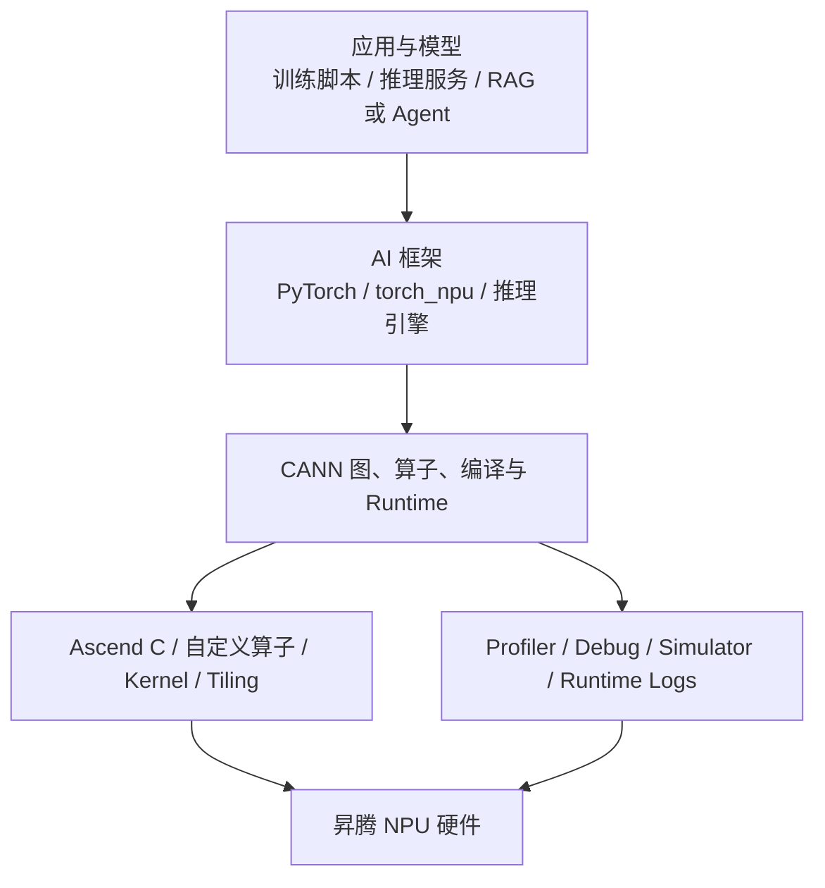

# Ascend/CANN 软件栈与开发入口

CANN 可以理解为昇腾平台的核心软件栈入口。对 AI Infra 来说，它连接了硬件、编译器、runtime、框架、算子开发、模型推理优化、profiling 和问题诊断。

不要把 CANN 只看成一个安装包。更实用的视角是：所有“模型能不能跑、为什么慢、哪里不支持、怎么定位”的问题，最终都会落到 CANN 与上层框架、下层硬件之间的接口上。

## 软件栈位置

这张图说明：当模型慢或报错时，不能只看 Python 代码，也不能直接跳到硬件参数。要先判断问题落在哪一层。

## CANN 相关入口

| 入口 | 典型问题 |
| --- | --- |
| Toolkit / Runtime / Driver | 当前软件栈是否支持目标设备、模型和编译路径。 |
| torch_npu | PyTorch 模型如何迁移到 NPU，哪些算子有支持路径，哪里发生 fallback。 |
| 图模式 / torch.compile | 图捕获、编译、fusion、dynamic shape 和性能稳定性。 |
| Ascend C | 自定义算子、tiling、片上存储、数据搬运和架构特化。 |
| Profiling | kernel、runtime、通信、内存和 host/device 时间线。 |
| Simulator | 无真实硬件或新架构验证时的功能、性能和流水线分析入口。 |
| Model inference skills | 模型迁移、KV Cache、fusion、量化、graph mode、多流、prefetch、superkernel 等专项优化。 |

## 从问题到入口

| 现象 | 优先入口 |
| --- | --- |
| 模型不能启动或 import 失败 | 环境、driver、CANN、torch_npu 版本。 |
| 某个算子不支持 | 框架算子覆盖、CANN 文档、自定义算子或替代实现。 |
| 精度对不上 | dtype、layout、融合、近似实现、随机性、算子精度调试。 |
| 推理 TTFT 慢 | Prefill kernel、batching、KV Cache、图模式、输入长度分布。 |
| Decode TPOT 慢 | KV Cache、attention kernel、调度、显存带宽、低精度路径。 |
| 训练 step 慢 | data pipeline、forward/backward kernel、collective 通信、overlap、显存和 checkpoint。 |
| 多卡扩展差 | rank mapping、通信库、网络、parallel strategy、collective timeline。 |
| 新平台适配 | NpuArch、SocVersion、CANN 支持矩阵、simulator、最小 workload。 |

## CANNBot 给知识库的启发

CANNBot Skills 仓库值得参考的不是某一篇具体文档，而是它的组织方法：

- 把“科普知识”与“可执行任务流程”分开。
- 对重复性工作写 skill，例如环境检查、算子设计、代码生成、性能调优、精度调试、模型迁移、KV Cache 优化。
- 每个 skill 关注一个明确任务，给出触发条件、输入、步骤、输出模板和引用来源。
- 对 CANN 路径、文档、工具和环境变量做封装，避免在多个 skill 中硬编码路径。
- 把 NPU 架构判断、profiling、simulator、Triton、TileLang、Ascend C、模型推理优化分别拆成独立能力。

本仓库目前不复制 CANNBot 的内容，而是借鉴它的“工作流化知识”思路。后续团队自己的硬件适配、性能分析和故障处理经验，也应该按这个方向沉淀。

## AI 诊断前应补齐的信息

当把 NPU 问题交给 AI 分析时，最少提供：

- 目标任务：训练、推理、算子开发、编译、模型迁移、性能调优、精度调试还是故障处理。
- 硬件信息：设备型号、设备数量、拓扑、SocVersion、NpuArch。
- 软件栈：CANN、driver、runtime、torch_npu、PyTorch、推理引擎、容器镜像。
- Workload：模型、输入输出长度、batch、并发、precision、并行策略。
- 错误或现象：完整日志、错误码、慢在哪里、是否可稳定复现。
- 证据文件：benchmark 输出、profiler timeline、配置文件、最小复现代码。

缺少这些信息时，AI 应该先要求补证据，而不是直接给结论。

## 参考资料

- [CANNBot Skills 项目主页](https://gitcode.com/cann/cannbot-skills) 说明该仓库为 CANN 开发提供可复用 Skills 模块。
- [CANNBot README](https://gitcode.com/cann/cannbot-skills/blob/master/README.md) 列出了 Ascend C、PyPTO、TileLang、Triton、NPU 模型推理优化、torch.compile 等多类 skill。
