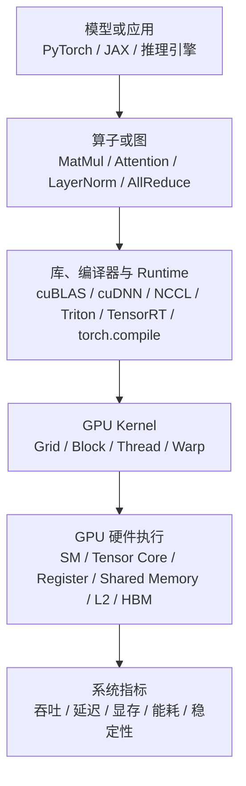
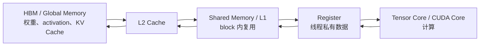

# GPU 架构基础

GPU 可以先理解成“为大规模并行吞吐设计的处理器”。CPU 更擅长复杂控制流、低延迟串行逻辑和操作系统管理；GPU 更擅长把同一种计算同时作用到大量数据上。AI 训练和推理里最核心的 MatMul、卷积、Attention、MLP、embedding lookup、normalization、sampling 和数据搬运，往往都能拆成大量相似的小任务，因此非常适合 GPU。

但 GPU 不是“只要有算力峰值就会快”。模型真正跑起来时，性能取决于算子如何切分、数据如何复用、显存带宽是否够、kernel launch 是否太碎、Tensor Core 是否被用上、多卡通信是否卡住，以及框架、编译器和 runtime 是否走到了正确路径。

## 一个最小视角

这条链路说明：AI workload 到 GPU 不是一步到位的。模型代码先被拆成算子或图，再由库、编译器和 runtime 选择或生成 kernel，最后由 GPU 的硬件执行模型完成计算。

## GPU 里最重要的几个层次

| 层次 | 可以怎么理解 | 为什么重要 |
| --- | --- | --- |
| Host CPU | 提交任务、准备数据、调度进程、运行 Python 和服务逻辑。 | CPU 侧过慢会造成 GPU 等待，表现为利用率低或请求排队。 |
| Kernel | 在 GPU 上运行的一段设备程序。 | AI 算子最终要落成一个或多个 kernel，kernel 数量和质量直接影响端到端性能。 |
| Grid / Block / Thread | kernel 启动后被拆成很多 block，每个 block 包含很多 thread。 | 决定并行粒度、资源占用和调度方式。 |
| SM | Streaming Multiprocessor，GPU 内部执行 thread block 的主要计算单元。 | SM 数量、调度、寄存器、shared memory 和 Tensor Core 决定单卡计算能力。 |
| Warp | 一组线程以 SIMT 方式一起执行，NVIDIA GPU 通常以 warp 为基本调度单位。 | 分支发散、访存不连续、线程利用率低都会浪费 warp 执行效率。 |
| Tensor Core | 面向矩阵乘累加的专用单元。 | Transformer 中大量 GEMM、Attention 和 MLP 性能依赖 Tensor Core 是否被充分使用。 |
| Register | 每个线程私有的高速寄存器。 | 寄存器太少会限制性能，寄存器使用太多会降低 occupancy，甚至发生 spill。 |
| Shared Memory | 同一个 block 内线程共享的片上高速存储。 | 常用于 tiling、数据复用、避免反复访问 HBM。 |
| L2 Cache | GPU 上较大的共享缓存层。 | 影响跨 SM 数据复用、KV Cache 访问、权重读取和不规则访存效率。 |
| HBM / Global Memory | GPU 外部高带宽显存，存放权重、activation、KV Cache 和临时 buffer。 | 大模型经常受 HBM 容量和带宽限制，而不只是受算力限制。 |
| Interconnect | PCIe、NVLink、NVSwitch、RDMA 等 GPU 与 CPU、GPU 与 GPU、GPU 与网络之间的连接。 | 分布式训练、Tensor Parallel、Expert Parallel 和大规模推理会被通信链路约束。 |

## SIMT、Warp 和 SM 是怎么一起工作的

GPU 的并行性可以从三个层级理解：

1. 一个 kernel 被启动成很多 thread block。
2. 每个 thread block 被分配到某个 SM 上执行。
3. SM 内部把线程组织成 warp，以 SIMT 方式发射指令。

SIMT 可以理解为“很多线程执行同一条指令，但每个线程处理自己的数据”。例如一个矩阵乘 kernel 中，不同线程负责不同 tile 或 tile 内不同元素。这样做的好处是硬件可以用很高吞吐处理规则计算；代价是如果同一个 warp 里的线程走不同分支，或者访存地址非常分散，硬件效率会下降。

对 AI 系统工程来说，理解 SIMT 不是为了手写所有 CUDA kernel，而是为了看懂几个常见现象：

- 为什么 shape 太小或 batch 太小会让 GPU 吃不满。
- 为什么很多小算子串起来会被 kernel launch overhead 和内存读写拖慢。
- 为什么 fused kernel、MegaKernel 或 CUDA Graph 能减少调度和访存开销。
- 为什么不规则 routing、稀疏访问、动态 shape 和长尾请求会让 GPU 利用率变差。

## Tensor Core 为什么重要

Transformer 的主要计算量集中在矩阵乘上，例如：

- Q/K/V projection。
- Attention score 的矩阵乘。
- Attention output projection。
- MLP 的 up/gate/down projection。
- 训练时的 backward GEMM。
- 大词表输出层的 logits 计算。

Tensor Core 可以把小块矩阵乘累加用专用硬件高速执行。实际能不能用上 Tensor Core，取决于 dtype、shape、layout、stride、对齐、kernel 实现和编译路径。只把模型改成 FP16、BF16、TF32 或 FP8，并不自动保证所有热点都跑在最优路径上。

判断 Tensor Core 是否真正发挥作用，不能只看理论 TFLOPS。更可靠的方法是结合 profiler 查看热点 kernel、矩阵 shape、achieved FLOP/s、memory bandwidth、occupancy、warp stall、Tensor Core 指标和端到端吞吐。

## GPU 内存层次和数据复用

GPU 上的计算通常不是“算力越大越快”，而是“数据能不能及时送到计算单元”。一个简化的数据路径是：

高性能 kernel 通常会尽量把数据从 HBM 读进来后，在片上多用几次。例如矩阵乘会把矩阵切成 tile，让一个 tile 在 shared memory 或 register 中反复参与计算。FlashAttention 的核心思想也可以从这个角度理解：不要把完整 attention matrix 写回 HBM，而是在片上分块计算 softmax 和加权求和，减少 HBM 读写。

对 LLM 推理来说，Decode 阶段经常受 KV Cache 读取影响。每生成一个 token，都需要读取已有上下文的 K/V。上下文越长、并发越高，HBM 容量和带宽压力越大。这也是为什么 PagedAttention、KV Cache 量化、Prefix Cache、分离部署和调度策略会显著影响推理系统性能。

## 从 AI 算子看 GPU

| AI 负载 | GPU 上通常关注什么 |
| --- | --- |
| 大 GEMM / MLP | Tensor Core 利用率、shape 对齐、batch 大小、layout、epilogue fusion。 |
| Attention Prefill | 大矩阵乘和 attention kernel，关注 FlashAttention、序列长度、mask、HBM 读写。 |
| Attention Decode | 每步 token 计算小、KV 读取多，关注 KV Cache layout、batching、memory bandwidth 和调度。 |
| LayerNorm / RMSNorm | 计算量小但读写频繁，关注 fusion 和 memory bandwidth。 |
| Softmax / Sampling | 常是小算子或 memory-bound，关注 fusion、batching 和 host/device 同步。 |
| MoE | router、token dispatch/combine、专家 GEMM、AllToAll 和负载不均。 |
| 训练 backward | forward 热点会放大，额外关注 activation 保存/重算、gradient、optimizer state 和通信重叠。 |
| 多卡通信 | NCCL、rank mapping、拓扑、bucket、overlap、网络拥塞和尾部 rank。 |

## GPU 适合什么，不适合什么

GPU 适合：

- 大规模规则并行计算。
- dense GEMM、卷积、batched matmul、FlashAttention 等成熟高性能算子。
- 有足够 batch、sequence、head、hidden size 可以摊开并行度的 workload。
- 需要成熟生态的训练、推理、profiling、通信和自定义 kernel 开发。

GPU 不擅长或需要额外优化：

- 极小 batch、极短序列、很多小算子串联的 workload。
- 强动态控制流、分支发散、不规则稀疏访问。
- 频繁 host/device 同步、频繁 kernel launch、CPU 侧服务逻辑过重。
- Decode 阶段 KV Cache 带宽压力很高的长上下文和高并发负载。
- 多机训练中通信、存储或数据输入已经成为瓶颈的情况。

因此 GPU 优化不是单纯“换更强的卡”，而是要把 workload 映射到 GPU 擅长的形态上。

## 常见优化方向

| 方向 | 核心问题 | 典型手段 |
| --- | --- | --- |
| 让计算更像大块矩阵乘 | 是否有足够并行度和 Tensor Core 利用率。 | 合理 batch、shape 对齐、使用高性能 GEMM/Attention kernel。 |
| 减少 HBM 读写 | 是否反复把中间结果写回显存。 | kernel fusion、FlashAttention、epilogue fusion、activation checkpointing。 |
| 提高数据局部性 | 数据是否能在 register、shared memory、L2 中复用。 | tiling、layout 调整、coalesced access、KV Cache layout 优化。 |
| 降低 launch 和调度开销 | 是否有大量小 kernel 或 CPU/GPU 同步。 | CUDA Graph、torch.compile、TensorRT、Triton fusion、persistent kernel。 |
| 控制显存占用 | 权重、activation、KV、optimizer state 哪类对象占主导。 | 量化、ZeRO/FSDP、KV Cache 管理、checkpointing、offload。 |
| 优化多卡通信 | 通信是否压过计算，拓扑是否匹配并行策略。 | NCCL 调优、rank mapping、bucket、overlap、并行策略重排。 |
| 用 profiler 找证据 | 慢在哪里，是否与猜测一致。 | Nsight Systems、Nsight Compute、PyTorch Profiler、DCGM、benchmark manifest。 |

## 最小记录清单

做 GPU 相关实验时，至少记录：

- GPU 型号、数量、拓扑、驱动、CUDA、cuDNN、NCCL、框架和推理引擎版本。
- 模型、precision、batch、sequence length、输入输出长度分布、并发和并行策略。
- 是否使用 TensorRT、Triton、torch.compile、CUDA Graph、FlashAttention、量化、KV Cache 优化或 fused kernel。
- 显存峰值、GPU 利用率、HBM 带宽、SM/Tensor Core 利用率、通信耗时和端到端指标。
- profiler trace、benchmark 原始数据、配置文件和可复现命令。

这些信息后续可以进入 benchmark report、ADR、failure case 或 AI skill。没有这些上下文时，“GPU 利用率低”“显存不够”“吞吐不达标”都很难形成可复用结论。

## 参考资料

- [CUDA C++ Programming Guide](https://docs.nvidia.com/cuda/cuda-programming-guide/index.html) 说明 CUDA 编程模型、thread hierarchy、memory hierarchy 和 SIMT 等基础概念。
- [CUDA C++ Best Practices Guide](https://docs.nvidia.com/cuda/cuda-c-best-practices-guide/index.html) 介绍内存访问、并行度、profiling 和性能优化实践。
- [NVIDIA Deep Learning Performance - GPU Performance Background](https://docs.nvidia.com/deeplearning/performance/dl-performance-gpu-background/index.html) 解释深度学习 workload、GPU 执行和 Tensor Core 相关背景。
