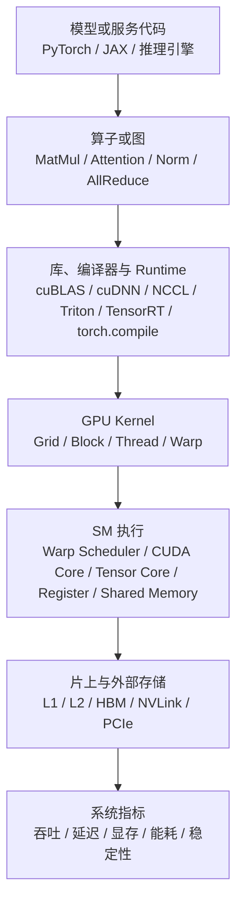
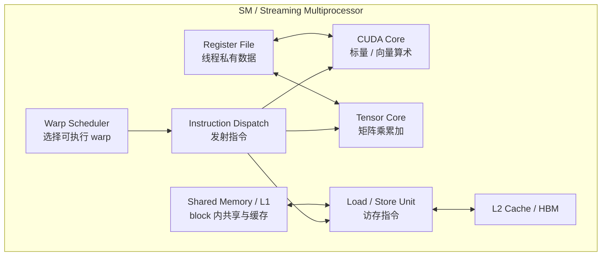
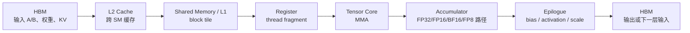

# GPU 架构基础

GPU 可以先理解成“为大规模并行吞吐设计的处理器”。CPU 更擅长复杂控制流、低延迟串行逻辑和操作系统管理；GPU 更擅长把同一种计算同时作用到大量数据上。AI 训练和推理里最核心的 MatMul、卷积、Attention、MLP、embedding lookup、normalization、sampling 和数据搬运，往往都能拆成大量相似的小任务，因此适合 GPU。

但 GPU 不是“只要有算力峰值就会快”。模型真正跑起来时，性能取决于算子如何切分、数据如何复用、显存带宽是否够、kernel launch 是否太碎、Tensor Core 是否被用上、多卡通信是否卡住，以及框架、编译器和 runtime 是否走到了正确路径。

> 图像说明：本篇中的官方图通过远程 URL 引用 NVIDIA 官方文档图片，图片版权归 NVIDIA。仓库不复制这些图片文件；如果离线阅读看不到图片，可以点击图下注明的官方来源。

## 先看哪些官方架构图

GPU 架构资料很多，新手不建议一开始就读完整芯片白皮书。更合理的顺序是先读 CUDA 编程模型图，再读内存层次图，最后再看某一代 GPU 的架构白皮书。

| 先后 | 官方图或资料 | 适合用来理解什么 |
| --- | --- | --- |
| 1 | [Deep Learning Performance: simple GPU architecture](https://docs.nvidia.com/deeplearning/performance/dl-performance-gpu-background/index.html) | GPU 由多个 SM、片上缓存、显存接口和互连组成，不是一个单独的大核心。 |
| 2 | [CUDA Programming Model: CPU/GPU system diagram](https://docs.nvidia.com/cuda/cuda-programming-guide/01-introduction/programming-model.html) | CPU host、GPU device、kernel launch 和 device memory 的关系。 |
| 3 | [CUDA Programming Model: grid of thread blocks](https://docs.nvidia.com/cuda/cuda-programming-guide/01-introduction/programming-model.html) | 一个 kernel 如何被拆成 grid、block 和 thread。 |
| 4 | [CUDA Programming Model: thread blocks scheduled on SMs](https://docs.nvidia.com/cuda/cuda-programming-guide/01-introduction/programming-model.html) | block 如何被调度到 SM 上执行。 |
| 5 | [CUDA Programming Model: active warp lanes](https://docs.nvidia.com/cuda/cuda-programming-guide/01-introduction/programming-model.html) | warp 内线程分支不一致时，为什么会浪费执行效率。 |
| 6 | [CUDA Best Practices Guide: memory spaces](https://docs.nvidia.com/cuda/cuda-c-best-practices-guide/index.html) | register、shared memory、L2/global memory 等内存空间的关系。 |
| 7 | [NVIDIA A100 Tensor Core GPU Architecture Whitepaper](https://www.nvidia.com/content/dam/en-zz/Solutions/Data-Center/nvidia-ampere-architecture-whitepaper.pdf) | 从 GA100 这样的具体芯片看 GPC、SM、HBM、NVLink、L2、Tensor Core 等单元如何组合。 |

这些图解决的是不同层次的问题：编程模型图解释“程序怎么表达并行”，内存层次图解释“数据怎么流动”，白皮书架构图解释“具体芯片里有哪些硬件资源”。

## GPU 的整体结构

先看 NVIDIA 深度学习性能文档中的简化 GPU 架构图：

来源：[NVIDIA Deep Learning Performance - GPU Performance Background](https://docs.nvidia.com/deeplearning/performance/dl-performance-gpu-background/index.html)

这张图要抓住三件事：

- GPU 不是一个大核心，而是一组可以并行工作的 SM。
- SM 旁边有片上缓存和互连，外面连接大容量高带宽显存。
- AI kernel 的目标是让 SM 尽量忙，同时减少从外部显存反复搬数据。

把它放到 AI 系统里，可以理解成下面这条链路：

这条链路说明：AI workload 到 GPU 不是一步到位的。模型代码先被拆成算子或图，再由库、编译器和 runtime 选择或生成 kernel，最后由 GPU 的硬件执行模型完成计算。

## Host、Device 和 Kernel Launch

CUDA 编程模型把 CPU 侧称为 host，把 GPU 侧称为 device。多数 AI 程序虽然不是直接写 CUDA C++，但底层仍然遵循类似边界：Python、服务逻辑、tokenizer、调度器和数据准备多在 host 侧；大规模 tensor 计算在 device 侧。

来源：[CUDA C++ Programming Guide - Programming Model](https://docs.nvidia.com/cuda/cuda-programming-guide/01-introduction/programming-model.html)

| 单元 | 用途 | 常见操作 | AI 系统里常见问题 |
| --- | --- | --- | --- |
| Host CPU | 提交 GPU 任务、准备输入、运行服务逻辑。 | 启动 kernel、管理 stream、处理 tokenizer、调度请求。 | CPU 侧排队、Python overhead、频繁同步导致 GPU 空转。 |
| Device GPU | 执行大规模 tensor 计算。 | 运行 CUDA kernel、调用 cuBLAS/cuDNN/Triton/TensorRT kernel。 | kernel 太碎、shape 太小、显存读写过多、算子 fallback。 |
| Device Memory | 存放权重、activation、KV Cache、临时 buffer。 | 分配显存、拷贝数据、复用 buffer、做 memory planning。 | OOM、碎片、KV Cache 膨胀、host-device copy 过多。 |
| Kernel Launch | host 发起 device 上的一段并行程序。 | `kernel<<<grid, block>>>`、库函数调用、CUDA Graph replay。 | 大量小 kernel 会被 launch overhead 放大。 |

新手最容易忽略的是 host/device 同步。很多时候 GPU 本身不慢，慢在 CPU 一边不断等待 GPU、GPU 一边又等 CPU 发下一个小任务。推理服务里如果 tokenizer、调度、streaming、采样或日志处理过重，GPU 利用率会明显下降。

## Grid、Block、Thread：程序如何表达并行

一个 CUDA kernel 启动后，会被组织成一个 grid；grid 里有多个 thread block；block 里有多个 thread。

来源：[CUDA C++ Programming Guide - Thread Hierarchy](https://docs.nvidia.com/cuda/cuda-programming-guide/01-introduction/programming-model.html)

可以把这张图对应到矩阵乘：

- grid：整个矩阵乘任务。
- block：矩阵 C 的一个 tile。
- thread：tile 内某个元素或一组元素的计算者。
- block 内共享资源：同一个 tile 的线程可以共享 shared memory。

| 概念 | 用途 | 常见操作 | 基础判断 |
| --- | --- | --- | --- |
| Grid | 表示整个 kernel 的并行任务集合。 | 选择 grid 维度覆盖输出 tensor。 | grid 太小会导致 SM 吃不满。 |
| Block | 被调度到 SM 上执行的基本任务单元。 | 常见 block size 是 128、256、512 等，需要结合 kernel 资源调。 | block 太小并行度不足，太大可能占用过多寄存器或 shared memory。 |
| Thread | 执行指令的最小编程视角。 | 根据 `threadIdx`、`blockIdx` 映射数据位置。 | 线程访问地址不连续会影响 memory coalescing。 |
| Tile | 高性能 AI kernel 常用的数据分块。 | GEMM/Attention 中把矩阵切成小块复用。 | tile 形状决定 Tensor Core、shared memory、register 的效率。 |

在 PyTorch、Triton 或 TensorRT 里，你通常不会直接写 `grid` 和 `block`，但这些概念仍然决定最终 kernel 的性能。Triton 的 `program_id`、block size、num warps、tile shape，本质上就是在表达类似的并行划分。

## SM：GPU 的主要执行单元

Thread block 会被调度到 SM 上执行。SM 内部包含 warp scheduler、CUDA core、Tensor Core、load/store 单元、寄存器文件、shared memory/L1 等资源。不同 GPU 代际的 SM 细节会变，但“block 上 SM，warp 在 SM 内调度”这个基本视角稳定。

来源：[CUDA C++ Programming Guide - Thread Block Scheduling](https://docs.nvidia.com/cuda/cuda-programming-guide/01-introduction/programming-model.html)

一个简化的 SM 内部视角如下：

| 单元 | 用途 | 常见操作 | 常见性能信号 |
| --- | --- | --- | --- |
| Warp Scheduler | 从准备好的 warp 中选择发射。 | 通过足够 occupancy 隐藏访存延迟。 | warp stall、eligible warps、issue active。 |
| CUDA Core | 执行普通算术、地址计算、部分标量/向量操作。 | elementwise、index、mask、部分 reduction。 | 算术利用率低、分支多、指令开销高。 |
| Tensor Core | 执行矩阵乘累加。 | cuBLAS、CUTLASS、Triton `tl.dot`、TensorRT engine。 | Tensor Core utilization、achieved FLOP/s、mma 指令占比。 |
| Register File | 保存线程私有变量和中间结果。 | kernel 编译器分配，程序员通过代码复杂度间接影响。 | register spill、occupancy 降低、本地内存访问增加。 |
| Shared Memory / L1 | block 内线程共享的片上存储和缓存。 | tiling、staging、reduction、async copy。 | bank conflict、shared load/store、L1 hit rate。 |
| Load / Store Unit | 执行 global/shared/local memory 访问。 | coalesced load/store、vectorized load、prefetch。 | memory throughput、uncoalesced access、stall memory dependency。 |

做 AI kernel 优化时，通常不是单独追求某个单元满载，而是让 Tensor Core、访存和调度形成稳定流水线。例如 GEMM 里，数据从 HBM 到 shared memory，再到 register，然后进入 Tensor Core；如果任何一段供不上，Tensor Core 就会等待。

## Warp 和 SIMT：为什么分支会浪费算力

NVIDIA GPU 通常以 warp 为基本调度单位。SIMT 可以理解为“很多线程执行同一条指令，但每个线程处理自己的数据”。如果一个 warp 内不同线程走不同分支，硬件会屏蔽一部分 lane，分多次执行不同路径。

来源：[CUDA C++ Programming Guide - SIMT Architecture](https://docs.nvidia.com/cuda/cuda-programming-guide/01-introduction/programming-model.html)

| 现象 | 为什么会发生 | 常见处理方式 |
| --- | --- | --- |
| 分支发散 | 同一 warp 内线程条件不同。 | 尽量让相邻线程处理相似数据，减少复杂 per-token 控制流。 |
| lane 利用率低 | 一些线程被 mask 掉或没有有效工作。 | 让 block/tile 覆盖更规整的数据区域，处理边界时减少浪费。 |
| 不规则访存 | 相邻线程访问分散地址。 | 使用 coalesced access、layout 调整、gather/scatter 分桶。 |
| 小 batch 吃不满 | 可调度 warp 数不够。 | 合并 batch、continuous batching、融合小算子。 |

LLM 推理里的 MoE routing、变长序列、稀疏 attention、RAG/Agent 多分支请求，都可能让 GPU 面临不规则计算。系统优化不是消灭动态性，而是通过 batching、分桶、padding 策略、kernel fusion 和调度，让动态 workload 尽量变成硬件擅长的规则块。

## Tensor Core：AI 计算的主要吞吐来源

Transformer 的主要计算量集中在矩阵乘上，例如：

- Q/K/V projection。
- Attention score 的矩阵乘。
- Attention output projection。
- MLP 的 up/gate/down projection。
- 训练时的 backward GEMM。
- 大词表输出层的 logits 计算。

Tensor Core 可以把小块矩阵乘累加用专用硬件高速执行。实际能不能用上 Tensor Core，取决于 dtype、shape、layout、stride、对齐、kernel 实现和编译路径。只把模型改成 FP16、BF16、TF32 或 FP8，并不自动保证所有热点都跑在最优路径上。

| 使用入口 | 你实际会看到什么 | 基础检查 |
| --- | --- | --- |
| cuBLAS / cuBLASLt | PyTorch `matmul`、`linear`、GEMM 自动走库。 | shape 是否适合 Tensor Core，dtype 是否支持，是否出现异常 fallback。 |
| CUTLASS | 自定义高性能 GEMM/attention kernel 模板。 | tile shape、epilogue fusion、layout 和 pipeline 是否匹配。 |
| Triton | `tl.dot` 生成矩阵乘或 block kernel。 | block size、num warps、num stages、shared memory 和 register 使用。 |
| TensorRT / TensorRT-LLM | 推理 engine 选择 fused kernel 和低精度路径。 | engine build log、profile、kernel 名称、量化 scale 和 shape profile。 |
| WMMA / MMA 指令 | 低层 CUDA kernel 直接使用矩阵乘片段。 | fragment shape、accumulator dtype、load/store layout。 |

判断 Tensor Core 是否真正发挥作用，不能只看理论 TFLOPS。更可靠的方法是结合 profiler 查看热点 kernel、矩阵 shape、achieved FLOP/s、memory bandwidth、occupancy、warp stall、Tensor Core 指标和端到端吞吐。

## Memory Spaces：数据在哪里、怎么搬

GPU 上的计算通常不是“算力越大越快”，而是“数据能不能及时送到计算单元”。CUDA Best Practices Guide 里的 memory spaces 图是理解 GPU 性能的关键入口：

来源：[CUDA C++ Best Practices Guide](https://docs.nvidia.com/cuda/cuda-c-best-practices-guide/index.html)

| 内存空间 | 谁能访问 | 常见用途 | 常见操作 |
| --- | --- | --- | --- |
| Register | 单个 thread 私有。 | 局部变量、accumulator、地址计算。 | 控制 kernel 复杂度，避免 register pressure 过高。 |
| Local Memory | 单个 thread 逻辑私有，但通常落到更慢存储路径。 | register 放不下时 spill。 | 通过 profiler 检查 local load/store，减少 spill。 |
| Shared Memory | 同一个 block 内线程共享。 | tile 缓存、reduction、数据重排、staging。 | `__shared__`、Triton block buffer、async copy、避免 bank conflict。 |
| L1 / Texture / Read-only Cache | 靠近 SM 的缓存层。 | 局部访问、只读访问、特定访存路径。 | layout 调整，提高局部性。 |
| L2 Cache | GPU 全局共享缓存。 | 跨 SM 复用、global memory 访问缓冲。 | L2 hit rate、persistent cache hint、KV/weight 复用分析。 |
| Global Memory / HBM | 所有 SM 可访问的大容量显存。 | 权重、activation、KV Cache、optimizer state、临时 buffer。 | coalesced access、减少重复读写、memory planning。 |
| Host Memory | CPU 侧内存。 | 数据集、请求输入、输出接收、异步拷贝源/目的。 | pinned memory、异步 H2D/D2H copy、减少同步拷贝。 |

高性能 kernel 通常会尽量把数据从 HBM 读进来后，在片上多用几次。例如矩阵乘会把矩阵切成 tile，让一个 tile 在 shared memory 或 register 中反复参与计算。FlashAttention 的核心思想也可以从这个角度理解：不要把完整 attention matrix 写回 HBM，而是在片上分块计算 softmax 和加权求和，减少 HBM 读写。

对 LLM 推理来说，Decode 阶段经常受 KV Cache 读取影响。每生成一个 token，都需要读取已有上下文的 K/V。上下文越长、并发越高，HBM 容量和带宽压力越大。这也是为什么 PagedAttention、KV Cache 量化、Prefix Cache、分离部署和调度策略会显著影响推理系统性能。

## 典型数据流：GEMM / Attention 如何使用硬件

以 Transformer 中最常见的矩阵乘为例，可以把数据流简化成：

| 阶段 | 常见操作 | 性能含义 |
| --- | --- | --- |
| HBM -> L2 | 读取权重、activation、KV Cache。 | HBM 带宽是大模型推理和长上下文 decode 的核心瓶颈之一。 |
| L2 -> Shared Memory | 按 tile 搬数据到片上。 | 数据复用越好，越能摊薄 HBM 访问成本。 |
| Shared Memory -> Register | 每个线程加载自己的 fragment。 | register pressure 影响 occupancy，过高会 spill。 |
| Tensor Core MMA | 执行矩阵乘累加。 | dtype、shape、layout 决定能否走高效路径。 |
| Epilogue | 加 bias、activation、scale、量化或写回。 | epilogue fusion 可减少额外 kernel 和 HBM 读写。 |
| 写回 HBM | 输出 tensor 或中间结果。 | 不必要的中间结果写回会让 memory-bound 更严重。 |

FlashAttention、fused MLP、fused norm、TensorRT engine、Triton kernel、MegaKernel，本质上都在围绕这条路径减少“无效搬运”和“碎片化调度”。

## 互连：多 GPU 为什么不只是多几张卡

单卡 GPU 之外，还有 GPU-GPU、GPU-CPU、GPU-NIC 的互连问题。常见链路包括 PCIe、NVLink、NVSwitch、InfiniBand/RDMA 等。不同链路的带宽、延迟、拓扑和可达性差异很大。

| 场景 | 互连里搬什么 | 常见系统技术 |
| --- | --- | --- |
| Data Parallel 训练 | 梯度、参数分片、optimizer state。 | NCCL AllReduce、ReduceScatter、AllGather、FSDP/ZeRO。 |
| Tensor Parallel | 每层中间 tensor 或 partial result。 | TP group、AllReduce、AllGather、ReduceScatter。 |
| Pipeline Parallel | micro-batch activation 和 gradient。 | stage 间 P2P、1F1B、interleaving。 |
| MoE Expert Parallel | token dispatch/combine、专家输入输出。 | AllToAll、expert placement、load balancing。 |
| 分布式推理 | KV、hidden state、请求路由或专家 token。 | TP/PP/EP、PD 分离、KV transfer、跨节点调度。 |

多卡性能不等于单卡性能乘以卡数。只要通信路径、rank mapping、并行策略或网络拥塞不匹配，扩展效率就会掉得很快。

## 从 AI 算子看 GPU

| AI 负载 | GPU 上通常关注什么 |
| --- | --- |
| 大 GEMM / MLP | Tensor Core 利用率、shape 对齐、batch 大小、layout、epilogue fusion。 |
| Attention Prefill | 大矩阵乘和 attention kernel，关注 FlashAttention、序列长度、mask、HBM 读写。 |
| Attention Decode | 每步 token 计算小、KV 读取多，关注 KV Cache layout、batching、memory bandwidth 和调度。 |
| LayerNorm / RMSNorm | 计算量小但读写频繁，关注 fusion 和 memory bandwidth。 |
| Softmax / Sampling | 常是小算子或 memory-bound，关注 fusion、batching 和 host/device 同步。 |
| MoE | router、token dispatch/combine、专家 GEMM、AllToAll 和负载不均。 |
| 训练 backward | forward 热点会放大，额外关注 activation 保存/重算、gradient、optimizer state 和通信重叠。 |
| 多卡通信 | NCCL、rank mapping、拓扑、bucket、overlap、网络拥塞和尾部 rank。 |

## 常见操作与对应硬件单元

| 常见操作 | 主要硬件单元 | 为什么这样做 |
| --- | --- | --- |
| 合并小算子 | Host、kernel launch、SM、HBM | 减少 launch overhead 和中间 tensor 写回。 |
| 调大 batch 或 continuous batching | Grid、SM、warp、HBM | 增加可并行任务数，提高 SM occupancy。 |
| 使用 FlashAttention | Shared memory、register、Tensor Core、HBM | 分块计算并减少 attention matrix 写回。 |
| KV Cache 分页/量化 | HBM、L2、memory allocator | 降低显存占用和带宽压力，提高并发。 |
| 使用 CUDA Graph | Host、runtime、kernel launch | 减少重复 launch 和 CPU 调度开销。 |
| 使用 Triton 写 kernel | SM、warp、shared memory、Tensor Core | 直接控制 tile、num warps、访存和 fusion。 |
| 使用 TensorRT-LLM | Tensor Core、kernel fusion、runtime | 用 engine 和 fused kernel 固化推理图。 |
| 做 NCCL rank mapping | NVLink、PCIe、NIC、SM copy engine | 让通信路径匹配硬件拓扑。 |
| 做 profiler | SM、Tensor Core、HBM、L2、runtime | 用证据判断瓶颈，而不是只看利用率。 |

## GPU 适合什么，不适合什么

GPU 适合：

- 大规模规则并行计算。
- dense GEMM、卷积、batched matmul、FlashAttention 等成熟高性能算子。
- 有足够 batch、sequence、head、hidden size 可以摊开并行度的 workload。
- 需要成熟生态的训练、推理、profiling、通信和自定义 kernel 开发。

GPU 不擅长或需要额外优化：

- 极小 batch、极短序列、很多小算子串联的 workload。
- 强动态控制流、分支发散、不规则稀疏访问。
- 频繁 host/device 同步、频繁 kernel launch、CPU 侧服务逻辑过重。
- Decode 阶段 KV Cache 带宽压力很高的长上下文和高并发负载。
- 多机训练中通信、存储或数据输入已经成为瓶颈的情况。

因此 GPU 优化不是单纯“换更强的卡”，而是要把 workload 映射到 GPU 擅长的形态上。

## 常见优化方向

| 方向 | 核心问题 | 典型手段 |
| --- | --- | --- |
| 让计算更像大块矩阵乘 | 是否有足够并行度和 Tensor Core 利用率。 | 合理 batch、shape 对齐、使用高性能 GEMM/Attention kernel。 |
| 减少 HBM 读写 | 是否反复把中间结果写回显存。 | kernel fusion、FlashAttention、epilogue fusion、activation checkpointing。 |
| 提高数据局部性 | 数据是否能在 register、shared memory、L2 中复用。 | tiling、layout 调整、coalesced access、KV Cache layout 优化。 |
| 降低 launch 和调度开销 | 是否有大量小 kernel 或 CPU/GPU 同步。 | CUDA Graph、torch.compile、TensorRT、Triton fusion、persistent kernel。 |
| 控制显存占用 | 权重、activation、KV、optimizer state 哪类对象占主导。 | 量化、ZeRO/FSDP、KV Cache 管理、checkpointing、offload。 |
| 优化多卡通信 | 通信是否压过计算，拓扑是否匹配并行策略。 | NCCL 调优、rank mapping、bucket、overlap、并行策略重排。 |
| 用 profiler 找证据 | 慢在哪里，是否与猜测一致。 | Nsight Systems、Nsight Compute、PyTorch Profiler、DCGM、benchmark manifest。 |

## 最小记录清单

做 GPU 相关实验时，至少记录：

- GPU 型号、数量、拓扑、驱动、CUDA、cuDNN、NCCL、框架和推理引擎版本。
- 模型、precision、batch、sequence length、输入输出长度分布、并发和并行策略。
- 是否使用 TensorRT、Triton、torch.compile、CUDA Graph、FlashAttention、量化、KV Cache 优化或 fused kernel。
- 显存峰值、GPU 利用率、HBM 带宽、SM/Tensor Core 利用率、通信耗时和端到端指标。
- profiler trace、benchmark 原始数据、配置文件和可复现命令。

这些信息后续可以进入 benchmark report、ADR、failure case 或 AI skill。没有这些上下文时，“GPU 利用率低”“显存不够”“吞吐不达标”都很难形成可复用结论。

## 参考资料

- [CUDA C++ Programming Guide](https://docs.nvidia.com/cuda/cuda-programming-guide/index.html) 说明 CUDA 编程模型、thread hierarchy、memory hierarchy 和 SIMT 等基础概念。
- [CUDA C++ Programming Guide - Programming Model](https://docs.nvidia.com/cuda/cuda-programming-guide/01-introduction/programming-model.html) 提供 CPU/GPU、grid/block、SM scheduling、active warp lanes 等官方图。
- [CUDA C++ Best Practices Guide](https://docs.nvidia.com/cuda/cuda-c-best-practices-guide/index.html) 介绍内存空间、访存合并、shared memory、异步拷贝、profiling 和性能优化实践。
- [NVIDIA Deep Learning Performance - GPU Performance Background](https://docs.nvidia.com/deeplearning/performance/dl-performance-gpu-background/index.html) 解释深度学习 workload、GPU 执行和 Tensor Core 相关背景。
- [NVIDIA A100 Tensor Core GPU Architecture Whitepaper](https://www.nvidia.com/content/dam/en-zz/Solutions/Data-Center/nvidia-ampere-architecture-whitepaper.pdf) 可作为具体芯片架构图的深入阅读材料，重点看 GA100 全芯片、SM、Tensor Core、HBM、L2 和 NVLink/NVSwitch 相关章节。
