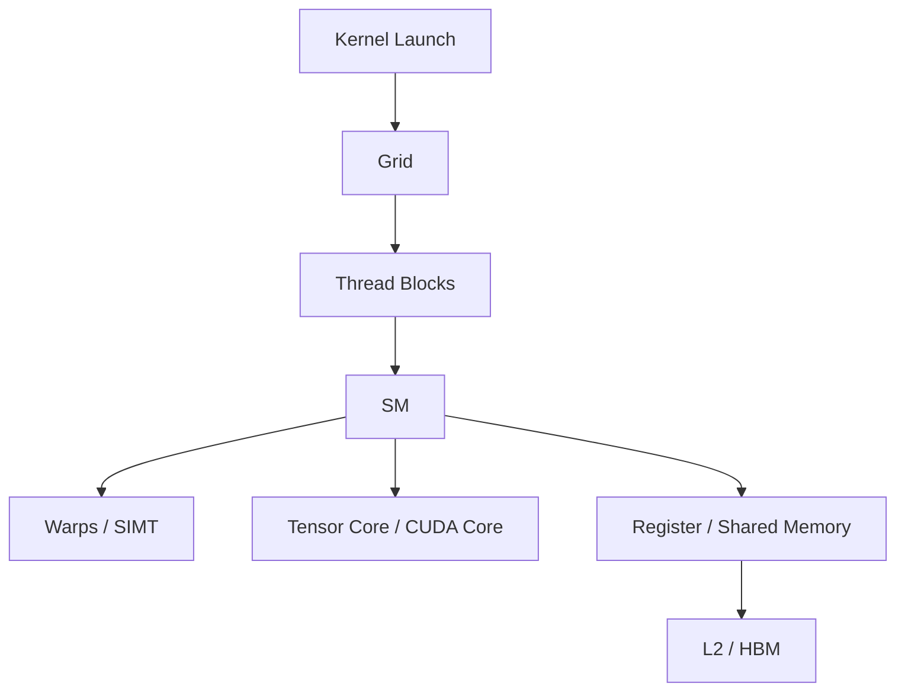
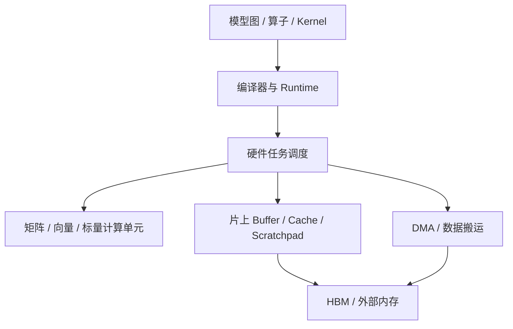

# GPU 与 NPU 异同点

GPU 和 NPU 都可以用来加速 AI 计算，但它们不是简单的“谁替代谁”。更合理的理解是：GPU 是通用并行处理器发展出来的 AI 加速平台，NPU 是围绕神经网络计算目标设计的一类 AI 加速器。两者都要处理矩阵乘、Attention、数据搬运、显存、通信、编译和 runtime，只是硬件组织方式、软件栈入口和工程边界不同。

评价 GPU 或 NPU 时，不能只看峰值算力。真正要问的是：目标模型、目标 shape、目标精度、目标并发、目标并行策略和目标软件栈，能不能稳定映射到这类硬件的高效路径上。

## 先给一个简化结论

| 维度 | GPU | NPU |
| --- | --- | --- |
| 核心定位 | 通用并行吞吐处理器，后来通过 Tensor Core、AI 库和编译栈强化深度学习。 | 面向神经网络和 AI workload 的专用或半专用加速器。 |
| 常见执行模型 | SIMT、warp、SM、CUDA core、Tensor Core。 | 矩阵/向量/标量单元、片上 buffer、DMA、图/算子/编译器驱动的执行模型。 |
| 软件入口 | CUDA、cuDNN、cuBLAS、NCCL、TensorRT、Triton、PyTorch/JAX 等生态成熟。 | 厂商软件栈和框架适配更关键，例如 CANN、Ascend C、torch_npu、图编译和算子库。 |
| 优势场景 | 研究原型、自定义 kernel、训练生态、大量开源框架和工具链。 | 支持路径明确的模型推理、训练、专用算子、能效优化和平台化部署。 |
| 主要风险 | 成本、功耗、显存、通信、供应和多租户治理。 | 算子覆盖、模型迁移、编译路径、工具链成熟度、生态兼容和版本耦合。 |
| 判断方法 | benchmark + profiler + workload manifest。 | benchmark + profiler + 软件栈/架构证据 + workload manifest。 |

这张表不是绝对规律。不同厂商、不同代际、不同软件版本之间差异很大。它只提供入门时的工程视角。

## 它们相同的地方

GPU 和 NPU 在 AI 系统里有很多共同问题：

- 都要把模型图拆成算子、kernel 或硬件任务。
- 都依赖矩阵乘、Attention、归一化、激活函数、数据搬运和通信。
- 都有“片上高速存储 + 外部高带宽内存”的层次。
- 都需要考虑 batch、sequence length、hidden size、head、dtype、layout 和并行策略。
- 都可能被 HBM 带宽、显存容量、通信、CPU 侧调度、数据输入或小算子开销限制。
- 都需要 profiler，而不是只根据理论峰值判断性能。
- 都需要记录硬件型号、软件版本、模型配置、精度、shape 和 benchmark 原始数据。

因此，学习 GPU/NPU 的第一原则是：不要把硬件当成孤立芯片，要把它放在 workload、compiler、runtime、framework、kernel 和系统指标的链路里理解。

## 执行模型差异

GPU 的典型抽象是：

这个模型强调大量 thread 以 SIMT 方式并行执行。程序员或编译器需要关心 block、warp、occupancy、register、shared memory、coalesced access、Tensor Core tile 等问题。GPU 很适合把规则计算摊平成大量并行线程。

NPU 的具体结构因厂商而异，但入门时可以抽象成：

这个模型强调算子、图编译、tiling、数据搬运和片上存储配合。很多 NPU 优化问题不是“写很多 thread”，而是“让编译器和算子实现把数据搬运、片上复用和计算流水线组织好”。

## 编程模型差异

| 问题 | GPU 上通常怎么处理 | NPU 上通常怎么处理 |
| --- | --- | --- |
| 写自定义算子 | CUDA、Triton、CUTLASS、TVM、PyTorch extension。 | 厂商 DSL / 算子开发框架，例如 Ascend C、TBE、图编译扩展等。 |
| 使用高性能库 | cuBLAS、cuDNN、NCCL、TensorRT、FlashAttention、xFormers。 | CANN 算子库、图模式、框架适配层、厂商推理/训练优化库。 |
| 接入 PyTorch | CUDA backend 路径成熟，很多算子默认支持。 | 依赖 torch_npu 或等价 backend，必须关注算子支持、fallback 和版本匹配。 |
| 编译优化 | torch.compile、TorchInductor、Triton、TensorRT、CUDA Graph。 | 图编译、算子选择、tiling、NpuArch/SocVersion、CANN 版本和平台能力。 |
| 多卡通信 | NCCL、NVLink/NVSwitch、InfiniBand/RDMA、rank mapping。 | 厂商通信库、集群拓扑、HCCL/等价通信层、并行策略适配。 |
| Profiling | Nsight Systems、Nsight Compute、PyTorch Profiler、DCGM。 | CANN profiler、framework profiler、runtime log、算子 trace、系统监控。 |

GPU 生态的强项是开放工具和通用开发经验非常丰富。NPU 生态的关键是平台软件栈和硬件能力绑定更紧，做工程时要更重视“当前版本到底支持什么、走了哪条路径、是否发生 fallback”。

## 内存和数据搬运差异

GPU 优化常围绕 register、shared memory、L1/L2、HBM、coalesced access、Tensor Core tile 和 occupancy 展开。程序员写 CUDA/Triton 时，经常直接控制线程如何读写、tile 如何切、数据如何在 shared memory 和 register 中复用。

NPU 优化也关注 HBM、片上存储和数据搬运，但很多时候会通过图编译、算子 tiling、DMA、pipeline 和专用 buffer 管理体现出来。对使用者来说，关键证据往往来自编译日志、算子选择、tiling 配置、profiler timeline 和 runtime 事件。

两者共同的核心问题是：数据从外部内存搬到计算单元的代价很高，必须尽量复用。无论 GPU 还是 NPU，如果一个 workload 反复读写 HBM、频繁产生临时 tensor、无法 fusion，或者 KV Cache 读取量太大，都可能出现“算力很高但跑不快”的情况。

## 算子覆盖和模型迁移差异

模型在 GPU 上能跑，不代表迁移到 NPU 就天然能跑快；反过来，NPU 上有专门优化路径的模型，也不代表 GPU 一定更差。迁移时重点看：

- 目标模型的主要算子是否被支持。
- Attention、RMSNorm、RoPE、GEMM、MoE、量化、KV Cache 等热点是否有高效实现。
- dynamic shape、变长 batch、长上下文、稀疏 attention、tool calling 或多模态输入是否走到支持路径。
- dtype 是否一致，例如 FP16、BF16、FP8、INT8、INT4，以及 accumulator 精度和 scale 处理是否一致。
- 是否存在 silent fallback，例如某些算子回到 CPU、低效通用实现或未融合路径。
- profiler 看到的热点是否与模型理论计算量一致。

迁移工作最怕只看“框架接口兼容”。AI Infra 要看的是真实执行路径和性能证据。

## 推理场景怎么比较

| 推理问题 | GPU 视角 | NPU 视角 |
| --- | --- | --- |
| TTFT | Prefill GEMM、Attention kernel、batching、Tensor Core、CPU/GPU 调度。 | 图编译、Prefill 算子支持、模型 shape、CANN/runtime 路径、片上复用。 |
| TPOT | Decode 小步计算、KV Cache bandwidth、scheduler、CUDA Graph、persistent kernel。 | KV Cache layout、Decode kernel、调度、图模式、多流、平台优化路径。 |
| 并发 | PagedAttention、continuous batching、显存碎片、KV Cache 管理。 | KV Cache 管理、batching、runtime 队列、模型服务框架适配。 |
| 量化 | TensorRT-LLM、AWQ/GPTQ/FP8/INT8 kernel、scale overhead。 | 平台支持的低精度路径、量化算子覆盖、scale/layout 约束。 |
| 多机 | TP/PP/EP、NCCL、NVLink/RDMA、rank mapping。 | 平台通信库、拓扑、并行策略、通信与计算重叠。 |

推理系统里最实用的比较方式是固定 workload：模型、输入输出长度分布、并发、SLO、precision、batching 策略和缓存策略都要一致，然后比较 goodput、TTFT、TPOT、p99、显存、功耗和稳定性。

## 训练场景怎么比较

训练比推理更容易暴露系统瓶颈，因为它同时包含 forward、loss、backward、gradient sync、optimizer、checkpoint 和数据输入。

GPU 训练生态成熟，常见工具链包括 PyTorch DDP/FSDP、Megatron-LM、DeepSpeed、NCCL、CUDA profiler 和大量开源 kernel。NPU 训练能否顺利落地，重点看框架适配、混合精度、分布式通信、算子覆盖、checkpoint、profiling、错误诊断和版本兼容。

比较训练平台时，不要只看单卡算力。至少要比较：

- tokens/s/GPU、step time、MFU 或等价利用率指标。
- global batch、micro-batch、sequence length、parallel strategy。
- 显存组成：parameter、gradient、optimizer state、activation、temporary buffer。
- 通信占比：AllReduce、ReduceScatter、AllGather、AllToAll。
- 数据输入和 checkpoint 是否成为瓶颈。
- 故障恢复、长稳训练和可复现能力。

## 常见误区

| 误区 | 更准确的说法 |
| --- | --- |
| GPU 是通用的，NPU 是固定不可编程的。 | 很多 NPU 也可编程，但编程入口、编译路径、支持边界和生态成熟度不同。 |
| NPU 一定比 GPU 更省电。 | 能效必须看 workload、batch、precision、利用率、功耗墙和端到端系统，不是看名字。 |
| GPU 上的优化经验可以直接照搬到 NPU。 | 原理可迁移，例如 tiling、fusion、数据复用；具体 API、工具、限制和最优路径要重新验证。 |
| 只要算子支持，性能就会好。 | 支持不等于高效，还要看 shape、layout、dtype、fusion、内存和调度。 |
| 只看单卡 benchmark 就能决定平台。 | 真实训练/推理还涉及多卡通信、服务调度、故障率、版本治理、成本和供应。 |

## 选型或迁移时的检查清单

1. 明确 workload：训练还是推理，模型类型、参数量、上下文长度、输入输出长度分布、并发和 SLO。
2. 明确软件栈：框架、runtime、编译器、推理引擎、通信库、driver 和容器版本。
3. 列出热点算子：GEMM、Attention、Norm、RoPE、MoE、量化、KV Cache、optimizer。
4. 验证支持路径：是否有高性能 kernel，是否发生 fallback，是否支持目标 dtype 和 dynamic shape。
5. 做最小 benchmark：先跑单算子和小模型，再跑端到端 workload。
6. 做 profiler 归因：确认瓶颈是计算、显存、通信、调度、CPU、数据输入还是存储。
7. 做长稳实验：看性能波动、错误率、内存泄漏、温度功耗、恢复和监控。
8. 沉淀证据：把硬件、软件、workload、benchmark 和结论写入 report、ADR 或 AI skill。

## 什么时候更偏向 GPU，什么时候更偏向 NPU

更偏向 GPU 的情况：

- 需要快速研究原型、频繁改模型结构或写自定义 kernel。
- 依赖大量现成 CUDA/Triton/TensorRT/NCCL 生态能力。
- 训练框架和开源实现主要围绕 GPU 优化。
- 团队已有成熟 GPU benchmark、profiling、运维和故障处理体系。

更偏向 NPU 的情况：

- 目标模型和算子已经在 NPU 软件栈中有明确高性能支持路径。
- 平台供应、能效、成本、国产化、集成形态或业务约束要求 NPU。
- 团队愿意围绕 CANN/厂商工具链建设迁移、算子、profiling 和 skill 沉淀。
- 推理服务或训练任务形态相对稳定，可以通过平台化优化获得持续收益。

最终选择不是口号问题，而是证据问题。对 AI Infra 来说，GPU/NPU 对比的输出应该是一份可复现的 benchmark report 或 ADR，而不是“某硬件更先进”的一句话。

## 参考资料

- [CUDA C++ Programming Guide](https://docs.nvidia.com/cuda/cuda-programming-guide/index.html) 说明 GPU/CUDA 的 thread hierarchy、memory hierarchy、SIMT 和编程模型。
- [NVIDIA Deep Learning Performance - GPU Performance Background](https://docs.nvidia.com/deeplearning/performance/dl-performance-gpu-background/index.html) 提供深度学习 workload 和 GPU 执行背景。
- [CANNBot Skills 项目主页](https://gitcode.com/cann/cannbot-skills) 展示了面向昇腾/CANN 生态的模型迁移、算子、编译、profiling 和 skill 组织方式。
