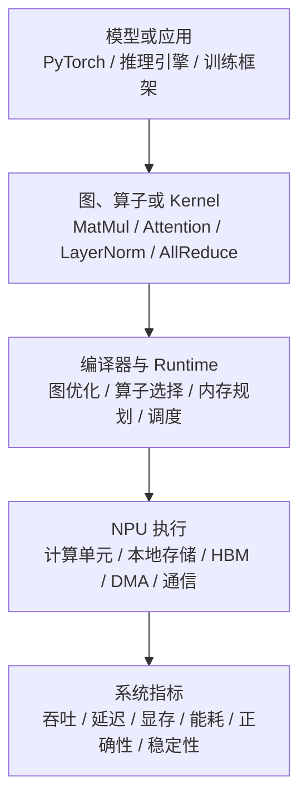

# NPU 基础概念

NPU 可以先理解成“为神经网络计算设计的加速器”。它不是只会运行某一个模型的固定电路，而是通过软件栈把模型中的矩阵乘、Attention、归一化、激活函数、数据搬运和通信等操作，映射到专门的计算单元和存储层次上。

对 AI Infra 来说，NPU 的关键不是名字，而是它能否把目标 workload 稳定、高效、正确地跑起来。

## 一个最小视角

这条链路说明一件事：模型代码能不能快，不只取决于 NPU 峰值算力，还取决于编译器能不能生成合适的 kernel，runtime 能不能把内存和调度安排好，框架能不能把模型图落到硬件支持的路径上。

## NPU 里常见的硬件概念

| 概念 | 可以怎么理解 | 为什么重要 |
| --- | --- | --- |
| 计算单元 | 执行矩阵、向量、标量或专用 AI 指令的核心资源。 | 决定 MatMul、Attention、MLP、LayerNorm 等算子的计算上限。 |
| 本地存储 | 靠近计算单元的小容量高速存储，如片上 buffer、cache 或专用 scratchpad。 | 决定数据能否被反复复用，影响算子 tiling 和 fusion。 |
| HBM / 外部显存 | 存放模型权重、activation、KV Cache、临时 buffer 的大容量高带宽内存。 | 大模型经常受显存容量和带宽限制。 |
| 数据搬运 | 在 HBM、片上存储和计算单元之间移动数据。 | 很多 kernel 慢不是因为算不动，而是数据没有及时送到。 |
| 编译器 | 把图、算子或 DSL 降低到硬件可执行形式。 | 影响算子覆盖、fusion、layout、dynamic shape 和 fallback。 |
| Runtime | 管理设备、stream、内存、执行队列和错误状态。 | 影响端到端稳定性、并发、profiling 和故障诊断。 |
| 通信 | 多卡之间交换 tensor、梯度、KV、专家 token 或中间状态。 | 分布式训练、MoE、长上下文推理都会被通信放大。 |

## NPU 与 GPU 的学习差异

GPU 生态里很多工程经验围绕 CUDA、Tensor Core、NCCL、Triton、TensorRT 展开。NPU 生态里也有类似层次，但名字、工具、编译路径和最佳实践会不同。学习 NPU 时，不要直接把 GPU 经验逐字搬过去，而要抓住几个对应关系：

| GPU 侧常见问题 | NPU 侧也要问的问题 |
| --- | --- |
| 这个算子有没有高效 kernel？ | 这个算子在 CANN/框架/推理引擎里是否有支持路径，是否发生 fallback。 |
| kernel 是 compute-bound 还是 memory-bound？ | 片上 buffer、HBM、数据搬运和 tiling 是否匹配该算子的 shape。 |
| 多卡通信是否拖慢训练？ | 对应通信库、拓扑、rank mapping、parallel strategy 是否适合该 NPU 平台。 |
| profiler 看到的瓶颈在哪里？ | CANN / framework / system profiler 能否把图、算子、kernel、通信和 runtime 事件串起来。 |
| 这个优化能否复现？ | 是否记录 CANN、driver、runtime、framework、芯片型号、SocVersion、NpuArch 和 workload。 |

## 为什么 AI Infra 要理解 NPU

做模型或算法时，可能只关心“能不能训练出更好的模型”。做 AI Infra 时，必须关心另一组问题：

- 同一个模型，为什么在不同硬件上吞吐差很多？
- 同一个 batch 和 sequence length，为什么某个平台显存先爆？
- 为什么某个算子在 GPU 上快，在 NPU 上需要改写或融合？
- 为什么模型迁移后精度对不上，或者运行到某个 shape 才报错？
- 为什么 CANN、driver、framework 或推理引擎版本变化后性能回退？

这些问题都不是“读芯片宣传页”能解决的，必须把硬件能力、软件栈路径和 workload 证据连起来。

## 最小记录清单

只要开始做 NPU 相关实验，建议每次记录：

- 设备型号、数量、拓扑和 `npu-smi` 或等价工具输出。
- CANN Toolkit / Runtime / Driver 版本。
- 框架版本，例如 PyTorch、torch_npu、推理引擎版本。
- SocVersion、NpuArch、编译目标和是否存在架构条件分支。
- 模型、精度、batch、sequence length、并行策略、输入输出长度分布。
- 是否启用图模式、融合、量化、KV Cache、通信重叠或自定义算子。
- profiler、benchmark 和错误日志的原始文件路径。

这些信息后续可以直接进入 benchmark report、failure case、ADR 或 AI skill。

