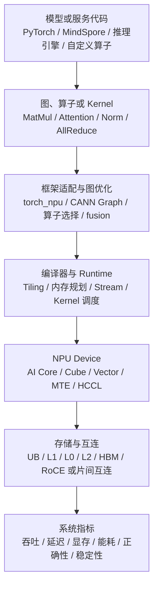
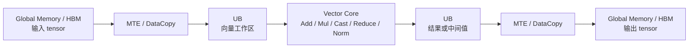
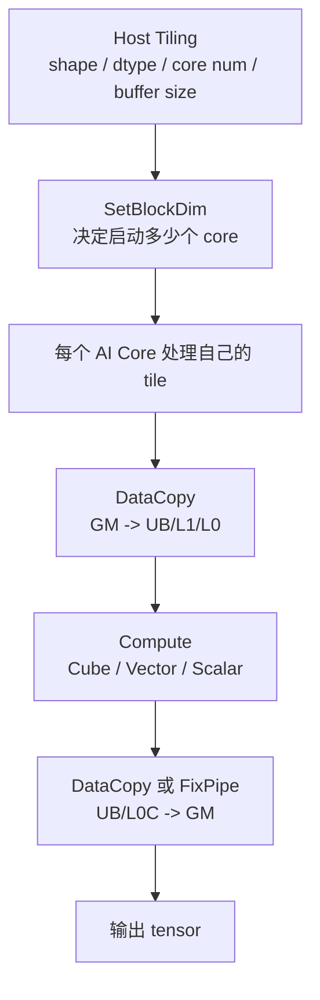

# NPU 基础概念

NPU 可以先理解成“为神经网络计算设计的 AI 加速器”。它不是只会运行某一个模型的固定电路，而是通过软件栈把模型里的矩阵乘、Attention、归一化、激活函数、数据搬运和通信，映射到专门的计算单元、片上存储和外部显存上。

对 AI Infra 来说，NPU 的关键不是名字，而是目标 workload 能不能稳定、高效、正确地跑起来。看 NPU 不能只看峰值算力，要同时看硬件单元、内存层次、编译器、runtime、算子覆盖、profiling 证据和具体模型 shape。

> 图像说明：本篇引用 CANN/Ascend 开源资料中的官方或准官方架构图，图片版权归原项目或原厂所有。仓库不复制这些图片文件；如果离线阅读看不到图片，可以点击图下注明的来源。

## 先看哪些架构图

NPU 资料容易一下子进入芯片型号、CANN 版本、Ascend C API 和算子细节。新手更适合按下面顺序读图：

| 先后 | 图或资料 | 适合用来理解什么 |
| --- | --- | --- |
| 1 | [Atlas A2/A3 architecture](https://gitcode.com/cann/asc-devkit/blob/master/docs/api/figures/atlas_a2_a3_architecture.png) | 从服务器/加速卡视角看 CPU、NPU、HBM、互连、通信和系统软件栈的关系。 |
| 2 | [Ascend 950PR/950DT architecture](https://gitcode.com/cann/asc-devkit/blob/master/docs/api/figures/ascend_950pr_950dt_architecture.png) | 从新一代服务器 NPU 视角看不同芯片形态和系统结构。 |
| 3 | [A2/A3 NPU architecture](https://gitcode.com/cann/asc-devkit/blob/master/docs/api/figures/a2a3_npu_arch.png) | 理解 NPU 内部的 AI Core、片上存储、搬运通路和外部显存。 |
| 4 | [950 NPU architecture](https://gitcode.com/cann/asc-devkit/blob/master/docs/api/figures/950_npu_arch.png) | 对比新架构中新增或增强的执行单元、搬运通路和低精度能力。 |
| 5 | [AI Core 内部并行计算架构抽象](https://gitcode.com/cann/asc-devkit/blob/master/docs/api/figures/AI-Core内部并行计算架构抽象.png) | 看清 AI Core 里 Cube、Vector、Scalar、MTE 和本地存储如何协作。 |
| 6 | [Cube compute unit A2/A3](https://gitcode.com/cann/asc-devkit/blob/master/docs/api/figures/architecture_of_cube_compute_unit_a2a3.png) 与 [Cube compute unit 950](https://gitcode.com/cann/asc-devkit/blob/master/docs/api/figures/architecture_of_cube_compute_unit_950.png) | 理解矩阵乘为什么是 NPU 的核心吞吐来源，以及不同代际的 Cube 能力差异。 |
| 7 | [A2/A3 UB memory structure](https://gitcode.com/cann/asc-devkit/blob/master/docs/api/figures/a2a3_UB内存结构图.png) 与 [950 UB memory structure](https://gitcode.com/cann/asc-devkit/blob/master/docs/api/figures/950_UB内存结构图.png) | 理解 UB 这种片上工作区为什么会影响 tiling、bank conflict、fusion 和算子性能。 |
| 8 | [CANNBot NPU architecture skill](https://gitcode.com/cann/cannbot-skills/tree/master/ops/npu-arch) | 用来查 SocVersion、NpuArch、`__NPU_ARCH__`、archXX、硬件参数和跨代能力差异。 |

这些图不是为了背芯片结构，而是为了建立一条主线：模型算子先经过软件栈变成 NPU kernel，再由 AI Core、Cube/Vector、片上存储、数据搬运和通信共同执行。

## NPU 的整体结构

先从服务器平台视角看。下面是 CANN/asc-devkit 中的 Atlas A2/A3 架构图：

来源：[CANN asc-devkit - Atlas A2/A3 architecture](https://gitcode.com/cann/asc-devkit/blob/master/docs/api/figures/atlas_a2_a3_architecture.png)

这类图要先抓住几个层次：

- CPU 和 host 侧负责应用逻辑、框架、runtime 调用、输入输出和任务下发。
- NPU device 侧负责大规模 tensor 计算、片上数据搬运和部分通信任务。
- HBM 或设备侧内存存放权重、activation、KV Cache、临时 buffer 和输出。
- 多卡或多节点训练/推理还要经过设备互连、网络和通信库。

再看 Ascend 950PR/950DT 这类新平台的架构图：

来源：[CANN asc-devkit - Ascend 950PR/950DT architecture](https://gitcode.com/cann/asc-devkit/blob/master/docs/api/figures/ascend_950pr_950dt_architecture.png)

不同代际、不同 SKU 的具体参数会变，但系统视角基本稳定：NPU 从来不是孤立芯片，而是“硬件 + driver + CANN + 框架/推理引擎 + 算子实现 + workload”的组合。

把它放进 AI 系统链路里，可以简化成：

这条链路说明：模型代码能不能快，不只取决于 NPU 峰值算力，还取决于编译器能否生成合适的 kernel，runtime 能否把内存和调度安排好，框架能否把模型图落到硬件支持的路径上。

## NPU 内部：AI Core 是主要执行入口

下面两张图给出了 A2/A3 和 950 的 NPU 内部架构视角：

来源：[CANN asc-devkit - A2/A3 NPU architecture](https://gitcode.com/cann/asc-devkit/blob/master/docs/api/figures/a2a3_npu_arch.png)

来源：[CANN asc-devkit - 950 NPU architecture](https://gitcode.com/cann/asc-devkit/blob/master/docs/api/figures/950_npu_arch.png)

入门时不需要记住每个框的细节，先理解几个稳定概念：

| 概念 | 可以怎么理解 | 常见操作 | 为什么重要 |
| --- | --- | --- | --- |
| AI Core | 执行 NPU kernel 的主要计算核心。 | 启动 kernel、多核切分、每个 core 处理一段 tensor。 | 决定单算子并行度、尾块浪费、占用率和负载均衡。 |
| Cube Core | 面向矩阵乘、卷积等 dense tensor 计算的专用矩阵单元。 | MatMul、Conv、MLP、QKV projection、Attention score。 | Transformer 主要 FLOPs 都来自矩阵乘，Cube 利用率直接影响吞吐。 |
| Vector Core | 面向逐元素、归一化、激活、类型转换、部分 reduction 的向量单元。 | Add、Mul、Cast、RMSNorm、Softmax 局部步骤、量化/反量化。 | 很多算子不是算不动，而是 Vector 和数据搬运没有跟 Cube 配好。 |
| Scalar / 控制单元 | 处理控制、地址、循环、同步和少量标量逻辑。 | 分支、offset 计算、mask、flag、pipeline 控制。 | 动态 shape、尾块、mask 和同步会增加控制成本。 |
| MTE / DataCopy | 负责在 Global Memory 和片上 Local Memory 之间搬数据。 | `DataCopy`、GM 到 UB/L1、L1 到 L0、L0C 写回。 | 数据供不上，Cube/Vector 就会等待。 |
| Local Memory | 靠近计算单元的片上工作区，包含 UB、L1、L0A/L0B/L0C 等具体层次。 | tiling、双缓冲、缓存输入 tile、保存中间结果。 | 片上容量小但快，决定数据复用和 fusion 能做到什么程度。 |
| Global Memory / HBM | 设备侧大容量内存。 | 存权重、activation、KV Cache、optimizer state、输入输出。 | 大模型经常受 HBM 容量和带宽限制。 |
| L2 / 片上缓存 | 多 core 共享或靠近 device 的缓存层。 | 跨 core 复用、缓存权重或中间数据。 | 影响长上下文、权重读取、KV 读取和多核访存效率。 |
| HCCL / 通信 | 多 NPU 之间交换 tensor。 | AllReduce、ReduceScatter、AllGather、AllToAll。 | 训练、多机推理、MoE 和大模型并行会被通信放大。 |

如果只记一句话：NPU 优化通常不是“让一个通用核心跑更多线程”，而是“让 Cube/Vector/MTE/片上存储形成稳定流水线，减少外部显存读写和空等”。

## AI Core 内部：Cube、Vector、MTE 怎么协作

下面这张 AI Core 内部并行计算抽象图，是理解 NPU kernel 的核心入口：

来源：[CANN asc-devkit - AI Core 内部并行计算架构抽象](https://gitcode.com/cann/asc-devkit/blob/master/docs/api/figures/AI-Core内部并行计算架构抽象.png)

可以把 AI Core 内部理解成几条并行工作线：

- `MTE` 负责搬数据：从 Global Memory 搬到 UB/L1/L0，或把结果搬回 Global Memory。
- `Cube` 负责大块矩阵乘：例如 GEMM、Conv、QKV projection、MLP。
- `Vector` 负责向量计算：例如 elementwise、Cast、Norm、Softmax、量化/反量化。
- `Scalar` 负责控制：例如循环、地址、mask、同步和分支。
- `Local Memory` 是这些单元协作的工作区：数据先搬到片上，再被计算单元反复使用。

这也是为什么 NPU 文档里经常出现“流水”“Tiling”“搬入、计算、搬出”“双缓冲”“bank conflict”。它们都在解决同一个问题：不要让昂贵的计算单元等数据，也不要把中间结果频繁写回 HBM。

一个典型矩阵算子的简化数据流如下：

一个典型向量算子的简化数据流则更像：

## Cube 计算单元：矩阵乘为什么是主角

Transformer 的主要计算量集中在矩阵乘上，例如 Q/K/V projection、Attention score、Attention output projection、MLP 的 up/gate/down projection，以及训练中的 backward GEMM。NPU 的 Cube 单元就是为这类 dense tensor 计算提供高吞吐的。

下面是 CANN/asc-devkit 中 A2/A3 与 950 的 Cube 计算单元示意图：

来源：[CANN asc-devkit - Cube compute unit A2/A3](https://gitcode.com/cann/asc-devkit/blob/master/docs/api/figures/architecture_of_cube_compute_unit_a2a3.png)

来源：[CANN asc-devkit - Cube compute unit 950](https://gitcode.com/cann/asc-devkit/blob/master/docs/api/figures/architecture_of_cube_compute_unit_950.png)

对工程入门来说，Cube 相关问题可以先这样看：

| 问题 | 应该看什么 |
| --- | --- |
| 矩阵乘是否走到高效路径 | dtype、shape、layout、对齐、是否调用高性能 MatMul API 或 fused kernel。 |
| Cube 是否吃满 | profiler 里的 Cube 利用率、热点 kernel、矩阵 shape、尾块比例。 |
| 为什么峰值算力高但端到端不快 | 可能卡在 HBM、数据搬运、Vector 后处理、kernel 太碎、通信或 host 调度。 |
| 为什么换一代 NPU 后需要改算子 | 新架构可能改变 Cube 支持的数据类型、搬运通路、L0C/UB 容量和同步方式。 |
| 为什么不能硬编码参数 | 同一架构下不同 SKU、vNPU 切分和版本配置可能改变可见核数和存储容量。 |

换句话说，Cube 是主角，但它不是单独工作的。一个 GEMM 要快，必须同时把输入 tile、L0/L1/UB、输出搬运、后处理和多核切分组织好。

## 片上存储：UB、L1、L0 与 HBM

NPU 上的性能瓶颈经常不是“算不动”，而是“数据没有放在正确的位置”。可以先把内存层次分成两类：

- `Global Memory`：设备侧大内存，通常用于权重、activation、KV Cache、optimizer state 和临时 buffer。
- `Local Memory`：靠近 AI Core 的片上工作区，容量小但速度快，常见具体层次包括 UB、L1、L0A、L0B、L0C 等。

下面是 A2/A3 与 950 的 UB 存储结构图：

来源：[CANN asc-devkit - A2/A3 UB memory structure](https://gitcode.com/cann/asc-devkit/blob/master/docs/api/figures/a2a3_UB内存结构图.png)

来源：[CANN asc-devkit - 950 UB memory structure](https://gitcode.com/cann/asc-devkit/blob/master/docs/api/figures/950_UB内存结构图.png)

常见存储单元可以这样理解：

| 存储层次 | 主要用途 | 常见操作 | 性能含义 |
| --- | --- | --- | --- |
| HBM / Global Memory | 大容量设备内存。 | 读权重、activation、KV Cache，写输出。 | 容量和带宽限制大模型训练、长上下文推理和 KV Cache。 |
| L2 | 设备侧共享缓存或片上缓存层。 | 跨 core 缓存复用，减少 HBM 访问。 | L2 命中率会影响权重、KV 和中间 tensor 访问。 |
| UB | Vector 工作区和很多算子的片上临时空间。 | 搬入输入，做 elementwise、Cast、Norm、Reduce，保存临时结果。 | UB 容量、对齐、bank conflict 会影响向量算子和 fusion。 |
| L1 | Cube 输入数据的片上缓存层之一。 | 缓存或重排矩阵 tile，向 L0A/L0B 供数。 | 决定矩阵 tile 能否高效复用。 |
| L0A / L0B | Cube 左右输入操作数。 | 装载矩阵 A/B 的小块。 | 对齐、layout 和 tile shape 决定 Cube 喂数效率。 |
| L0C | Cube 输出累加区。 | 保存矩阵乘累加结果，再交给后处理或写回。 | 影响输出累加、融合 epilogue 和跨代迁移。 |
| BT / 其他专用 buffer | 某些后处理、bias 或特定功能的辅助存储。 | FixPipe、bias、格式转换等。 | 具体能力强依赖架构代际和 API 支持。 |

新手先记住：HBM 大但远，UB/L1/L0 小但近。高性能 kernel 的核心动作，就是把数据从 HBM 搬到片上后尽量多用几次。

## 编程模型：Tiling、搬、算、搬

多数用户不会一上来写 Ascend C 自定义算子，但理解它的基本执行模型很有帮助。因为框架、编译器和高性能库最终也要解决类似问题。

NPU 算子常见的思路可以概括成四步：

1. `Tiling`：host 侧根据 shape、dtype、硬件核数和片上 buffer 容量，把大 tensor 切成每个 core 能处理的小块。
2. `搬入`：kernel 侧用 `DataCopy` 把 Global Memory 中的数据搬到 Local Memory。
3. `计算`：在 Local Memory 上调用 Cube、Vector 或其他硬件单元完成计算。
4. `搬出`：把 Local Memory 中的结果写回 Global Memory。

一个非常简化的示意如下：

常见 Ascend C 概念可以这样对应：

| 概念 | 可以怎么理解 | 常见用途 |
| --- | --- | --- |
| `GlobalTensor` | 指向 Global Memory 中的数据。 | 读输入、权重、KV，写输出。 |
| `LocalTensor` | 指向 Local Memory 中的数据。 | 在 UB/L1/L0 等片上空间里计算。 |
| `DataCopy` | 触发数据搬运，通常对应 MTE/DMA 能力。 | GM 到 UB、GM 到 L1、L0C 到 GM 等。 |
| `TPipe` | 管理 kernel 内的流水资源。 | 初始化队列、buffer 和异步流水。 |
| `TQue` | 管理输入、输出或临时 tensor 队列。 | 双缓冲、多 stage pipeline。 |
| `TBuf` | 管理一块临时 buffer。 | 临时工作区、scratch buffer。 |
| `SetBlockDim` | 设置 kernel 使用多少个 core。 | 多核并行切分。 |
| `GetCoreNumAic/Aiv` | 获取实际可见 Cube/Vector 核数。 | 避免硬编码核数。 |
| `GetCoreMemSize` | 获取 UB、L1、L0 等可用容量。 | 避免硬编码 buffer 大小。 |

写算子时最忌讳把某个型号的核数、UB 大小、L0 大小直接写死。CANNBot NPU 架构 skill 也强调：具体 SKU、vNPU 切分和运行时环境可能让可见资源发生变化，应该通过平台接口获取实际值。

## SIMD、SIMT、RegBase：不要只套 GPU 词汇

GPU 文章里会重点讲 SIMT、warp、thread block。NPU 里也会出现 SIMD、SIMT、RegBase 等词，但含义和使用边界要按当前平台资料判断，不能把 CUDA 经验直接逐字搬过来。

| 概念 | 入门理解 | 什么时候需要关心 |
| --- | --- | --- |
| SIMD | 一条向量指令处理多个数据元素。 | elementwise、Cast、Norm、Reduce、向量化内存访问。 |
| SIMT | 用线程式编程表达并行，硬件负责调度一组线程执行。 | 新架构上处理不规则逻辑、线程级并行或从 GPU 迁移某些写法。 |
| RegBase | Vector 计算从 UB 内存操作更多转向寄存器内计算。 | 950 类新架构上做 VF 融合、减少中间结果回写 UB。 |
| MemBase | 以 UB 等 Local Memory 为主要操作位置。 | 传统向量 API、普通 elementwise 和入门算子。 |

对新手来说，先不需要深入 API 细节。更重要的是知道：不同 NPU 代际可能引入新的执行模型、数据类型和搬运通路，所以迁移算子时要查 `SocVersion`、`NpuArch`、`__NPU_ARCH__` 和 CANN 版本，而不是只看产品名。

## 从 AI workload 看 NPU

把硬件单元和常见 AI 负载对应起来，能帮助你更快读 profiler：

| AI 负载 | NPU 上通常涉及什么 | 常见瓶颈 |
| --- | --- | --- |
| 大 GEMM / MLP | Cube、L1、L0A/L0B/L0C、HBM、MatMul API。 | shape 不合适、Cube 利用率低、输出后处理没融合、HBM 读写多。 |
| Attention Prefill | QKV GEMM、QK^T、softmax、PV、mask、HBM/UB。 | 长序列 HBM 读写、softmax/Mask 处理、tile 设计、fusion。 |
| Attention Decode | 小 batch GEMM、KV Cache 读取、调度和缓存。 | KV 带宽、请求长度不均、batch 太小、host 调度和 kernel 粒度。 |
| LayerNorm / RMSNorm | Vector、UB、Reduce、Cast。 | memory-bound、UB 使用不佳、缺少 fusion。 |
| 量化/反量化 | Vector、Cube 低精度路径、scale/zero-point 处理。 | dtype 支持、scale layout、额外 Cast 和搬运。 |
| MoE | router、专家 GEMM、token dispatch/combine、AllToAll。 | 负载不均、通信、专家 batch 太小、动态 shape。 |
| 训练 backward | Cube、Vector、activation、gradient、optimizer state、通信。 | 显存、梯度同步、activation 保存/重算、通信计算重叠。 |
| 多卡通信 | HCCL、拓扑、rank mapping、并行策略。 | AllReduce/AllToAll 尾部 rank、网络拥塞、并行策略不匹配。 |

因此分析 NPU 性能时，不要只问“这张卡算力多少”。更应该问：

- 当前模型主要热点是 Cube、Vector、数据搬运、通信还是 host 调度？
- 当前 shape 是否让每个 AI Core 都有足够工作？
- 中间结果是否频繁写回 HBM？
- 是否发生算子 fallback、图断裂或不支持 dtype/layout？
- profiler 里的热点 kernel 是否符合预期？

## NPU 与 GPU 的学习差异

GPU 生态里很多工程经验围绕 CUDA、Tensor Core、NCCL、Triton、TensorRT 展开。NPU 生态里也有类似层次，但名字、工具、编译路径和最佳实践会不同。

| GPU 侧常见问题 | NPU 侧也要问的问题 |
| --- | --- |
| 这个算子有没有高效 CUDA/Triton kernel？ | 这个算子在 CANN、框架、推理引擎里是否有支持路径，是否发生 fallback。 |
| kernel 是 compute-bound 还是 memory-bound？ | Cube、Vector、UB、L1/L0、HBM、DataCopy 和 tiling 是否匹配 shape。 |
| Tensor Core 是否被用上？ | Cube 是否被用上，dtype/layout/MatMul API 是否走到高效路径。 |
| shared memory、register 是否够？ | UB、L1、L0A/L0B/L0C 和临时 buffer 是否够，是否有 bank conflict。 |
| 多卡通信是否拖慢训练？ | HCCL、拓扑、rank mapping、parallel strategy 是否适合该 NPU 平台。 |
| profiler 看到的瓶颈在哪里？ | CANN / framework / system profiler 能否把图、算子、kernel、通信和 runtime 事件串起来。 |
| 这个优化能否复现？ | 是否记录 CANN、driver、runtime、framework、芯片型号、SocVersion、NpuArch 和 workload。 |

GPU 经验能帮助你形成“算力、访存、通信、调度”的分析框架，但具体到 NPU 时，一定要回到当前平台的软件栈和硬件文档。

## 为什么 AI Infra 要理解 NPU

做模型或算法时，可能只关心“能不能训练出更好的模型”。做 AI Infra 时，必须关心另一组问题：

- 同一个模型，为什么在不同硬件上吞吐差很多？
- 同一个 batch 和 sequence length，为什么某个平台显存先爆？
- 为什么某个算子在 GPU 上快，在 NPU 上需要改写或融合？
- 为什么模型迁移后精度对不上，或者运行到某个 shape 才报错？
- 为什么 CANN、driver、framework 或推理引擎版本变化后性能回退？

这些问题都不是“读芯片宣传页”能解决的，必须把硬件能力、软件栈路径和 workload 证据连起来。

## 最小记录清单

只要开始做 NPU 相关实验，建议每次记录：

- 设备型号、数量、拓扑和 `npu-smi` 或等价工具输出。
- CANN Toolkit / Runtime / Driver / Firmware 版本。
- 框架版本，例如 PyTorch、torch_npu、MindSpore、推理引擎版本。
- SocVersion、NpuArch、`__NPU_ARCH__`、编译目标和是否存在架构条件分支。
- 可见 AI Core / Cube / Vector 核数，以及 UB、L1、L0、L2、HBM 等容量信息，优先来自运行时接口。
- 模型、精度、batch、sequence length、并行策略、输入输出长度分布。
- 是否启用图模式、融合、量化、KV Cache、通信重叠或自定义算子。
- profiler、benchmark、编译日志和错误日志的原始文件路径。

这些信息后续可以直接进入 benchmark report、failure case、ADR 或 AI skill。

## 参考资料

- [CANN asc-devkit](https://gitcode.com/cann/asc-devkit)：CANN/Ascend 开源开发资料和图示来源。
- [Ascend 950PR/950DT 新增特性导航](https://gitcode.com/cann/asc-devkit/blob/master/docs/asc_950_feature_guide.md)：950PR/950DT 的 RegBase、SIMT、NDDMA、FixPipe、UB 结构等特性索引。
- [CANNBot NPU architecture skill](https://gitcode.com/cann/cannbot-skills/tree/master/ops/npu-arch)：SocVersion、NpuArch、`__NPU_ARCH__`、archXX 和架构能力判断入口。
- [HiAscend CANN 文档中心](https://www.hiascend.com/cann/document)：CANN、Ascend C、算子开发和 profiling 的官方文档入口。
