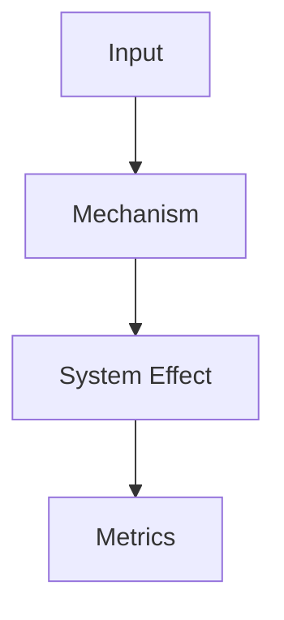

# 知识点模板：从概念解释到 AI 可读卡片

这个模板用于撰写 AI Infra 知识库中的普通知识点文章。

普通知识点不是 benchmark report、ADR、failure case 或 runbook。

它通常用于解释：

- 一个概念；
- 一个机制；
- 一个系统组件；
- 一个优化方向；
- 一个工具能力；
- 一个常见瓶颈；
- 一个实验前需要理解的背景知识。

例如：

- KV Cache；
- Prefill 与 Decode；
- Tensor Parallel；
- Activation Checkpointing；
- RDMA 网络与 NCCL 拓扑；
- TorchInductor 编译流程；
- AI 加速器 Roofline 模型。

高质量知识点文章的目标不是“把资料整理一遍”。

它应该让读者和 AI 都能回答：

> 这个知识点解决什么问题？在哪个系统层？适用于什么 workload？核心机制是什么？带来什么收益和代价？有哪些证据？什么时候不能直接套用？

## 使用方式

新增知识点时，建议按下面流程：

1. 先确定 `doc_type`。
2. 如果是普通概念或机制说明，使用本模板。
3. 如果是 benchmark，用基准实验报告模板。
4. 如果是技术选择，用 ADR 模板。
5. 如果是故障样本，用 failure case 结构。
6. 如果是现场操作，用 runbook 结构。

本模板适合：

- 概念讲解；
- 机制说明；
- 系统设计说明；
- 工程经验沉淀；
- 论文机制转写；
- 工具能力说明。

本模板不适合：

- 记录一次具体实验；
- 记录一次技术决策；
- 记录一次事故；
- 写操作手册；
- 写纯参考表。

## 最小可复制模板

下面是最小版本。

适合快速创建新文章。

````markdown
---
title: ""
domain: ""
doc_type: concept
status: draft
owner: maintainers
license: CC-BY-4.0
updated: 2026-06-12
workload: []
system_layer: []
hardware: []
software: []
metrics: []
sources: []
---

# 标题

## 摘要

用 3 到 5 句话说明：

- 这个知识点解决什么问题；
- 属于哪个系统层级；
- 适用于什么 workload；
- 核心机制是什么；
- 读完后读者应该能做什么。

## 背景

说明这个问题为什么存在。

- 它出现在训练、推理、kernel、编译器、硬件、集群还是 benchmark 中？
- 如果不了解它，会导致什么误判？
- 它和上游 workload、下游系统有什么关系？

## 核心问题

用一句话写清楚本文回答的问题。

> 在什么场景下，如何理解或解决什么系统问题？

## 基本概念

解释必要术语。

| 术语 | 含义 |
| --- | --- |
|  |  |

## 工作流程

用步骤解释机制如何工作。

1.
2.
3.

## 系统视角

说明它影响哪些系统对象。

| 对象 | 影响 |
| --- | --- |
| workload |  |
| runtime |  |
| memory |  |
| communication |  |
| benchmark |  |

## 成本模型

说明它减少什么成本，增加什么成本。

| 成本项 | 变化 |
| --- | --- |
| 计算 |  |
| 显存 |  |
| HBM 带宽 |  |
| 网络通信 |  |
| 调度复杂度 |  |
| 工程维护 |  |

## 指标

说明应该用哪些指标观察它。

- primary metrics:
- guardrail metrics:
- debugging metrics:

## 适用范围

适用于：

-

不适用于或需要谨慎：

-

## 常见优化方向

-

## 常见误区

### 误区一：

解释为什么是误区。

## 检查清单

- [ ] 是否说明 workload？
- [ ] 是否说明 system layer？
- [ ] 是否说明核心机制？
- [ ] 是否说明收益和代价？
- [ ] 是否说明适用范围？
- [ ] 是否链接相关章节？

## 小结

用 3 到 5 条总结核心结论。

## 参考资料

-
````

## 完整推荐模板

下面是完整版本。

适合写重要知识点、系统机制或后续可能被 AI 检索引用的文章。

````markdown
---
title: ""
domain: ""
doc_type: concept
status: draft
owner: maintainers
license: CC-BY-4.0
updated: 2026-06-12

workload:
  - ""
system_layer:
  - ""
hardware:
  - ""
software:
  - ""
metrics:
  - ""
sources:
  - type: ""
    title: ""
    url: ""
related:
  - ""
evidence_level: E1
---

# 标题

## 摘要

用 3 到 5 句话说明这篇文章。

建议结构：

1. 这个知识点解决什么问题。
2. 它属于哪个系统层。
3. 它的核心机制是什么。
4. 它对延迟、吞吐、显存、通信、成本或可靠性有什么影响。
5. 本文不覆盖什么。

## 一张总图

如果机制跨越多个对象，建议给 Mermaid 图。



图要表达数据流、控制流或系统依赖。

不要为了装饰画图。

## 背景

说明问题从哪里来。

建议回答：

- 这个问题在哪类 AI workload 中出现？
- 为什么传统理解不够？
- 它和前置章节有什么关系？
- 它通常在什么规模、shape、硬件或流量下变重要？

## 核心问题

用一句话明确本文的问题。

例：

> 在 LLM serving 中，KV Cache 如何把历史 token 的 attention 计算变成显存管理问题，并影响并发、长上下文和调度？

## 基本概念

解释术语。

| 术语 | 含义 | 为什么重要 |
| --- | --- | --- |
|  |  |  |

规则：

- 不要堆术语；
- 每个术语都要说明和系统问题的关系；
- 已在其他章节解释过的术语要链接过去。

## 工作流程

按步骤解释机制。

示例结构：

1. 输入是什么。
2. 系统创建或读取哪些状态。
3. 关键计算在哪里发生。
4. 中间状态如何保存、传输或释放。
5. 输出是什么。
6. 哪些步骤在关键路径上。

如果是训练机制，可按：

```text
data -> forward -> loss -> backward -> communication -> optimizer -> checkpoint
```

如果是推理机制，可按：

```text
request -> tokenize -> prefill -> schedule -> decode -> stream -> release
```

如果是 kernel 机制，可按：

```text
global memory -> tile -> shared/register -> compute -> reduce -> write back
```

## 系统对象

列出该机制操作的对象。

| 对象 | 例子 | 系统影响 |
| --- | --- | --- |
| request | prompt、output stream | 影响 latency 和 queueing |
| token | input/output token | 影响计算量和 KV Cache |
| tensor | Q/K/V、activation、gradient | 影响显存和 bandwidth |
| cache | prefix、KV、artifact | 影响命中率和一致性 |
| rank | DP/TP/PP/EP rank | 影响通信和故障域 |
| node | GPU node、NIC、NVMe | 影响拓扑和调度 |

不必每篇都填满。

只保留相关对象。

## 成本模型

AI Infra 文章必须讲收益和代价。

| 成本项 | 可能问题 | 本文结论 |
| --- | --- | --- |
| Compute | FLOPs、kernel launch、Tensor Core 利用率 |  |
| Memory Capacity | 参数、activation、KV、optimizer state |  |
| Memory Bandwidth | HBM read/write、cache locality |  |
| Communication | AllReduce、AllGather、AllToAll、P2P |  |
| Scheduling | queue、priority、batching、placement |  |
| Reliability | failure domain、recovery、retry |  |
| Engineering | 实现复杂度、debug 成本、升级成本 |  |

建议写清：

- 减少了什么；
- 增加了什么；
- 哪个成本从瓶颈变成非瓶颈；
- 哪个新成本可能成为下一个瓶颈。

## 指标体系

说明如何观察该机制。

### Primary Metrics

直接衡量目标。

-

### Guardrail Metrics

防止优化伤害其他目标。

-

### Debugging Metrics

用于定位问题。

-

例：

```yaml
metrics:
  primary:
    - "goodput_at_slo"
    - "ttft_p99"
  guardrail:
    - "error_rate"
    - "cost_per_output_token"
  debugging:
    - "queue_wait_ms"
    - "kv_cache_occupancy"
```

## 适用范围

写清楚适用条件。

适用于：

- workload:
- model:
- shape:
- hardware:
- software:
- scale:

不适用于或需要谨慎：

-

如果结论只来自论文或小实验，要说明证据等级。

## 与相关技术的关系

| 相关技术 | 关系 |
| --- | --- |
|  | 上游概念 / 替代方案 / 组合使用 / 互相约束 |

示例：

| 相关技术 | 关系 |
| --- | --- |
| KV Cache | PagedAttention 管理的核心状态 |
| Prefix Cache | 可以减少重复 Prefill，但和 KV 管理策略相互影响 |
| Batching | 决定请求如何共享 GPU 时间片 |
| Capacity Modeling | 用于评估显存和并发边界 |

## 常见优化方向

每个优化方向都要写：

- 优化什么；
- 代价是什么；
- 怎么验证。

```text
方向：
收益：
代价：
验证：
风险：
```

## 常见故障或反模式

写常见误判和失败模式。

### 反模式一：

说明：

- 现象；
- 为什么会发生；
- 如何检测；
- 如何修复或规避。

## Benchmark 方法

如果该知识点会影响性能，应说明如何 benchmark。

最小字段：

```yaml
benchmark:
  question: ""
  workload: ""
  baseline: ""
  variants: []
  metrics:
    primary: []
    guardrail: []
  sweep:
    - ""
  raw_data: ""
  run_manifest: ""
```

不要只写“测一下性能”。

要写清：

- 测什么问题；
- 和谁比；
- 变哪个变量；
- 如何判断有效；
- 如何避免 toy benchmark 误导。

## 证据与来源

把证据分层。

| 证据 | 当前状态 |
| --- | --- |
| 论文 |  |
| 官方文档 |  |
| 源码 |  |
| 本地 benchmark |  |
| profiler |  |
| 线上数据 |  |
| failure case |  |
| ADR |  |

说明：

- 哪些结论有证据；
- 哪些只是推论；
- 哪些需要后续验证；
- 哪些来源可能过期。

## AI-readable Card

重要知识点建议包含结构化卡片。

```yaml
knowledge_card:
  title: ""
  domain: ""
  doc_type: "concept"
  problem: ""
  applies_to:
    workload: []
    system_layer: []
    hardware: []
    software: []
  mechanism:
    summary: ""
    key_objects: []
    critical_path: []
  affects:
    metrics: []
    cost:
      reduces: []
      increases: []
  evidence:
    level: "E1"
    sources: []
  caveats: []
  related_docs: []
  recommended_next_reads: []
```

AI 检索时，这个 card 应该能快速回答：

- 这篇文章讲什么；
- 适用在哪里；
- 影响什么指标；
- 有什么证据；
- 有什么边界。

## 检查清单

### 内容

- [ ] 是否说明核心问题？
- [ ] 是否解释为什么重要？
- [ ] 是否讲清基本概念？
- [ ] 是否讲清工作流程？
- [ ] 是否讲清系统对象？
- [ ] 是否讲清成本模型？
- [ ] 是否讲清指标？

### 边界

- [ ] 是否写明适用 workload？
- [ ] 是否写明硬件或软件前提？
- [ ] 是否写明不适用场景？
- [ ] 是否区分事实、推论和假设？

### 证据

- [ ] 是否有来源？
- [ ] 是否有 evidence level？
- [ ] 如果有 benchmark，是否有 workload、baseline、metrics、raw data、manifest？
- [ ] 是否避免把博客观点写成验证结论？

### AI 可读

- [ ] front matter 是否完整？
- [ ] doc_type 是否正确？
- [ ] 是否有 related docs？
- [ ] 是否有 AI-readable card？
- [ ] 标题和 heading 是否稳定？

### 维护

- [ ] 是否更新 `updated`？
- [ ] 是否加入 `mkdocs.yml`？
- [ ] 是否更新章节入口？
- [ ] 是否需要更新知识地图？
- [ ] 是否更新 `scripts/generate_llms_files.py`？
- [ ] 是否运行生成和构建命令？

## 小结

用 3 到 5 条总结：

- 核心机制；
- 系统影响；
- 适用边界；
- 证据强度；
- 下一步阅读。

## 参考资料

-
````

## 字段说明

### domain

表示所属章节或技术域。

建议使用固定枚举：

```yaml
domain:
  - ai-workloads
  - inference-systems
  - training-systems
  - kernels-compilers
  - accelerators-architecture
  - cluster-infra
  - benchmark-capacity
  - reliability-observability
  - papers-cases
  - knowledge-index
  - template
```

### doc_type

普通知识点通常使用：

```yaml
doc_type: concept
```

其他可选值：

```yaml
doc_type:
  - primer
  - concept
  - system-guide
  - benchmark-guide
  - tool-case
  - paper-note
  - experiment-report
  - adr
  - failure-case
  - runbook
  - template
  - index
```

如果发现一篇文章同时像 ADR、benchmark report 和 failure case，通常说明应该拆成多篇。

### status

建议状态：

| 状态 | 含义 |
| --- | --- |
| draft | 初稿，逻辑和证据可能未完成 |
| reviewed | 人工读过，结构和结论基本可靠 |
| verified | 有实验、构建、来源或使用验证 |
| stale | 可能过期，需要复核 |
| deprecated | 不再推荐 |
| superseded | 被新文档替代 |

### workload

写清楚适用 workload。

示例：

```yaml
workload:
  - llm-serving
  - long-context
  - rag
  - pretraining
  - post-training
  - moe
  - kernel-benchmark
```

### system_layer

写清系统层。

示例：

```yaml
system_layer:
  - runtime
  - scheduler
  - memory
  - kernel
  - communication
  - storage
  - cluster
  - benchmark
```

### metrics

写和结论相关的指标。

示例：

```yaml
metrics:
  - ttft
  - tpot
  - goodput_at_slo
  - tokens_per_second
  - step_time
  - mfu
  - gpu_memory_peak
  - cost_per_token
```

### sources

来源要尽量结构化。

```yaml
sources:
  - type: paper
    title: ""
    url: ""
  - type: official-doc
    title: ""
    url: ""
  - type: benchmark
    run_id: ""
    report: ""
  - type: source-code
    repo: ""
    commit: ""
```

## 写作规则

### 先问题，后机制

不要一上来堆实现细节。

先说明：

- 为什么这个知识点存在；
- 它解决什么系统问题；
- 哪类读者需要它。

### 每个结论都要有边界

不好：

```text
这个优化能提高吞吐。
```

好：

```text
在长上下文 LLM serving 中，如果 KV Cache 显存压力限制并发，这个优化可能提高 goodput at SLO；但在短上下文、低并发或显存充足场景下收益可能不明显。
```

### 区分原理和工程实现

原理解释：

```text
为什么这个机制成立。
```

工程实现：

```text
系统里哪些对象、状态和接口实现这个机制。
```

两者都需要，但不要混在一起。

### 区分性能和正确性

性能优化必须说明：

- 是否改变数学语义；
- 是否影响数值；
- 是否影响模型质量；
- 是否影响稳定性；
- 是否需要 guardrail metric。

### 不把单点实验写成普遍结论

如果只有一个实验点，应写：

```text
在该配置下观察到...
```

不要写：

```text
该方法总是...
```

## 常见误区

### 误区一：只有概念，没有系统对象

AI Infra 不是纯术语表。

要写清楚对象：

- token；
- tensor；
- cache；
- rank；
- request；
- node；
- queue；
- checkpoint；
- trace。

### 误区二：只有收益，没有代价

任何优化都应该问：

- 增加什么复杂度；
- 转移到哪个瓶颈；
- 对 debug 有什么影响；
- 对可靠性有什么影响；
- 如何回滚。

### 误区三：只适合人读，不适合 AI 检索

如果没有 metadata、标题、相关链接和结构化 card，AI 很难正确复用。

### 误区四：没有相关章节

知识点应放进知识图谱。

至少链接：

- 上游基础概念；
- 下游应用章节；
- benchmark 章节；
- failure case 或 ADR。

### 误区五：把模板示例当真实证据

模板中的数字和字段只是示例。

写真实文章时，必须替换为真实数据或删除。

## 模板质量门禁

使用本模板写完一篇知识点后，至少检查：

- `title` 和 H1 是否一致；
- `updated` 是否为当前日期；
- `domain` 是否是固定枚举；
- `doc_type` 是否正确；
- 是否说明 workload；
- 是否说明 system layer；
- 是否有成本模型；
- 是否有适用范围；
- 是否有相关链接；
- 是否有参考资料；
- 是否需要加入 `scripts/generate_llms_files.py`；
- 是否运行 `python3 scripts/generate_llms_files.py`；
- 是否运行 `.venv/bin/mkdocs build --strict`；
- 是否运行 `git diff --check`。

## 参考资料

- [Diataxis documentation framework](https://diataxis.fr/)
- [Google developer documentation style guide](https://developers.google.com/style)
- [FAIR Principles](https://www.go-fair.org/fair-principles/)
