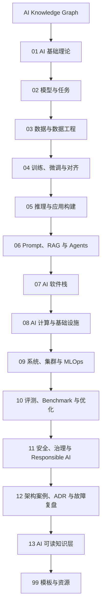

# AI 知识地图

## 导航目录

| 模块 | 关注问题 | 入口 |
| --- | --- | --- |
| AI 基础理论 | 数学、机器学习、深度学习、Transformer 和 LLM 基础 | [进入](01-ai-basics/index.md) |
| 模型与任务 | 模型类型、任务范式、能力边界和选型标准 | [进入](02-models-and-tasks/index.md) |
| 数据与数据工程 | 数据集、标注、清洗、Tokenization、数据质量和数据管道 | [进入](03-data-engineering/index.md) |
| 训练、微调与对齐 | 预训练、微调、LoRA、RLHF、DPO 和训练稳定性 | [进入](04-training-finetuning-alignment/index.md) |
| 推理与应用构建 | 模型服务、应用接口、结构化输出、成本和延迟权衡 | [进入](05-inference-apps/index.md) |
| Prompt、RAG 与 Agents | 提示词、上下文工程、检索增强、工具调用和智能体 | [进入](06-prompt-rag-agents/index.md) |
| AI 软件栈 | 框架、Runtime、编译器、算子库、Serving 和分布式执行 | [进入](07-ai-software-stack/index.md) |
| AI 计算与基础设施 | 计算、内存、互连、能效、可靠性和部署约束 | [进入](08-ai-compute-infra/index.md) |
| 系统、集群与 MLOps | 调度、存储、监控、实验管理、发布和反馈闭环 | [进入](09-systems-mlops/index.md) |
| 评测、Benchmark 与优化 | 模型评测、系统 Benchmark、Profiling、Roofline 和 TCO | [进入](10-evaluation-benchmark-optimization/index.md) |
| 安全、治理与 Responsible AI | Prompt Injection、Guardrails、红队、许可、隐私和治理 | [进入](11-safety-governance/index.md) |
| 架构案例、ADR 与故障复盘 | 架构案例、设计决策、方案取舍、故障复盘和反模式 | [进入](12-architecture-cases/index.md) |
| AI 可读知识层 | 元数据、RAG 索引、知识图谱、引用溯源和 AI skills | [进入](13-ai-indexing/index.md) |
| 模板与资源 | 知识点、ADR、Benchmark 文档模板 | [知识点](99-templates/knowledge-note.md) / [ADR](99-templates/adr.md) / [Benchmark](99-templates/benchmark-report.md) |

## 模块细分

### 01 AI 基础理论

- 机器学习 / 深度学习
- 概率统计、优化、表示学习
- Transformer / Attention / LLM 基础
- 训练、推理、压缩、对齐的基本概念

### 02 模型与任务

- 分类、回归、排序、推荐、检索
- CV、NLP、语音、多模态任务
- LLM、VLM、SLM、Reasoning Model
- Diffusion、Embedding、MoE、Agentic Model

### 03 数据与数据工程

- 数据采集、清洗、去重、脱敏
- 标注、数据质量、数据泄漏
- Tokenization、数据增强、Synthetic Data
- Dataset、DataLoader、数据版本管理

### 04 训练、微调与对齐

- 预训练、继续预训练、监督微调
- LoRA、QLoRA、Adapter、Prompt Tuning
- RLHF、DPO、RLAIF、偏好优化
- 分布式训练、实验管理、训练稳定性

### 05 推理与应用构建

- 在线推理、批处理、流式输出
- KV Cache、Batching、Speculative Decoding
- 模型服务、API、缓存、限流、重试
- 结构化输出、函数调用、多模态应用

### 06 Prompt、RAG 与 Agents

- Prompt 技术和上下文工程
- Embedding、向量数据库、Hybrid Search、Rerank
- RAG 切分、召回、引用、评测
- Tool Calling、MCP、Agent 工作流和记忆

### 07 AI 软件栈

- PyTorch / JAX / ONNX
- CUDA / ROCm / Triton
- 编译器 / Runtime / 算子库
- Serving、调度、分布式训练与推理

### 08 AI 计算与基础设施

- CPU / GPU / NPU / ASIC / FPGA
- HBM / DDR / Cache / NUMA
- PCIe / CXL / NVLink / NoC
- 能效、可靠性、可扩展性和容量规划

### 09 系统、集群与 MLOps

- AI 系统部署架构
- Kubernetes、Slurm、存储、网络、监控
- 实验跟踪、模型注册、CI/CD、灰度发布
- 漂移检测、线上反馈、持续学习

### 10 评测、Benchmark 与优化

- 模型能力评测、人工评估、安全评测
- 训练性能、推理性能、系统 Benchmark
- Profiling、Roofline、瓶颈定位
- TCO、能效、稳定性和成本优化

### 11 安全、治理与 Responsible AI

- Prompt Injection、越权工具调用、数据泄露
- 幻觉、事实性、偏见、公平性
- Guardrails、Red Teaming、安全策略
- 数据许可、模型许可、审计和治理

### 12 架构案例、ADR 与故障复盘

- AI 系统架构案例
- 设计决策记录 ADR
- 方案取舍和架构约束
- 故障复盘、经验教训、模式和反模式

### 13 AI 可读知识层

- 结构化元数据
- 向量检索 RAG
- 知识图谱和实体关系
- AI Skills / Agent 工具说明

## 知识分层

| 层级 | 说明 | 典型内容 |
| --- | --- | --- |
| 基础知识 | 建立概念体系 | 数学、ML、DL、Transformer、LLM |
| 模型知识 | 理解能力边界 | 模型类型、任务、数据、训练、评测 |
| 应用知识 | 面向落地使用 | 推理、Prompt、RAG、Agents、应用架构 |
| 工程知识 | 面向稳定运行 | 软件栈、计算基础设施、MLOps、Benchmark |
| 治理知识 | 面向风险控制 | 安全、隐私、许可、Responsible AI |
| 经验知识 | 面向复用判断 | 架构案例、ADR、故障复盘、反模式 |
| AI 可读层 | 面向检索和推理 | 元数据、标签、实体关系、索引、skills |
