# AI 计算知识地图

```mermaid
flowchart TD
  A["AI 知识库"] --> B["AI 基础理论"]
  A --> C["AI 软件栈"]
  A --> D["AI 计算与基础设施"]
  A --> E["系统与集群"]
  A --> F["性能与 Benchmark"]
  A --> G["AI 系统架构"]
  A --> H["学习路径与资料资产"]
  A --> I["AI 可读知识层"]

  B --> B1["机器学习 / 深度学习"]
  B --> B2["Transformer / LLM / MoE / 多模态"]
  B --> B3["训练、推理、压缩、对齐"]

  C --> C1["PyTorch / JAX / ONNX"]
  C --> C2["CUDA / ROCm / Triton"]
  C --> C3["编译器 / Runtime / 算子库"]
  C --> C4["分布式训练与推理"]

  D --> D1["CPU / GPU / NPU / ASIC / FPGA"]
  D --> D2["内存体系: HBM / DDR / Cache"]
  D --> D3["互连: PCIe / CXL / NVLink / NoC"]
  D --> D4["能效、可靠性、可扩展性"]

  E --> E1["AI 系统部署架构"]
  E --> E2["集群网络: IB / RoCE"]
  E --> E3["存储、调度、K8s、监控"]

  F --> F1["训练性能"]
  F --> F2["推理性能"]
  F --> F3["Roofline / Profiling"]
  F --> F4["TCO、能效、稳定性"]

  G --> G1["模型服务架构 / 计算架构 / 数据流"]
  G --> G2["设计决策记录 ADR"]
  G --> G3["架构约束、性能模型"]
  G --> G4["经验教训、故障案例"]

  H --> H1["学习路径"]
  H --> H2["资料评审"]
  H --> H3["测试验证"]
  H --> H4["参考资料 / 工具清单 / 术语表"]

  I --> I1["结构化元数据"]
  I --> I2["向量检索 RAG"]
  I --> I3["知识图谱"]
  I --> I4["AI Skills / Agent 工具说明"]
```

## 知识分层

| 层级 | 说明 | 典型内容 |
| --- | --- | --- |
| 基础知识 | 通用知识 | 模型、算法、软件栈、计算基础 |
| 工程知识 | 实践知识 | 服务架构、调优方法、测试流程 |
| 架构知识 | 系统设计知识 | AI 系统架构、性能模型、设计约束 |
| 决策知识 | 可追溯判断 | ADR、方案比较、取舍依据 |
| AI 可读层 | 面向检索和推理 | 元数据、标签、实体关系、索引 |
