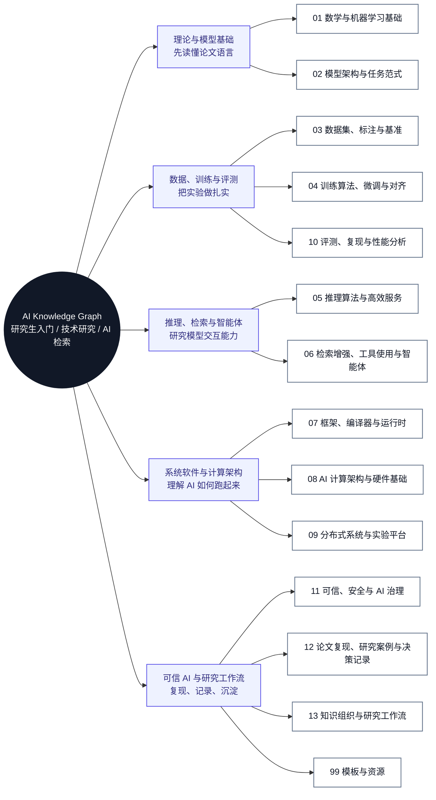
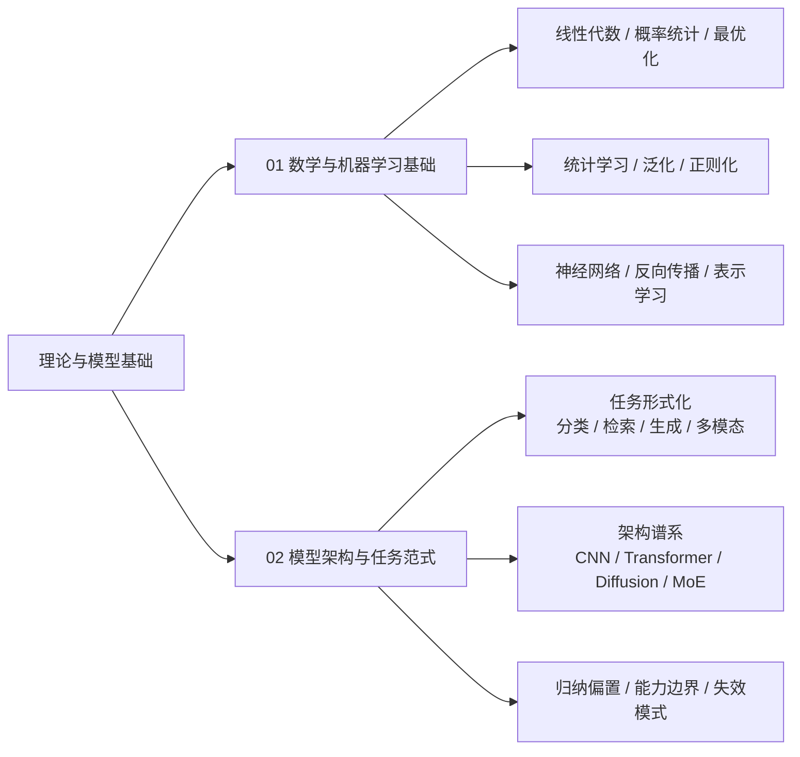
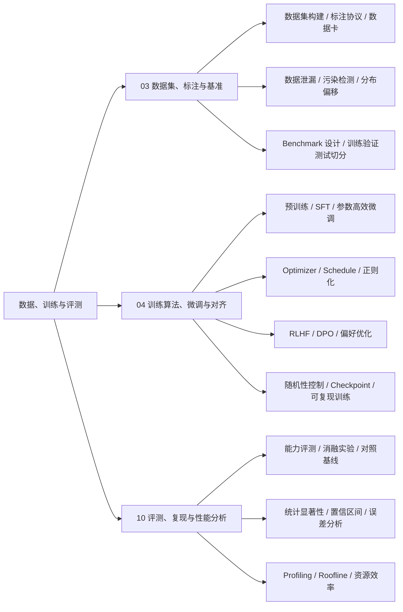
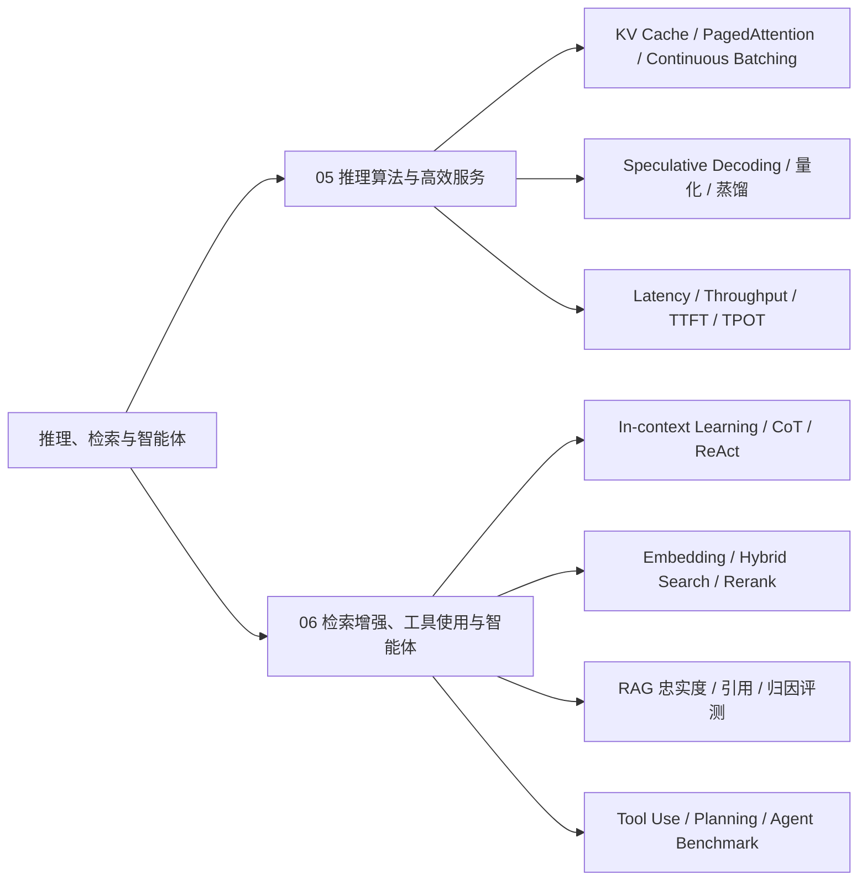
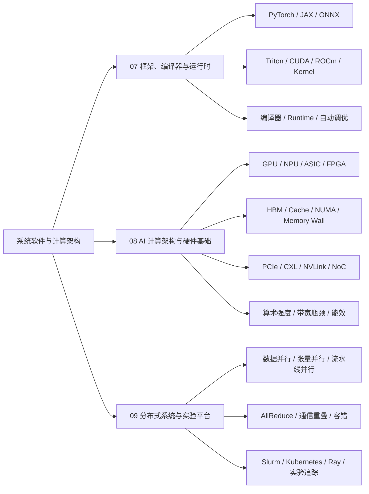
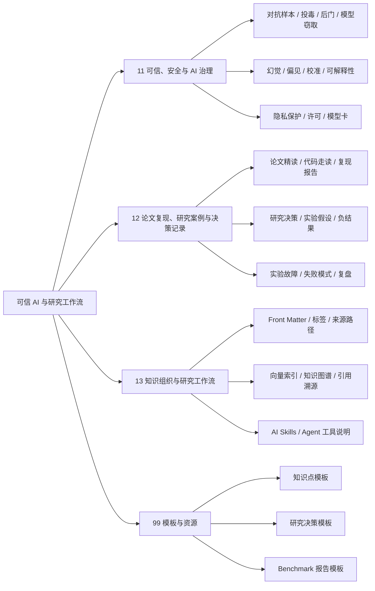

# AI 知识地图

这张地图面向 AI 方向课题组新生，按“基础课 -> 经典模型 -> 数据与实验 -> 系统实现 -> 论文复现 -> 研究沉淀”的训练路径组织。图中带编号的模块可以点击跳转到对应章节。

## 总览思维导图

## 分支展开

### 理论与模型基础

### 数据、训练与评测

### 推理、检索与智能体

### 系统软件与计算架构

### 可信 AI 与研究工作流

## 地图逻辑

| 主线 | 组织逻辑 | 对应模块 |
| --- | --- | --- |
| 理论与模型基础 | 先补足数学、统计学习和深度学习基础，再理解任务形式化和模型架构谱系。 | [01 数学与机器学习基础](01-ai-basics/index.md)、[02 模型架构与任务范式](02-models-and-tasks/index.md) |
| 数据、训练与评测 | 数据定义实验边界，训练算法产生模型能力，评测与复现判断结论是否可靠。 | [03 数据集、标注与基准](03-data-engineering/index.md)、[04 训练算法、微调与对齐](04-training-finetuning-alignment/index.md)、[10 评测、复现与性能分析](10-evaluation-benchmark-optimization/index.md) |
| 推理、检索与智能体 | 研究模型在推理阶段的效率、外部知识接入、工具使用和长程任务能力。 | [05 推理算法与高效服务](05-inference-apps/index.md)、[06 检索增强、工具使用与智能体](06-prompt-rag-agents/index.md) |
| 系统软件与计算架构 | 理解模型如何被框架、编译器、运行时、加速器和分布式系统共同执行。 | [07 框架、编译器与运行时](07-ai-software-stack/index.md)、[08 AI 计算架构与硬件基础](08-ai-compute-infra/index.md)、[09 分布式系统与实验平台](09-systems-mlops/index.md) |
| 可信 AI 与研究工作流 | 控制研究风险，沉淀论文复现、实验决策、失败经验和 AI 可读知识。 | [11 可信、安全与 AI 治理](11-safety-governance/index.md)、[12 论文复现、研究案例与决策记录](12-architecture-cases/index.md)、[13 知识组织与研究工作流](13-ai-indexing/index.md) |

## 按研究任务导航

| 研究生当前任务 | 优先阅读 |
| --- | --- |
| 刚入组，需要补基础 | [01 数学与机器学习基础](01-ai-basics/index.md) -> [02 模型架构与任务范式](02-models-and-tasks/index.md) |
| 准备读一篇模型论文 | [02 模型架构与任务范式](02-models-and-tasks/index.md) -> [03 数据集、标注与基准](03-data-engineering/index.md) -> [10 评测、复现与性能分析](10-evaluation-benchmark-optimization/index.md) |
| 准备复现训练或微调论文 | [03 数据集、标注与基准](03-data-engineering/index.md) -> [04 训练算法、微调与对齐](04-training-finetuning-alignment/index.md) -> [12 论文复现、研究案例与决策记录](12-architecture-cases/index.md) |
| 做 LLM 推理、RAG 或 Agent 方向 | [05 推理算法与高效服务](05-inference-apps/index.md) -> [06 检索增强、工具使用与智能体](06-prompt-rag-agents/index.md) -> [10 评测、复现与性能分析](10-evaluation-benchmark-optimization/index.md) |
| 做 AI 系统、编译器或硬件方向 | [07 框架、编译器与运行时](07-ai-software-stack/index.md) -> [08 AI 计算架构与硬件基础](08-ai-compute-infra/index.md) -> [09 分布式系统与实验平台](09-systems-mlops/index.md) |
| 做可信 AI 或安全方向 | [11 可信、安全与 AI 治理](11-safety-governance/index.md) -> [10 评测、复现与性能分析](10-evaluation-benchmark-optimization/index.md) -> [12 论文复现、研究案例与决策记录](12-architecture-cases/index.md) |
| 准备沉淀组会、论文笔记或实验记录 | [13 知识组织与研究工作流](13-ai-indexing/index.md) -> [知识点模板](99-templates/knowledge-note.md) -> [Benchmark 报告模板](99-templates/benchmark-report.md) |

## 模块关系

| 模块 | 上游依赖 | 主要产出 |
| --- | --- | --- |
| 01 数学与机器学习基础 | 无 | 术语、公式、基础理论和论文阅读前置知识 |
| 02 模型架构与任务范式 | 01 | 任务形式化、模型谱系、架构理解和开放问题 |
| 03 数据集、标注与基准 | 02 | 数据卡、标注协议、benchmark 边界和数据风险 |
| 04 训练算法、微调与对齐 | 01、02、03 | 训练方案、优化配置、对齐方法和复现实验 |
| 05 推理算法与高效服务 | 02、04、07、08 | 推理算法、服务运行时、性能指标和瓶颈分析 |
| 06 检索增强、工具使用与智能体 | 02、05、10、13 | RAG、Tool Use、Agent 工作流和评测协议 |
| 07 框架、编译器与运行时 | 01、04、05 | Kernel、编译优化、Runtime 和系统实现知识 |
| 08 AI 计算架构与硬件基础 | 04、05、07 | 计算、内存、互连、能效和体系结构分析 |
| 09 分布式系统与实验平台 | 04、07、08 | 并行训练、调度、容错、实验追踪和复现平台 |
| 10 评测、复现与性能分析 | 02、03、04、05、06、08、09 | 指标体系、消融实验、复现协议和性能诊断 |
| 11 可信、安全与 AI 治理 | 03、05、06、10 | 威胁模型、安全评测、隐私与许可边界 |
| 12 论文复现、研究案例与决策记录 | 全部模块 | 论文笔记、复现报告、负结果和研究决策 |
| 13 知识组织与研究工作流 | 全部模块 | 元数据、索引、引用溯源、AI-readable skills |
