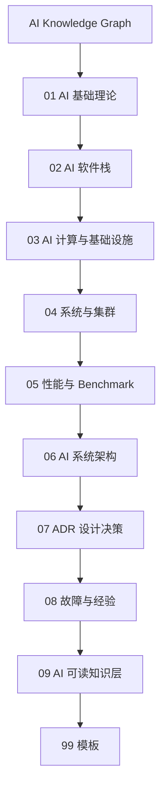

# AI 计算知识地图

## 导航目录

| 模块 | 关注问题 | 入口 |
| --- | --- | --- |
| AI 基础理论 | 模型、算法、训练、推理和压缩的基础概念 | [进入](01-ai-basics/index.md) |
| AI 软件栈 | 框架、Runtime、编译器、算子库和分布式执行 | [进入](02-ai-software-stack/index.md) |
| AI 计算与基础设施 | 计算、内存、互连、能效、可靠性和部署约束 | [进入](03-ai-hardware/index.md) |
| 系统与集群 | 集群网络、存储、调度、监控和容量规划 | [进入](04-system-architecture/index.md) |
| 性能与 Benchmark | 训练性能、推理性能、Profiling、Roofline 和 TCO | [进入](05-benchmark/index.md) |
| AI 系统架构 | 模型服务架构、计算架构、数据流和设计边界 | [进入](06-ai-system-architecture/index.md) |
| ADR 设计决策 | 方案比较、取舍依据、长期影响和复盘 | [进入](07-adr/index.md) |
| 故障与经验 | 故障复盘、异常分析、修复方案和可复用经验 | [进入](08-failure-cases/index.md) |
| AI 可读知识层 | 元数据、RAG、知识图谱和 AI skills 组织方式 | [进入](09-ai-indexing/index.md) |
| 模板 | 知识点、ADR 和 Benchmark 文档模板 | [知识点](99-templates/knowledge-note.md) / [ADR](99-templates/adr.md) / [Benchmark](99-templates/benchmark-report.md) |

## 模块细分

### AI 基础理论

- 机器学习 / 深度学习
- Transformer / LLM / MoE / 多模态
- 训练、推理、压缩、对齐

### AI 软件栈

- PyTorch / JAX / ONNX
- CUDA / ROCm / Triton
- 编译器 / Runtime / 算子库
- 分布式训练与推理

### AI 计算与基础设施

- CPU / GPU / NPU / ASIC / FPGA
- 内存体系: HBM / DDR / Cache
- 互连: PCIe / CXL / NVLink / NoC
- 能效、可靠性、可扩展性

### 系统与集群

- AI 系统部署架构
- 集群网络: IB / RoCE
- 存储、调度、K8s、监控

### 性能与 Benchmark

- 训练性能
- 推理性能
- Roofline / Profiling
- TCO、能效、稳定性

### AI 系统架构

- 模型服务架构 / 计算架构 / 数据流
- 设计决策记录 ADR
- 架构约束、性能模型
- 经验教训、故障案例

### AI 可读知识层

- 结构化元数据
- 向量检索 RAG
- 知识图谱
- AI Skills / Agent 工具说明

## 知识分层

| 层级 | 说明 | 典型内容 |
| --- | --- | --- |
| 基础知识 | 通用知识 | 模型、算法、软件栈、计算基础 |
| 工程知识 | 实践知识 | 服务架构、调优方法、测试流程 |
| 架构知识 | 系统设计知识 | AI 系统架构、性能模型、设计约束 |
| 决策知识 | 可追溯判断 | ADR、方案比较、取舍依据 |
| AI 可读层 | 面向检索和推理 | 元数据、标签、实体关系、索引 |
