# AI 知识地图

这张地图面向 AI Systems、AI Infrastructure 和高效 AI 计算方向的新生。主线不是提升模型任务指标，而是理解一个 AI workload 如何经过推理服务、训练系统、Kernel、编译器、加速器、集群和 Benchmark，最终被做快、做省、做稳、做可复现。图中带编号的模块可以点击跳转到对应章节。

## 总览思维导图

```mermaid
flowchart TD
  KG(("AI Knowledge Graph<br/>更快 / 更省 / 更稳 / 可复现"))

  KG --> S0["学习入口<br/>建立系统视角"]
  KG --> S1["工作负载<br/>性能问题从哪里来"]
  KG --> S2["执行链路<br/>单机如何跑快"]
  KG --> S3["基础设施<br/>多机如何跑稳"]
  KG --> S4["研究沉淀<br/>如何度量、复现和复用"]

  S0 --> M01["01 入门导读"]

  S1 --> M02["02 AI 计算工作负载基础"]
  M02 --> M02A["数据与输入路径"]

  S2 --> M03["03 推理系统与服务优化"]
  M03 --> M03A["RAG 与 Agent 推理负载"]
  S2 --> M05["05 Kernel、算子与编译优化"]
  M05 --> M05A["Triton Kernel 编程"]
  M05 --> M05B["TorchInductor 与 PyTorch 编译栈"]
  S2 --> M06["06 AI 加速器与计算架构"]

  S3 --> M04["04 训练系统与分布式计算"]
  S3 --> M07["07 集群、网络、存储与调度"]

  S4 --> M08["08 性能分析、Benchmark 与容量建模"]
  S4 --> M09["09 可靠性、可观测性与故障复盘"]
  S4 --> M10["10 论文复现与系统案例"]
  S4 --> M11["11 知识组织、模板与 AI 可读索引"]
  S4 --> M99["99 模板与资源"]

  click KG "../" "打开首页"
  click M01 "../01-getting-started/" "打开入门导读"
  click M02 "../02-ai-workloads/" "打开 AI 计算工作负载基础"
  click M02A "../02-ai-workloads/data-paths/" "打开数据与输入路径"
  click M03 "../03-inference-systems/" "打开推理系统与服务优化"
  click M03A "../03-inference-systems/rag-agent-workloads/" "打开 RAG 与 Agent 推理负载"
  click M04 "../04-training-systems/" "打开训练系统与分布式计算"
  click M05 "../05-kernels-compilers/" "打开 Kernel、算子与编译优化"
  click M05A "../05-kernels-compilers/triton/" "打开 Triton Kernel 编程"
  click M05B "../05-kernels-compilers/torchinductor/" "打开 TorchInductor 与 PyTorch 编译栈"
  click M06 "../06-accelerators-architecture/" "打开 AI 加速器与计算架构"
  click M07 "../07-cluster-infra/" "打开集群、网络、存储与调度"
  click M08 "../08-benchmark-capacity/" "打开性能分析、Benchmark 与容量建模"
  click M09 "../09-reliability-observability/" "打开可靠性、可观测性与故障复盘"
  click M10 "../10-papers-cases/" "打开论文复现与系统案例"
  click M11 "../11-knowledge-index/" "打开知识组织、模板与 AI 可读索引"
  click M99 "../99-templates/knowledge-note/" "打开模板"

  classDef root fill:#111827,color:#ffffff,stroke:#111827,stroke-width:2px;
  classDef trunk fill:#ecfeff,color:#164e63,stroke:#0891b2,stroke-width:1.2px;
  classDef module fill:#ffffff,color:#111827,stroke:#64748b,stroke-width:1.4px;
  classDef sub fill:#f8fafc,color:#334155,stroke:#94a3b8,stroke-width:1px;
  class KG root;
  class S0,S1,S2,S3,S4 trunk;
  class M01,M02,M03,M04,M05,M06,M07,M08,M09,M10,M11,M99 module;
  class M02A,M03A,M05A,M05B sub;
```

## 系统链路

```mermaid
flowchart LR
  W["AI Workload<br/>模型结构、输入长度、batch、精度"] --> R["Runtime<br/>推理服务 / 训练框架"]
  R --> K["Kernel 与编译<br/>Triton / Inductor / 融合 / 自动调优"]
  K --> H["Accelerator<br/>计算单元、内存层次、互连"]
  H --> C["Cluster<br/>网络、存储、调度、隔离"]
  C --> M["Measurement<br/>Benchmark、Profiling、容量模型"]
  M --> P["Knowledge<br/>论文复现、案例、决策记录"]

  click W "../02-ai-workloads/" "打开 AI 计算工作负载基础"
  click R "../03-inference-systems/" "打开推理系统与服务优化"
  click K "../05-kernels-compilers/" "打开 Kernel、算子与编译优化"
  click H "../06-accelerators-architecture/" "打开 AI 加速器与计算架构"
  click C "../07-cluster-infra/" "打开集群、网络、存储与调度"
  click M "../08-benchmark-capacity/" "打开性能分析、Benchmark 与容量建模"
  click P "../10-papers-cases/" "打开论文复现与系统案例"
```

## 地图逻辑

| 主线 | 组织逻辑 | 对应模块 |
| --- | --- | --- |
| 学习入口 | 先建立 AI Infra 的问题意识、阅读方法和实验纪律。 | [01 入门导读](01-getting-started/index.md) |
| 工作负载 | 只学习与性能有关的模型背景：Attention、KV Cache、MoE、上下文长度、batch shape、精度格式和数据路径。 | [02 AI 计算工作负载基础](02-ai-workloads/index.md)、[数据与输入路径](02-ai-workloads/data-paths.md) |
| 单机执行 | 研究推理服务、算子、Triton Kernel、TorchInductor、runtime 和加速器如何决定延迟、吞吐、显存和能效。 | [03 推理系统与服务优化](03-inference-systems/index.md)、[05 Kernel、算子与编译优化](05-kernels-compilers/index.md)、[Triton Kernel 编程](05-kernels-compilers/triton.md)、[TorchInductor 与 PyTorch 编译栈](05-kernels-compilers/torchinductor.md)、[06 AI 加速器与计算架构](06-accelerators-architecture/index.md) |
| 多机基础设施 | 研究训练系统、通信、调度、网络、存储和集群隔离如何影响规模化效率。 | [04 训练系统与分布式计算](04-training-systems/index.md)、[07 集群、网络、存储与调度](07-cluster-infra/index.md) |
| 度量与沉淀 | 用 Benchmark、Profiling、容量模型、故障复盘和论文复现把经验变成可复用知识。 | [08 性能分析、Benchmark 与容量建模](08-benchmark-capacity/index.md)、[09 可靠性、可观测性与故障复盘](09-reliability-observability/index.md)、[10 论文复现与系统案例](10-papers-cases/index.md)、[11 知识组织、模板与 AI 可读索引](11-knowledge-index/index.md) |

## 按目标导航

| 当前目标 | 优先阅读 |
| --- | --- |
| 刚进入 AI Infra 方向 | [01 入门导读](01-getting-started/index.md) -> [02 AI 计算工作负载基础](02-ai-workloads/index.md) -> [08 性能分析、Benchmark 与容量建模](08-benchmark-capacity/index.md) |
| 想降低 LLM 推理延迟 | [02 AI 计算工作负载基础](02-ai-workloads/index.md) -> [03 推理系统与服务优化](03-inference-systems/index.md) -> [05 Kernel、算子与编译优化](05-kernels-compilers/index.md) -> [08 性能分析、Benchmark 与容量建模](08-benchmark-capacity/index.md) |
| 想提高吞吐和 GPU 利用率 | [03 推理系统与服务优化](03-inference-systems/index.md) -> [07 集群、网络、存储与调度](07-cluster-infra/index.md) -> [08 性能分析、Benchmark 与容量建模](08-benchmark-capacity/index.md) |
| 想做分布式训练系统 | [04 训练系统与分布式计算](04-training-systems/index.md) -> [06 AI 加速器与计算架构](06-accelerators-architecture/index.md) -> [07 集群、网络、存储与调度](07-cluster-infra/index.md) |
| 想做 Triton Kernel 或编译优化 | [02 AI 计算工作负载基础](02-ai-workloads/index.md) -> [05 Kernel、算子与编译优化](05-kernels-compilers/index.md) -> [Triton Kernel 编程](05-kernels-compilers/triton.md) -> [TorchInductor 与 PyTorch 编译栈](05-kernels-compilers/torchinductor.md) -> [06 AI 加速器与计算架构](06-accelerators-architecture/index.md) |
| 想做 AI 加速器或硬件架构 | [02 AI 计算工作负载基础](02-ai-workloads/index.md) -> [05 Kernel、算子与编译优化](05-kernels-compilers/index.md) -> [06 AI 加速器与计算架构](06-accelerators-architecture/index.md) -> [08 性能分析、Benchmark 与容量建模](08-benchmark-capacity/index.md) |
| 想建设稳定集群或实验平台 | [07 集群、网络、存储与调度](07-cluster-infra/index.md) -> [09 可靠性、可观测性与故障复盘](09-reliability-observability/index.md) -> [11 知识组织、模板与 AI 可读索引](11-knowledge-index/index.md) |
| 想复现系统论文 | [10 论文复现与系统案例](10-papers-cases/index.md) -> [08 性能分析、Benchmark 与容量建模](08-benchmark-capacity/index.md) -> [技术决策模板](99-templates/adr.md) |

## 模块关系

| 模块 | 上游依赖 | 主要产出 |
| --- | --- | --- |
| 01 入门导读 | 无 | 学习路线、术语约定、实验纪律、贡献方法 |
| 02 AI 计算工作负载基础 | 01 | 性能相关模型背景、shape 分析、数据流和负载画像 |
| 03 推理系统与服务优化 | 02、05、06、08 | 推理链路、调度策略、缓存策略、延迟吞吐分析 |
| 04 训练系统与分布式计算 | 02、06、07、08 | 并行策略、通信模型、训练稳定性和扩展效率 |
| 05 Kernel、算子与编译优化 | 02、06、08 | Triton Kernel、TorchInductor、算子实现、图优化、编译和自动调优 |
| 06 AI 加速器与计算架构 | 02、05、08 | 计算、存储、互连、能效和体系结构分析 |
| 07 集群、网络、存储与调度 | 03、04、06 | 资源调度、网络存储、隔离、镜像环境和实验平台 |
| 08 性能分析、Benchmark 与容量建模 | 02、03、04、05、06、07 | 指标体系、Profiling、Roofline、容量估算和对比方法 |
| 09 可靠性、可观测性与故障复盘 | 03、04、07、08 | 监控、告警、故障模式、复盘和改进项 |
| 10 论文复现与系统案例 | 全部模块 | 论文笔记、代码走读、复现报告、系统案例和技术决策 |
| 11 知识组织、模板与 AI 可读索引 | 全部模块 | 元数据、标签、引用溯源、向量索引和 AI skills |
