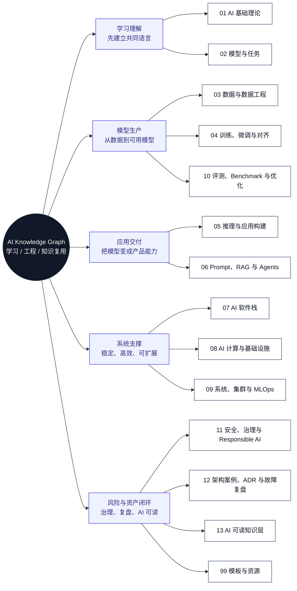
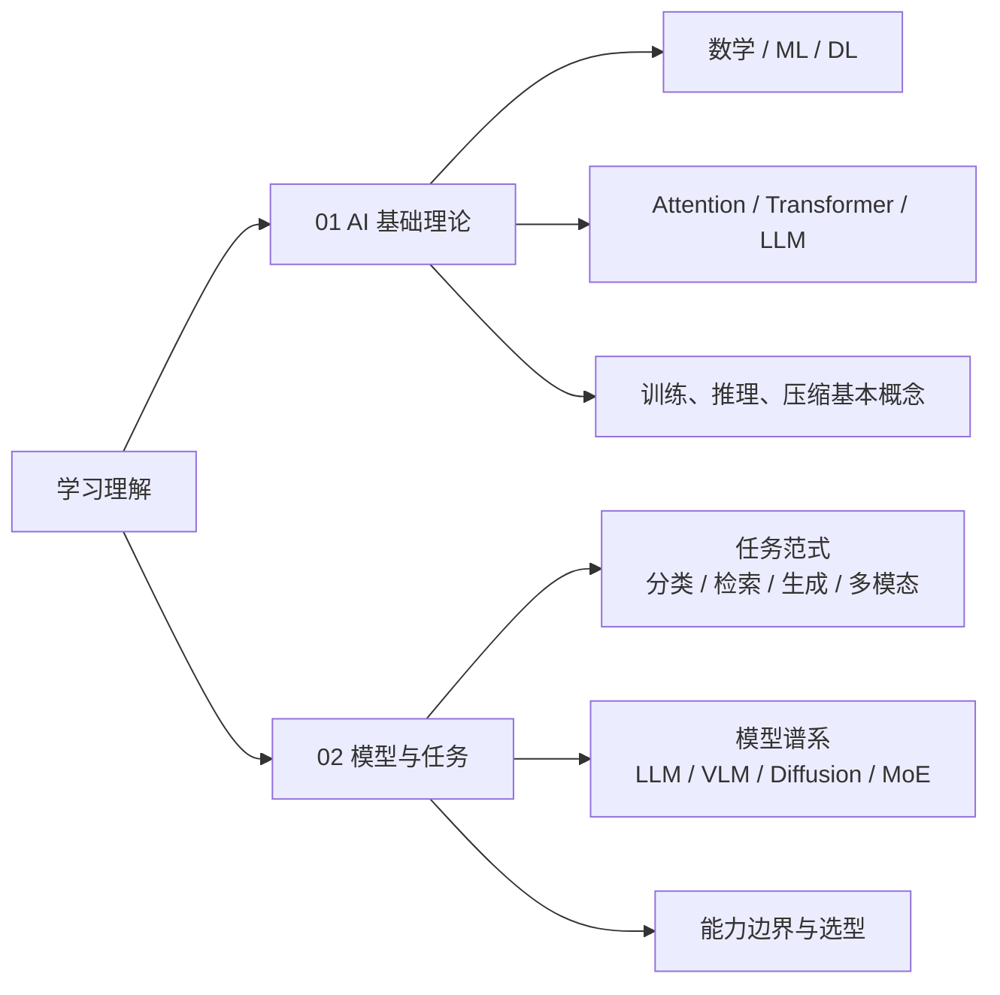
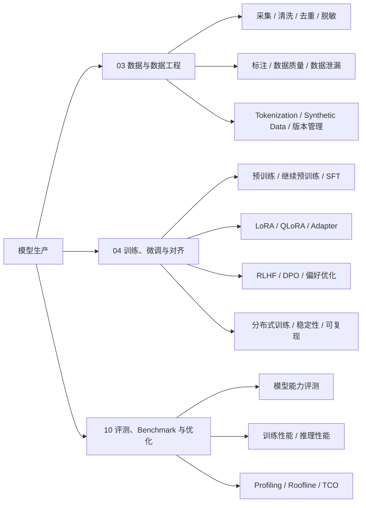
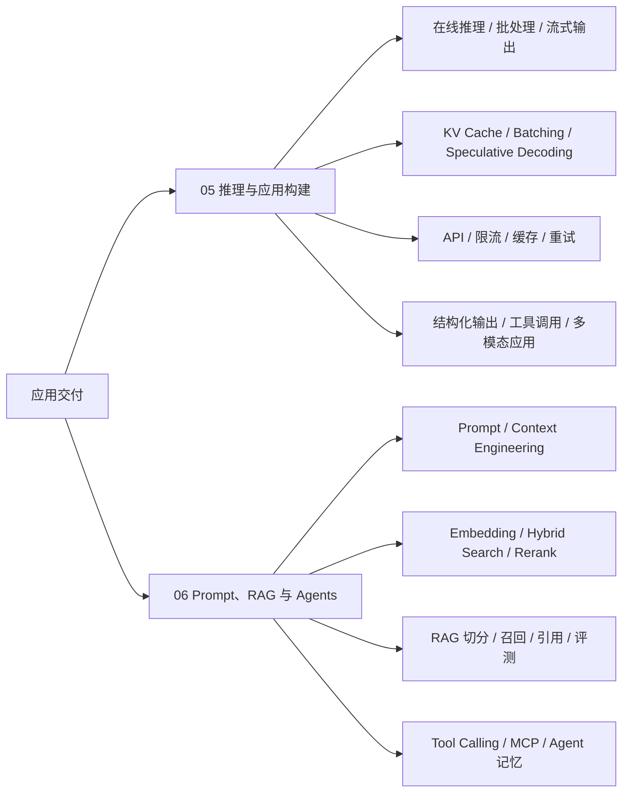
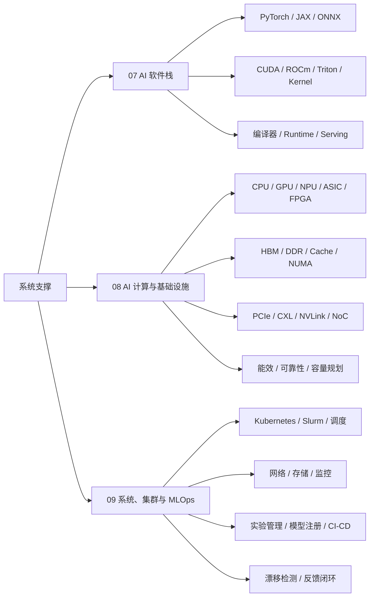
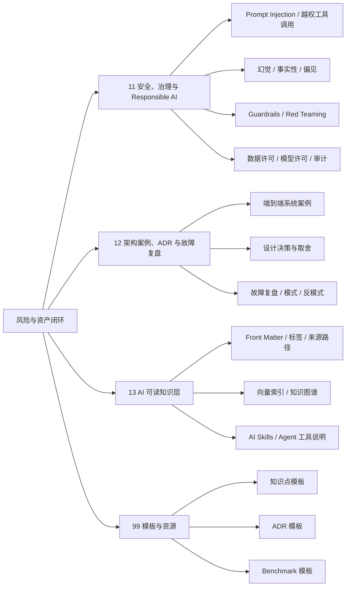

# AI 知识地图

这张地图按“学习理解 -> 模型生产 -> 应用交付 -> 系统支撑 -> 经验复用”的闭环组织。先看总览图建立方向，再看每条主线的分支展开；图中带编号的模块可以点击跳转到对应章节。

## 总览思维导图

## 分支展开

### 学习理解

### 模型生产

### 应用交付

### 系统支撑

### 风险与资产闭环

## 地图逻辑

| 主线 | 组织逻辑 | 对应模块 |
| --- | --- | --- |
| 学习理解 | 先统一基础概念，再理解模型类型、任务边界和选型方式。 | [01 AI 基础理论](01-ai-basics/index.md)、[02 模型与任务](02-models-and-tasks/index.md) |
| 模型生产 | 数据决定上限，训练和对齐决定能力形态，评测负责判断是否真的可用。 | [03 数据与数据工程](03-data-engineering/index.md)、[04 训练、微调与对齐](04-training-finetuning-alignment/index.md)、[10 评测、Benchmark 与优化](10-evaluation-benchmark-optimization/index.md) |
| 应用交付 | 推理服务负责把模型稳定暴露出来，Prompt、RAG 和 Agents 负责把模型接入业务知识、工具和流程。 | [05 推理与应用构建](05-inference-apps/index.md)、[06 Prompt、RAG 与 Agents](06-prompt-rag-agents/index.md) |
| 系统支撑 | 软件栈、计算基础设施、集群与 MLOps 决定训练和推理能否规模化、低成本、可观测地运行。 | [07 AI 软件栈](07-ai-software-stack/index.md)、[08 AI 计算与基础设施](08-ai-compute-infra/index.md)、[09 系统、集群与 MLOps](09-systems-mlops/index.md) |
| 风险与资产闭环 | 安全治理控制风险，架构案例和 ADR 沉淀判断依据，AI 可读层让知识能被检索、引用和复用。 | [11 安全、治理与 Responsible AI](11-safety-governance/index.md)、[12 架构案例、ADR 与故障复盘](12-architecture-cases/index.md)、[13 AI 可读知识层](13-ai-indexing/index.md) |

## 按问题导航

| 我想解决的问题 | 优先阅读 |
| --- | --- |
| 我刚开始系统学习 AI | [01 AI 基础理论](01-ai-basics/index.md) -> [02 模型与任务](02-models-and-tasks/index.md) |
| 我想判断某个任务该用什么模型 | [02 模型与任务](02-models-and-tasks/index.md) -> [10 评测、Benchmark 与优化](10-evaluation-benchmark-optimization/index.md) |
| 我想建设训练或微调能力 | [03 数据与数据工程](03-data-engineering/index.md) -> [04 训练、微调与对齐](04-training-finetuning-alignment/index.md) -> [10 评测、Benchmark 与优化](10-evaluation-benchmark-optimization/index.md) |
| 我想做 RAG、Agent 或知识库应用 | [05 推理与应用构建](05-inference-apps/index.md) -> [06 Prompt、RAG 与 Agents](06-prompt-rag-agents/index.md) -> [13 AI 可读知识层](13-ai-indexing/index.md) |
| 我想把模型服务跑稳、跑快、跑便宜 | [05 推理与应用构建](05-inference-apps/index.md) -> [07 AI 软件栈](07-ai-software-stack/index.md) -> [08 AI 计算与基础设施](08-ai-compute-infra/index.md) -> [09 系统、集群与 MLOps](09-systems-mlops/index.md) |
| 我想分析性能瓶颈、算力效率和系统成本 | [07 AI 软件栈](07-ai-software-stack/index.md) -> [08 AI 计算与基础设施](08-ai-compute-infra/index.md) -> [10 评测、Benchmark 与优化](10-evaluation-benchmark-optimization/index.md) -> [12 架构案例、ADR 与故障复盘](12-architecture-cases/index.md) |
| 我想避免安全、许可、隐私和治理风险 | [11 安全、治理与 Responsible AI](11-safety-governance/index.md) -> [12 架构案例、ADR 与故障复盘](12-architecture-cases/index.md) |
| 我想让资料库更适合 AI 检索和引用 | [13 AI 可读知识层](13-ai-indexing/index.md) -> [知识点模板](99-templates/knowledge-note.md) -> [ADR 模板](99-templates/adr.md) |

## 模块关系

| 模块 | 上游依赖 | 主要产出 |
| --- | --- | --- |
| 01 AI 基础理论 | 无 | 统一概念、术语和基本原理 |
| 02 模型与任务 | 01 | 任务分类、模型选型、能力边界 |
| 03 数据与数据工程 | 02 | 可训练、可评测、可追溯的数据资产 |
| 04 训练、微调与对齐 | 01、02、03 | 可用模型、对齐策略、训练经验 |
| 05 推理与应用构建 | 02、04、07、08 | 服务接口、推理链路、应用能力 |
| 06 Prompt、RAG 与 Agents | 02、05、13 | 上下文工程、检索增强、工具化工作流 |
| 07 AI 软件栈 | 01、04、05 | 框架、Runtime、Kernel、Serving 能力 |
| 08 AI 计算与基础设施 | 04、05、07 | 算力、内存、互连、容量和能效模型 |
| 09 系统、集群与 MLOps | 05、07、08 | 部署、调度、监控、发布和反馈闭环 |
| 10 评测、Benchmark 与优化 | 02、03、04、05、08、09 | 能力评测、性能评测、瓶颈定位、成本判断 |
| 11 安全、治理与 Responsible AI | 03、05、06、13 | 风险边界、治理策略、安全评测 |
| 12 架构案例、ADR 与故障复盘 | 05、07、08、09、10、11 | 可复用设计判断、失败模式、反模式 |
| 13 AI 可读知识层 | 全部模块 | 元数据、索引、实体关系、AI skills |
